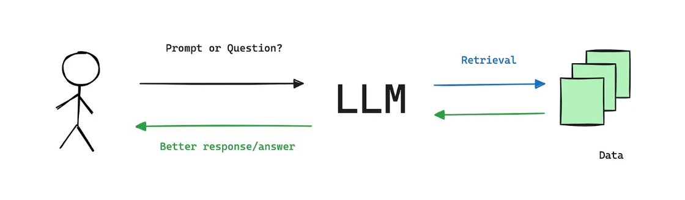
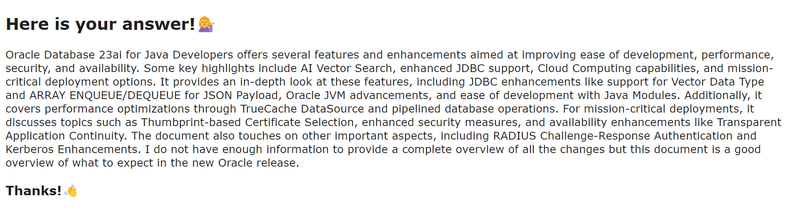
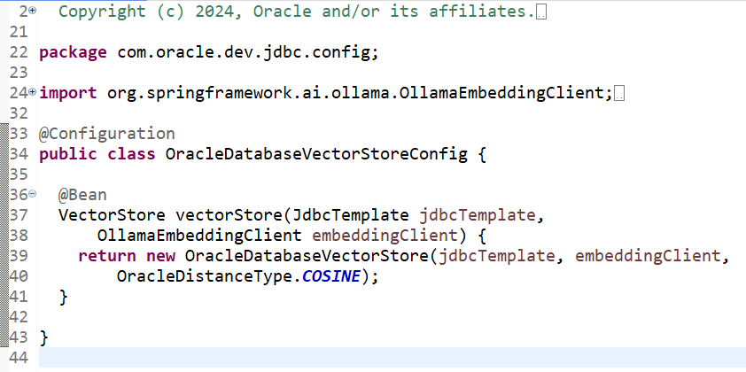
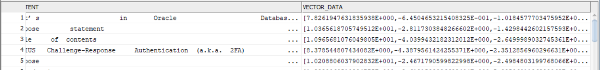
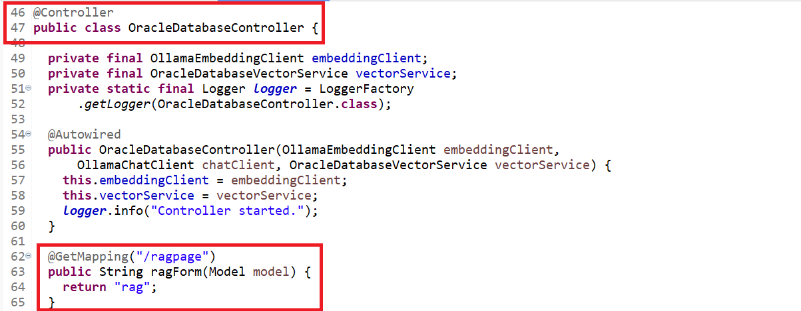
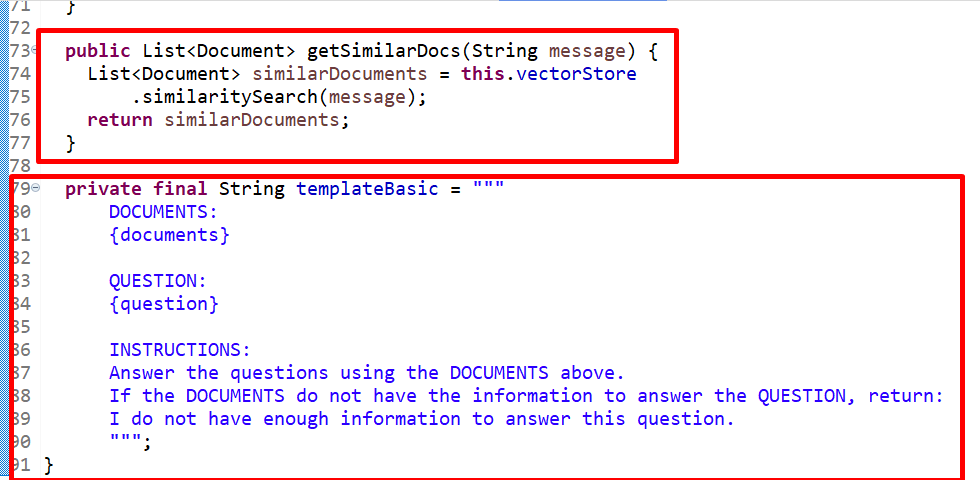
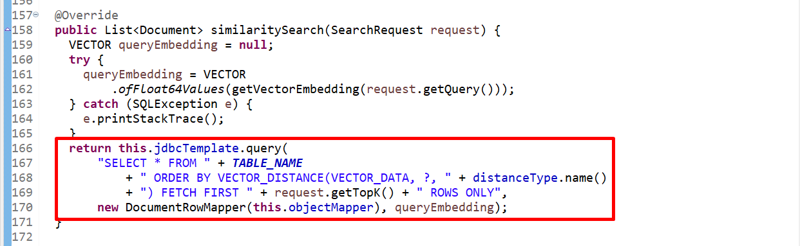
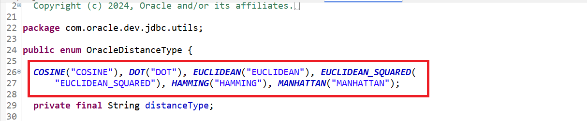
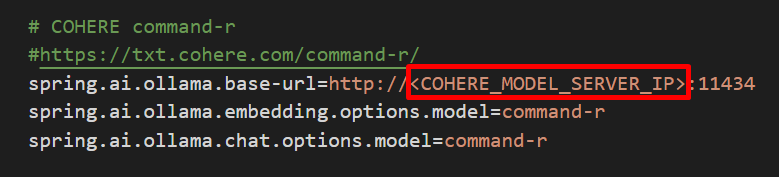

# Learn how a GenAI RAG app with Spring AI, Cohere and the Oracle Database 23ai works

## Introduction

In this lab, you will learn how a GenAI RAG application with Spring AI, Cohere AI, Oracle AI Vector Search and the Oracle Database 23ai works.

Estimated time: 10 minutes

<!-- Watch the video below for a quick walk-through of the lab.

Mac:

[](youtube:xCVhmx7KAm8) -->

### Objectives

In this lab, you will:

- Look at Spring AI RAG application's front-end (GUI), and understand it.
- Look at the code implementation of our GenAI RAG application with Spring AI, Cohere AI, Oracle AI Vector Search and the Oracle Database 23ai, and understand it.
- Configure the Spring AI application to use the Cohere Command-R model

### Prerequisites

1. This lab requires the completion of **Setup Dev Environment**.

## Task 1: Understand the Spring AI RAG application's front-end (GUI)

The main screen has one (1) input field and one (1) button. The input field is used to specify your GenAI RAG prompt, and the button will start the interaction with the Cohere CommandR GenAI model. 

1. Just type your prompt, or use the default one, then the Ask Now! button to start the interaction. 

    

2. The Spring AI will initiate the interaction by submitting the prompt to the RAG process that will be executed by combining the data from the remote Cohere AI Command-R model and the Oracle Database 23ai, which will use the Oracle AI Vector Search functionality to retrieve the embeddings (store vector data).

    

3. As soon as the RAG process completes, a response will be returned and presented to the user with the relevant results, as shown below.

    


## Task 2: Understand the Spring AI with Cohere AI and Oracle Database 23ai implementation

The application is simple; it uses Spring Boot and the Spring AI frameworks to perform the interactions with both the Cohere AI Command-R model and the Oracle Database 23ai, which is accessed by using JDBC, UCP and Oracle AI Vector Search to retrieve the vector embeddings that support the RAG functionality.

1. The central component that controls the ingestion of our domain-related data, that is a PDF file -  What’s in Oracle Database 23ai for Java Developers? - which is started along with the Spring Boot/AI application on the same main entry point class, that is, the Java class with the "@SpringBootApplication" annotation. Specifically, the Java class OracleDatabaseVectorStoreConfig.java with the "@Configuration" annotation will perform the ingestion steps.



2. The RAG (Retrieval-Augmented Generation) is started as part of the application's bootstrap process, and the PDF contents will be ingested and stored as vector embeddings as expected.

    

3. The Spring RAG controller class - OracleDatabaseController.java - implements the Spring AI RAG functionality will expose a REST endpoint (/ragpage) that will redirect the users to the landing page of our application.

    

4. Next, the Spring service class - OracleDatabaseVectorService.java - implements the RAG interaction implementation, including the methods to start the similarity search and the template for the input prompt.

    

5. Now the most important Java implementation class - OracleDatabaseVectorStore.java - as it has the custom implementation of Spring AI's VectorStore interface to deliver the actual vector store implementation that uses the Oracle AI Vector Search functionality provided by the Oracle Database 23ai. It provides the core functionality that supports our vector/similarity search against the Oracle Database.  

    

6. Last, there are three (3) utility classes that support the custom vector store implementation, the RAG ingestion steps, and the vector search functionality. The most important ones are OracleDistanceType.java and PdfDataExtractor.java. The former specifies the Oracle distance types that support the search.

    

The latter implements an interface provided by Spring AI that supports the ingestion of PDF files that is, the org.springframework.ai.reader.pdf.PagePdfDocumentReader interface.

## Task 3: Configure the Spring AI application to use the Cohere Command-R model

You must configure your Spring AI application to use the Cohere Command-R model. You must provide the model URL, the chat model name, and the embeddings model name.

1. Configure the Telegram Bot details. Navigate to `$MTDRWORKSHOP_LOCATION/backend/src/main/resources`, use a text editor (vi, vim, nano, etc) to open the application.properties file, then add the three entries below to configure the "Cohere Command-R model" parameters. Note that you have to provide the hostname [GPU_SERVER_IP] of your server where the model is located.

    ```
    <copy>
    cd $MTDRWORKSHOP_LOCATION/backend/src/main/resources
    vi application.properties
    </copy>
    ```

    

You may now **proceed to the next lab**.

## Acknowledgements

* **Author** - Juarez Barbosa, Sr. Principal Java Developer Evangelist, Java Database Access
* **Contributors** - Kuassi Mensah, Dir. Product Management, Java Database Access; Jean de Lavarene, Sr. Director of Development, JDBC/UCP
* **Last Updated By Date** - Juarez Barbosa Junior, July 2024
