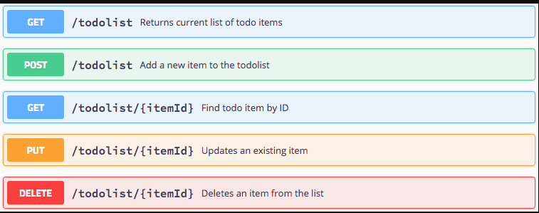
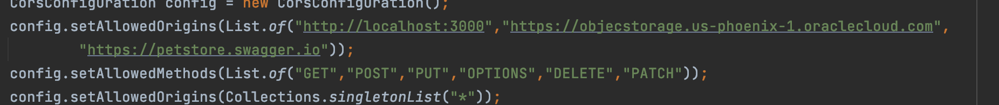
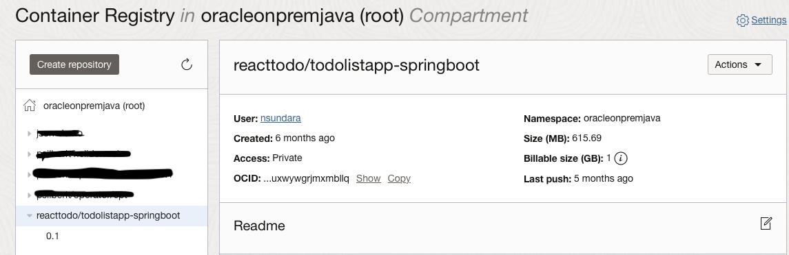
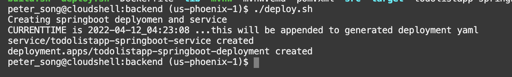
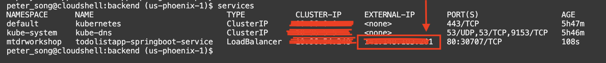
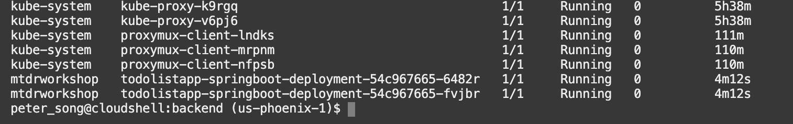
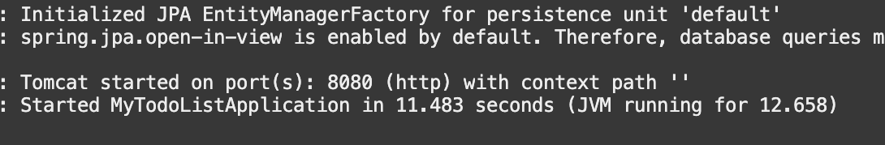
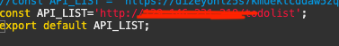
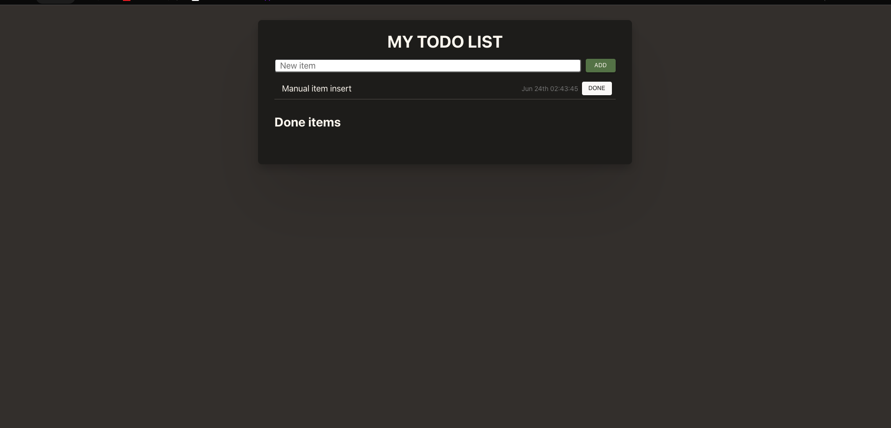

# Deploy the Backend Docker Image to Kubernetes

## Introduction

In this lab, you will make changes and deploy the pre-built SpringBoot Java backend Docker image to OKE, update the code to reflect the IP address of the API Gateway, and finally update your Kubernetes pod to use the latest docker image.

Estimated time: 15 minutes

### Understand the Java backend application

As with most React applications (https://reactjs.org/), this application uses remote APIs to handle data persistence. The backend implements five REST APIs including

* Retrieving the current list of todo items
* Adding a new todo item
* Finding a todo item by its ID
* Updating an existing todo item
* Deleting a todo item

The APIs are documented using Swagger. You can look it up at for the following address: https://bit.ly/3piu4cp in Swagger's console

The backend is implemented using the following Java classes (under ./backend/src/main/java/com/springboot...):

* MyTodoListApplication.java: Starts and configures the main entry points
* ToDoItem.java: Maps a Todo Item instance to and from the JSON document
* OracleConfiguration.java: Connects SpringBoot backend to Oracle Autonomous Database
* ToDoItemService.java: Implements the SpringBoot service and exposes the REST APIs
* ToDoItemController.java: Implements the endpoints and populates data


### Objectives

* Build and deploy the Docker image of the application
* Deploy the image on the Oracle Kubernetes Engine (OKE)
* Describe the steps for Undeploying
* Test the backend application

### Prerequisites

* This lab requires the completion of the **Setup Dev Environment** tutorial (aka Lab 1).

## Task 1: Build and Push the Docker Images to the OCI Registry

The OCI Container Registry is where your Docker images are managed. A container registry should have been created for you in Lab 1 in your compartment.

1. Edit ./backend/src/main/java/com/springboot/MyTodoList/config/CorsConfig.java. Locate the following code fragment:



\- Replace `us-phoenix-1` in `"[https://objectstorage.us-phoenix-1.oraclecloud.com](https://objectstorage.us-phoenix-1.oraclecloud.com)"` with your region (see the Cloud shell promipt)

\- Save the file

\- This will allow the appropriate object storage bucket to access your application\.

2. Run `build.sh` script to build and push the SpringBoot image into the repository

```
<copy>
cd $MTDRWORKSHOP_LOCATION/backend;
source build.sh
</copy>
```

In a couple of minutes, you should have successfully built and pushed the images into the OCI repository.

3. Check your container registry in your compartment (refresh the console if the image is not shown)

* Go to the console, click the hamburger menu in the top-left corner, and open **Developer Services > Container Registry**.



## Task 2: Deploy on Kubernetes and Check the Status

1. Run the `deploy.sh` script

```
<copy>
cd $MTDRWORKSHOP_LOCATION/backend
./deploy.sh
</copy>
```

If everything runs correctly, the script will output something like this:



2. Check the status using the following commands

The following command returns the Kubernetes services of the MyToDo application with a load balancer exposed through an external API
```<copy> services </copy>```
This will run `kubectl get services` (but the setup script creates aliases for ease of use). After running the command above, it should output the external IP address.



3. The following command returns all the pods running in your Kubernetes cluster:

```
<copy>
pods
</copy>
```

Pods is an alias for `kubectl get pods`.

4\. You can tail the log of one of the pods by running:

```
<copy>
kubectl -n mtdrworkshop logs -f <pod name>
</copy>
```

$ kubectl logs -f

<br>
Example: `kubectl -n mtdrworkshop logs -f todolistapp-springboot-deployment-54c967665-6482r`



If the logs return **'Tomcat started on port(s): 8080 (HTTP) with context path'**, then you can move on to task 4!

## Task 3: UnDeploy (optional)

If you make changes to the image, you need to delete the service and the pods by running undeploy.sh then redo Steps 2 & 3.

1. Run the `undeploy.sh` script

```
<copy>
cd $MTDRWORKSHOP_LOCATION/backend
./undeploy.sh
</copy>
```

2. Rebuild the image + Deploy + (Re)Configure the API Gateway

## Task 4: Build and Re-Deploy with Load Balancer IP address

In order to call the APIs that are built to retrieve the list of Todo items, update items, and so on, we must update the value of API\_LIST to point to the load balancer IP address.

1. Navigate to the following directory

```
<copy>
cd; cd reacttodo/oci-react-samples/MtdrSpring/backend/src/main/frontend/src
</copy>
```

2. Change API\_LIST to the external IP address of your load balancer, and append /todolist, for example http://`<ip_address>`/todolist

```
<copy>
vi API.js
</copy>
```



3. Navigate back to the backend folder

```
<copy>
cd ../../../..
source build.sh
</copy>
```

4. Next, for the code change to be reflected in your pod, you must update the pod to use the latest image.
Note: Replace `phx` with your region.

```
<copy>
kubectl set image deployments/todolistapp-springboot-deployment todolistapp-springboot=phx.ocir.io/<tenancy_name>/reacttodo/todolistapp-springboot:0.1 -n mtdrworkshop
</copy>
```

5. Give your pods a couple of minutes to restart. Check their progress using the `pods` command.

6\. Once your pods are up and running\. Go to your web browser and navigate to the load balancer IP address\.
The application login screen will appear


Once you log in, you should see the following output, which means your deployment is successful!


You may now **proceed to the next lab**.

## Acknowledgements

* **Author** \- Peter Song\, Developer Advocate JDBC
* **Contributors** \- Kuassi Mensah\, Director Product Management and Jean de Lavarene\, Sr\. Director of Development\, JDBC/UCP
* **Last Updated By/Date** \- Kuassi Mensah\, September 2022
*