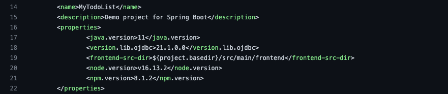
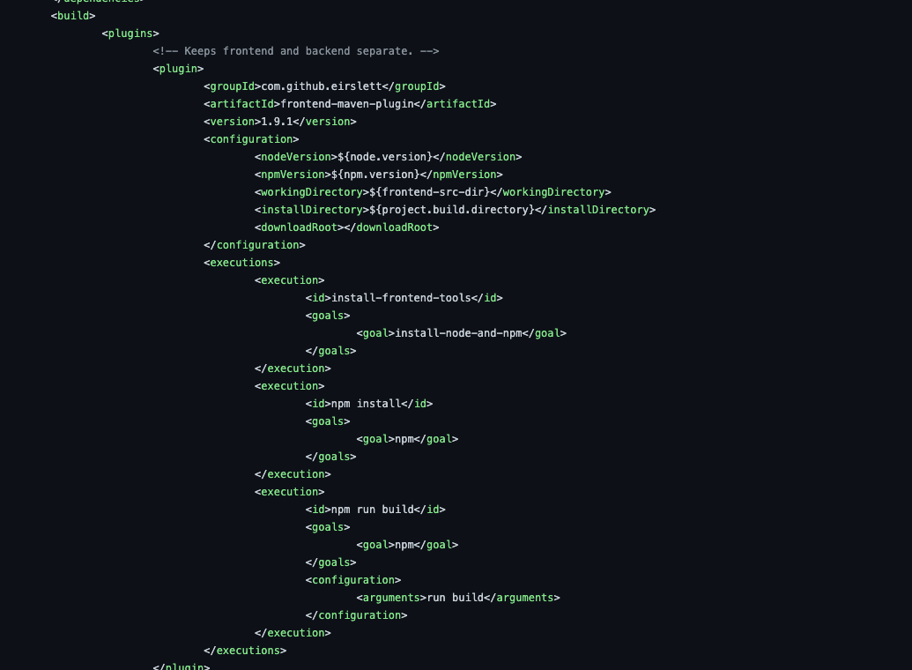
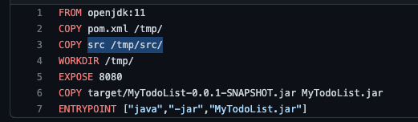

# Learn how the Frontend Works

## Introduction

In this lab, you will learn how the frontend react application is deployed and maintained.

Estimated time: 10 minutes

<!-- Watch the video below for a quick walk-through of the lab.

Mac:

 -->

### Understand the ReactJS Application

The application is simple; it uses "functional components" with "state hooks" for managing states. There is a central part called "App," which renders another part called "NewItem" and two tables of todo items: the active ones and the already done ones. The "NewItem" part displays the text field for adding a new item.

The App part includes the items state ([]), which contains the list of todo items. When setItems is called with a new array of items, the part will re-render.

The App part also maintains the following states:

- "isLoading" is true when waiting for the Java tier to return the list of items. We use this state to display a spinning wheel while loading.

- "isInserting" is true when waiting for the Java tier to process a newly inserted item. The **Add** button will display a spinning wheel during this time.

- "error" stores the error messages received during the API calls.

The index.css file has all the styles for the application.

### Objectives

In this lab, you will:
- Look at the code to see how the frontend deploys.

### Prerequisites

1. This lab requires the completion of **Setup Dev Environment** and **Backend (Java/SpringBoot)**.

## Task 1: Learn how the frontend build is automated

1. The frontend folder is located inside `MtdrSpring/backend/src/main`. It is inside the backend folder because we copy the `src` directory into our docker container. We could move the frontend folder somewhere else, and we would have to make the appropriate changes to the other files.

2. To see how the frontend build is automated, we must look at the `pom.xml` file.

	

	Here we can see that a `frontend-src-dir` is specified. 
3. Inside the `<build>` portion of our `pom.xml`, we specify our working directory as the `frontend-src-dir` we specified earlier, and within the `<execution>` section of the `pom.xml` we specify what we want to accomplish. In this case, we want to install node and npm, then create our build folder. For further detail on this plugin navigate [here](https://github.com/eirslett/frontend-maven-plugin)

	

4. Once the build folder is created, we use the `maven-resources-plugin` to copy the resources from our build folder into the outputDirectory. `${project.build.outputDirectory}` is a default location provided to you by Maven. Read the maven specifications for more details.

5. Finally, we need to ensure our container has the necessary files to run the frontend. We copy the src directory to our container within the dockerfile.

	

6. We recommend to visit the GitHub Repository to look at the file structure and how everything works together to fully understanding how the frontend is hosted!

You may now **proceed to the next lab**.

## Acknowledgements

* **Authors** -  Kuassi Mensah, Dir. Product Management, Java Database Access; Peter Song, Developer Advocate JDBC
* **Contributors** - Jean de Lavarene, Sr. Director of Development, JDBC/UCP
* **Last Updated By/Date** - Peter Song, Developer Advocate JDBC
