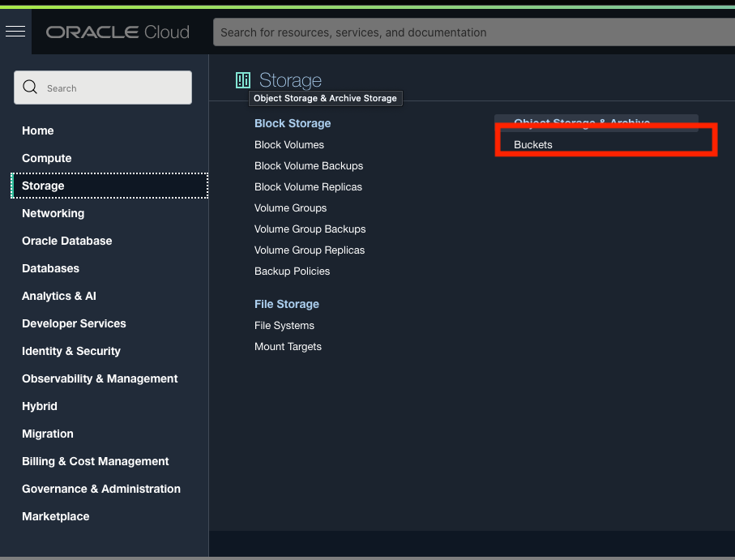

# Deploy the Frontend React JS Application

## Introduction

In this lab, you will make changes and deploy a pre-built ReactJS application locally then build it for production and host it on Oracle Cloud Infrastructure.

Estimated time: 10 minutes

Watch the video below for a quick walk-through of the lab.

Mac:

[](youtube:xCVhmx7KAm8)


### Understand the ReactJS Application

The application is simple; it uses "functional components" with "state hooks" for managing states. There is a main part called "App," which renders another part called "NewItem" and two tables of todo items: the active ones and the already done ones. The "NewItem" part displays the text field for adding a new item.

The App part includes the items state ([]) which contains the list of todo items. When setItems is called with a new array of items, the part will re-render.

The App part also maintains the following states:

- "isLoading" is true when waiting for the Java tier to return the list of items. We use this state to display a spinning wheel while loading.

- "isInserting" is true when waiting for the Java tier to process a newly inserted item. The **Add** button will display a spinning wheel during this time.

- "error" stores the error messages received during the API calls.

The index.css file has all the styles for the application.

### Objectives

In this lab, you will:
- Clone the workshop git repository **on your laptop**
- Set the API Gateway endpoint
- Run the ReactJS frontend code in Dev Mode then Build for Production
- Host the production build on the Oracle Cloud's object storage
### Prerequisites

1. This lab requires the completion of **Setup Dev Environment** and **Backend (Java/SpringBoot)**. This lab requires sudo privileges (if you can successfully issue a sudo command, you have admin privileges)

2. Make sure the `npm` command is installed.

    ```
    <copy>npm --version</copy>
    ```
3. if `npm` is not installed, install `Node` for your laptop, using `https://bit.ly/3oVTrSh`.

4. Make sure `Go lang` is installed.

    `go version` shows `go version go1.15.2 darwin/amd64`.

    ```
    <copy>go version</copy>
    ```
5. If `Go lang` is not installed, see https://golang.org/doc/.

6. Make sure **git** is installed; if not please follow the instructions @ `https://bit.ly/3DXyjiL`.

## **Task 1**: Configure API.js
In this task, you will edit API.js to point to the correct endpoint that has been allowed (in the previous lab) to access the APIs used in your application

This project was bootstrapped with [Create React App](https://github.com/facebook/create-react-app).

1. Clone the git repository to a directory on your laptop (we only need the front end in this lab)
	```
	<copy>
	mkdir reacttoo
	cd reacttodo
	git clone -b springboot --single-branch https://github.com/oracle/oci-react-samples.git
	cd oci-react-samples/MtdrSpring
	</copy>
	```

2. Navigate to frontend
	```
	<copy>
	cd frontend
	</copy>
	```

3. Run the following npm commands to install the required packages

	```
	<copy>
	npm install --save typescript
	</copy>
	```
	```
	<copy>
	npm install
	</copy>
	```
    In case of errors, try the following command
	```
	<copy>
	npm audit fix --force
	</copy>
	```
  Ideally, npm -version should return > 6.14.x AND Node version > 14.16.x
  If the npm version < 6.14.x then install the latest Node using
   https://bit.ly/3evGlEo

4. Update API_LIST in API.js

- Make sure to be in the frontend/src directory
	```
	<copy>
	cd frontend/src
	</copy>
	```
- In the Cloud console, navigate to **Developer Services > API Management >Gateways**

 	

- Click on your Gateway and go to Deployment and copy the Deployment Endpoint

	

 - Paste the endpoint as the value of 'API_LIST' and append "/todolist"
    
	
  
  Example: const 'API_LIST' = 'https://xxxxxxxxxx.apigateway.eu-frankfurt-1.oci.customer-oci.com/todolist';

  - Save the modified API.js file

## **Task 2**: Run in Dev Mode then Build for Production
Here you will run the application locally in development mode, then run it in production mode to create the build folder.
1. In the project directory, run the app in the development mode <br />

	```
	<copy>
	npm start
	</copy>
	```

2. Open [http://localhost:3000](http://localhost:3000) to view it in the browser.

3. The page will reload if you make edits.<br />
   You will also see any lint errors in the console.

4. Cancel the developer mode execution and build the app for production to the `build` folder. This will create a folder named `build` for you<br />

- Issue "Ctrl-c" to cancel the developer mode executions

- Execute npm run build
	```
	<copy>
	npm run build
	</copy>
	```
It correctly bundles React in production mode (into the build folder) and optimizes the build for the best performance.

  

	The build is minified and the filenames include the hashes.<br />
	Your app is ready to be deployed!

	See the section about [deployment](https://facebook.github.io/create-react-app/docs/deployment) for more information.

## **Task 3**: Hosting on the Oracle Cloud's Object Storage
The build folder will be uploaded to object storage so you can access your application from OCI.

1. Open up the hamburger menu in the top-left corner of the Console and select
**Object Storage > Object Storage**.

  

  Create the 'mtdrworkshop' (or another name if that's taken) bucket

  

  Enter in the bucket details.

  

  Edit visibility to public

  

2. Install the Staci utility for copying directories to OCI object storage
   bucket with folder hierarchies

	- git clone https://github.com/maxjahn/staci.git

		```
		<copy>
		git clone https://github.com/maxjahn/staci.git
		</copy>
		```

	- cd staci

		```
		<copy>
		cd staci
		</copy>
		```
	- go mod init staci

		```
		<copy>
		go mod init staci
		</copy>
		```
	- go get -d

		```
		<copy>
		go get -d
		</copy>
		```

	- go build

		```
		<copy>
		go build
		</copy>
		```
3. If you have never used your laptop for connecting to an Oracle Cloud account, you need to set up an **OCI config file** and create an **API key**
    * Follow Step #2 in the following doc https://bit.ly/3vM7v2h for that purpose.

4. Upload a static build into the bucket, using the staci binary.
`-source build` should be the path to `build` from `npm run build` earlier. `-target mtdrworkshop` should be the name of the bucket

	```
	<copy>
	./staci/staci -source build -target mtdrworkshop
	</copy>
	```

* The application is visible in the 'mtdrworkshop' bucket of your tenancy

* Click on the index.html object and copy the URL of the index object

	

- You may now run the application from Object Storage, using the URL of the index that you've copied above.

	
  

You may now **proceed to the next lab**.

## Acknowledgements

* **Authors** -  Kuassi Mensah, Dir. Product Management, Java Database Access; Peter Song, Developer Advocate JDBC
* **Contributors** - Jean de Lavarene, Sr. Director of Development, JDBC/UCP
* **Last Updated By/Date** - Peter Song, Developer Advocate JDBC
