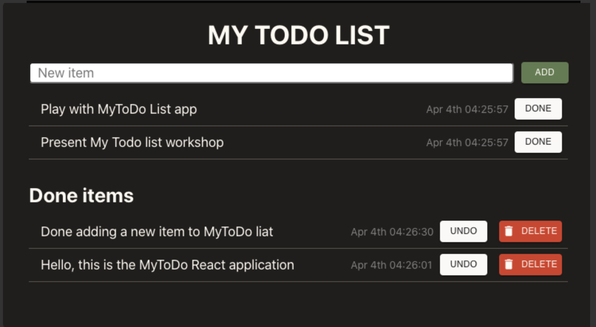
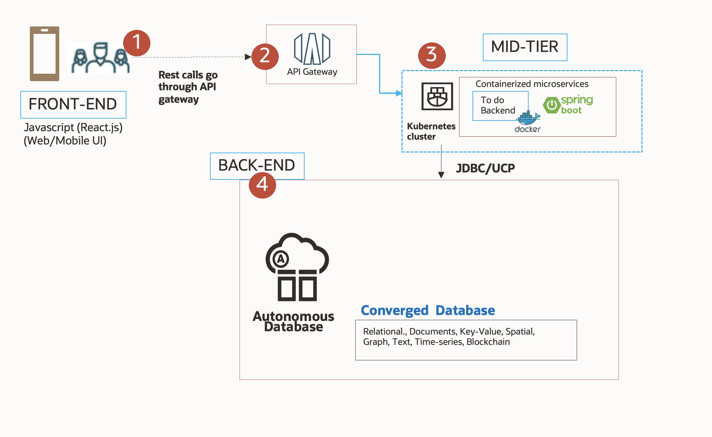

# Introduction

## About this Workshop

In this workshop, you will explore how to use SpringBoot to build microservices to build and deploy a Cloud Native application. You will serve the data to the React.js frontend and persist your data in the Oracle Autonomous database while utilizing Oracle Cloud Infrastructure (OCI) services.

Estimated Time: 50 minutes

### About Product/Technology

Learn how to use Autonomous Database, the Oracle Container Registry (OCR), Oracle Container Engine for Kubernetes (OKE), SpringBoot, and the API Gateway managed services of OCI through the deployment of a simple MyToDo List React JS application.

<!-- 
include architecture diagram here -->

### Objectives

In this 3 part workshop, you will:

* Provision a Kubernetes cluster, Oracle Autonomous Database, a Container Registry, and an API Gateway
* Understand, build, and deploy a Java tier implementing the REST APIs, using the SpringBoot framework, Docker, the OCI Container Registry, and a Kubernetes service
* Understand, build, and deploy a ReactJS frontend/UI making REST calls to the SpringBoot service implementing the REST APIs; then redeploy the ReactJS frontend over an OCI Object storage bucket

### Prerequisites

* An Oracle Free Tier or Paid Cloud Account

You may now **proceed to the next lab**.

## Acknowledgements

* **Author** - Peter Song, Developer Advocate, JDBC
* **Contributors** - Jean de Lavarene, Sr. Director of Development, JDBC/UCP; Kuassi Mensah, Dir. Product Management, Java Database Access
* **Last Updated By Date** - Peter Song, Developer Advocate, JDBC