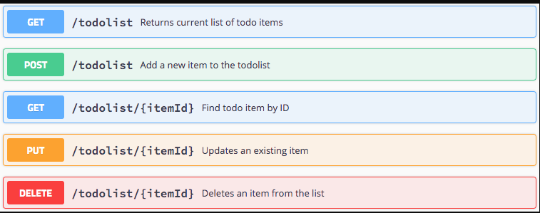
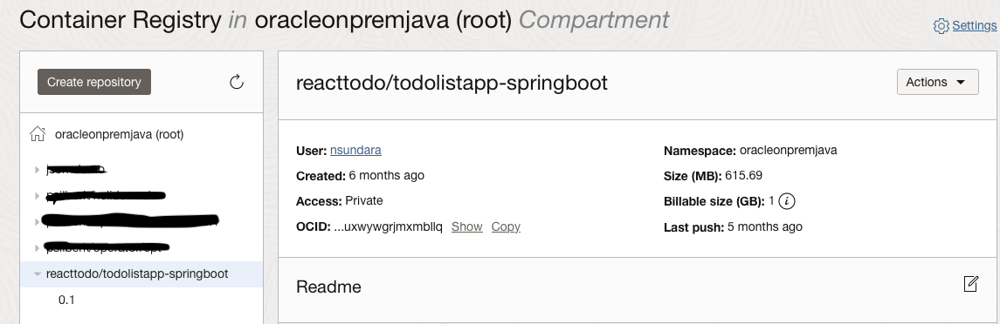
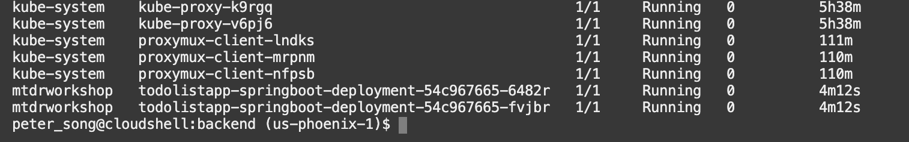
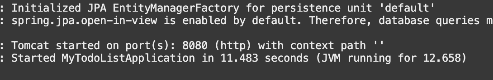
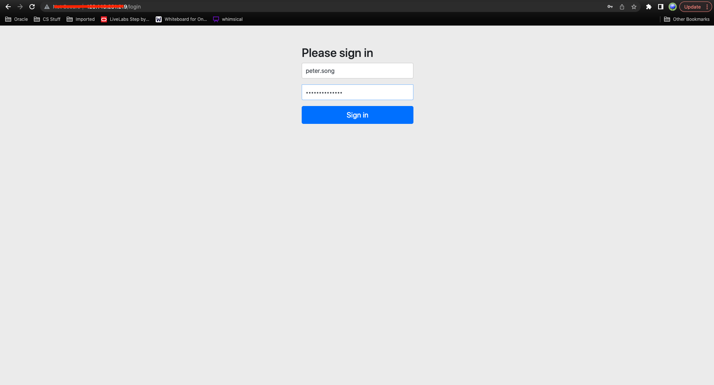
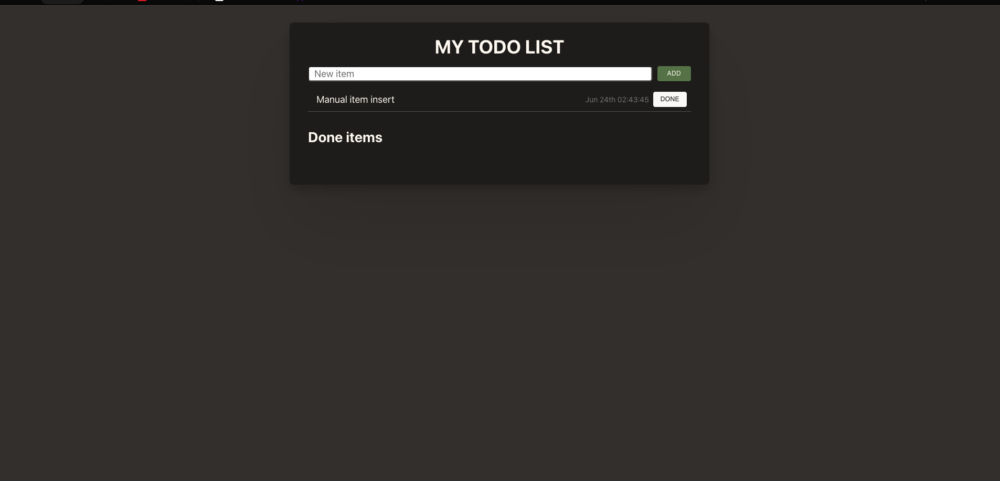

# Deploy the Backend Docker Image to Kubernetes

## Introduction

In this lab, you will make changes and deploy the pre-built SpringBoot Java backend Docker image to OKE, update the code to reflect the IP address of the API Gateway, and finally update your Kubernetes pod to use the latest docker image.

Estimated time: 15 minutes

Watch the video below for a quick walk-through of the lab.
[Backend (Java/SpringBoot)](videohub:1_6h0vwu1q)

### Understand the Java backend application

As with most React applications (https://react.dev/), this application uses remote APIs to handle data persistence. The backend implements five REST APIs to support the functionality below:

* Retrieve the current list of todo items
* Add a new todo item
* Find a todo item by its ID
* Update an existing todo item
* Delete a todo item

The APIs are documented using Swagger.

The backend is implemented using the following Java classes (under ./backend/src/main/java/com/springboot...):

* MyTodoListApplication.java: Starts and configures the main entry points
* ToDoItem.java: Maps a Todo Item instance to and from the JSON document
* OracleConfiguration.java: Connects SpringBoot backend to Oracle Autonomous Database
* ToDoItemService.java: Implements the SpringBoot service and exposes the REST APIs
* ToDoItemController.java: Implements the endpoints and populates data


### Objectives

* Build and deploy the Docker image of the application
* Deploy the image on the Oracle Kubernetes Engine (OKE)
* Describe the steps for Undeploying
* Test the backend application

### Prerequisites

* This lab requires the completion of the **Setup Dev Environment** tutorial (aka Lab 1).

## Task 1: Build and Push the Docker Images to the OCI Registry

The OCI Container Registry is where your Docker images are managed. A container registry should have been created for you in Lab 1 in your compartment.

1. Run `build.sh` script to build and push the SpringBoot image into the repository

    ```
    <copy>
    cd $MTDRWORKSHOP_LOCATION/backend
    source build.sh
    </copy>
    ```
In a couple of minutes, you should have successfully built and pushed the images into the OCI repository.

2. Check your container registry in your compartment (refresh the console if the image is not shown)

    * Go to the console, click the hamburger menu in the top-left corner, and open **Developer Services > Container Registry**.

    

## Task 2: Deploy on Kubernetes and Check the Status

1. Run the `deploy.sh` script

    ```
    <copy>
    cd $MTDRWORKSHOP_LOCATION/backend
    ./deploy.sh
    </copy>
    ```

    If everything runs correctly, the script will output something like this:

    

2. Check the status using the following commands

    The following command returns the Kubernetes services of the MyToDo application with a load balancer exposed through an external API

    ```
    <copy>
    services
    </copy>
    ```

    This will run `kubectl get services` (but the setup script creates aliases for ease of use). After running the command above, it should output the external IP address.

    

3. The following command returns all the pods running in your Kubernetes cluster:

    ```
    <copy>
    pods
    </copy>
    ```

    Pods is an alias for `kubectl get pods`.
    

4. You can tail the log of one of the pods by running:

    ```
    <copy>
    kubectl -n mtdrworkshop logs -f <pod name>
    </copy>
    ```

    ```
    <copy>
    $ kubectl logs -f
    </copy>
    ```

    <br>
    Example: `kubectl -n mtdrworkshop logs -f todolistapp-springboot-deployment-54c967665-6482r`

    

    If the logs return

    "Tomcat started on port(s): 8080 (HTTP) with context path"

    then everything looks good.

5. Once your pods are up and running. Go to your web browser and navigate to the load balancer IP address.
    The application login screen will appear
    

    Once you log in, you should see the following output, which means your deployment is successful!
    

    You may now **proceed to the next lab**.

## Task 3: UnDeploy (optional)

If you make changes to the image, you need to delete the service and the pods by running undeploy.sh then redo Tasks 1 & 2.

1. Run the `undeploy.sh` script

    ```
    <copy>
    cd $MTDRWORKSHOP_LOCATION/backend
    source undeploy.sh
    </copy>
    ```
2. Rebuild the image + Deploy + (Re)Configure the API Gateway

## Acknowledgements

* **Author** - Peter Song, Developer Advocate JDBC
* **Contributors** - Kuassi Mensah, Director Product Management and Jean de Lavarene, Sr. Director of Development, JDBC/UCP
* **Last Updated By/Date** - Juarez Barbosa Junior, July 2023
