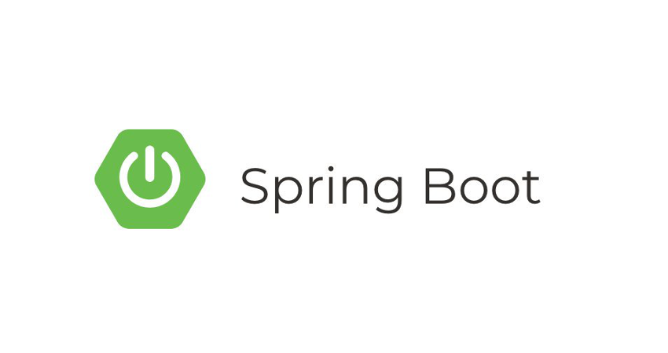
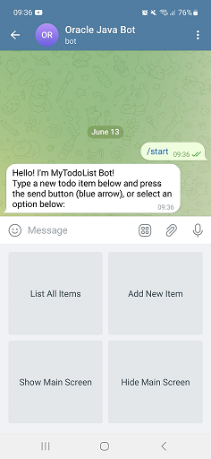
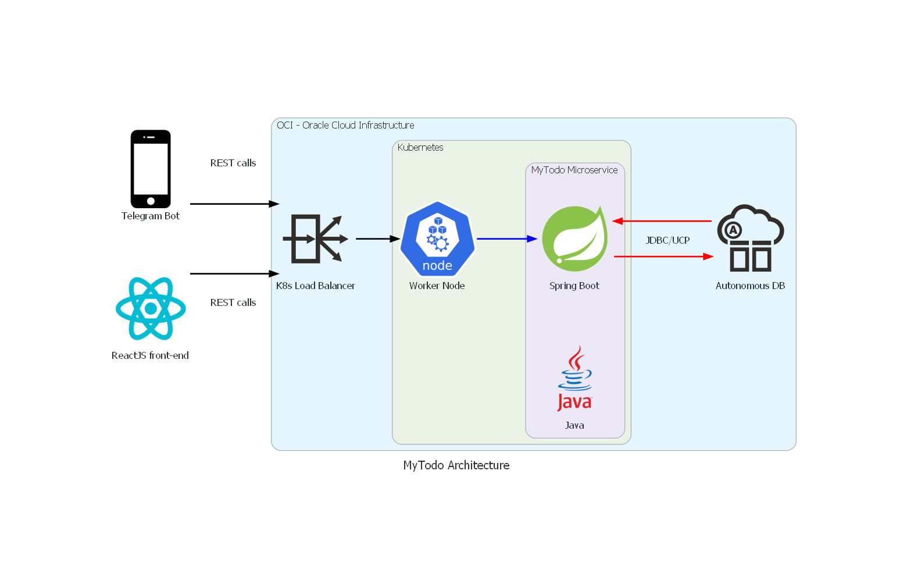

# Introduction

## About this Workshop

In this workshop, you will explore how to use SpringBoot to build microservices and deploy a Cloud Native application. You will serve the data to a Telegram Chatbot and persist your data in the Oracle Autonomous database while utilizing Oracle Cloud Infrastructure (OCI) services.

Estimated Time: 50 minutes

### About Product/Technology

Learn how to use Autonomous Database, the Oracle Container Registry (OCR), Oracle Container Engine for Kubernetes (OKE), SpringBoot, and the API Gateway managed services of OCI through the deployment of a simple MyToDo List Telegram Bot application.

<!-- 
include architecture diagram here -->

### Objectives

In this 3 part workshop, you will:

* Provision a Kubernetes cluster, Oracle Autonomous Database, a Container Registry, and an API Gateway
* Understand, build, and deploy a Java tier implementing the REST APIs, using the SpringBoot framework, Docker, the OCI Container Registry, and a Kubernetes service
* Understand, build, and deploy a Telegram Bot frontend/UI making calls to the SpringBoot service implementing the REST APIs. The solution also has a React JS front that you can deploy over an OCI Object storage bucket.

### Prerequisites

* Please refer to "Get Started"

You may now **proceed to the next lab**.

## Acknowledgements

* **Author** - Juarez Barbosa, Sr. Principal Java Developer Evangelist, Java Database Access; Peter Song, Developer Advocate, JDBC
* **Contributors** - Jean de Lavarene, Sr. Director of Development, JDBC/UCP; Kuassi Mensah, Dir. Product Management, Java Database Access;
Peter Song, Developer Advocate, JDBC
* **Last Updated By Date** - Juarez Barbosa, June 2023