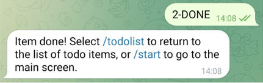
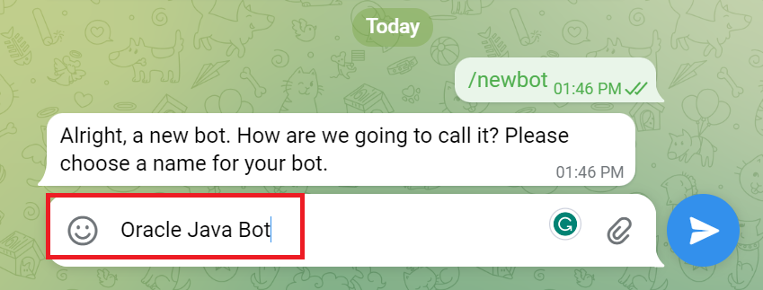

# Learn how a Telegram Bot works

## Introduction

In this lab, you will learn how the Telegram Bot that acts as a frontend works.

Estimated time: 10 minutes

<!-- Watch the video below for a quick walk-through of the lab.

Mac:

 -->

### Objectives

In this lab, you will:

- Look at the code to see how the frontend deploys.

### Prerequisites

1. This lab requires the completion of **Setup Dev Environment** and **Backend (Java/Spring Boot)**.

## Task 1: Understand the Telegram Bot GUI

The main screen has one (1) input field and four (4) buttons. The input field is used to add new items directly from the main screen. 

1. Just type the new item, then touch the blue arrow on the right-hand side to add it.

    

2. There are also four buttons that can be used to list all items, add a new item, and show/hide the main screen.

    

3. By selecting the new item button, a message will be shown with the same explanation about how to add a new item as above.

    

4. Next, if you select the List All Items button, the screen below will be rendered.
The first button allows you to return to the main screen, the second one allows you to add a new item, and the third one list all items. The list of items has two sections with the active ones at the top, and the already done ones at the bottom.

    

5. For each item listed, the active ones (not done) have a Done button to allow you to mark them as completed.

6. At the bottom, the inactive items (done) have an Undo button to allow you to make them active again. They also have a Delete button to allow you to delete them altogether, so their status won't be changed anymore.

7. Yet at the bottom, there's also an additional button to allow you to navigate back to the main screen.

    

8. Last, when you execute a command, a feedback message will be show with some shortcuts/hints concerning what you can do next.

9. Below is an example showing a suggestion presented after marking an item as done.
If you select /todolist, all items will be listed again.

10. Otherwise, if you select /start, you will redirected to the main screen.

    

## Task 2: Understand the Telegram Bot implementation

The application is simple; it uses the Telegram Bot API with the "long pooling method" for managing the bot interactions with the backend Spring Boot application.

1. The central component that controls the interaction with the Telegram messaging platform is started along with the Spring Boot application on the same main entry point class, that is, the Java class with the "@SpringBootApplication" annotation.

2. The Telegram Bot API is started as part of the application's bootstrap process, and a default session with the Telegram platform is created. 

3. Next, the controller that implements the Telegram Bot functionality will be registered as a bot. To do so, it uses the Telegram Bot Token that you got from the Telegram platform in the previous section.

    

4. The Bot controller implements two main functions. First, it interacts with the Telegram Bot platform by implementing a callback method that watches for updates from the Telegram platform.

    

5. Second, depending on the bot commands selected, it will invoke the respective methods exposed by a Spring Boot component called "ToDoItemService", which acts as a service to interact with the database access components. 

    

## Task 3: Create a Telegram Bot

You must use Telegram to create your chatbot and get the details about your token ID and chat ID, respectively.

1. Open a web browser and access the Telegram platform (web or smartphone) at [https://web.telegram.org/](https://web.telegram.org/)

2. Search for "BotFather" on Telegram, then click on it.
    

3. Select START on BotFather's screen.
    

4. Click "\newbot" as below to create a new bot.
    

5. Define a name for your bot. "Oracle Java Bot" is used below.
    

6. Define a unique username for your bot. It must end with 'bot'.
    

7. Take note of your "Telegram Bot Token" which is required to access the Telegram Bot (HTTP) API. Besides, also take note of your bot URL "(t.me/your_bot_unique_name)" and use it to access your bot, as below.
    

8. Configure the Telegram Bot details. Navigate to `MtdrSpring/backend/src/main/resources`, use a text editor (vi, vim, nano, etc) to open the application.properties file, then uncomment the two entries below to configure the "Telegram Bot Token" and "Telegram Bot Name" properties with the values you got from the Telegram Bot platform in the previous steps.
    

You may now **proceed to the next lab**.

## Acknowledgements

* **Authors** -  Juarez Barbosa, Sr. Principal Java Developer Evangelist, Java Database Access; 
* **Contributors** - Kuassi Mensah, Dir. Product Management, Java Database Access
* **Last Updated By/Date** - Juarez Barbosa Junior, July 2023
