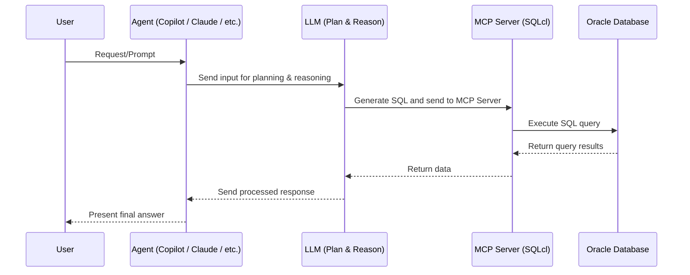

# Introduction

## About this Workshop

What Happens at Each Hop
1.	User: Asks a task in natural language (e.g., “Find the top 10 most expensive queries from last week and recommend an index.”).
2.	Agent: Builds/Shows a plan (some agents render a step list), selects MCP tools.
3.	LLM: Generates the SQL or chooses a prebuilt tool (e.g., “AWR analysis”).
4.	MCP Server (SQLcl): Executes safely via JDBC using stored credentials (LLM never sees passwords).
5.	Oracle Database: Enforces all your standard security and returns results.
6.	Back to LLM: Summarizes, validates, proposes next steps (“Create the index?”).
7.	User: Reviews/approves each step (stay in the loop; you’re the pilot).

This introduction covers the complete "parent" workshop. Use this text to set up the story for the workshop. Be engaging - what will the learner get from spending their time on this workshop?

Estimated Time: -- hours -- minutes (This estimate is for the entire workshop - it is the sum of the estimates provided for each of the labs included in the workshop.)

*You may add an option video, using this format: *

  

### Objectives

*List concise objectives for the workshop*

In this workshop, you will:
* Objective 1
* Objective 2
* Objective 3

### Prerequisites (Optional)

*List the prerequisites for this lab using the format below. Fill in whatever knowledge, accounts, etc. is needed to complete the lab. Do NOT list each previous lab as a prerequisite.*

This lab assumes you have:
* An Oracle account
* All previous labs successfully completed

*This is the "fold" - below items are collapsed by default*

In general, the Introduction does not have Steps.

### About

#### MCP

Model Context Protocol (MCP) is a proposed standard of communication and interaction between you and your information or data (like an Oracle Database 23ai), through an intermediary called an MCP Server. 

When designed properly, an MCP server can take your core tech, like SQLcl, and perform certain functions on or about your data while simultaneously being "connected" to an AI API (LLM) of your choice.

That's it. When done correctly, your MCP Server will have been designed to have certain capabilities. These capabilites (technically known as Primitives) can be used or called upon in the *Context* you are in; like connecting to and interacting with your Oracle database via the SQLcl command line interface. 

MCP solves this specific problem: 

> *How can I securely use LLMs in and around my Oracle Database, while also keeping SQLcl as my "base of operations."*

##### Protocols

When you interact with your MCP server, the natural language question you ask is translated in a way that the MCP server can understand while also considering how it might use your MCP's available Tools to achieve your goals.

Much happens under the covers for MCP to work, but you should know that MCP can support the following communication mechanisms: 

- Stdio
- HTTP (in the form of `POST` requests)

The SQLcl MCP server utilizes the fast, no overhead Stdio communcation mechanism. To you, the end user, *this* is what makes up the **Protocol** in Model Context Protocol (MCP). 

##### Capabilities

We mentioned Capabilities earlier. Technically speaking an MCP will have a set of Primitives. They can be any one of the following: 

|  | | 
| -- | -- | 
| Tools | Executable functions that AI applications can invoke to perform actions (e.g., file operations, API calls, database queries) | 
|Resources| Data sources that provide contextual information to AI applications (e.g., file contents, database records, API responses)|
|Prompts| Reusable templates that help structure interactions with language models (e.g., system prompts, few-shot examples)|

But in the case of this Lab, you'll explore the available Tools that the SQLcl MCP Server has to offer. 

#### The SQLcl MCP server

Since SQLcl is an already existing, and powerful command line tool for the Oracle database, it makes sense to "extend" its capabilitites with an MCP server. 

For many users, and scripting tools, SQLcl is the preferred way to interact with an Oracle database. And since you are already interacting with the command line; it makes sense to implement the Stdio means of communicating with the SQLcl MCP server. This means that responses are fast, as they are printed directly to your client's Stdout.

But as an end-user, you probably want to know what you can do with this SQLcl MCP Server. Read on to learn more. 

##### Tools

The SQLcl MCP server, like other MCP servers provides you with contextual "Tools." In the case of SQLcl, your MCP server "comes alive" after you've configured your database credentials, Connect String, and/or Cloud Wallet. 

At this point, you can explore your Oracle database via SQLcl, but using natural language. If you are just beginning your database journey this means your queries become more of a conversation. Think of the MCP server as like a soundboard for your ideas and intent. 

But if you are an experienced user, you can use a combination of natural language, and formal SQL and PL/SQL to achieve your goals with ease and even more speed. W

What tools do you have at your disposal? The practical scenarios in this lab will help you to understand what might be possible, but here is an overview: 

   |Tool | Parameters | Definition |
   | --- | ---------- | ---------- | 
   | `list-connections` | <ul><li>`filter`</li><li>`mcp_client`</li><li>`model`</li></ul> | <ul><li>This is the filter that will be used to refine the list of connections</li><li>Specify the name and version of the MCP client implementation being used (e.g. Copilot, Claude, Cline...)</li><li>The name (and version) of the language model being used by the MCP client to process requests (e.g. gpt-4.1, claude-sonnet-4, llama4...</li></ul>|
   | `connect` | <ul><li>`connection_name`</li><li>`mcp_client`</li><li>`model`</li></ul> | <ul><li>Specify the name and version of the MCP client implementation being used (e.g. Copilot, Claude, Cline...)</li><li>The name (and version) of the language model being used by the MCP client to process requests (e.g. gpt-4.1, claude-sonnet-4, llama4...</li></ul>|
   | `disconnect` | <ul><li>`mcp_client`</li><li>`model`</li></ul> | <ul><li>The name of the saved connection you want to connect to</li><li>The name (and version) of the language model being used by the MCP client to process requests (e.g. gpt-4.1, claude-sonnet-4, llama4...</li></ul>|
   | `run-sqlcl` | <ul><li>`sqlcl`</li><li>`mcp_client`</li><li>`model`</li></ul> | <ul><li>The SQLcl command to execute</li><li>Specify the name and version of the MCP client implementation being used (e.g. Copilot, Claude, Cline...)</li><li>The name (and version) of the language model being used by the MCP client to process requests (e.g. gpt-4.1, claude-sonnet-4, llama4...</li></ul>|
   | `sql` | <ul><li>`sql`</li><li>`mcp_client`</li><li>`model`</li></ul> | <ul><li>The SQL query to execute</li><li>Specify the name and version of the MCP client implementation being used (e.g. Copilot, Claude, Cline...)</li><li>The name (and version) of the language model being used by the MCP client to process requests (e.g. gpt-4.1, claude-sonnet-4, llama4...</li></ul>|

##### Security Considerations

Least Privilege: Use read only accounts for analytic/reporting tasks.
Segregation of Duties: Separate querying from DDL/DML (use different connections).
Policies: Apply existing AI data use policies; add agent specific rules (e.g., “no PII extraction,” “no mass updates”).
Avoid Tool Overlap: Do not ship multiple MCP servers that claim the same capability (e.g., multiple “run SQL” tools) — agents will get confused.
Approval Workflow: Require per step approval for anything that changes data, schema, security, or performance posture.
Monitoring:
Tag queries (model + agent) via SQL comments.
Store agent actions (who/what/when/db/plan) in an audit table.
Defense in Depth:
SQL Firewall patterns to block risky statements.
Data Vault for privileged access management.
Resource Manager for runaway queries.
Row level security for least data exposure.

Credentials never shown to the LLM/agent; managed in Oracle Wallet.
Honors DB roles/privileges and features (VPD/Row Level Security, Data Vault, SQL Firewall, Resource Manager).

##### Compatability

Compatibility note (from the workshop): JDBC often works against older DBs (even 11g), though only 19c+ is “current/fully supported.” Test as needed.

#### MCP Best Practices

Do
•	Use read only connections by default.
•	Keep MCP servers focused (no overlapping “run SQL” from multiple servers).
•	Make tools explain themselves (clear descriptions).
•	Log everything the agent runs (transparency).
Don’t
•	Don’t blanket approve session actions.
•	Don’t expose credentials to the LLM.
•	Don’t deploy agents into production without DB controls (Firewall, Vault, RLS, Resource Manager).
•	Don’t assume the LLM is always right—review SQL and results.

#### Summary 

•	What: Use MCP to let AI agents safely plan and execute multi step work against Oracle Database.
•	How: Ship a SQLcl based MCP server exposing clear tools (connect, run sql, awr, etc.), with wallet based credentials and Oracle’s security features intact.
•	Why: Massive productivity gains (DB exploration, reporting, performance triage) while keeping humans in control and security uncompromised.
•	Next: Pilot in VS Code with read only data; add logging; iterate; scale to HTTP MCP and OCI Control Plane.

## Learn More

*(optional - include links to docs, white papers, blogs, etc)*

* [URL text 1](http://docs.oracle.com)
* [URL text 2](http://docs.oracle.com)

## Acknowledgements
* **Author** - <Name, Title, Group>
* **Contributors** -  <Name, Group> -- optional
* **Last Updated By/Date** - <Name,  Month Year>
