# Setting up your development environment

## Introduction

In this Lab, you will setup your working environment to use the SQLcl MCP Server along with the Cline for VS code extension.

### Objectives

- Install:
    - SQL Developer for VS Code Extension
    - Cline for VS Code extension  
- Configure the SQLcl MCP server

### Prerequisites

This lab assumes you have:

* Access to an LLM Provider (via an API Key or similar authentication method) 
* Oracle Java 17 or 21 (recommended) installed
* A personal computer or access to a workshop-provided workstation
* Reviewed the prerequisites of the Introduction lab

<if type="freesql">

## Task 1: Create a FreeSQL account

1. Navigate to FreeSQL.com and sign in or create a new account <freesql-button>

     

     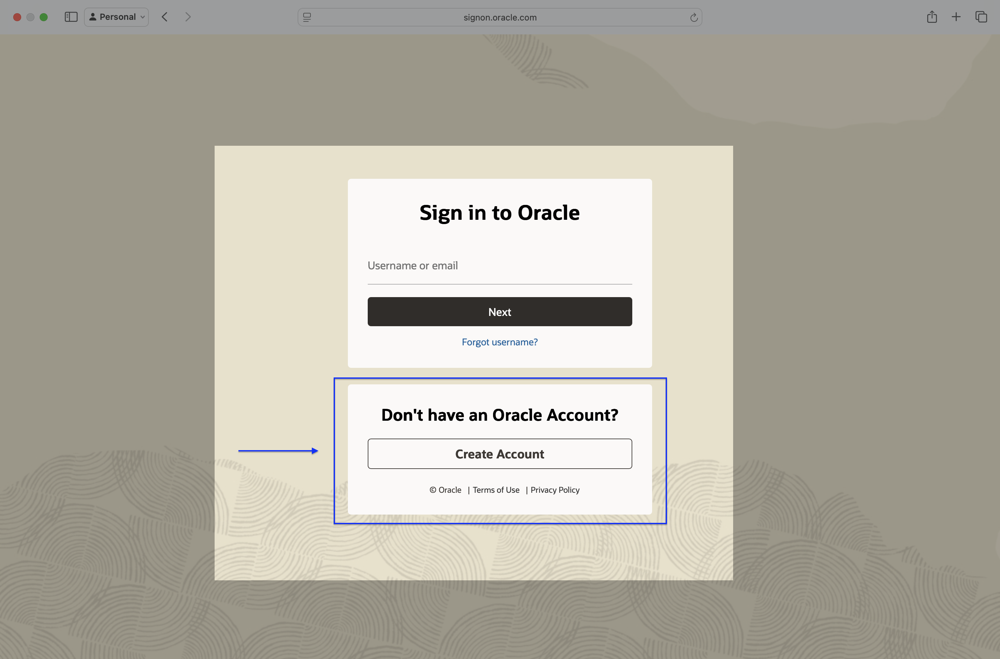  

     

       

     

2. Once logged in, click the <strong>Connect with [rotating language option]</strong> button.

   

3. Your new FreeSQL connection details will appear. Your password will appear only once. Copy the SQLcl connect string for future use. If you need a new password, click <strong>&circlearrowleft; Regenerate</strong>.

     
  
    

4. SQL Developer for VS Code Extension already installed? Take note of your password, click the <strong><span style="display:inline-block; transform: rotate(90deg);">&#8689;</span> Create a SQL Developer for VSCode connection</strong> button, and continue to the next task. Visual Studio Code should open automatically.

  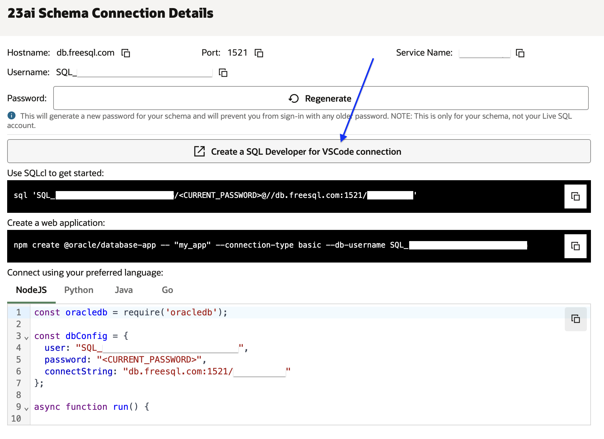  

5. If you do not yet have the SQL Developer for VS Code Extension installed, note your FreeSQL credentials for later use:
    - Username
    - Password
    - Hostname
    - Port
    - Service Name

   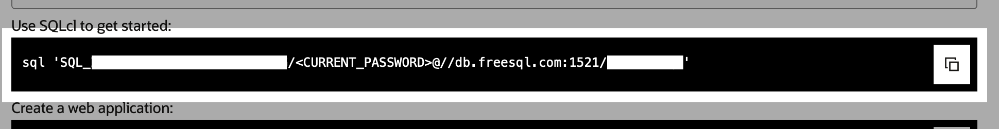

6. You will use this FreeSQL user for the remainder of LiveLab. Next, you'll create a database connection in SQL Developer for VS Code Extension. 

</if>

<if type="freetier">

## Task 1: Download the Instance Wallet

1. In this Lab, you will use a Cloud Wallet to configure your connection in SQL Developer for VS Code. Return to your Autonomous AI database dashboard.
2. Click on Database Connection.

   

3. Ensure Instance wallet is selected, then click Download wallet.

   

4. Enter and reconfirm a wallet password, then click Download.

    

5. Note the complete path of your Cloud Wallet.

    

> &#9872; **Note:** You can drag and drop the .zip file into a terminal to quickly discover the complete path.

## Task 2: Create a new REST-enabled database user

1. In your Autonomous AI database console, click **Database Actions** then **View all database actions**.

    

2. From the LaunchPad, go to **Administration** > **Database Users**.

   

3. From the User Management dashboard, select <strong>+ Create User</strong>.

   

4. In the create dialog, choose a username and password, enable **REST, GraphQL, MongoDB API, and Web access**.

   

5. You can enable the `DB_DEVELOPER_ROLE` role to grant developer permissions. Click **Create User** to finish.

   

6. Optionally, retain your user's unique SQL Developer Web login URL.

   

7. You will use this DB user for the rest of this Lab.

</if>

<if type="freesql">

## Task 2: Install SQL Developer for VS Code Extension 

</if>

> &#8505; **Note:** If you've pre-installed SQL Developer for VS Code or were redirected from FreeSQL.com you may proceed to Step 3.

1. Install SQL Developer for VS Code Extension:
     - [VS Code Marketplace](https://marketplace.visualstudio.com/items?itemName=Oracle.sql-developer), or
     - From VS Code, navigate to Extensions, search with keyword "Oracle", and install **Oracle SQL Developer for VS Code Extension**

     
     

2. Once installed, open the SQL Developer Extension (accessible from the Activity Bar).

     

<if type="freesql">

3. Click <strong>Create Connection</strong> and enter your FreeSQL connection details. 

   
   
   
   
> &#9888; **Important:** Check <strong>Save Password</strong>. The SQLcl MCP Server needs this to connect.
 
 <details>
  <summary style="color:DodgerBlue;"><i><b>( &#9756; click to expand) Redirected from FreeSQL.com?</b></i></summary>
  
  1. You may be prompted to allow the application to proceed.
   
   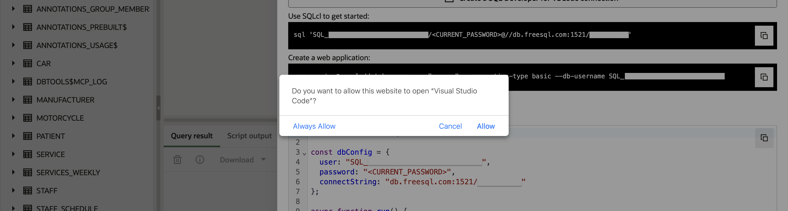

  2. Once VS Code has opened, you may need to grant additional permissions to the application. 
  
     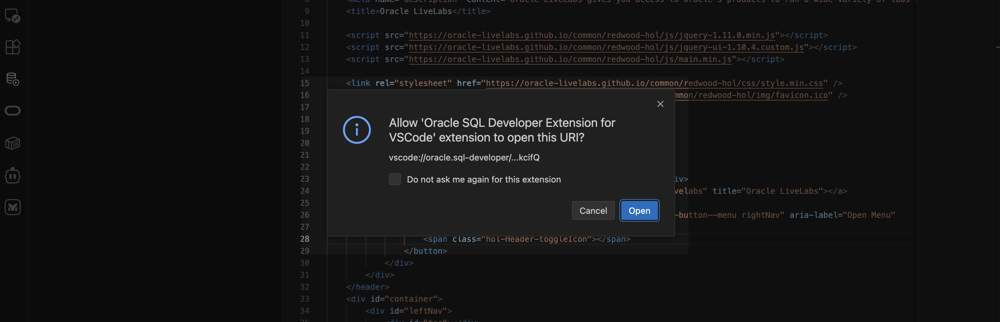
     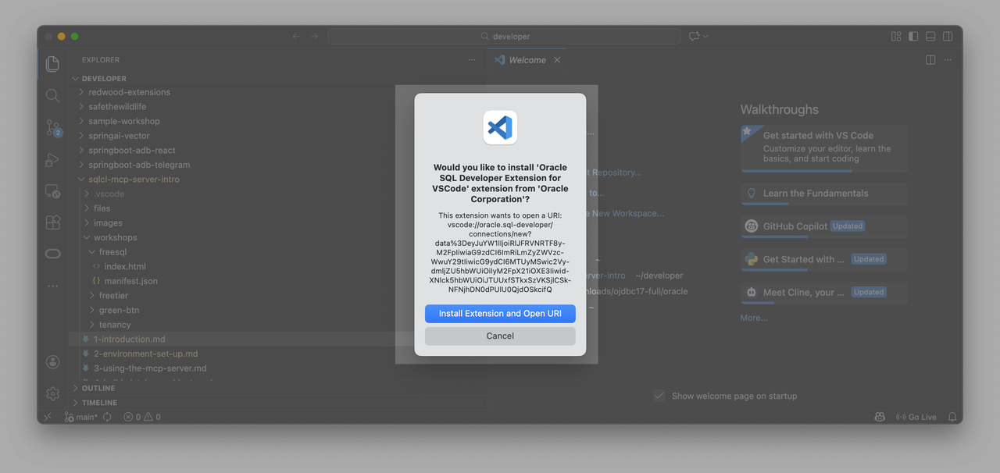

  4. Your FreeSQL credentails are pre-populated for you. Enter in your password, and save your password before saving the connection. 
  
      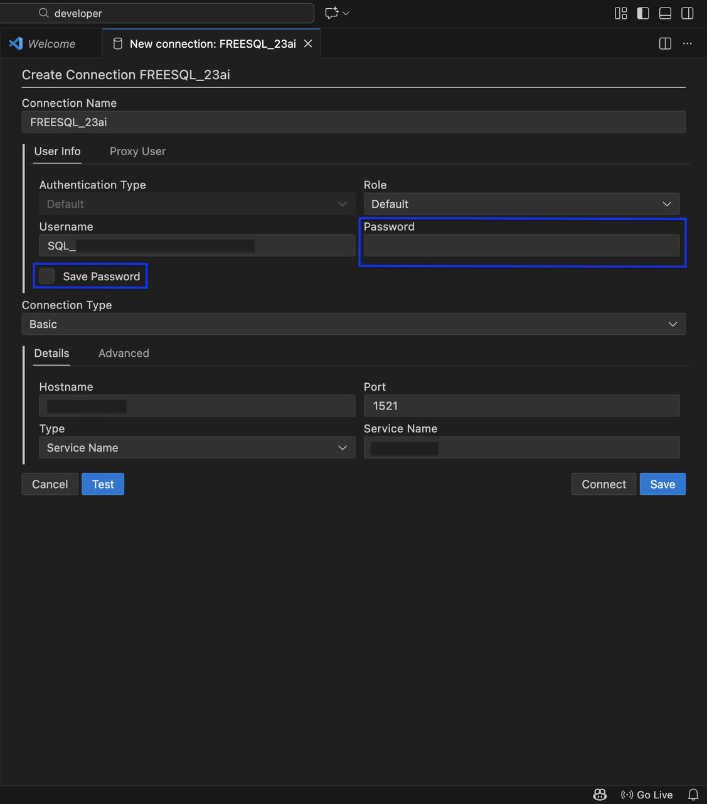

      > &#9888; **Important:** Check <strong>Save Password</strong>. The SQLcl MCP Server needs this to connect.

</details>

</if>

<if type="freetier">

3. Click <strong>Create Connection</strong>, enter your DB details, and select **Cloud Wallet** as Connection Type.

   
   

</if>

4. Click **Test** to check the connection. When successful, click **Save**.

   
   

6. Your new connection will appear in the sidebar. Click the connection name.

   

> &phone; **Info:** Clicking a connection establishes a connection and reveals schema objects, links, directories, and other categories.

7. Next, you'll <if type="freesql">install the Cline for VS Code Extension.</if><if type="freetier">install SQLcl.</if>

<if type="freetier">

## Task 4: Installing SQLcl

1. Download and install SQLcl:
   - With Homebrew (Mac):
     ```shell
     brew install --cask sqlcl
     ```
   - Or [download directly](https://www.oracle.com/database/sqldeveloper/technologies/sqlcl/download/)

> &#9872; **Note:** Use SQLcl version 25.2 or later to use the MCP Server.

2. Note the path to the SQLcl /bin directory. Examples:

   **macOS (Homebrew):**

    - *Homebrew installation*
  
      ```shell
      /opt/homebrew/Caskroom/sqlcl/[your SQLcl version]/sqlcl/bin
      ```

  **Manual installation**

    ```shell
    complete_file_path_to_your_sqlcldirectory/bin
    ```


</if>

## Task <if type="freesql">3:</if><if type="freetier">5:</if> Installing the Cline for VS Code Extension

1. In the VS Code Extensions tab, search for the Cline extension.


2. Install and open the extension from the Activity bar.

3. Choose how you will use Cline (this LiveLab assumes you provide you are providing your own API key).

 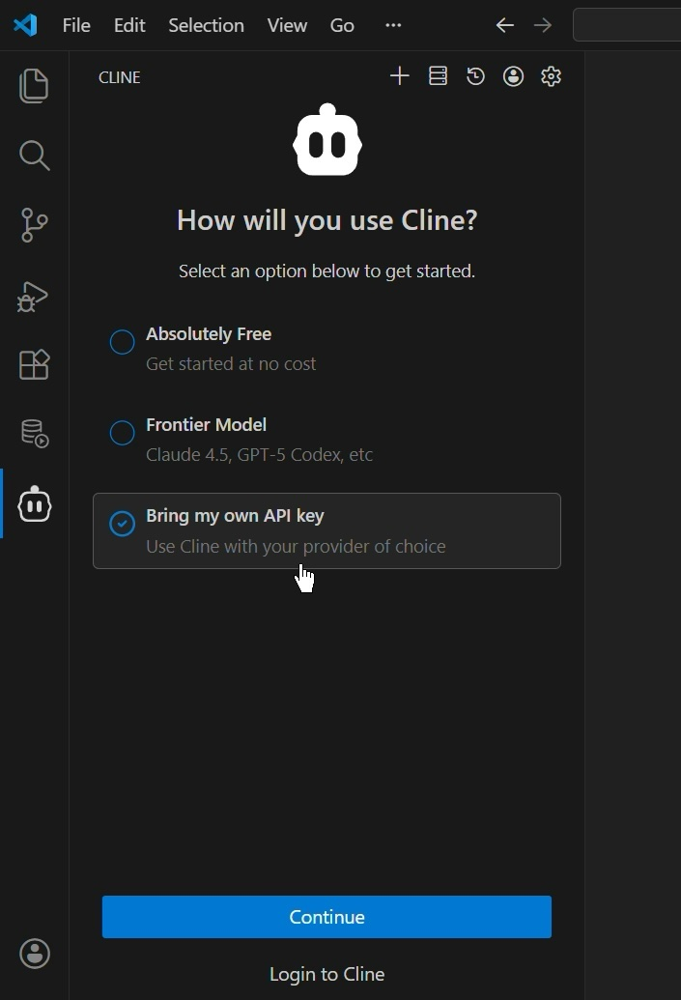

4. Choose from the list of available API Providers. Enter your API Key, and pick your LLM model (if bringing your own API Key).

 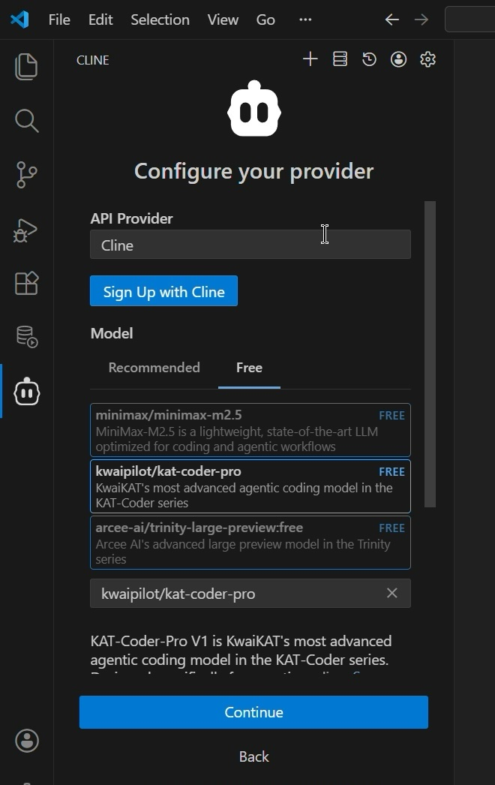

5. Click Continue to complete registration.

 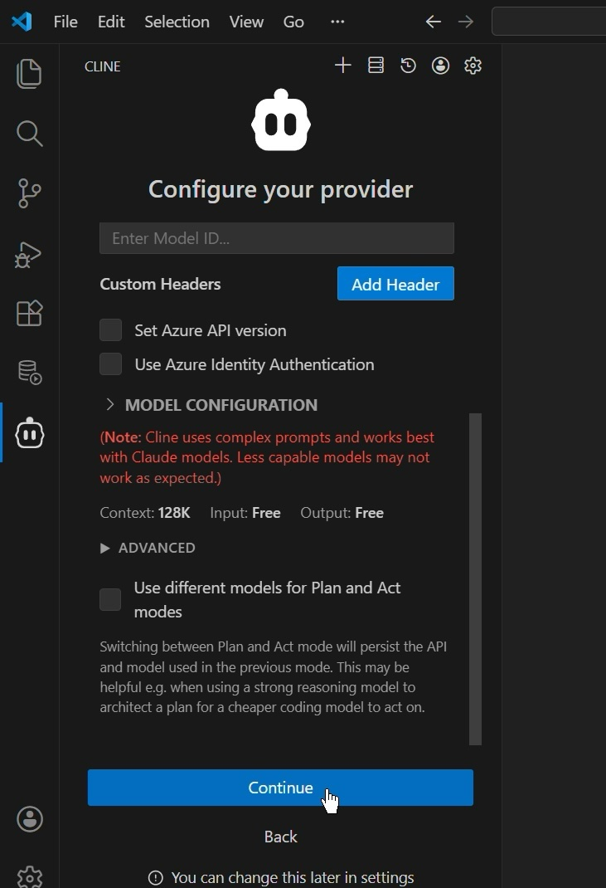

 <!-- 
  -->

6. With your provider settings complete, you’re ready to configure the SQLcl MCP Server.

## Task <if type="freesql">4:</if><if type="freetier">6:</if> SQLcl MCP server

1. In VS Code, open the Command Palette and search for: <kbd>Configure Cline SQLcl MCP</kbd>. 

  **On Mac**
 
  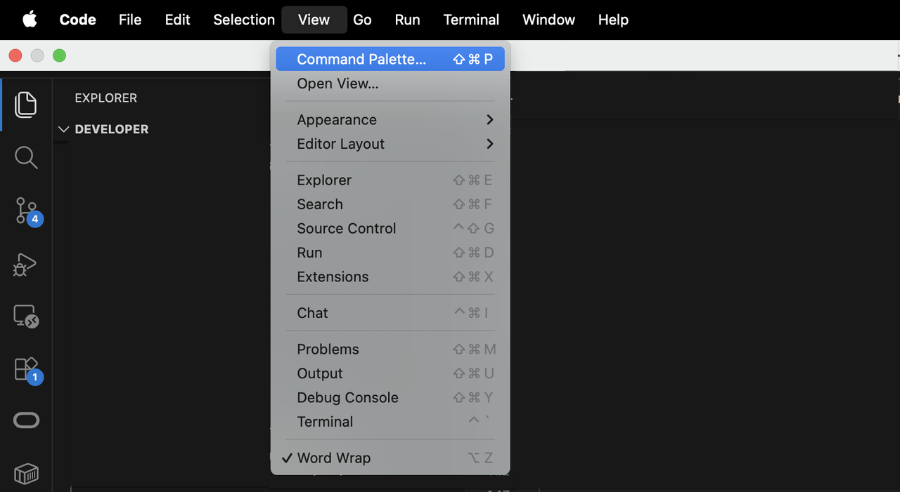

  **On Windows**

  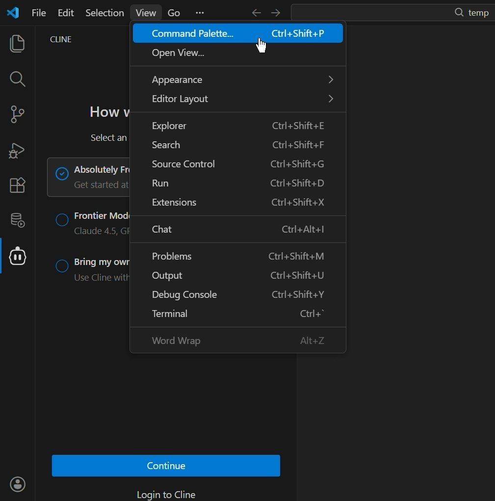

2. Once located, select the option. A preconfigured Cline configuration settings JSON file will appear. The details of your SQLcl installation will be preopulated; to include all required MCP Server settings and parameters

  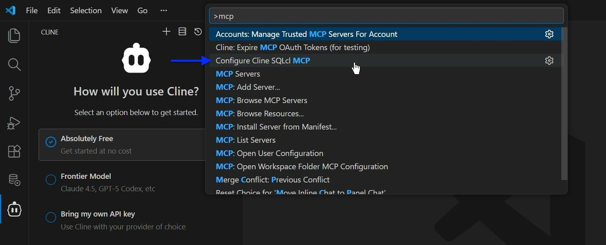

> &#9872; **Note:** Update to the latest version of SQL Developer for VS Code to use the embedded SQLcl that ships with this extension.

3. Preview the `cline_mcp_settings.json` configuration file. No updates are needed.

  

4. Save and close the file. You might see an "Updating MCP Servers..." notification followed by "MCP Servers updated..." notification. This is expected.

  

5. You should now see `SQLcl - SQL Developer` (the default name) under the Installed MCP Servers tab of the MCP Servers view.

  

6. Click the SQLcl MCP server frame to expand. You’ll see a list of SQLcl MCP Server tools, parameters, and definitions.

  

<p></p>

| Tool                | Purpose                                                        | Parameters                                           | Parameter Definitions                                                                                 |
|---------------------|----------------------------------------------------------------|------------------------------------------------------|-------------------------------------------------------------------------------------------------------|
| `list-connections`  | List saved Oracle DB connection names                          | <ul><li>filter</li> <li>mcp_client</li> <li>model</li></ul>| Filter for connection list. Name/version of MCP client. Name/version of language model.               |
| `connect`           | Interface to connect, confirm, and list schemas if needed      | <ul><li>connection\_name</li><li>mcp\_client</li><li>model</li></ul> | Name/version of MCP client. Name/version of language model.                |
| `disconnect`        | Disconnect current session and log out                         | <ul><li>mcp_client</li><li>model</li></ul>                | Name/version of MCP client. Name/version of language model.                                            |
| `run-sqlcl`         | Run SQLcl CLI commands in SQLcl, returns command results       | <ul><li>sqlcl</li><li>mcp_client</li><li>model</li></ul> | The SQLcl command. Name/version of MCP client. Name/version of language model.                        |
| `run-sql`           | Run SQL queries and return CSV                                 | <ul><li>sql</li> <li>mcp_client</li> <li>model</li></ul>   | The SQL query. Name/version of MCP client. Name/version of language model.                            |
| `schema-information`| Give insights on the connected schema (metadata analysis)      |<ul><li>model</li></ul>                                   | Name/version of language model.                                                                       |

7. Your SQLcl MCP Server is configured. You may now [proceed to the next lab](#next).

## Troubleshooting

|    |    |
|----|----|
| ***MCP server not visible*** | Update SQLcl MCP configuration settings in Cline (may be necessary after recent SQL Developer for VS Code update). |
| ***No connections found*** | Define named connections in VS Code/SQLcl; check wallet path/tnsnames |

**Managing MCP Servers**

*Need to review your MCP Server settings in Cline?* From the Cline Task view, click the `Manage MCP Servers` icon, followed by the gear icon. 

  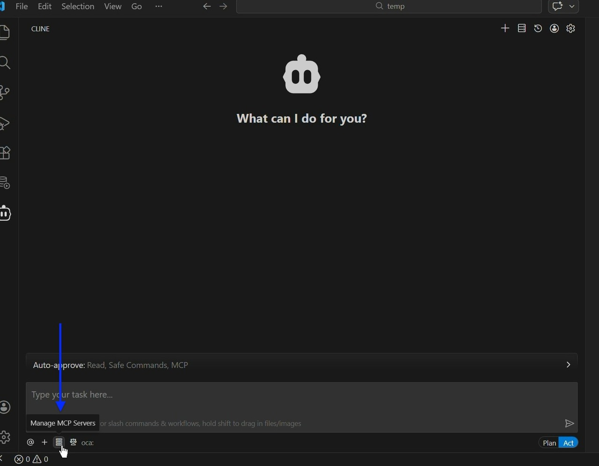
  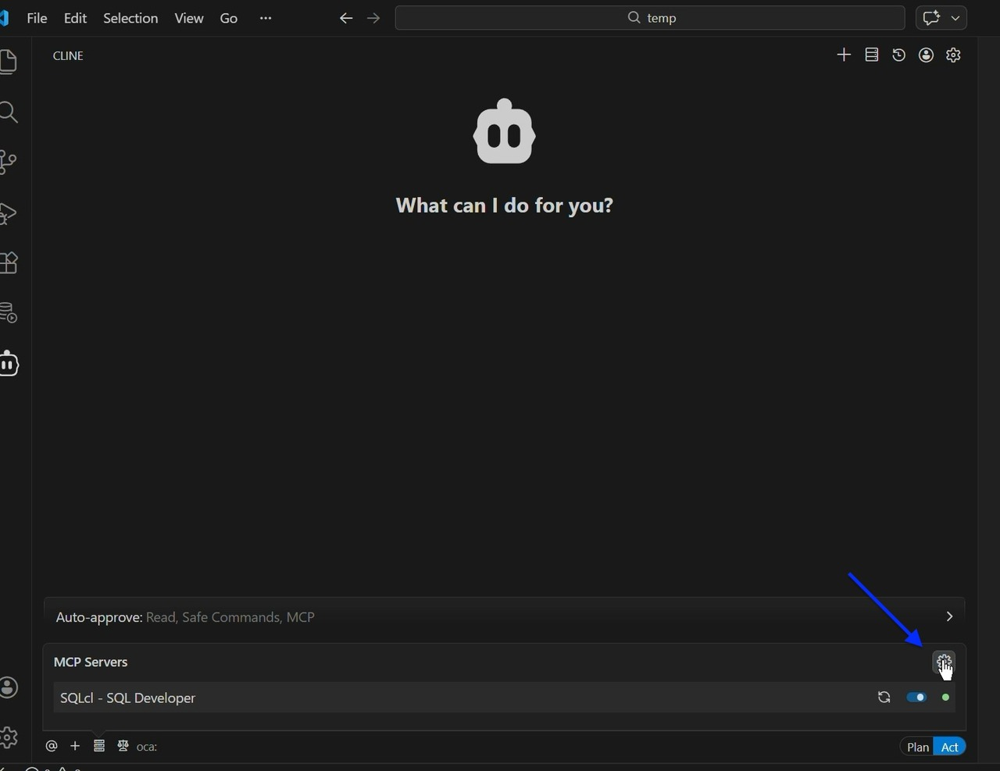

Click the Configure tab to review your currently configured MCP Servers and to edit configuration properties. 

  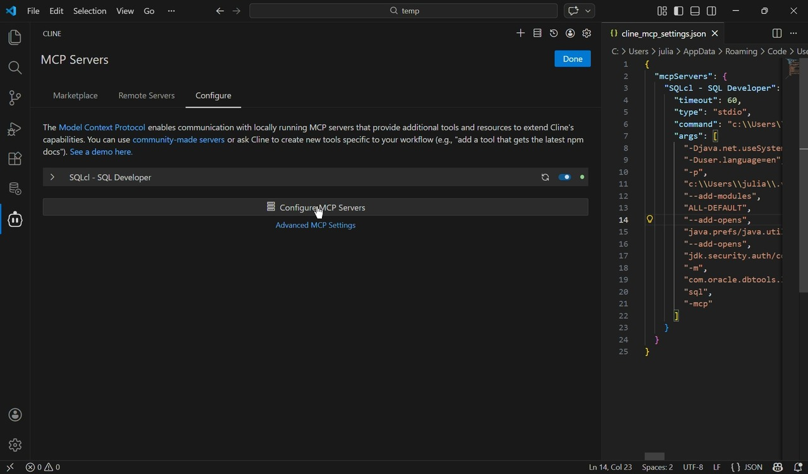

## Learn More

* [Model Context Protocol Overview](https://www.anthropic.com/news/model-context-protocol)
* [Oracle MCP Server Blog](https://blogs.oracle.com/database/post/introducing-mcp-server-for-oracle-database)
* [Oracle official MCP Server repository](https://github.com/oracle/mcp/tree/main)
* [SQLcl MCP Server Docs](https://docs.oracle.com/en/database/oracle/sql-developer-command-line/25.2/sqcug/using-oracle-sqlcl-mcp-server.html)

## Acknowledgements

* **Author:** Chris Hoina, Senior Product Manager, Database Tools
* **Contributors:** Jeff Smith, Distinguished Product Manager, Database Tools
* **Last Updated:** Chris Hoina, February 2026

<!-- WMS ID 11914 -->