# Setting up your development environment

## Introduction


### About Product/Technology (Optional)
Enter background information here about the technology/feature or product used in this lab - no need to repeat what you covered in the introduction.

### Objectives

*List objectives for this lab*

In this lab, you will:
* Create a FreeSQL account (or login if you have an already existing account)
* Install, or modify a current VS Code IDE
* Install and configure the Oracle SQL Developer for VS Code extension
* Install the Cline for VS Code extension
* Install and configure SQlcl

### Prerequisites (Optional)

*List the prerequisites for this lab using the format below. Fill in whatever knowledge, accounts, etc. is needed to complete the lab. **Do NOT list** each previous lab as a prerequisite.*

This lab assumes you have:
* An Oracle account
* All previous labs successfully completed

*This is the "fold" - below items are collapsed by default*

<mark>Highlighting indicates To-Do/Pending</mark>

## Task 1: Create a FreeSQL account

1. In a separate tab, navigate to [freesql.com](https://www.freesql.com).
2. Sign in with your existing Oracle account, or create a new account. 
3. Log in to [freesql.com](https://www.freesql.com) and click the <button>Connect with [rotating language option]</button>

   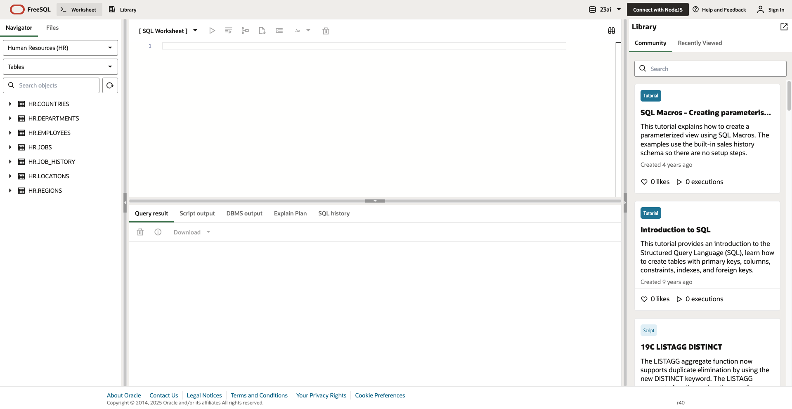

4. Take note of your FreeSQL credentials. You will need the following: 

   - Hostname
   - Port
   - Service Name
   - Username
   - Password

        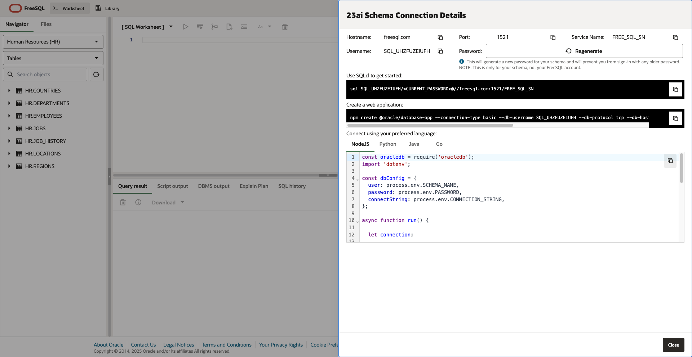

:memo: **Note:** You must click the Regenerate button to create a new password. Please save this password, as it will only be displayed once. It will not be saved or displayed across sessions.

## Task 2: Oracle SQL Developer for VS Code

1. Install Oracle the SQL Develeoper for VS Code extension. There are two installation options:

   1. [Install](https://marketplace.visualstudio.com/items?itemName=Oracle.sql-developer) the latest Oracle SQL Developer for VS Code Extension.[^1]
   2. From within VS Code, navigate to **Extensions**, search for "Oracle" and choose <kbd>Install</kbd>

     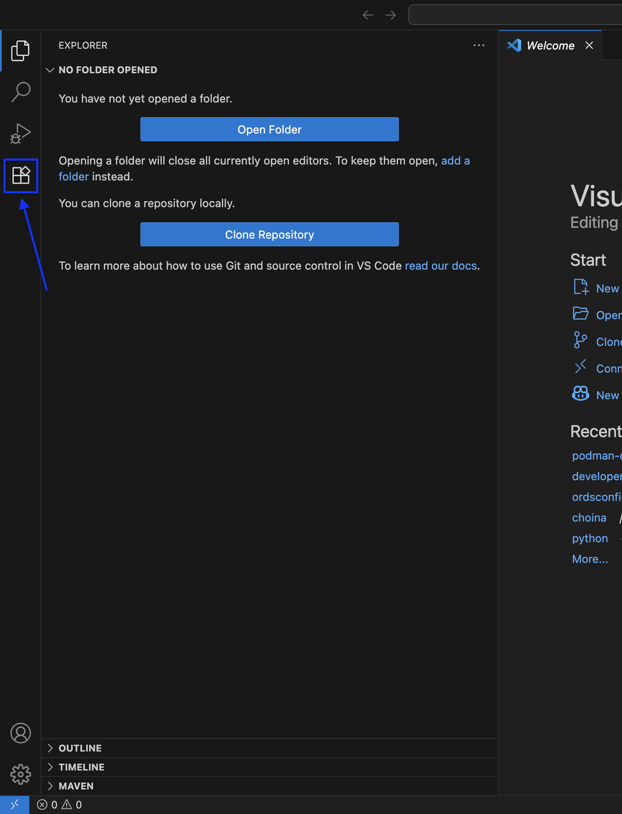

     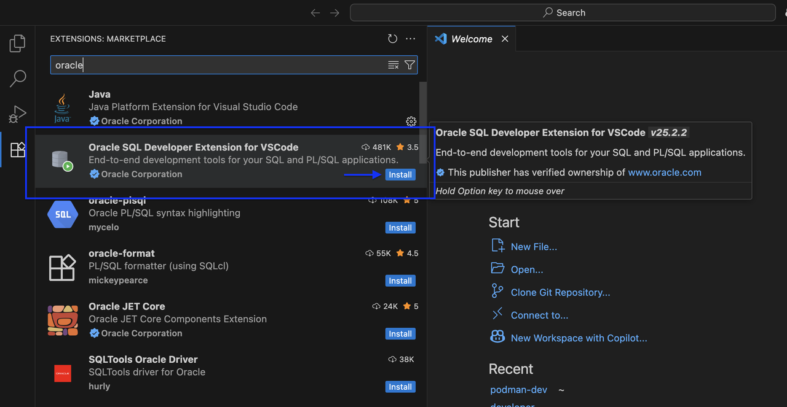

     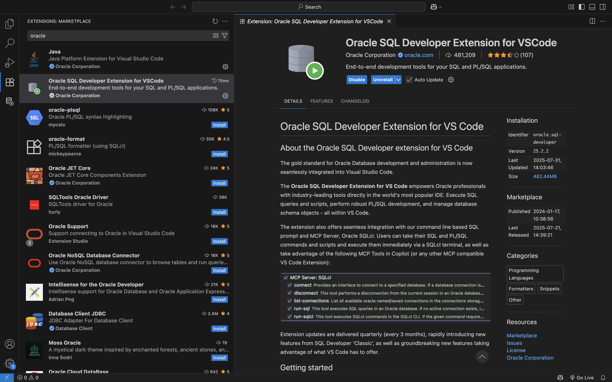

[^1]: Visit the [Setting up Visual Studio Code](https://code.visualstudio.com/docs/setup/setup-overview) reference page for available configuration options and features of VS Code.  

2. Restart your VS Code session
3. Navigate to the Oracle SQL Developer for VS Code extension (located in your Activity Bar)

   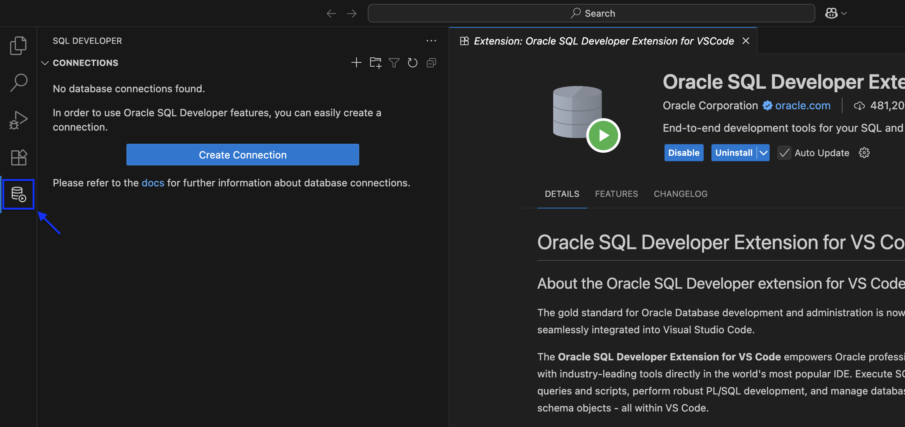

4. Click the <kbd>Create Connection</kbd> button, begin entering in your FreeSQL connection details.

   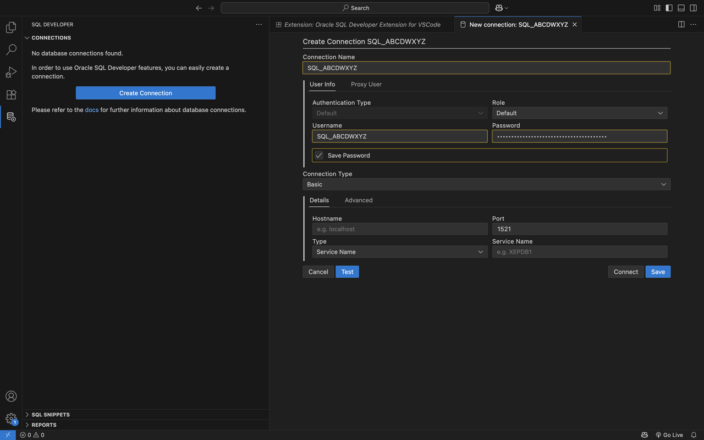

:warning: **Important:** Make sure you click the checkbox to "Save Password." The MCP server requires this saved password to establish a SQLcl connection on your behalf.

5. Choose **Basic** as the Connection Type, enter in your details. 

6. Click the <kbd>Test</kbd> button to test your connection. When the test succeeds, click the <kdb>Save</kbd> button. This will save your connection, but not connect.

   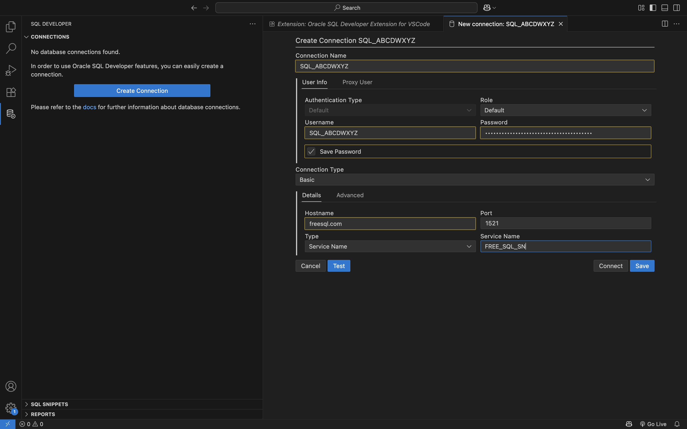

7. Your new connection will appear in the Primary Side Bar. Click the connection name. 

   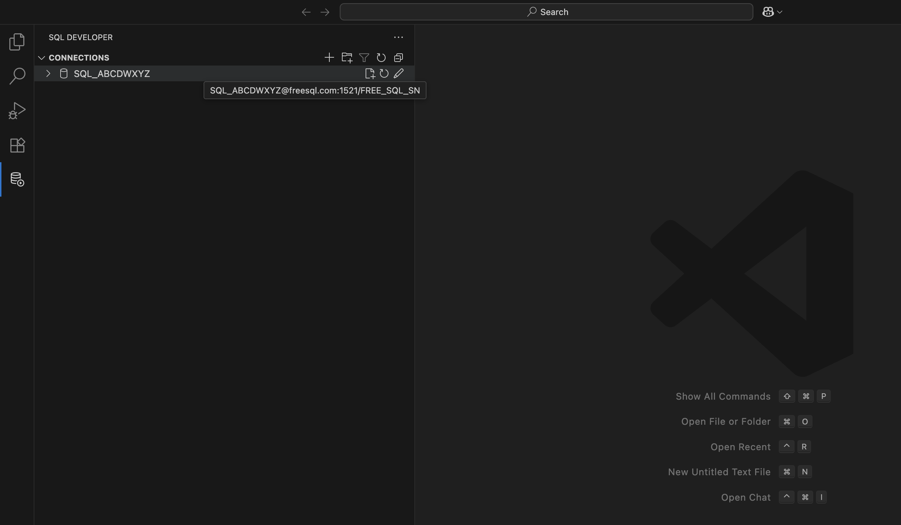

   Clicking the connnection name will do two things:[^2]

   1. Establish a connection to the FreeSQL database
   2. Reveal the various database objects, links, directories, and other categories

      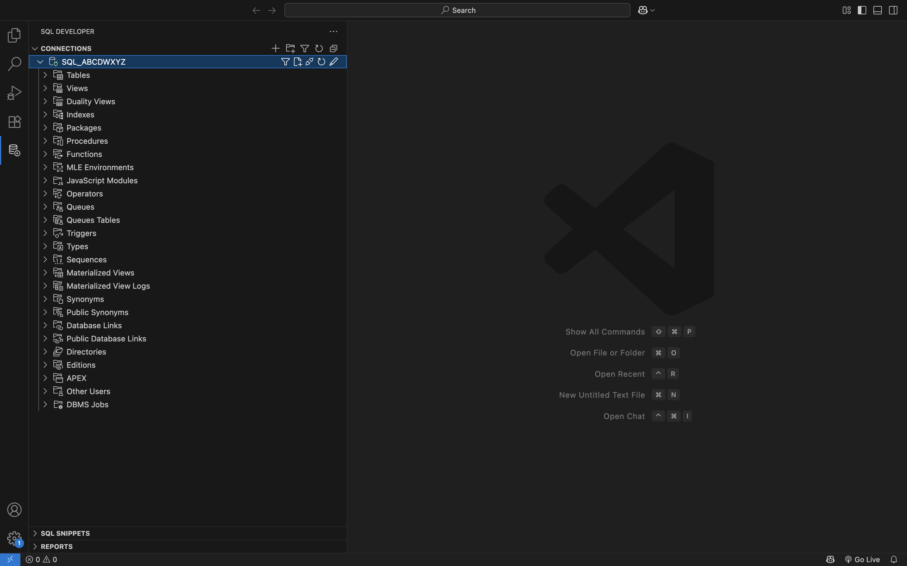

[^2]: You can also right-click on a connection name to reveal the context menu. You can connect, disconnect, and edit connections as well as perform other common actions.

8. Continue to the next task to install SQLcl. 

## Task 4: Installing SQLcl

1. Download and install SQLcl. Two possible options include: 

    1. With a package manager such as Homebrew (Mac)
    2. Directly from the [SQLcl download page](https://www.oracle.com/database/sqldeveloper/technologies/sqlcl/download/)
  
2. Whether downloading from a package manager, or via a manual download, you must set the SQLcl `/bin` directory to your `$PATH`.

  **macOS**

  *Homebrew installation*

    ```sh
     cat << EOF >> ~/.zprofile
     # Add SQLcl via Homebrew
     export PATH="$PATH:/opt/homebrew/Caskroom/sqlcl/[your SQLcl version]/sqlcl/bin"
     EOF
    ```

  *Manual installation*

    ```sh
    cat << EOF >> ~/.zprofile
    # Add SQLcl via manual installation
    export PATH="$PATH:/complete_file_path_to_your_sqlcldirectory/bin"
    EOF
    ```

  **Windows**

    1. In Search, search for and then select: System (Control Panel)
    2. Click the Advanced system settings link.
    3. Click Environment Variables.
    4. In the section System Variables find the PATH environment variable and select it.
    5. Click Edit.
    6. If the PATH environment variable does not exist, click New.
    7. In the Edit System Variable (or New System Variable) window, specify the value of the PATH environment variable.
    
        - *Example:* `/complete_file_path_to_your_sqlcl_directory/bin`

    8. Click OK. 
    9. Close all remaining windows by clicking OK.

:memo: **Note:** Take note of this path, as you will need it for a later step.

3. Close out any shell sessions, to pick up your changes. 

## Task 5: Installing the Cline for VS Code Extension

1. Return to the Extensions tab. And search for the Cline extension.

   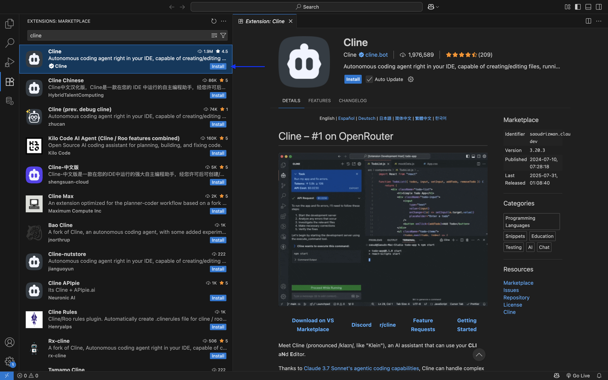

2.  Install the extension. Once installed, navigate to the Cline extension (found in the Activity bar)

3. Click the "Scale" icon to select an API provider. 

   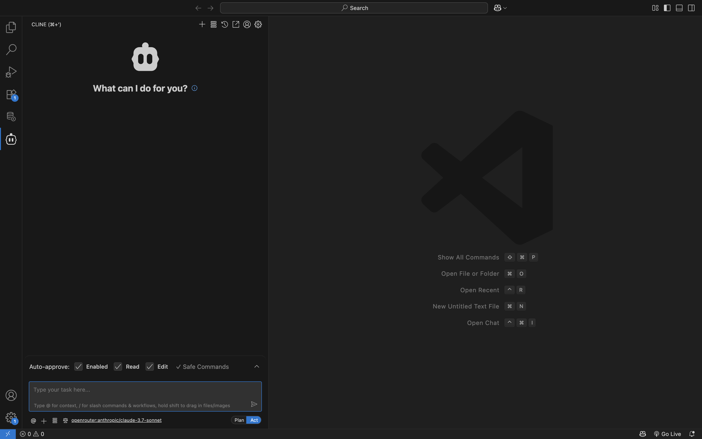

   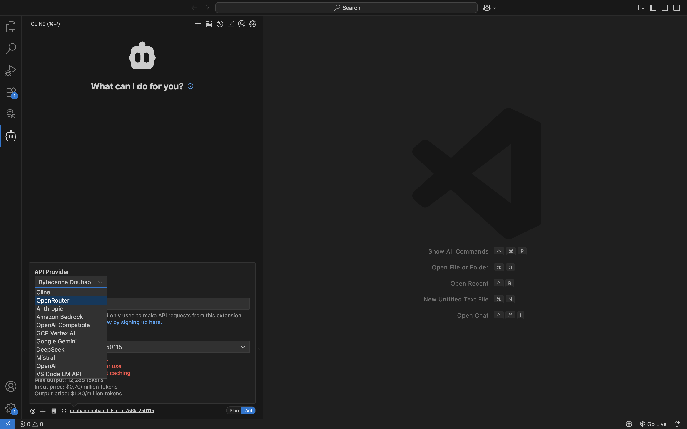

4. Follow the prompts to enter in a valid API key. In this example Oracle Code Assist is used. A user authenticates with a valid Oracle SSO instead of an API key. 

   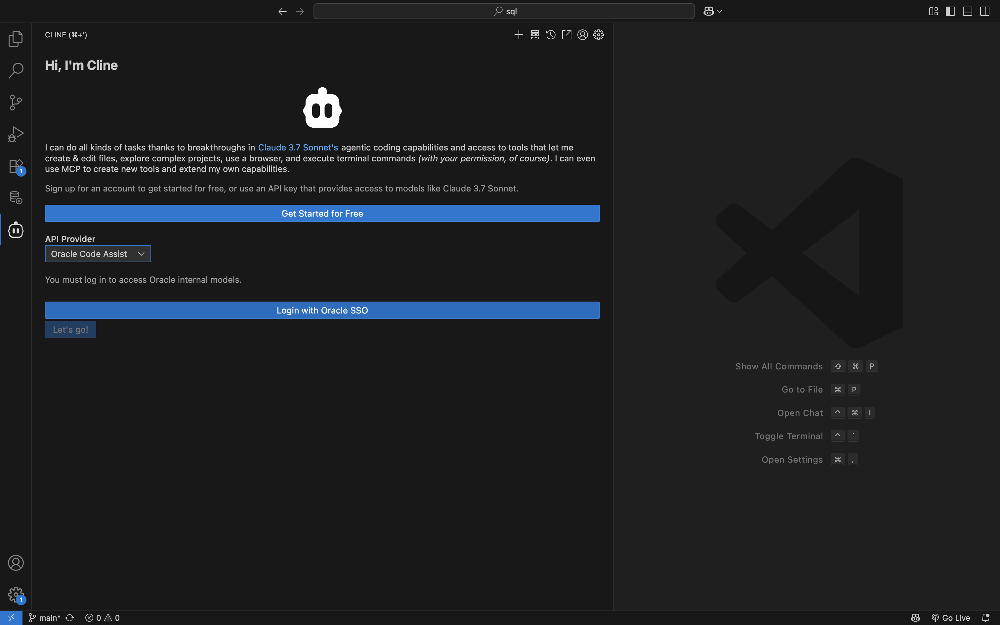

   You can also click the API name at the bottom of the Cline "Tasks" view, to review your API settings.  
   
   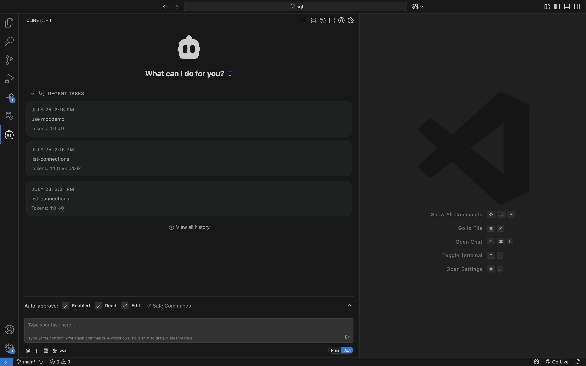

5. Next, you'll configure the SQLcl MCP Server. 

## Task 6: Configuring the SQLcl MCP server

1. Click the MCP Servers icon, then on the Installed tab.

   <!-- Needs edit, to highlight both icons. -->
  
   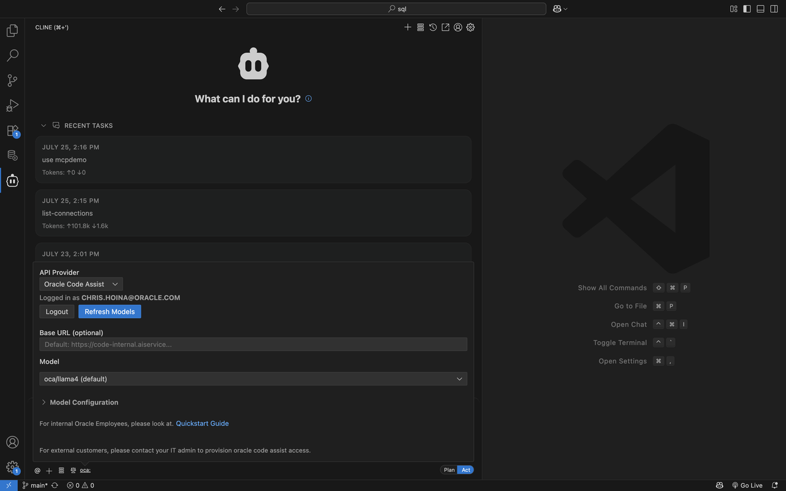

   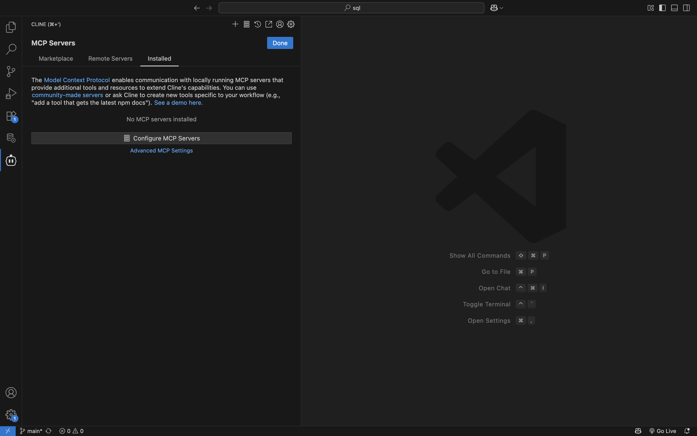

2. Click the <button style="color: Gainsboro; background-color: DimGray;">Configure MCP Servers</button> botton. The `cline_mcp_settings.json` MCP Server configuration file will appear.

   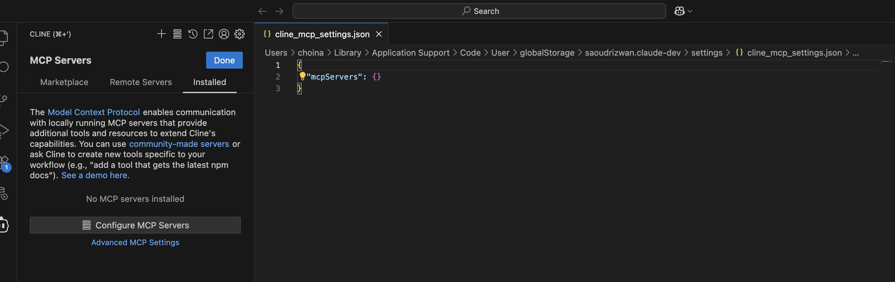

3. You will replace the empty JSON object with that of your SQLcl `/bin/sql` directory

In this example, we have chosen to install SQLcl via Homebrew. Thus our SQLcl's `/bin` directory is located at:  
  
  ```sh
  opt/homebrew/Caskroom/sqlcl/25.2.2.199.0918/sqlcl/bin/sql
  ```

4. Update your `cline_mcp_settings.json` so it points to the correct location. Use the following `JSON` as template: 

    ```JSON
    <copy>
    {
      "mcpServers": {
        "sqlcl": {
          "command": "[path to your SQLcl installation]/bin/sql",
          "args": ["-mcp"],
          "disabled": false
        }
        
      }
    }
    </copy>
    ```

5. Save your configuration settings. In doing so, you may notice an "Updating MCP Servers..." message following by a "MCP Servers updated..." message.  

   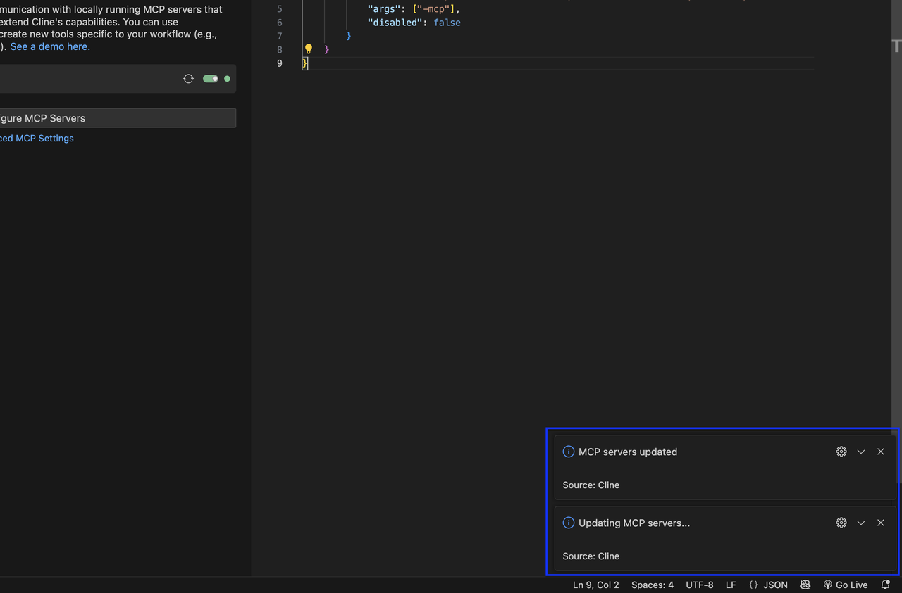
    
      
   You should now see `sqlcl` listed under the Installed MCP Servers tab.

   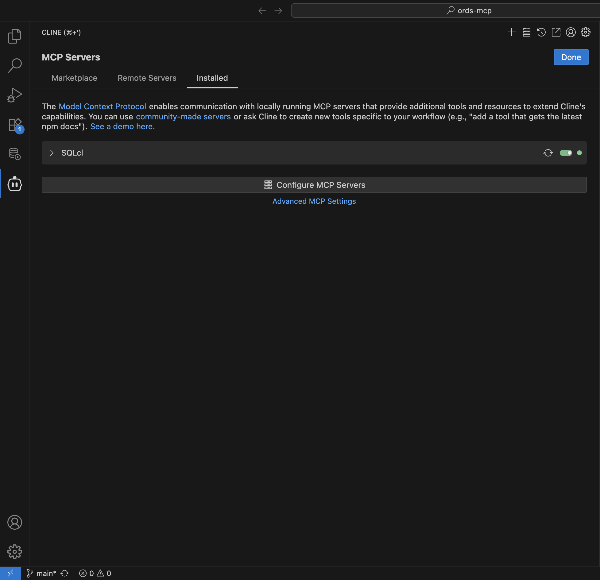

6. Click the anywhere in the SQLcl bar to expand it. You'll see a list of SQLcl MCP Sever "Tools", their parameters, and definitions.

   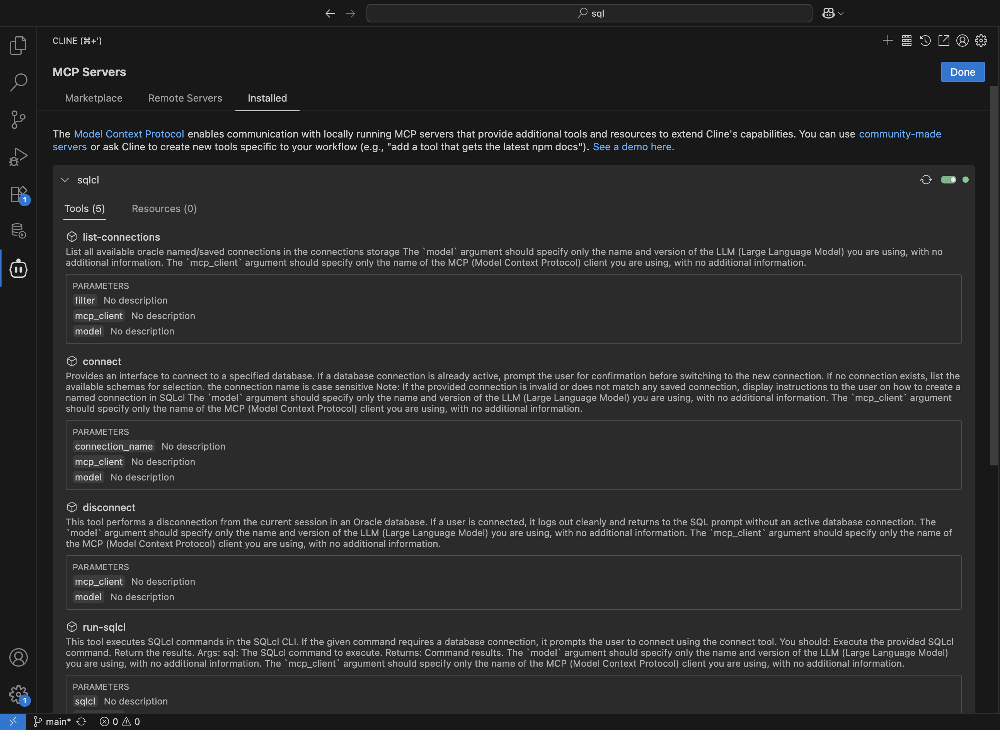

   Available tools summary: 

   |Tool | Parameters | Definition |
   | --- | ---------- | ---------- | 
   | `list-connections` | <ul><li>`filter`</li><li>`mcp_client`</li><li>`model`</li></ul> | <ul><li>This is the filter that will be used to refine the list of connections</li><li>Specify the name and version of the MCP client implementation being used (e.g. Copilot, Claude, Cline...)</li><li>The name (and version) of the language model being used by the MCP client to process requests (e.g. gpt-4.1, claude-sonnet-4, llama4...</li></ul>|
   | `connect` | <ul><li>`connection_name`</li><li>`mcp_client`</li><li>`model`</li></ul> | <ul><li>Specify the name and version of the MCP client implementation being used (e.g. Copilot, Claude, Cline...)</li><li>The name (and version) of the language model being used by the MCP client to process requests (e.g. gpt-4.1, claude-sonnet-4, llama4...</li></ul>|
   | `disconnect` | <ul><li>`mcp_client`</li><li>`model`</li></ul> | <ul><li>The name of the saved connection you want to connect to</li><li>The name (and version) of the language model being used by the MCP client to process requests (e.g. gpt-4.1, claude-sonnet-4, llama4...</li></ul>|
   | `run-sqlcl` | <ul><li>`sqlcl`</li><li>`mcp_client`</li><li>`model`</li></ul> | <ul><li>The SQLcl command to execute</li><li>Specify the name and version of the MCP client implementation being used (e.g. Copilot, Claude, Cline...)</li><li>The name (and version) of the language model being used by the MCP client to process requests (e.g. gpt-4.1, claude-sonnet-4, llama4...</li></ul>|
   | `sql` | <ul><li>`sql`</li><li>`mcp_client`</li><li>`model`</li></ul> | <ul><li>The SQL query to execute</li><li>Specify the name and version of the MCP client implementation being used (e.g. Copilot, Claude, Cline...)</li><li>The name (and version) of the language model being used by the MCP client to process requests (e.g. gpt-4.1, claude-sonnet-4, llama4...</li></ul>|

7. With your SQLcl MCP Server configured, you may now proceed to the next lab.

## Troubleshooting 

•	MCP server not visible: Check JSON registration path/quotes; confirm sql --mcp runs locally.
•	No connections found: Define named connections in VS Code/SQLcl; verify wallet path/tnsnames.
•	Agent keeps choosing the wrong tool: Rename tools for clarity; remove overlapping servers; provide stronger tool prompts.
•	LLM hallucinating SQL: Prefer structured tools (schema explorer, awr); add examples in resources; enforce read only.
•	Long running queries: Add timeouts, row limits, and place agent sessions into a restricted consumer group.


## Learn More

*(optional - include links to docs, white papers, blogs, etc)*

* [URL text 1](http://docs.oracle.com)
* [URL text 2](http://docs.oracle.com)

## Acknowledgements
* **Author** - <Name, Title, Group>
* **Contributors** -  <Name, Group> -- optional
* **Last Updated By/Date** - <Name, Group, Month Year> -->

