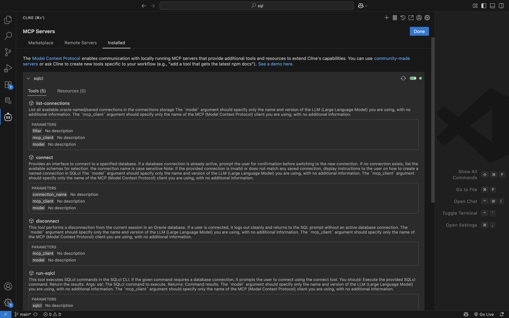

# Setting up your development environment

## Introduction

In this Lab, you will install SQL Developer Extension for VS Code and SQLcl. You will also install Cline for VS Code. 

### Objectives

In this lab, you will:
* Install SQL Developer Extension for VS Code 
* Install SQlcl
* Install the Cline for VS Code extension
* Configure the SQLcl MCP server

### Prerequisites 

This lab assumes you have:
* Access (via an API Key or other means) to an LLM Provider of your choice
* Oracle Java 17 or 21 (*recommended*) installed
* A personal computer or access to a workshop-provided workstation
* Reviewed the prerequisites of the Introduction lab

<if type="freesql">

## Task 1: Create a FreeSQL account

1. Navigate to FreeSQL.com to Sign in with or create a new account: <a href="https://freesql.com" target="_blank"><button class="livesql-button" type="button"><emp>Try it now w/ FreeSQL</emp></button></a>

<!-- <form action="https://freesql.com" method="get" target="_blank">
  <button class="livesql-button" type="submit"><emp>Try it now w/ FreeSQL</emp></button>
</form>
 -->

<!-- 1. 
From a new browser window/tab, navigate to [https://freesql.com/](https://freesql.com/). 

    -->

2. Sign in with your existing Oracle account, or create a new account.

   

   

   

   

   

3. Once logged in, click the <strong>Connect with [rotating language option]</strong> button.

   

4. Your new FreeSQL connection details will appear. Copy the SQLcl connect string to your clipboard. If you need a new password, click the <strong>&circlearrowleft; Regenerate</strong> button to create a new password.  

    > &#9872; **NOTE:** *Your password will **NOT** be saved or displayed across sessions!*
    > 
    > 
    > 
    > 

4. Take note of your FreeSQL credentials. You will need the following values for the next Task:

      - Username
      - Password
      - Hostname
      - Port
      - Service Name

   

5. You will use this new FreeSQL user for the remainder of this Lab. In the next task, you'll create a database connection in SQL Developer Extension for VS Code.

</if>

<if type="freetier">

## Task 1: Download the Instance Wallet

1. In this Lab you will use a Cloud Wallet to configure your database connection in Oracle SQL Developer for VS Code (to be completed in a later step). Return to your Autonomous AI database dashboard. 

2. Click on Database Connection.

   

3. Ensure Instance wallet is selected for the Wallet Type. Click the Download wallet button.

   

4. Enter a Wallet password, and reconfirm. Then click the Download button.

    

5. Take note of the complete path of where the Cloud Wallet was downloaded to.

    

   > &#9872; **NOTE:** You can drag and drop the .zip file into a terminal window to quickly discover the complete path.

## Task 2: Create a new REST-enabled database user

1. From your Autonomous AI database's console, click **Database Actions** then **View all database actions**.

    

2. From the Database Actions LaunchPad, navigate to the **Administration** category. Then select **Database Users**.

   

2. From the User Management dashboard, select the **&plus; Create User** button. 

   

3. A *Create User* dialog will appear. Choose a username and password (that conforms to Oracle database password requirements). Use the Radio button to enable **REST, GraphQL, MongoDB API, and Web access**. The REST Alias should remain unchanged. 

   

4. The new user will automatically be granted the `CONNECT` and `RESOURCE` roles. However, you can manually enable the new 26ai `DB_DEVELOPER_ROLE`, as this is an easy way to ensure a Developer user has many of the required roles aimed at the Oracle database developer user. Once complete, click the **Create User** button.

   

5. You may retain your user's unique URL for logging into SQL Developer Web (Database Actions). 

   

6. You will use this new developer user for the remainder of this Lab.  Next you'll create a database connection in SQL Developer for VS Code.

</if>

## Task <if type="freesql"> 2: </if> <if type="freetier"> 3: </if> Install SQL Developer Extension for VS Code 

1. Install SQL Developer Extension for VS Code. Here are two installation options:

    - VS Code [Marketplace](https://marketplace.visualstudio.com/items?itemName=Oracle.sql-developer)
    
    <!-- <sup id="ref-1"><a href="#fn-1">1</a></sup> -->

    - From within VS Code, navigate to **Extensions**, search for "Oracle," **Oracle SQL Developer Extension for VSCode** will be near the top of the results. Coose <strong>Install</strong>

     

     

2. Once installed, navigate to SQL Developer Extension for VS Code (located in your Activity Bar)

     

<if type="freesql"> 

3. Click the <strong>Create Connection</strong> button. Enter your FreeSQL database connection details.

   

   

   

</if>

<if type="freetier"> 

3. Click the <strong>Create Connection</strong> button. Enter your database connection details. Choose **Cloud Wallet** as the Connection Type.

   

   

</if>

> &#9888; **Important:** Make sure you click the checkbox (&check; Save Password) to save your password. Your SQLcl MCP Server relies on this securely saved password to establish a database connection.

4. Click the **Test** button to test your connection. When the test succeeds, click the **Save** button. This will save your connection, but not connect.

   

   

6. Your new connection will appear in the Primary Side Bar. Click the connection name. 

   

> &phone; **Info:** Clicking a connnection name does two things:  
> - Establishes a connection to the target database
> - Reveals the various database objects, links, directories, and other categories in a schema
   
</if>

7. In the next task you'll <if type="freesql"> install the Cline for VS code Extension. </if> <if type="freetier"> install SQLcl. </if>

<!-- <br></br>
**Footnotes**
<ol>
  <li id="fn-1">
    Visit the <a href="https://code.visualstudio.com/docs/setup/setup-overview">Setting up Visual Studio Code</a> reference page for available configuration options and features of VS Code. 
    <a href="#ref-1" title="Jump back to the reference">&uarr;</a>
  </li>
   <li id="fn-2">
   You can also right-click on a connection name to reveal the context menu. You can connect, disconnect, and edit connections as well as perform other common actions.
    <a href="#ref-2" title="Jump back to the reference">&uarr;</a>
  </li>
</ol> -->

<if type="freetier"> 

## Task 4: Installing SQLcl

1. Download and install SQLcl. Download two ways: 

    - With a package manager such as Homebrew (Mac):

         **Homebrew command:** 

         ```shell
         <copy>
         brew install --cask sqlcl
         </copy>
         ```

    - *or*, directly from the [SQLcl download page](https://www.oracle.com/database/sqldeveloper/technologies/sqlcl/download/)

> &#9872; **NOTE:** You must install SQLcl version 25.2 *or later* in order to use the SQLcl MCP Server.

2. Whether downloading from a package manager, or via a manual download, you will need to locate and note the complete path to the SQLcl /bin directory. Some possible locations: 

  **macOS**

    - *Homebrew installation*
  
      ```shell
      /opt/homebrew/Caskroom/sqlcl/[your SQLcl version]/sqlcl/bin
      ```

  **Manual installation**

    ```shell
    complete_file_path_to_your_sqlcldirectory/bin
    ```

</if>

## Task <if type="freesql"> 3: </if> <if type="freetier"> 5: </if> Installing the Cline for VS Code Extension

</if>

1. Return to the VS Code Extensions tab and search for the Cline extension.

   

2.  Install the extension and navigate to the Cline extension (found in the Activity bar)

3. Click the Select Model/API Provider text. Chose your API Provider, enter you API Key, and choose your LLM Model.

    

    

5. With your API Provider details confirmed, you'll now configure the SQLcl MCP Server.

## Task <if type="freesql"> 4: </if> <if type="freetier"> 6 </if> SQLcl MCP server

1. Navigate to the VS Code Command Palette. In the search field enter the following text: <kbd> Configure Cline SQLcl MCP </kbd>

   

2. Press enter to priew the `cline_mcp_settings.json` configuration file. Retain the configuration settings; you do not need to update or modify any details. 

   

3. After reviewing, save the file, and close it. You may notice an "Updating MCP Servers..." message followed by a "MCP Servers updated..." message. This is expected. 

   
      
   You should now see `sqlcl` listed under the Installed MCP Servers tab.

      

6. Click the SQLcl MCP server frame to expand it. You'll see a list of SQLcl MCP Sever "Tools", their parameters, and definitions. The contents of this LiveLab will focus primarily on the available SQLcl MCP Server Tools.

   

    <p></p>

    | Tool | Purpose | Parameters | Parameter Definitions |
    | ---- | ------- | ---------- | ---------- |
    | `list-connections` | Lists all saved Oracle database connection names in the connection storage. | <ul><li>`filter`</li><li>`mcp_client`</li><li>`model`</li></ul> | <ul><li>This is the filter that will be used to refine the list of connections</li><li>Specify the name and version of the MCP client implementation being used (e.g. Copilot, Claude, Cline...)</li><li>The name (and version) of the language model being used by the MCP client to process requests (e.g. gpt-4.1, claude-sonnet-4, llama4...</li></ul>|
    | `connect` | Provides an interface for connecting to a specified Oracle database, prompting for confirmation if already connected, listing available schemas if not connected, handling case-sensitive connection names, and instructing on creating named connections if an invalid name is provided. | <ul><li>`connection_name`</li><li>`mcp_client`</li><li>`model`</li></ul> | <ul><li>Specify the name and version of the MCP client implementation being used (e.g. Copilot, Claude, Cline...)</li><li>The name (and version) of the language model being used by the MCP client to process requests (e.g. gpt-4.1, claude-sonnet-4, llama4...</li></ul>|
    | `disconnect` | Performs a disconnection from the current Oracle database session, logging out and returning to the SQL prompt if connected. | <ul><li>`mcp_client`</li><li>`model`</li></ul> | <ul><li>The name of the saved connection you want to connect to</li><li>The name (and version) of the language model being used by the MCP client to process requests (e.g. gpt-4.1, claude-sonnet-4, llama4...</li></ul>|
    | `run-sqlcl` | Executes SQLcl commands in the SQLcl CLI, prompting for database connection if needed, and returns the command results. | <ul><li>`sqlcl`</li><li>`mcp_client`</li><li>`model`</li></ul> | <ul><li>The SQLcl command to execute</li><li>Specify the name and version of the MCP client implementation being used (e.g. Copilot, Claude, Cline...)</li><li>The name (and version) of the language model being used by the MCP client to process requests (e.g. gpt-4.1, claude-sonnet-4, llama4...</li></ul>|
    | `run-sql` | Executes SQL queries in an Oracle database, prompting for connection if none is active, and returns results in CSV format. | <ul><li>`sql`</li><li>`mcp_client`</li><li>`model`</li></ul> | <ul><li>The SQL query to execute</li><li>Specify the name and version of the MCP client implementation being used (e.g. Copilot, Claude, Cline...)</li><li>The name (and version) of the language model being used by the MCP client to process requests (e.g. gpt-4.1, claude-sonnet-4, llama4...</li></ul>|
    | `schema-information` | Provides detailed insights about the currently connected schema by analyzing and enriching metadata from executed queries. | <ul><li>`model`</li></ul> | <ul><li>The name (and version) of the language model being used by the MCP client to process requests

    {: title="SQLcl MCP Server Tools"}

7. With your SQLcl MCP Server configured, you may now [proceed to the next lab](#next).

## Troubleshooting 

Some helpful tips if you run into trouble:
 
|    |    |
| -- | -- |
| ***MCP server not visible*** | Check JSON registration path/quotes; confirm <code>sql --mcp</code> runs locally. |
| ***No connections found*** | Define named connections in VS Code/SQLcl; verify wallet path/tnsnames. |
{: title="Troubleshooting tips"}

## Learn More

* [Introducing the Model Context Protocol](https://www.anthropic.com/news/model-context-protocol)
* [MCP Server Introduction](https://blogs.oracle.com/database/post/introducing-mcp-server-for-oracle-database) 
* [Oracle official MCP Server repository](https://github.com/oracle/mcp/tree/main)
* [SQLcl MCP Server Docs](https://docs.oracle.com/en/database/oracle/sql-developer-command-line/25.2/sqcug/using-oracle-sqlcl-mcp-server.html)

## Acknowledgements

* **Author**<ul><li>Chris Hoina, Senior Product Manager, Database Tools</li></ul>
* **Contributors**<ul><li>Jeff Smith, Distinguished Product Manager, Database Tools</li></ul>
* **Last Updated By/Date**<ul><li>Chris Hoina, November 2025</li></ul>

<!-- WMS ID 11914 -->
