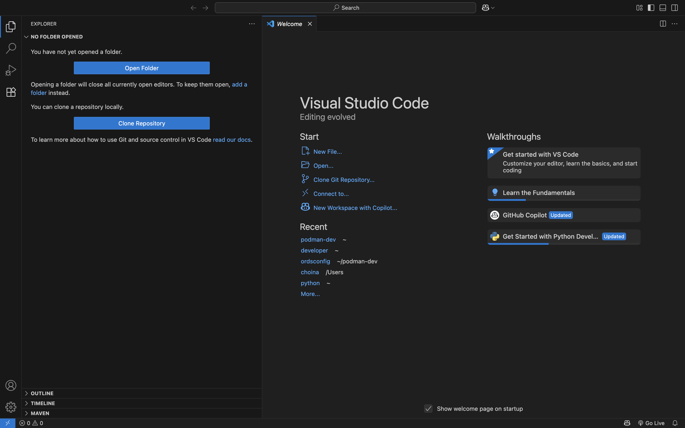
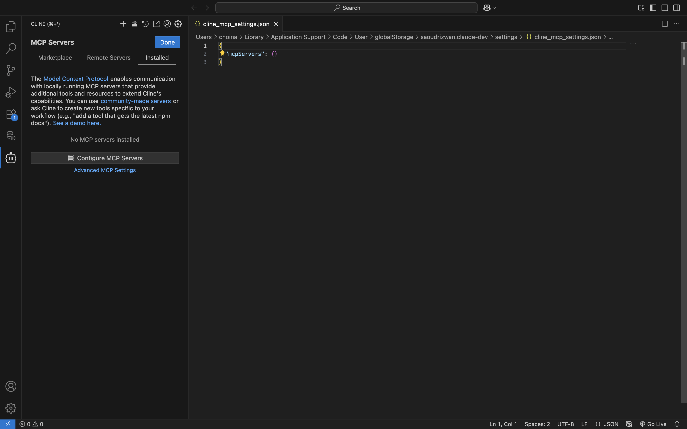
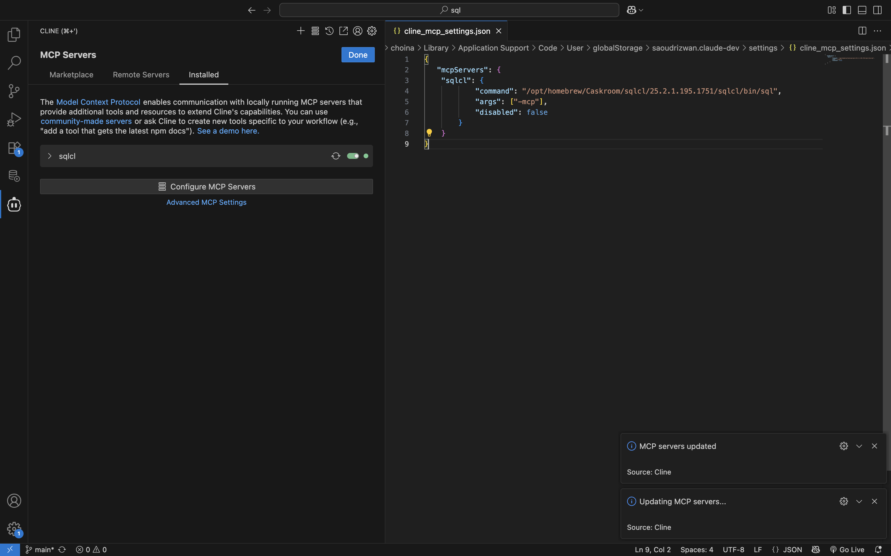
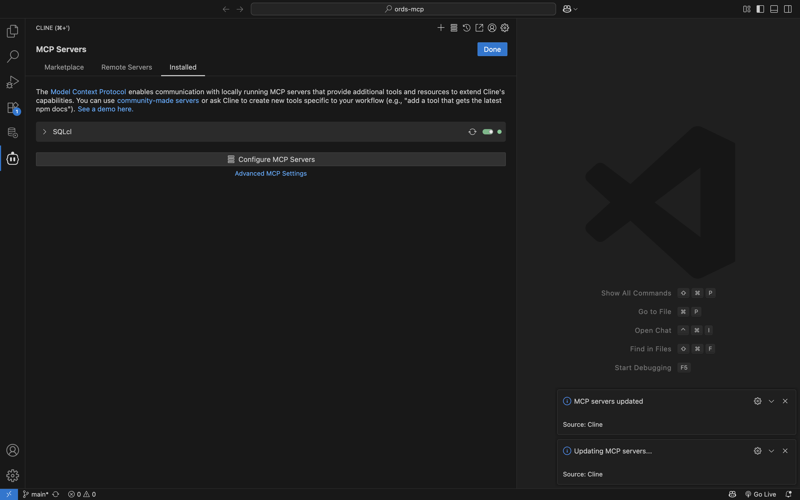

# Setting up your development environment

## Introduction

In this Lab, you will install SQL Developer Extension for VS Code and SQLcl. You will also install Cline for VS Code. 

### Objectives

In this lab, you will:
* Install SQL Developer Extension for VS Code 
* Install SQlcl
* Install the Cline for VS Code extension
* Configure the SQLcl MCP server

### Prerequisites 

This lab assumes you have:
* Oracle Java 17 or 21 (*recommended*) installed
* A personal computer or access to a workshop-provided workstation
* Oracle SSO credentials (existing or workshop provided)
* Reviewed the prerequisites of the Introduction lab


## Task 1: Create a FreeSQL account

1. From a new browser window/tab, navigate to [freesql.com](https://www.freesql.com).
2. Sign in with your existing Oracle account, or create a new account. 
3. Log in to [freesql.com](https://www.freesql.com) and click the <strong>Connect with [rotating language option]</strong>

   
 
    

<p></p>

4. Take note of your FreeSQL (or LiveSQL) credentials. You will need the following values:

      - Hostname
      - Port
      - Service Name
      - Username
      - Password

<p></p>

> &#9872; **NOTE:** You must click the <strong>&circlearrowleft; Regenerate</strong> button to create a new password. Please save this password, as it will only be displayed once. 
> 
> *Your password will **NOT** be saved or displayed across sessions!*

## Task 2: Install SQL Developer Extension for VS Code

1. Install SQL Developer Extension for VS Code; there are two installation options:

    - VS Code [Marketplace](https://marketplace.visualstudio.com/items?itemName=Oracle.sql-developer)<sup id="ref-1"><a href="#fn-1">1</a></sup>
    - From within VS Code, navigate to **Extensions**, search for "Oracle" and choose <strong>Install</strong>

     

     

     

<!-- 2. Restart your VS Code session -->

2. Once installed, navigate to SQL Developer Extension for VS Code(located in your Activity Bar)

     

3. Click the <strong>Create Connection</strong> button. Enter your database connection details.

   

<p></p>

> &#9888; **Important:** Make sure you click the checkbox (&check; Save Password) to save your password. Your SQLcl MCP Server relies on this securly saved password to establish a database connection.

4. Choose **Basic** as the Connection Type. Enter in your details. 

5. Click the **Test** button to test your connection. When the test succeeds, click the **Save** button. This will save your connection, but not connect.

   

6. Your new connection will appear in the Primary Side Bar. Click the connection name. 

   

   Clicking a connnection name does two things:<sup id="ref-2"><a href="#fn-2">2</a></sup>

    - Establishes a connection to the the target database
    - Reveals the various database objects, links, directories, and other categories in a schema

      

7. Continue to the next task to install SQLcl. 

<br></br>
**Footnotes**
<ol>
  <li id="fn-1">
    Visit the <a href="https://code.visualstudio.com/docs/setup/setup-overview">Setting up Visual Studio Code</a> reference page for available configuration options and features of VS Code. 
    <a href="#ref-1" title="Jump back to the reference">&uarr;</a>
  </li>
   <li id="fn-2">
   You can also right-click on a connection name to reveal the context menu. You can connect, disconnect, and edit connections as well as perform other common actions.
    <a href="#ref-2" title="Jump back to the reference">&uarr;</a>
  </li>
</ol>

<br></br>

## Task 4: Installing SQLcl

1. Download and install SQLcl. Download two ways: 

    - With a package manager such as Homebrew (Mac):

         **Homebrew command:** 

         ```shell
         <copy>
         brew install --cask sqlcl
         </copy>
         ```

    - *or*, directly from the [SQLcl download page](https://www.oracle.com/database/sqldeveloper/technologies/sqlcl/download/)

> &#9872; **NOTE:** You must install SQLcl version 25.2 *or later* in order to use the SQLcl MCP Server.

2. Whether downloading from a package manager, or via a manual download, a good practice is to set the SQLcl `/bin` directory to your `$PATH`. Here are some examples of how to achieve this: 

  **macOS**

  *Homebrew installation*

      ```sh
      <copy>
      cat << EOF >> ~/.zprofile
      # Add SQLcl via Homebrew
      export PATH="$PATH:/opt/homebrew/Caskroom/sqlcl/[your SQLcl version]/sqlcl/bin"
      EOF
      </copy>
      ```

  *Manual installation*

      ```sh
      <copy>
      cat << EOF >> ~/.zprofile
      # Add SQLcl via manual installation
      export PATH="$PATH:/complete_file_path_to_your_sqlcldirectory/bin"
      EOF
      </copy>
      ```

  **Windows**

      ```txt
         1. In Search, search for and then select: System (Control Panel)
         2. Click the Advanced system settings link.
         3. Click Environment Variables.
         4. In the section System Variables find the PATH environment variable and select it.
         5. Click Edit.
         6. If the PATH environment variable does not exist, click New.
         7. In the Edit System Variable (or New System Variable) window, specify the value of the PATH environment variable.
         
            - *Example:* `/complete_file_path_to_your_sqlcl_directory/bin`

         8. Click OK. 
         9. Close all remaining windows by clicking OK.
         ```
<p></p>

> &#9872; **NOTE:** Take note of this path, as you will need it for a later step.

3. Close out any shell/terminal sessions to pick up these environment changes. 

## Task 5: Installing the Cline for VS Code Extension

1. Return to the VS Code Extensions tab and search for the Cline extension.

   

2.  Install the extension and navigate to the Cline extension (found in the Activity bar)

3. Click the &#9878; scale icon to select an API provider. 

   

   

4. Follow the prompts to enter in a valid API key. In this example Oracle Code Assist is used. In this example the user authenticates with a valid Oracle SSO instead of an API key. 

   

   You can also click the API name at the bottom of the Cline "Tasks" view, to review your API settings.  
   
   

5. You'll configure the SQLcl MCP Server next.

## Task 6: SQLcl MCP server

1. Click the &equiv; MCP Servers icon, then on the "Installed" tab.
  
    

   

2. Click the <strong>Configure MCP Servers</strong> botton. An empty `cline_mcp_settings.json` MCP Server configuration file will appear.

   

3. You will replace the empty JSON object with that of your SQLcl `/bin/sql` directory

   In this example, we have chosen to install SQLcl via Homebrew. Thus our SQLcl's `/bin` directory is located at (yours may differ, only use this as a reference):  
  
      ```sh
      <copy>
      opt/homebrew/Caskroom/sqlcl/25.2.2.199.0918/sqlcl/bin/sql
      </copy>
      ```

4. Update your `cline_mcp_settings.json` so it points to the correct location. Use the following `JSON` as template: 

    ```JSON
    <copy>
    {
      "mcpServers": {
        "sqlcl": {
          "command": "[path to your SQLcl installation]/bin/sql",
          "args": ["-mcp"],
          "disabled": false
        }
        
      }
    }
    </copy>
    ```

5. Save your configuration settings. You may notice an "Updating MCP Servers..." message followed by a "MCP Servers updated..." message. This is expected. 

   
    
      
   You should now see `sqlcl` listed under the Installed MCP Servers tab.<sup id="ref-3"><a href="#fn-3">3</a></sup>

   

6. Click anywhere in the SQLcl bar to expand it. You'll see a list of SQLcl MCP Sever "Tools", their parameters, and definitions. The contents of this LiveLab will focus primarily on the available SQLcl MCP Server Tools.

   

    <p></p>

    |Tool | Parameters | Definition |
    | --- | ---------- | ---------- | 
    | `list-connections` | <ul><li>`filter`</li><li>`mcp_client`</li><li>`model`</li></ul> | <ul><li>This is the filter that will be used to refine the list of connections</li><li>Specify the name and version of the MCP client implementation being used (e.g. Copilot, Claude, Cline...)</li><li>The name (and version) of the language model being used by the MCP client to process requests (e.g. gpt-4.1, claude-sonnet-4, llama4...</li></ul>|
    | `connect` | <ul><li>`connection_name`</li><li>`mcp_client`</li><li>`model`</li></ul> | <ul><li>Specify the name and version of the MCP client implementation being used (e.g. Copilot, Claude, Cline...)</li><li>The name (and version) of the language model being used by the MCP client to process requests (e.g. gpt-4.1, claude-sonnet-4, llama4...</li></ul>|
    | `disconnect` | <ul><li>`mcp_client`</li><li>`model`</li></ul> | <ul><li>The name of the saved connection you want to connect to</li><li>The name (and version) of the language model being used by the MCP client to process requests (e.g. gpt-4.1, claude-sonnet-4, llama4...</li></ul>|
    | `run-sqlcl` | <ul><li>`sqlcl`</li><li>`mcp_client`</li><li>`model`</li></ul> | <ul><li>The SQLcl command to execute</li><li>Specify the name and version of the MCP client implementation being used (e.g. Copilot, Claude, Cline...)</li><li>The name (and version) of the language model being used by the MCP client to process requests (e.g. gpt-4.1, claude-sonnet-4, llama4...</li></ul>|
    | `sql` | <ul><li>`sql`</li><li>`mcp_client`</li><li>`model`</li></ul> | <ul><li>The SQL query to execute</li><li>Specify the name and version of the MCP client implementation being used (e.g. Copilot, Claude, Cline...)</li><li>The name (and version) of the language model being used by the MCP client to process requests (e.g. gpt-4.1, claude-sonnet-4, llama4...</li></ul>|
    {: title="SQLcl MCP Server Tools"}

7. With your SQLcl MCP Server configured, you may now proceed to the next lab.

<br></br>

**Footnotes**
<ol>
  <li id="fn-3">
    We recommend naming your SQLcl MCP server with characters of the <a href="https://en.wikipedia.org/wiki/Latin-script_alphabet">Latin-script alphabet</a>, in lower case. Some AI Agents may have trouble with mixed-cases.
    <a href="#ref-3" title="Jump back to the reference">&uarr;</a>
  </li>
</ol>

## Troubleshooting 

Some helpful tips if you run into trouble:

|    |    |
| -- | -- |
| ***MCP server not visible*** | Check JSON registration path/quotes; confirm <code>sql --mcp</code> runs locally. |
| ***No connections found*** | Define named connections in VS Code/SQLcl; verify wallet path/tnsnames. |
{: title="Troubleshooting tips"}

## Learn More

* [Introducing the Model Context Protocol](https://www.anthropic.com/news/model-context-protocol)
* [MCP Server Introduction](https://blogs.oracle.com/database/post/introducing-mcp-server-for-oracle-database) 
* [Oracle official MCP Server repository](https://github.com/oracle/mcp/tree/main)
* [SQLcl MCP Server Docs](https://docs.oracle.com/en/database/oracle/sql-developer-command-line/25.2/sqcug/using-oracle-sqlcl-mcp-server.html)

## Acknowledgements

* **Author**<ul><li>Chris Hoina, Senior Product Manager, Database Tools</li></ul>
* **Contributors**<ul><li>Jeff Smith, Distinguished Product Manager, Database Tools</li></ul>
* **Last Updated By/Date**<ul><li>Chris Hoina, September 2025</li></ul>


