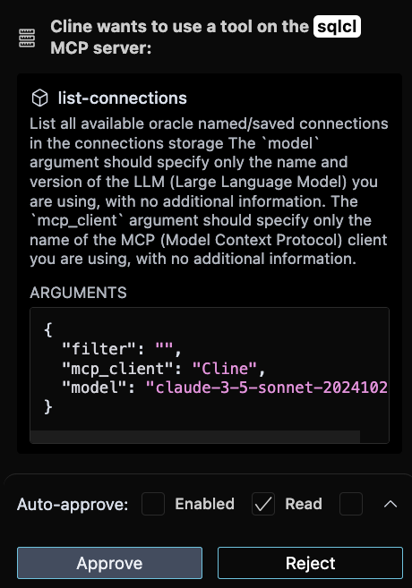

# Title of the Lab

## Introduction

In this lab you will become acquainted with Cline, an open-source AI coding agent, and the SQLcl MCP server. Throughout the labs presented here, Cline will act as an interpreter to your plain language requests and prompts. These requests and prompts are then sent to the SQLcl MCP server. 

The SQLcl MCP server will act upon your requests and intents, communicating with the database on your behalf. This new way of working with your Oracle database allows for a more natural/plain language, conversation-based interaction.

Estimated Time: 10 minutes

<!-- ### About Product/Technology (Optional)
Enter background information here about the technology/feature or product used in this lab - no need to repeat what you covered in the introduction. -->

<!-- Don't think we need the Product/Technology. We've already covered this in the intro lab, as well as in the intro above. -->

### Objectives

In this lab, you will:
* Learn how to:
  - request MCP Server "Tools"
  - review and approve Tool requests
* Observe how the your responses inform an AI agent's behavior
* Discover how an LLM generates SQL and presents it to the SQLcl MCP Server for execution
* Review the the LLM's results and summaries of findings 
* Review the SQLcl MCP Server's task log in your schema 

### Prerequisites 

This lab assumes you have:
* VS Code installed
* Configured an Oracle Database connection using the Oracle SQL Developer for VS Code extension</p>
  * > Note: If participating in a workshop, you may optionally use your FREESQL credentials.
* Installed the Cline for VS Code Extension

## Task 1: Testing your configuration and getting started

1. Is the MCP Server working?

   You will need to confirm that the SQLcl MCP Server is working *before* you can begin interacting with it. 

2. Locate the Cline extension. Ensure you see the Agent prompt. Notice the Plan and Act modes; you will toggle between these modes depending on your intent and prompts used. For adhering to security best practices, ensure the "Auto-Approve" option is disabled.

   

<!-- You will ask (via a prompt) the Agent (Cline)  to complete a task. The agent will see that it needs to use one or more tools from our MCP Server to accomplish said task.

It will prompt you for permission to use the tool. You will review the request, and approve (or deny!) it as appropriate. 

The agent via the configured LLM, will generate SQL as necessary, and prompt you to run it via the run-sql tool, where you will again review it for accuracy, saftey, and performance, and then approve it. 

The results will be analyzed by the LLM and summarized.

When you are done, you will inspect the MCP logging table in your schema to see what has happened in the database, via our MCP Server. -->

  
3. Enable "Plan Mode", by clicking the work "Plan." Then, in the Task input area of Cline, enter the following prompt:

    ```txt
    connect to my database and run a test query to make sure everything is working as expected
    ```

4. Cline will create a plan and respond by asking permission to use the SQLcl MCP Server via the `list-connections` tool. You should see something like this:

   

> [!NOTE] 
> Note the tool name, followed by the arguments. In this case, Cline wants to "see" what database connections are available.

5. Select the <kbd>Approve</kbd> button to allow the Agent to continue its plan. 

   The Agent will use your Oracle Database connection, and ask to connect to it, via the `connect` tool. 

6. You will again be prompted to approve a request. The message will look something like this: 

    ```json
        {
          "connection_name": "your connection name",
              "mcp_client": "Cline",
                    "model": "claude-3-5-sonnet-20241022"
        }
    ```

7. Approve the request to advance the Agent's plan to the next step.

8. If the connection is successful, you will see two things:
   - the raw feedback from the `connect` tool
   - An LLM-generated summary

   *Example:*

     ```txt
     Excellent! The connection to your database was successful. I can see we're connected to Oracle Database 23.0.0.0.0 in READ WRITE mode with AL32UTF8 character set.
    
     Now let me run a test query to verify everything is working properly. I'll start with a simple query to check the current database time:
     ```

> [!NOTE] 
> LLM training data can vary widely among versions and vendors. Thus, an LLM may generate one of several different types of queries to satisfy our request to 'test' the connection and system. 

> [!WARNING]
> It is very important that you review the following SQL, or update your prompt to include the exact SQL you want the Agent to use.<p>

9. Scroll through the "sql" attribute to review the SQL statement. 

   

   In the above example the complete SQL statement will resemble the following:

    ```sql
    SELECT /* LLM in use is claude-3-5-sonnet-20241022 */
          SYSDATE as current_time,
          USER as connected_user
    FROM DUAL
    ```

10. After confirming the generated SQL is correct, we can can again, <kbd>Approve</kbd> the task request. The agent will continue with it's plan.

      <!-- The *run-sql* tool returns query results as CSV, and in the Cline panel, you can see the 'Plain Text' response, followed by the Agent's interpretation of those results.  --> 

      <!-- Think we should omit this ^^, unless we want to show an example flow. -->

      

> [!NOTE] 
> The username should be the one you established in the previous lab, one of: your Tenancy, workshop-provided, or FreeSQL credentials. 

## Task 2: Closing the connection

1. As a best practice, you should prompt Cline to close your database connection when you are finished. Cline will prompt you for permission to use the `disconnect` tool; which you should approve.

2. The Cline agent will finish its task and provide you with a summary steps used to achieve your original task or prompts.

> [!NOTE]
> The agent may wish to continue running more queries, in an attempt to provide you with more information about your database. It is up to **YOU** to:
>
> - allow it to continue
> - deny any follow-up requests, or 
> - provide it with a follow-up prompt to cease operations

3. Before completing this lab, you can inspect the information that was recorded in our database. Locate the Oracle SQL Developer extension in the Activity Panel.

4. Click the connection you used with the SQLcl MCP server to connect to the database.

5. Click the `Tables` object to expand it. Locate the `DBTOOLS$MCP_LOG` table, and click it to open up a new panel. 

6. Click the Data tab to review the interactions from our previous Cline project. These logs will capture the SQL, PLSQL, and SQL scripts that were executed on your behalf (via Cline), by the SQLcl MCP Server.

   

7. That's it! You are now ready to start exploring the power of your Agent, it's LLMs, and your Oracle Database via the SQLcl MCP Server!

## Learn More

*(optional - include links to docs, white papers, blogs, etc)*

* [URL text 1](http://docs.oracle.com)
* [URL text 2](http://docs.oracle.com)

## Acknowledgements
* **Author** - <Name, Title, Group>
* **Contributors** -  <Name, Group> -- optional
* **Last Updated By/Date** - <Name, Group, Month Year> -->
