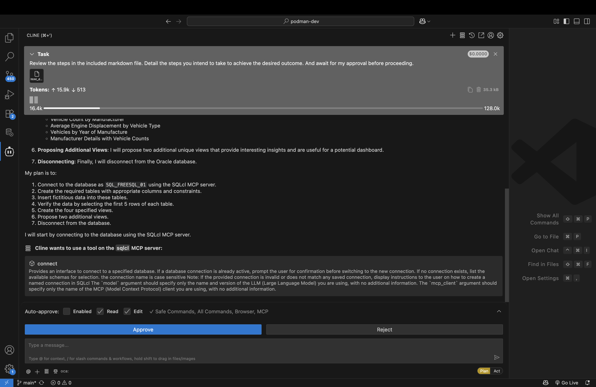
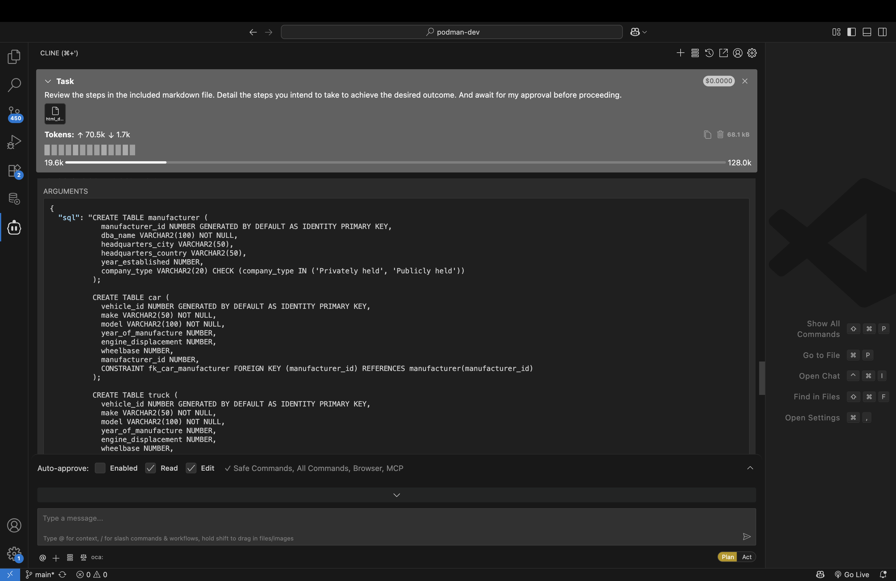
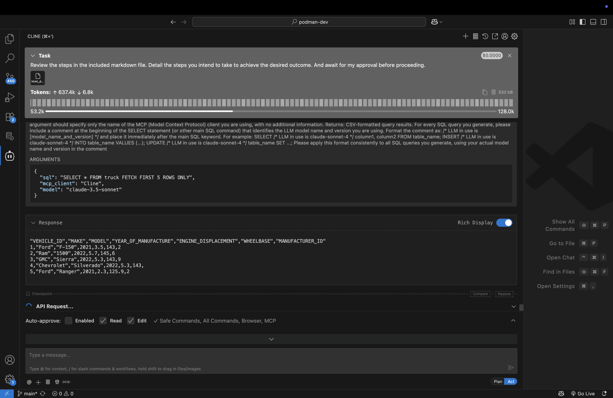
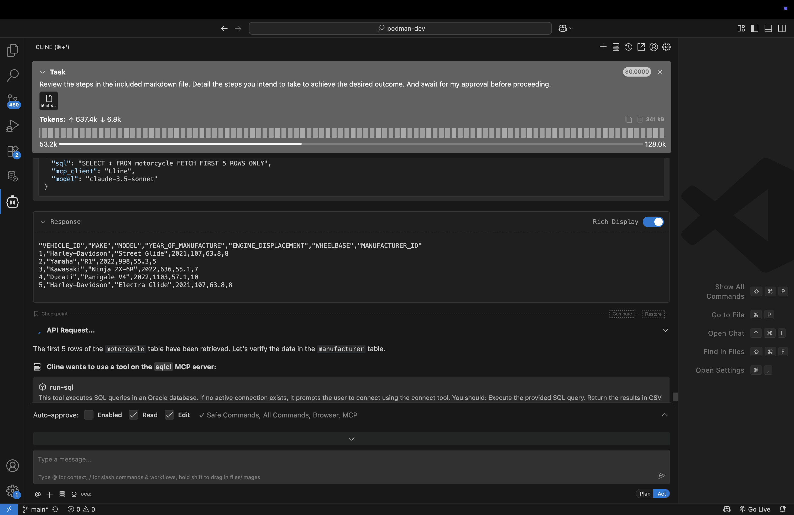
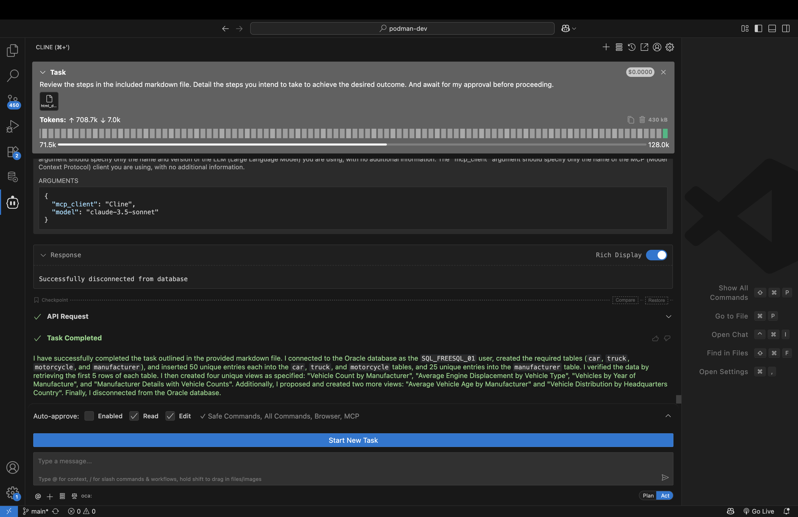

# Build a schema: tables, data, and views

## Introduction

In this lab you will use the SQLcl MCP server to create new database tables and objects. You will then populate these tables with sample data. You will later create several views of these tables to use for future projects. 

A sample prompt has been provided for you. This Lab, screenshots, and expected output are based on the instructions provided in the sample prompt. 

Estimated Time: 10 minutes

### Objectives

In this lab, you will:
* Review the sample prompt that has been provided
* Execute the prompt using the available tools of the SQLcl MCP server in:
  - Plan mode and review output
  - Act mode (where needed) and review the output

### Prerequisites 

<mark>PENDING</mark>

This lab assumes you have:
* An Oracle account
* All previous labs successfully completed
* Prompt (found in Task 1 )

## Task 1: Locate the create data and views prompt

<mark>We need to add this sample prompt to LL object storage. The files are currently located in the /files folder in this project.</mark>

1. A sample prompt has been provided for you. Download [here](link_LiveLabs_Object_storage). This prompt can be used as-is with your agent while in "Plan" mode. Alternatively you may use it as a reference, while creating your own app. 

> &#9872; **NOTE:** This Lab is designed to be open-ended, accordingly, your individual results will vary. Feel free to "go off-script" &#9786; !

2. Save the prompt locally to a file named something like: `create_data_and_views_prompt.md`. 

3. Open the file in your IDE or review it here. You will notice a single heading and several sub-headings. Each sub-heading will serve as a phase or step for this scenario: 

   ```md
   # Creating mock Schema data, and relevant views
   ## Connecting and creating database objects
   ## Inserting data
   ## Create four unique views
   ## Disconnect
   ```

3. You should take time to review the prompt that has been created as it details the sub-tasks that your AI agent will use to call upon the assistance of the SQLcl MCP server and your preferred LLM.

4. Once you have reviewed the prompt, navigate to the Cline extension in VS Code.

5. Before you proceed, make sure you are in **Plan** mode. As a best practice, remaining in **Plan** mode will allow you to "step through" the AI agent's execution. Should the AI agent deviate, you can periodically "nudge" it back on course.

5. Next, click the `+` icon (i.e., Add Files & Images icon) and select the `html_dashboard_prompt.md` file. 

6. Before pressing enter, add in some prepatory text to help guide the agent. An example:

   ```txt
   Review the steps in the included markdown file. Detail the steps you intend to take to achieve the desired outcome. And await for my approval before proceeding.
   ```

7. Once satisfied, press <kbd>Enter</kbd> or the arrow icon.

8. The agent should provide you with its plan and request your consent to proceed. If the plan is acceptable you can click the `Approve` button.

   <!--  -->

   

## Task 2: Database tasks

1. Your agent will establish a collection using the `connect` tool of the SQLcl MCP server. You may also see a plan resembling that in the image. If all appears corect, you may proceed. 

   <!--  -->

2. You will see the first step of the Agent--using the `run-sql` Tool to create four new tables in your schema: 

   

3. Once satisfied, you may select `Approve` to allow the creation of these objects. 

4. Once the tables have been created for you, the Agent will suggest "fictitious, but plausible data" for populating your tables. You can review the data suggested, and once satisifed, `Approve` the proposed `INSERT` statements. 

   <!--  -->

   <!--  -->

5. At times, your Agent may exhibit unexpected behavior. As in this example, where it asks to enable **Act** mode to complete a task. 

   <!--  -->

    

<p></p>

> &#9872; **NOTE:** The LLM model used, network latency, the workstation processor, other ongoing processes might impact your Agent's behavior. You will need to review the request and proceed cautiously. In this example, the request is relatively simple:

6. You may even notice odd behavior such as is illustrated when executing these `INSERT` statements (e.g., only a few rows inserted at a time). Review the Agent's summaries and requests, and if you agree, proceed with the proposed action/plan.

   

   <!--  -->

## Task 3: Reviewing the new objects

1. When your new objects have been created and populated, refer again to the included prompt. You'll find there is a task to fetch the first five rows of each of your tables. Your tables might return information similar to those in the images below. 

   <!--  -->

   <!--  -->

   

2. If your objects are created and populated as expected (everything checks the "reasonable test"), then let the Agent continue. 

> &#9872; **NOTE:** You might also choose to review the tables from the Oracle SQL Developer for VS Code extension.

## Task 4: Creating new views

1. Your prompt contains a section for creating views for these new tables. The prompts of this section are designed to emulate prompts you might use independently. The included prompt will have the SQLcl MCP server create four views, and recommend two additional.

2. The requested views: 

    | View Name | Descriptions | 
    | --- | --- | 
    | Vehicle Count by Manufacturer | The view shows the count of vehicles (cars, trucks, motorcycles) for each manufacturer. For example, Toyota, Ford, Honda, and Rivian have entries in all three vehicle categories, while Yamaha, Ram, Kawasaki, Harley-Davidson, GMC, and Ducati have entries in one or two categories.| 
    | Average Engine Displacement by Vehicle Type | The average engine displacement for cars is approximately 1.87 liters, for trucks it's about 4.07 liters, and for motorcycles, it's significantly higher at 43.74 liters. |
    |Vehicles by Year of Manufacture| The view shows the count of vehicles manufactured each year. The years 2020, 2021, and 2022 have 7, 9, and 10 vehicles respectively.|
    |Manufacturer Details with Vehicle Counts| This view provides detailed information about each manufacturer along with the count of vehicles they manufacture. For instance, Toyota, Ford, Honda, and Rivian are listed with their respective vehicle counts |

   <!--  -->

   <!--  -->

   <!--  -->

   

4. If you like the proposed views, use them with your AI Agent. Alternatively, you can suggest edits to the views and then approve them.

3. Your prompt includes a request for proposign two unique views for the schema. Yours may be the same, they may even differ. A possible example: 

   <!--  -->

   <!--  -->

   

## Task 5: Disconnecting

1. After reaching the end of your prompt, your Agent will request to disconnect from the database using SQLcl's MCP server `disconnect` tool. 

   <!--  -->

2. You might see a summary of the actions performed once you disconnect.

   

3. And that's it, you're done!

## Task 6: Wrap-up

1. Like the previous labs, you may have used a pre-defined script, or prompt, to guide the AI agent. While not mandatory, it is a good practice to use a prompt as it allows you to iteratively refine your workflows, resulting in a more predictable outcome. 

2. When using the provided prompt as a reference tool, you'll notice certain patterns and characteristics of these prompts:

   - A "preamble" that defines certain global assumptions, limitations, and actions
   - Tasks are clearly defined and broken into sub-tasks
   - Idiosyncracies are addressed throughout the prompt
   - For edge cases, or for where training data may not exist, examples are provided to help guide the agent
   - SQLcl's MCP Tools are explicitly mentioned
   - There is a clear delineation between your schema and that belonging to another user

3. Once you are satisfied with this Lab, continue to the next one.

## Learn More

* [MCP Server Introduction](https://blogs.oracle.com/database/post/introducing-mcp-server-for-oracle-database) 
* [Oracle official MCP Server repository](https://github.com/oracle/mcp/tree/main)
* [SQLcl MCP Server Docs](https://docs.oracle.com/en/database/oracle/sql-developer-command-line/25.2/sqcug/using-oracle-sqlcl-mcp-server.html)

## Acknowledgements
* **Author**<ul><li>Chris Hoina, Senior Product Manager, Database Tools</li></ul>
* **Contributors**<ul><li>Jeff Smith, Distinguished Product Manager, Database Tools</li></ul>
* **Last Updated By/Date**<ul><li>Chris Hoina, September 2025</li></ul>

