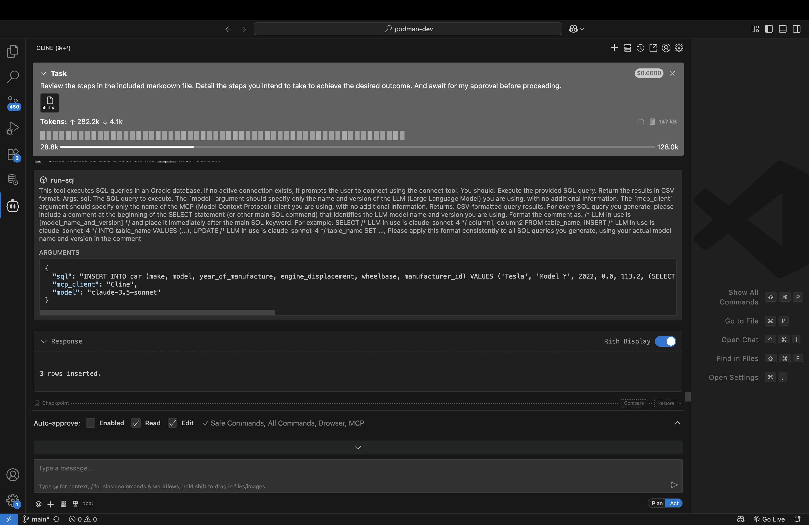

# Build a schema: tables, data, and views

## Introduction

In this lab you will use the SQLcl MCP server to create new database tables and objects. You will then populate these tables with sample data, and then ask your AI Agent to call upon the SQLcl MCP Server to create several views of these tables (perhaps to use for future projects). 

<p></p>

> &#9872; **NOTE:** A sample prompt has been provided for you. This Lab, screenshots, and expected output are based on the instructions provided in the sample prompt. 

<p></p>

Estimated Time: 10 minutes

### Objectives

In this lab, you will:
* Review the provided sample prompt
* Execute the prompt using the available tools of the SQLcl MCP server in:
    * Plan mode and review output
    * Act mode (where needed) and review the output

### Prerequisites 

This lab assumes you have:
* An Oracle Cloud, LiveSQL, or FreeSQL account
* Access to a currently supported Oracle database (or LiveSQL/FreeSQL account if participating in an instructor-led workshop)
* Organizational Roles/Privileges to install the following software on your employer-provided work station:
    * MS Visual Studio Code 

## Task 1: Locate the create data and views prompt

1. A sample prompt has been provided for you (see below). This prompt can be used as-is with your Agent while in "Plan" mode. Alternatively you may use it as a reference, while creating your own scenario. 

   <details>
      <summary style="color: #0000FF";><kbd style="font-size: 10px;">(click) </kbd><strong>Sample prompt</strong></summary>
      <p></p>
      <button>
      <a href="./files/create_data_and_views_prompt.md" target="_blank">Open in new tab</a>
      </button> 
      <button>
      <a href="./files/create_data_and_views_prompt.md" target="_self" download="create_data_and_views_prompt.md">Download .md file</a>
      </button>
      <p></p>
    
      ```txt
      <copy>
      Title: Creating mock Schema data, and relevant views

      Task 1: Connecting and creating database objects

         1. Connect as the SQL_FREESQL_01 user 
         2. Create four tables named car, truck, motorcycle, and manufacturer in the SQL_FREESQL_01 schema with the following characteristics (please review the three "NOTE" notes in this section before creating the tables):

         The car, truck, motorcycle tables should include colums such as: 
            - make
            - model
            - year of manufacture
            - engine displacement
            - wheelbase

         The manufacturer table should include details such as: 
            - Doing business as (dba) name
            - Headquarters location city
            - Headquarters location country 
            - Year manufacturer was established/incorporated
            - Privately held or publiclly held company 

         Create, where applicable for the tables:
            - indexes
            - comments
            - tags
            - references
            - primary and foreign keys  
         
         NOTE: For all tables, recommend any other additional columns you think may be relevant.
         
         NOTE: Ensure that no integrity constraints will be violated. Parent keys, in referred tables, should be verified of their existence before being used in any fictitous data. As an example, make sure the manufacturer_id exists across the various tables.

         NOTE: For simplicity, include Internal Combustion Engine (ICE) vehicles only.

      Task 2: Inserting data

         1. Create 50 unique entries each (in each table) of fictitious, but plausible data for the following tables(please review the two "NOTE" notes in this section before inserting the table data):
            - car
            - truck
            - motorcycle

            NOTE: When performing the inserts, bulk insert the data with syntax such as this:
            
               INSERT INTO t(col1, col2, col3) VALUES
               ('val1_1', 'val1_2', 'val1_3'),
               ('val2_1', 'val2_2', 'val2_3'),
               ('val3_1', 'val3_2', 'val3_3');
            

            NOTE: Take care to not create duplicate data in any of the tables.

         2. Create 25 unique entries of fictitious, but plausible data for the following table (please review the two "NOTE" notes in this section before inserting the table data):
            - manufacturer

         NOTE: When performing the inserts, bulk insert the data with syntax such as this:
         
            INSERT INTO t(col1, col2, col3) VALUES
            ('val1_1', 'val1_2', 'val1_3'),
            ('val2_1', 'val2_2', 'val2_3'),
            ('val3_1', 'val3_2', 'val3_3');

         NOTE: Take care to not create duplicate data in this table.

         3. After inserting the data show me the first 5 rows of each table individually. If no data exists, then: 
            - reattempt the inserting of the data in the empty tables, then:
               - show the first 5 rows of the table, and:
                  - continue this until we are certain that table data exists in all the tables

      Task 3: Create four unique views

         1. Create the following views for me, according to these specifications: 

            Vehicle Count by Manufacturer: The view shows the count of vehicles (cars, trucks, motorcycles) for each manufacturer. For example, Toyota, Ford, Honda, and Rivian have entries in all three vehicle categories, while Yamaha, Ram, Kawasaki, Harley-Davidson, GMC, and Ducati have entries in one or two categories.
         
            Average Engine Displacement by Vehicle Type: The average engine displacement for cars is approximately 1.87 liters, for trucks it's about 4.07 liters, and for motorcycles, it's significantly higher at 43.74 liters.

            Vehicles by Year of Manufacture: The view shows the count of vehicles manufactured each year. The years 2020, 2021, and 2022 have 7, 9, and 10 vehicles respectively.

            Manufacturer Details with Vehicle Counts: This view provides detailed information about each manufacturer along with the count of vehicles they manufacture. For instance, Toyota, Ford, Honda, and Rivian are listed with their respective vehicle counts.

         2. Recommend to me, two additional unique views. These views should:
               - provide me with unique and/or intersting insights
               - be useful enough to include in a dashboard, should I want to do this in the future
               - Feature in-line commenting, so future users can understand what the view is doing
         3. After reviewing the views you propose I will either approve or ask you to reiterate. 
         4. Once I am satisfied, I will approve, and you will create these views.

      Task 4: Disconnect

         1. Once we are complete, you will disconnect from the Oracle database.
      </copy>
      ```

   </details>

     <p></p>

> &#9872; **NOTE:** This Lab is designed to be open-ended, accordingly, your individual results will vary. Feel free to "go off-script" &#9786;!


2. Review the provided prompt in your IDE, browser, or above. You will notice a single heading and several sub-headings. Each sub-heading will serve as a phase or step for this scenario: 

    ```md 
    # Creating mock Schema data, and relevant views
    ## Connecting and creating database objects
    ## Inserting data
    ## Create four unique views
    ## Disconnect
    ```

3. Next, familiarize yourself with the details the sub-tasks in the included prompt. Notice the descriptive and prescriptive tone. If you decide to improvise, ensure you provide sufficient instruction for your AI Agent. Doing so will help you achieve better, more improved, and predictable outcomes.

4. Once you have reviewed the prompt, navigate to the Cline extension in VS Code.

5. Make sure you are in **Plan** mode. As a best practice, remaining in **Plan** mode will allow you to "step through" Cline's execution. Should an AI Agent deviate from your agreed upon plan, you can periodically "nudge" it back on course.

6. If you decide to use the prepared `.md` file, click the `+` icon (i.e., Add Files & Images icon) and select the file. 

7. Before continuing, consider adding in some prepatory text to help guide the Agent. An example:

    ```txt
    <copy>
    Review the steps in the included markdown file. Detail the steps you intend to take to achieve the desired outcome. And await for my approval before proceeding.
    </copy>
    ```

8. Once satisfied, press <kbd>Enter</kbd> or the arrow icon.

9. An Agent will likely provide you with its plan and request your consent to proceed. When a plan is acceptable can click the `Approve` button.

   

## Task 2: Database tasks

1. Your Agent will establish a collection using the SQLcl MCP Server's `connect` tool. You may also see an accompanying execution plan. If everything looks good proceed to the next step.

   <!--  -->

2. You will then probably notice Agent using the `run-sql` tool to create four new tables in your schema: 

   

3. If prompted, select `Approve` to allow the creation of these objects.

4. Once the tables have been created for you, the Agent will suggest "fictitious, but plausible data" for populating your tables (should you decide to use the provided prompt as-is). You can review the data suggested, and once satisifed, `Approve` the proposed `INSERT` statements. 

5. At times, your Agent may exhibit unexpected behavior. Take this example, where a user is asked to enable **Act** mode to complete a task. Review requests carefully and respond appropriately.

   

<p></p>

> &#9872; **NOTE:** The LLM model used, network latency, the workstation processor, other ongoing processes might impact your Agent's behavior. You will need to review the request and proceed cautiously. In this example, the request is relatively simple:

6. You may even notice odd behavior such as is illustrated when executing these `INSERT` statements (e.g., only a few rows inserted at a time). Review the Agent's summaries and requests, and if you agree, proceed with any proposed actions/plans.

   

## Task 3: Reviewing the new objects

1. When your new objects have been created and populated, refer again to the included prompt. You'll find there is a task to fetch the first five rows of each of your tables. Your tables might return information similar to those in the images below. 

   

2. If your objects are created and populated as expected (everything checks the "reasonableness test"), allow the Agent to continue. 

> &#9872; **NOTE:** You might also choose to review the tables from the SQL Developer Extension for VS Code.

## Task 4: Creating new views

1. The included prompt contains a task for creating views for these new tables. The steps of that prompt section are designed to emulate actions that you might use on your own. The included prompt will have the SQLcl MCP server create four views, and recommend two additional.

2. This prompt will rely on the SQLcl MCP Server to create the following views: 

    | View Name | Descriptions | 
    | --- | --- | 
    | Vehicle Count by Manufacturer | The view shows the count of vehicles (cars, trucks, motorcycles) for each manufacturer. For example, Toyota, Ford, Honda, and Rivian have entries in all three vehicle categories, while Yamaha, Ram, Kawasaki, Harley-Davidson, GMC, and Ducati have entries in one or two categories.| 
    | Average Engine Displacement by Vehicle Type | The average engine displacement for cars is approximately 1.87 liters, for trucks it's about 4.07 liters, and for motorcycles, it's significantly higher at 43.74 liters. |
    |Vehicles by Year of Manufacture| The view shows the count of vehicles manufactured each year. The years 2020, 2021, and 2022 have 7, 9, and 10 vehicles respectively.|
    |Manufacturer Details with Vehicle Counts| This view provides detailed information about each manufacturer along with the count of vehicles they manufacture. For instance, Toyota, Ford, Honda, and Rivian are listed with their respective vehicle counts |
    {: title="Views from provided prompt"}
<!-- 
    -->

3. If you agree with the proposed views, use them. Otherwise, you can suggest edits to the views and then approve.

4. Your prompt includes a request to propose two additional, unique views. Yours may be the same, they may even differ. A possible example: 

   

5. Compare your results. What did you come up with? 

## Task 5: Disconnecting

1. At the end of your prompt, your Agent will request to disconnect from the database using SQLcl's MCP server `disconnect` tool. 

2. You might see a summary of the actions performed once you disconnect. Compare your results. What did you end up with?

   

3. And that's it, you're done!

## Task 6: Wrap-up

1. Like the previous labs, you may have used the included prompt to guide the AI Agent. While not mandatory, it is a good practice to use a prompt as it allows you to iteratively refine your workflows, resulting in a more predictable outcome. 

2. When using the provided prompt as a reference tool, you'll notice certain patterns and characteristics of these prompts. Remember these characteristics and integrate then into your future workflows: 

    - A "preamble" that defines certain global assumptions, limitations, and actions
    - Tasks are clearly defined and broken into sub-tasks
    - Idiosyncracies are addressed throughout the prompt
    - For edge cases, or for where training data may not exist, examples are provided to help guide the Agent
    - SQLcl's MCP Tools are explicitly mentioned
    - There is a clear delineation between your schema and that belonging to another user

3. Once you are satisfied with this Lab, continue to the next one.

## Learn More

* [MCP Server Introduction](https://blogs.oracle.com/database/post/introducing-mcp-server-for-oracle-database) 
* [Oracle official MCP Server repository](https://github.com/oracle/mcp/tree/main)
* [SQLcl MCP Server Docs](https://docs.oracle.com/en/database/oracle/sql-developer-command-line/25.2/sqcug/using-oracle-sqlcl-mcp-server.html)

## Acknowledgements

* **Author**<ul><li>Chris Hoina, Senior Product Manager, Database Tools</li></ul>
* **Contributors**<ul><li>Jeff Smith, Distinguished Product Manager, Database Tools</li></ul>
* **Last Updated By/Date**<ul><li>Chris Hoina, September 2025</li></ul>

