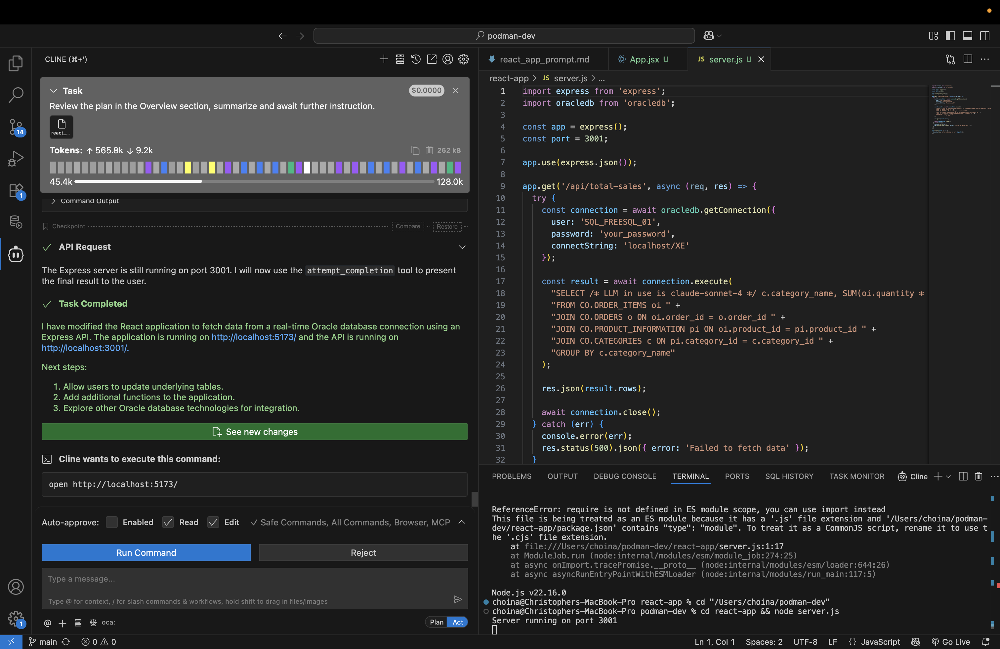
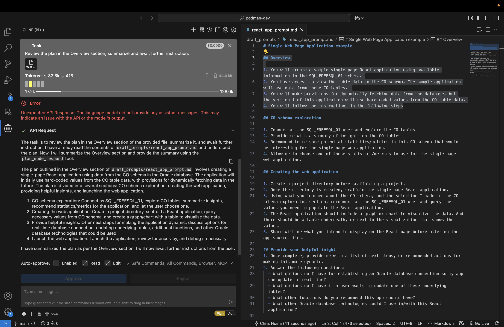
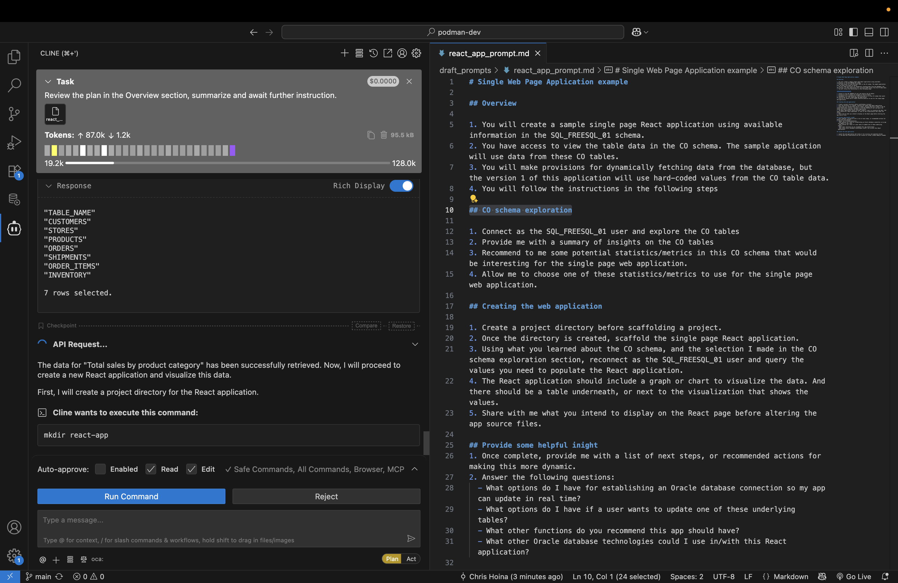
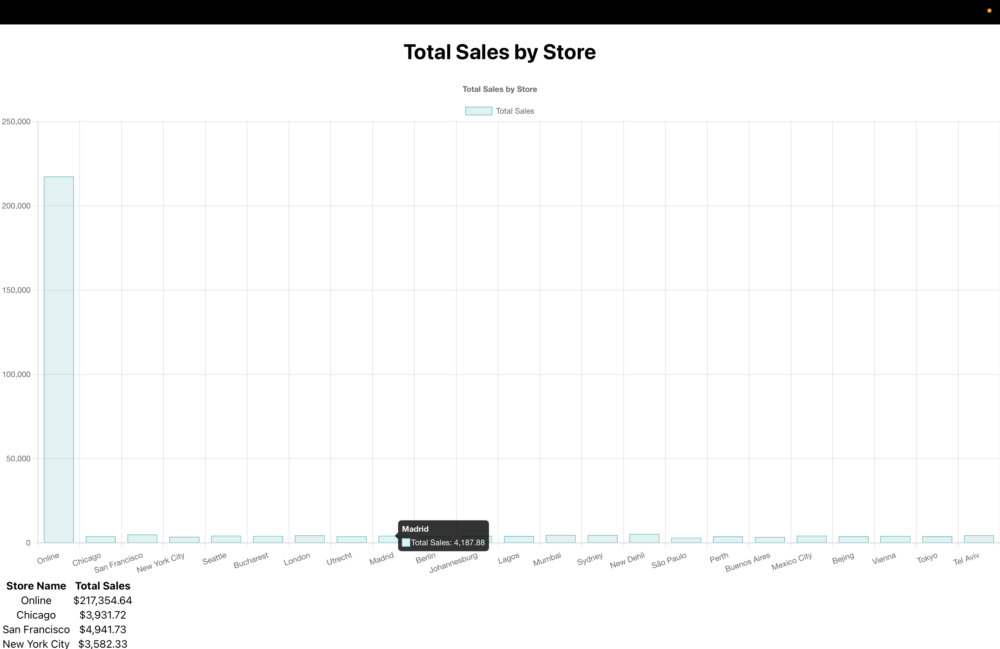
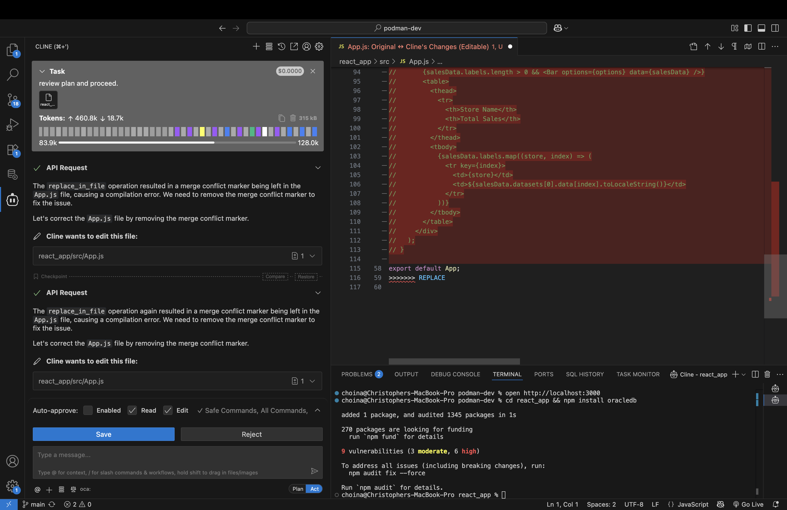

# Build a React app

## Introduction

In this Lab you will use Cline and the SQLcl MCP Server to create a starter web application. The example in this Lab generates a React-based sample web application. However, should you decide, you an opt for a framework/library of your choosing.

Estimated Time: 12 minutes

### Objectives

In this lab, you will:
* Review the included prompt
* Use the provided prompt:
  * to guide you through the creation process, *or*
  * as a reference guide while you improvise your own app

### Prerequisites 

This lab assumes you have:
* All previous labs successfully completed
* VS Code installed
* Installed the Cline for VS Code Extension
* Configured an Oracle Database connection using the Oracle SQL Developer for VS Code extension

<p></p>

> &#9872; **NOTE:** If participating in a workshop, you may optionally use your the credentials provided to you.

## Task 1: Review the prompt

<mark>We need to add this sample prompt to LL object storage. The files are currently located in the /files folder in this project.</mark>

1. A sample prompt has been provided for you. Download [here](link_LiveLabs_Object_storage). This prompt can be used as-is with your agent while in "Plan" mode. Alternatively you may use it as a reference, while creating your own app. 

> &#9872; **NOTE:** This Lab is designed to be open-ended, accordingly, your individual results will vary. Feel free to "go off-script" &#9786; !


2. Save the prompt locally to a file named something like: `create_a_react_app_prompt.md`. 

3. Before you begin, review the sections of the prompt: 

   - Overview
   - CO Schema exploration
   - Create the web application
   - Provide helpful insight
   - Disconnect from the database
   - Launch the web application

4. As you may have seen in other scenarios in this LiveLab, you may save this prompt as a markdown file and execute it in your agent's "Plan" mode. 

5. If you decide to improvise, and use the prompt as a reference, your results may differ from the Lab's expected output. If you get stuck, start over with the provided prompt and let the LLM and the MCP server do the work for you.

## Task 2: Observing the prompt execution

1. The prompt that you have been provided is the result of iterative testing. It is designed to teach you how to prompt your LLM to best utilize the SQLcl MCP Server. Following along with the prompt should result in a repeatable and predictable outcome. 

> Note: You should expect to complete this Lab with a version unique to you; and one that closesly resembles the examples and images in this Lab.

2. Navigate to your Cline extension. Toggle the agent to **Plan** mode. 

3. Click the `+` icon to add files and images to the task. Select the file name you chose for the prompt. 

4. If you decide to use the prompt in its entirety, include some prepatory instructions in additon to the prompt file; something like this:

    ```txt
    <copy>Review the steps in the included markdown file. Detail the steps you intend to take to achieve the desired outcome. And await for my approval before proceeding.</copy>
    ```

5. Carefully follow along with the agent's actions, providing feedback and coaching as needed. 

    

   Should the agent request to transition to **Act** mode, proceed carefully. Only approve actions you know to be safe, and reject those actions which you deem unecessary or risky.

      

6. Continue building out your application and review Task 3 once you have successfully launched your application.

    <!-- | | | 
    | -- | -- | 
    |  | |
    |  | |
    ||| -->

## Task 3: Comparing notes

1. By now you should have a sample React application. While your values are hard-coded, you might ask the agent to build the app out further.

2. Compare the sample application to your own:

   

   

## Task 4: Troubleshooting

1. Did you run into any issues? Review these common issues we've encountered, and attempt to resolve the problem.

2. Merge conflict markers. LLMs can sometimes have issues with advanced file creation, preparation, and updating. One common issue is their inability to remove Merge convlict markers, you may need to manually remove and save a file every now and again. 

   

3. The agent may forget, or narrow its focus too much. You may need to prompt it every now and again. For instance, in this example, we reiterated the request to connect as a specific user: 

   

4. An agent might *convincingly* tell you a task has been accomlished, when in fact it has not. In cases such as these, you may need to provide the agent with quality feedback markers, or actual errors from your application's console log. 

   

## Task 5: Wraping up

1. By now you should have a starter React web application. 

2. If you attempted to create one on your own, try this Lab again, but use the provided prompt verbatim. Compare the results; what worked, what didn't work? 

3. Need more help? Review the **Learn More** section of this Lab for helpful blog posts and tutorials. 

## Learn More

* [MCP Server Introduction](https://blogs.oracle.com/database/post/introducing-mcp-server-for-oracle-database) 
* [Oracle official MCP Server repository](https://github.com/oracle/mcp/tree/main)
* [SQLcl MCP Server Docs](https://docs.oracle.com/en/database/oracle/sql-developer-command-line/25.2/sqcug/using-oracle-sqlcl-mcp-server.html)

## Acknowledgements
* **Author**<ul><li>Chris Hoina, Senior Product Manager, Database Tools</li></ul>
* **Contributors**<ul><li>Jeff Smith, Distinguished Product Manager, Database Tools</li></ul>
* **Last Updated By/Date**<ul><li>Chris Hoina, September 2025</li></ul>
