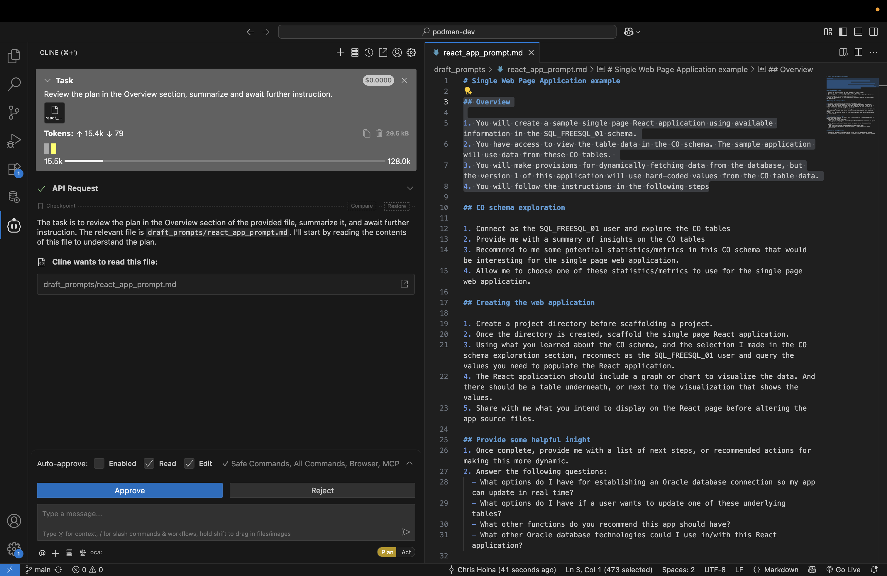
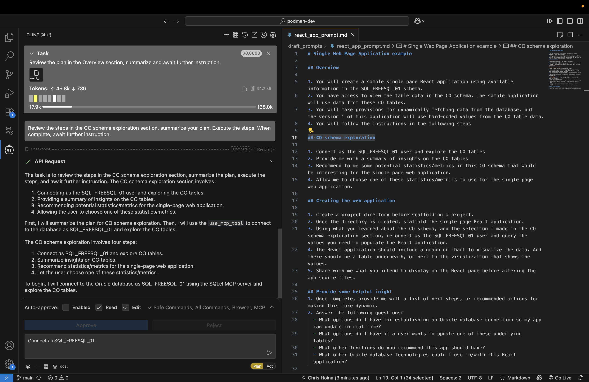
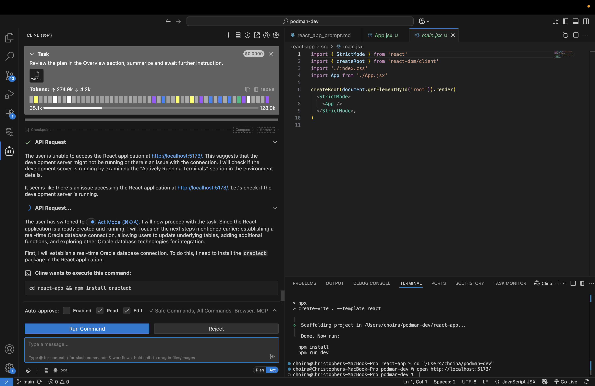

# Build a React app

## Introduction

In this Lab you will use Cline and the SQLcl MCP Server to create a starter web application. This lab's prompt will generate a React-based application. However, should you decide, you can opt to use the framework/library of your choosing.

Estimated Time: 12 minutes

### Objectives

In this lab, you will:
* Review the included prompt
* Use the provided prompt:
  * to guide you through the creation process, *or*
  * as a reference guide while you improvise your own app

### Prerequisites 

This lab assumes you have:
* All previous labs successfully completed
* VS Code installed
* Installed the Cline for VS Code Extension
* Configured an Oracle Database connection using the Oracle SQL Developer for VS Code extension

<p></p>

> &#9872; **NOTE:** In this lab you must allow your AI Agent to create a new project folder, scaffold a sample React application, and if required, install project dependencies (e.g., npm, Node, Express, React, etc. ).

<p></p>

> &#9872; **NOTE:** If participating in a workshop, you may optionally use your the credentials and workstation provided to you.

<p></p>

## Task 1: Review the prompt

1. A sample prompt has been provided for you. You may review it here, open the `.md` file in a new tab, or download the file locally.

   <details>
      <summary style="color: #0000FF";><kbd style="font-size: 10px;">(click) </kbd><strong>Sample prompt</strong></summary>
      <p></p>
      <button>
      <a href="./files/create_a_react_app_prompt.md" target="_blank">Open in new tab</a>
      </button> 
      <button>
      <a href="./files/create_a_react_app_prompt.md" target="_self" download="create_a_react_app_prompt.md">Download .md file</a>
      </button>
      <p></p>
       
      ```txt
      <copy>
      Title: Single Web Page Application example

      Task 1: Overview

      1. You will create a sample single page React application using available information in the SQL_FREESQL_01 schema.
      2. You have access to view the table data in the CO schema. The sample application will use data from these CO tables. 
      3. You will make provisions for dynamically fetching data from the database, but the version 1 of this application will use hard-coded values from the CO table data.
      4. You will follow the instructions in the following steps

      Task 2: CO schema exploration

      1. Connect as the SQL_FREESQL_01 user and explore the CO tables
      2. Provide me with a summary of insights on the CO tables
      3. Recommend to me some potential statistics/metrics in this CO schema that would be interesting for the single page web application. 
      4. Allow me to choose one of these statistics/metrics to use for the single page web application.

      Task 3: Creating the web application

      1. Create a project directory before scaffolding a project.
      2. Once the directory is created, scaffold the single page React application. 
      3. Using what you learned about the CO schema, and the selection I made in the CO schema exploration section, reconnect as the SQL_FREESQL_01 user and query the values you need to populate the React application.
      4. The React application should include a graph or chart to visualize the data. And there should be a table underneath, or next to the visualization that shows the values. 
      5. Share with me what you intend to display on the React page before altering the app source files.

      Task 4: Provide some helpful inight 
      1. Once complete, provide me with a list of next steps, or recommended actions for making this more dynamic.
      2. Answer the following questions: 
      - What options do I have for establishing an Oracle database connection so my app can update in real time? 
      - What options do I have if a user wants to update one of these underlying tables? 
      - What other functions do you recommend this app should have? 
      - What other Oracle database technologies could I use in/with this React application? 

      Task 5: Launch the web application

      1. Launch the web application and review it for accuracy and expected outcome
      2. If the data and visualization are not visible on screen, please debug as needed. 
      </copy>
      ```
         
   </details>
   <p></p>

> &#9872; **NOTE:** This Lab is designed to be open-ended, accordingly, your individual results will vary. Feel free to improvise &#9786; !


2. After reviewing the prompt, you may wish to save it locally. But, before you begin, review the various sections of the prompt: 

    - Overview
    - CO Schema exploration
    - Create the web application
    - Provide helpful insight
    - Disconnect from the database
    - Launch the web application

3. If you decide to improvise, may use the prompt as a reference. Know that your results may differ from the lab's expected output. If you get stuck, start over with the provided prompt and let the LLM and the SQLcl MCP server do much of the work for you.

## Task 2: Observing the prompt execution

1. The prompt that you have been provided is the result of iterative testing. The prompt is provided to teach you how to guide your LLM to best utilize the SQLcl MCP Server. Following along with the prompt should result in a repeatable and predictable outcome. 

> &#9872; **NOTE:** You should expect to complete this lab with a version of the application that is unique to you; but that still closesly resembles any examples and images in this Lab.

2. When ready, navigate to your Cline extension. Toggle the Agent to **Plan** mode. 

3. Click the `+` icon to add files and images to the task. Select the file name you chose for the prompt. 

4. If you decide to use the prompt in its entirety, include some prepatory instructions in additon to the prompt file; something like this:

    ```txt
    <copy>Review the steps in the included markdown file. Detail the steps you intend to take to achieve the desired outcome. And await for my approval before proceeding.</copy>
    ```

5. Carefully follow along with the Agent's actions, providing feedback and coaching as needed. 

    

6. Should the Agent request to transition to **Act** mode, proceed carefully. Only approve actions you know to be safe, and reject those actions which you deem unecessary or risky.

    

7. Continue building out your application and review the next task once you have successfully launched your application.

## Task 3: Comparing notes

1. Compare the sample application to your own:

   

   

2. By now you should have a sample React application. While your values are hard-coded, you might ask the Agent to build the app out further.

## Task 4: Troubleshooting

1. Issues? Review these following steps and attempt to resolve the problem.

2. Merge conflict markers (e.g. `>>>>>>> REPLACE`)? LLMs can sometimes have issues with advanced file creation, preparation, and updating. One common issue is their inability to remove merge conflict markers, you may need to manually remove and save a file every now and again. 

   

3. The Agent may forget, or narrow its focus too much. The Agent may require periodic prompting. For instance, in this example, we reiterated the request to connect as a specific user: 

   

4. An Agent might *convincingly* tell you a task has been accomlished, when in fact it has not. In cases such as these, you may need to provide the Agent with quality feedback markers, or actual errors from your application's console log. 

   

## Task 5: Wraping up

1. By now you should have a starter React web application. 

2. If you attempted to create one on your own, try this Lab again but use the provided prompt verbatim. Compare the results; what worked, what didn't work? 

3. Need more help? Review the **Learn More** section of this Lab for helpful blog posts and tutorials. 

## Learn More

* [MCP Server Introduction](https://blogs.oracle.com/database/post/introducing-mcp-server-for-oracle-database) 
* [Oracle official MCP Server repository](https://github.com/oracle/mcp/tree/main)
* [SQLcl MCP Server Docs](https://docs.oracle.com/en/database/oracle/sql-developer-command-line/25.2/sqcug/using-oracle-sqlcl-mcp-server.html)

## Acknowledgements

* **Author**<ul><li>Chris Hoina, Senior Product Manager, Database Tools</li></ul>
* **Contributors**<ul><li>Jeff Smith, Distinguished Product Manager, Database Tools</li></ul>
* **Last Updated By/Date**<ul><li>Chris Hoina, September 2025</li></ul>
