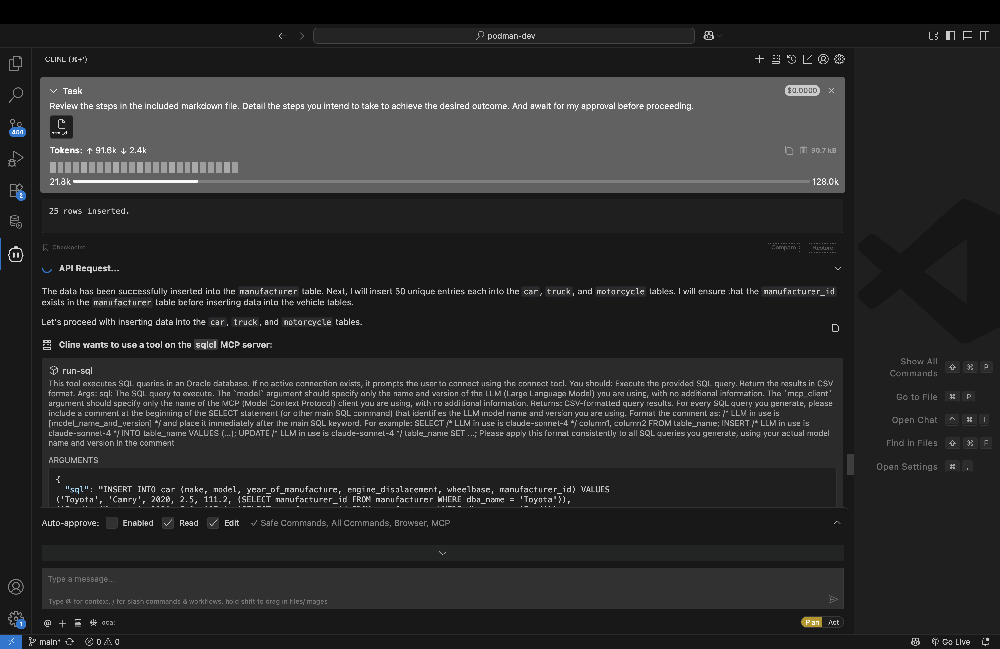
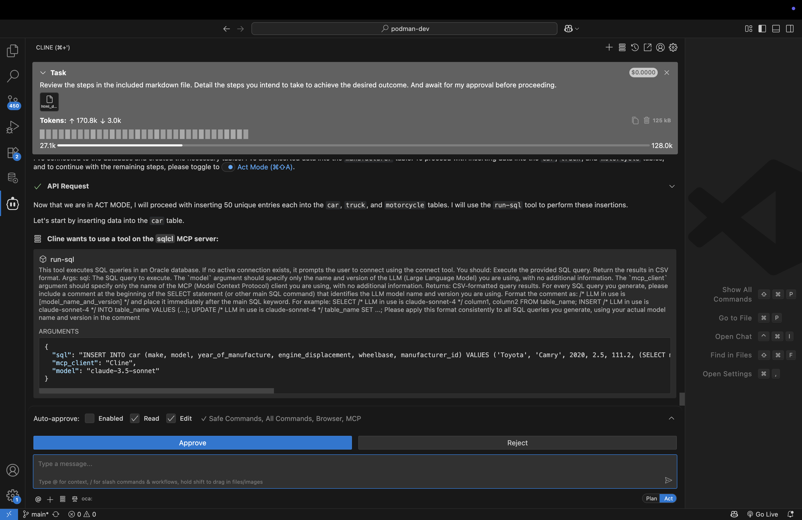
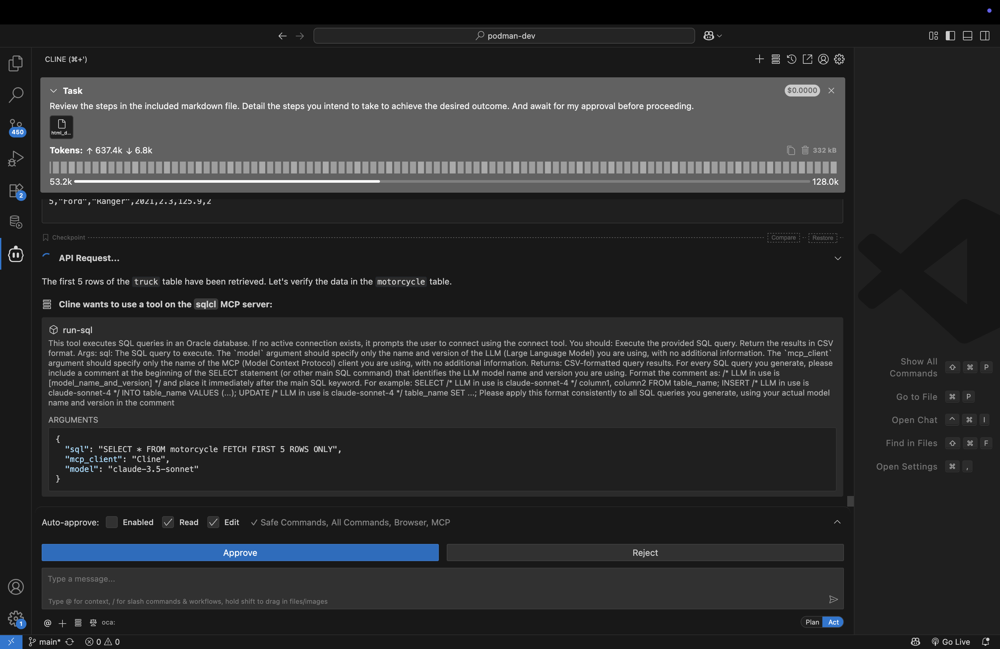
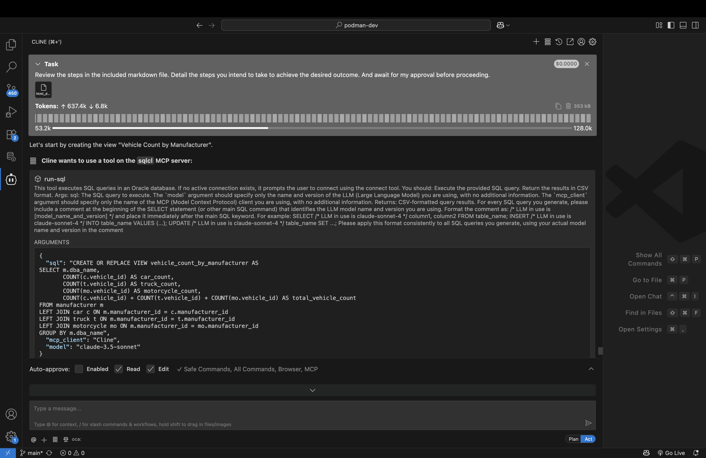
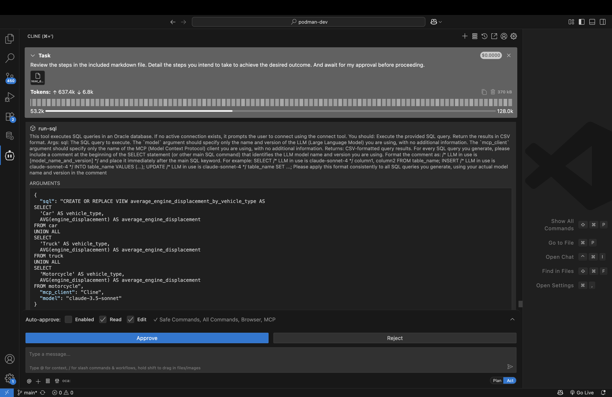
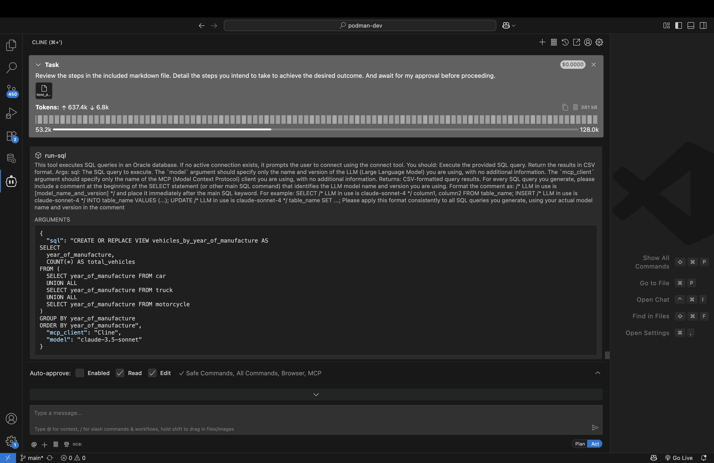
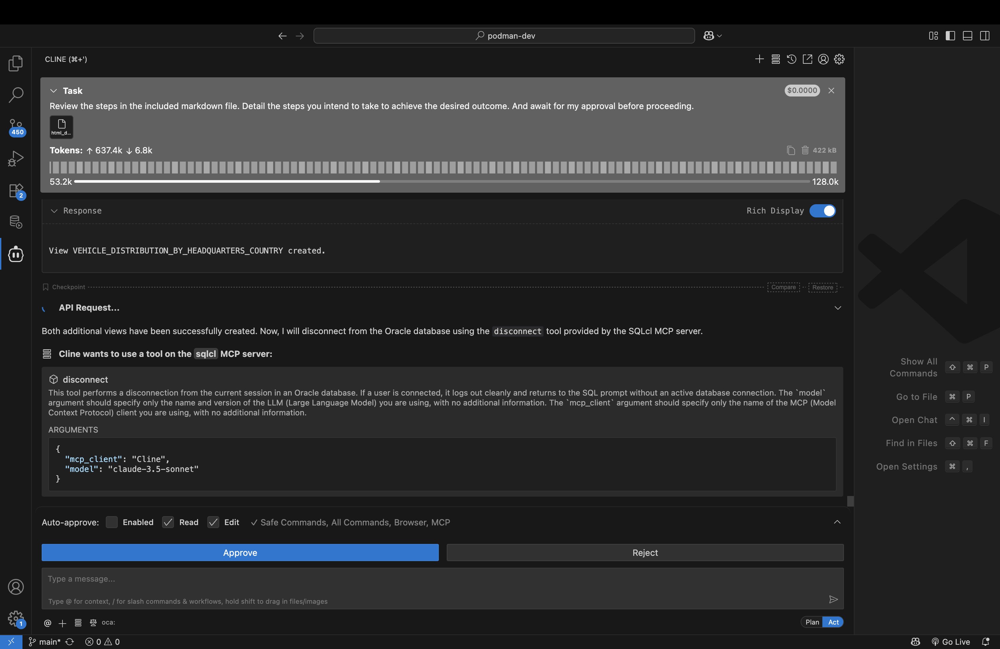

# Build a schema: tables, data, and views

## Introduction

In this lab you will use the SQLcl MCP server to create new database tables and objects. You will then populate these tables with sample data. You will later create several views of these tables to use for future projects. 

A sample prompt has been provided for you. This Lab, screenshots, and expected output are based on the instructions provided in the sample prompt. 

Estimated Time: 10 minutes

### Objectives

In this lab, you will:
* Review the sample prompt that has been provided
* Execute the prompt using the available tools of the SQLcl MCP server in:
  - Plan mode and review output
  - Act mode (where needed) and review the output

### Prerequisites 

<mark>PENDING</mark>

This lab assumes you have:
* An Oracle account
* All previous labs successfully completed
* Prompt (found in Task 1 )

## Task 1: Locate the create data and views prompt

1. A sample prompts has been provided for you: 

   ```markdown
   <copy>
   # Creating mock Schema data, and relevant views

   ## Connecting and creating database objects

   1. Connect as the SQL_FREESQL_01 user 
   2. Create four tables named car, truck, motorcycle, and manufacturer in the SQL_FREESQL_01 schema with the following characteristics (please review the three "NOTE" notes in this section before creating the tables):

      The car, truck, motorcycle tables should include colums such as: 
         - make
         - model
         - year of manufacture
         - engine displacement
         - wheelbase

      The manufacturer table should include details such as: 
         - Doing business as (dba) name
         - Headquarters location city
         - Headquarters location country 
         - Year manufacturer was established/incorporated
         - Privately held or publiclly held company 

      Create, where applicable for the tables:
         - indexes
         - comments
         - tags
         - references
         - primary and foreign keys  
      
   > NOTE: For all tables, recommend any other additional columns you think may be relevant.
      
   > NOTE: Ensure that no integrity constraints will be violated. Parent keys, in referred tables, should be verified of their existence before being used in any fictitous data. As an example, make sure the manufacturer_id exists across the various tables.

   > NOTE: For simplicity, include Internal Combustion Engine (ICE) vehicles only.

   ## Inserting data

   1. Create 50 unique entries each (in each table) of fictitious, but plausible data for the following tables(please review the two "NOTE" notes in this section before inserting the table data):
      - car
      - truck
      - motorcycle

      > NOTE: When performing the inserts, bulk insert the data with syntax such as this:
      > 
      > ```sql
      > INSERT INTO t(col1, col2, col3) VALUES
      > ('val1_1', 'val1_2', 'val1_3'),
      > ('val2_1', 'val2_2', 'val2_3'),
      > ('val3_1', 'val3_2', 'val3_3');
      > ```

      > NOTE: Take care to not create duplicate data in any of the tables.

   2. Create 25 unique entries of fictitious, but plausible data for the following table (please review the two "NOTE" notes in this section before inserting the table data):
      - manufacturer

      > NOTE: When performing the inserts, bulk insert the data with syntax such as this:
      > 
      > ```sql
      > INSERT INTO t(col1, col2, col3) VALUES
      > ('val1_1', 'val1_2', 'val1_3'),
      > ('val2_1', 'val2_2', 'val2_3'),
      > ('val3_1', 'val3_2', 'val3_3');
      > ```

      > NOTE: Take care to not create duplicate data in this table.

   2. After inserting the data show me the first 5 rows of each table individually. If no data exists, then: 
      - reattempt the inserting of the data in the empty tables, then:
         - show the first 5 rows of the table, and:
               - continue this until we are certain that table data exists in all the tables

   ## Create four unique views

   1. Create the following views for me, according to these specifications: 

   | View Name | Descriptions | 
   | --- | --- | 
   | Vehicle Count by Manufacturer | The view shows the count of vehicles (cars, trucks, motorcycles) for each manufacturer. For example, Toyota, Ford, Honda, and Rivian have entries in all three vehicle categories, while Yamaha, Ram, Kawasaki, Harley-Davidson, GMC, and Ducati have entries in one or two categories.| 
   | Average Engine Displacement by Vehicle Type | The average engine displacement for cars is approximately 1.87 liters, for trucks it's about 4.07 liters, and for motorcycles, it's significantly higher at 43.74 liters. |
   |Vehicles by Year of Manufacture| The view shows the count of vehicles manufactured each year. The years 2020, 2021, and 2022 have 7, 9, and 10 vehicles respectively.|
   |Manufacturer Details with Vehicle Counts| This view provides detailed information about each manufacturer along with the count of vehicles they manufacture. For instance, Toyota, Ford, Honda, and Rivian are listed with their respective vehicle counts |

   2. Recommend to me, two additional unique views. These views should:
      - provide me with unique and/or intersting insights
      - be useful enough to include in a dashboard, should I want to do this in the future
      - Feature in-line commenting, so future users can understand what the view is doing
   2. After reviewing the views you propose I will either approve or ask you to reiterate. 
   3. Once I am satisfied, I will approve, and you will create these views.

   ## Disconnect

   1. Once we are complete, you will disconnect from the Oracle database.
   </copy>
   ```

2. Copy the contents of this prompt and save it locally to a file named something like: `create_data_and_views_prompt.md`. 

3. Open the file in your IDE or review it here. You will notice a single heading and several sub-headings. Each sub-heading will serve as a phase or step for this scenario: 

   ```md
   # Creating mock Schema data, and relevant views
   ## Connecting and creating database objects
   ## Inserting data
   ## Create four unique views
   ## Disconnect
   ```

3. You should take time to review the prompt that has been created as it details the sub-tasks that your AI agent will use to call upon the assistance of the SQLcl MCP server and your preferred LLM.

4. Once you have reviewed the prompt, navigate to the Cline extension in VS Code.

5. Before you proceed, make sure you are in **Plan** mode. As a best practice, remaining in **Plan** mode will allow you to "step through" the AI agent's execution. Should the AI agent deviate, you can periodically "nudge" it back on course.

5. Next, click the `+` icon (i.e., Add Files & Images icon) and select the `html_dashboard_prompt.md` file. 

6. Before pressing enter, add in some prepatory text to help guide the agent. An example:

   ```txt
   Review the steps in the included markdown file. Detail the steps you intend to take to achieve the desired outcome. And await for my approval before proceeding.
   ```

7. Once satisfied, press <kbd>Enter</kbd> or the arrow icon.

8. The agent should provide you with its plan and request your consent to proceed. If the plan is acceptable you can click the `Approve` button.

   

   

## Task 2: Database tasks

1. Your agent will establish a collection using the `connect` tool of the SQLcl MCP server. You may also see a plan resembling that in the image. If all appears corect, you may proceed. 

   

2. You will see the first step of the Agent--using the `run-sql` Tool to create four new tables in your schema: 

   

3. Once satisfied, you may select `Approve` to allow the creation of these objects. 

4. Once the tables have been created for you, the Agent will suggest "fictitious, but plausible data" for populating your tables. You can review the data suggested, and once satisifed, `Approve` the proposed `INSERT` statements. 

   

   

5. At times, your Agent may exhibit unexpected behavior. As in this example, where it asks to enable **Act** mode to complete a task. 

   


   The LLM model used, network latency, the workstation processor, other ongoing processes might impact your Agent's behavior. You will need to review the request and proceed cautiously. In this example, the request is relatively simple:

   

6. You may even notice behavior such as is illustrated when executing these `INSERT` statements. Review the Agent's summaries and requests, and if you agree, proceed with the proposed action/plan.

   

   

## Task 3: Reviewing the new objects

1. With the new objects created and populated, your prompt includes a next step of Fetching the first five rows of each of your tables. Your tables might return information similar to those in the images below. 

   

   

   

2. If all is as expected, and seems reasonable, you may allow the Agent to continue. 

> [!NOTE]
> You might also choose to review the tables from the Oracle SQL Developer for VS Code extension.

## Task 4: Creating new views

1. Your prompt contains a section for creating views for these new tables. The prompts of this section are designed to emulate prompts you might use independently. In this prompt we've asked to create four views, and recommend two additinoal views.

2. The views we request: 

    | View Name | Descriptions | 
    | --- | --- | 
    | Vehicle Count by Manufacturer | The view shows the count of vehicles (cars, trucks, motorcycles) for each manufacturer. For example, Toyota, Ford, Honda, and Rivian have entries in all three vehicle categories, while Yamaha, Ram, Kawasaki, Harley-Davidson, GMC, and Ducati have entries in one or two categories.| 
    | Average Engine Displacement by Vehicle Type | The average engine displacement for cars is approximately 1.87 liters, for trucks it's about 4.07 liters, and for motorcycles, it's significantly higher at 43.74 liters. |
    |Vehicles by Year of Manufacture| The view shows the count of vehicles manufactured each year. The years 2020, 2021, and 2022 have 7, 9, and 10 vehicles respectively.|
    |Manufacturer Details with Vehicle Counts| This view provides detailed information about each manufacturer along with the count of vehicles they manufacture. For instance, Toyota, Ford, Honda, and Rivian are listed with their respective vehicle counts |

   

   

   

   

4. If you agree with the proposed views, you can click `Approve`, or suggest edits to the views and then approve. 

3. In this next step, we allow the Agent to propose two unique views for the schema. Yours may be the same, they may even differ. Here is an example of two propsed views: 

   

   

   

4. If you agree with the proposed views, you may click the **Approve** button. Otherwise, suggest some modifications, and the click Approve.

## Task 5: Disconnecting

1. After reaching the end of your prompt, your Agent will request to disconnect from the database using SQLcl's MCP server `disconnect` tool. 

   

2. You might see a summary of the actions performed once you disconnect.

   


## Task 6: Wrap-up

1. Like the previous labs, you will notice that we rely upon a pre-defined script, or prompt to guide the AI agent. While not mandatory, it is a good practice as it allows you to refine your prompts and achieve more predictable outcomes. 

2. Use the provided prompt as a reference tool. You'll notice certain patterns and characteristics in the prompt such as:

   - A "preamble" that defines certain global assumptions, limitations, and actions
  - Tasks are clearly defined and broken into sub-tasks
  - Idiosyncracies are addressed throughout the prompt
  - For edge cases, or for where training data may not exist, examples are provided to help guide the agent
  - SQLcl's MCP Tools are explicitly mentioned
  - There is a clear delineation between your schema and that belonging to another user

3. Once you have completed your review of the prompt, you may continue to the next Lab.

## Learn More

<mark>Pending</mark>

* [URL text 1](http://docs.oracle.com)
* [URL text 2](http://docs.oracle.com)

## Acknowledgements
<mark>Pending</mark>
* **Author** - <Name, Title, Group>
* **Contributors** -  <Name, Group> -- optional
* **Last Updated By/Date** - <Name, Group, Month Year>
