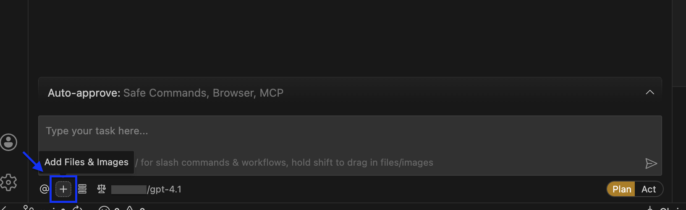
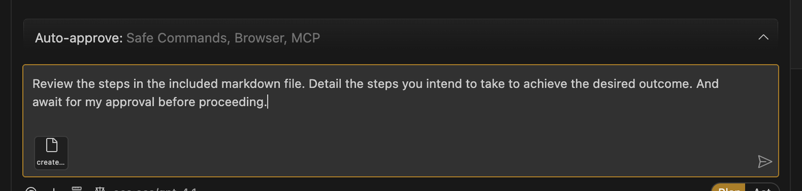

# Build an HTML Dashboard

## Introduction

<div style="display: flex; gap: 16px;">
  
  
</div>

In this lab, you'll discover how easy it is to instruct an LLM to create a basic HTML dashboard with the help of the SQLcl MCP server.

Estimated Time: 10 minutes

### Objectives

In this lab, you will:
* Review the included prompt
* Use the provided prompt:
  * to guide you through the creation process, *or*
  * as a reference guide while you improvise your own HTML dashboard

### Prerequisites

This lab assumes you have:
* All previous labs successfully completed
* VS Code installed
* Installed the Cline for VS Code Extension
* Configured an Oracle Database connection using the Oracle SQL Developer for VS Code extension

<p></p>

> &#9872; **Note:** In this lab you must allow your AI Agent to create a new project folder, scaffold an HTML page, and if required, install dependencies (e.g., npm, Node, Express, etc.).

<p></p>

## Task 1: Review the sample prompt

1. A sample prompt has been provided for you. It can be used as-is in **Plan** mode with your Agent. Or, can use the prompt as a reference while you create your own dashboard. 

      <button>
      <a href="./files/create_an_html_dashboard_prompt.md" target="_blank">Open prompt in new tab</a>
      </button> 
      <button>
      <a href="./files/create_an_html_dashboard_prompt.md" target="_self" download="create_an_html_dashboard_prompt.md">Download prompt as .md file</a>
      </button>

> &#9872; **Note:** This Lab is designed to be open-ended, accordingly, your individual results will vary. Feel free to "go off-script" &#9786; !

2. Whether you use the prompt as-is or use it as a reference; you decide. Make sure to begin your workflow in **Plan** mode in order to have better control and oversight over the entire process. 

   

3. Click the `+` icon to add files and images to the task. Select the file name you chose for the prompt. 

   

4. If you decide to use the prompt in its entirety, include some prepatory instructions in additon to the prompt file; something like this:

    ```txt
    <copy>Review the steps in the included markdown file. Detail the steps you intend to take to achieve the desired outcome. And await for my approval before proceeding.</copy>
    ```
   
   

3. Let the Agent summarize its intent. 

   

4. In other labs, you might approve actions in stages. But if you decide to share with the Agent the *entire* prompt, the Agent will review the tasks all at once and execute its plan with minimal intervention. You can of course add suggestions or changes to the proposed plan. And when you are satisfied, allow the Agent to continue.

5. There are other schemas that have granted access to `PUBLIC` (i.e., all other users); so, you do not need to be connected as the `HR` user (which is what the provided prompt references). You also have access to other schemas: `CO` and `SH`~. You might improvise and create a dashboard using these schemas instead.

6. Whatever you decide, observe what SQLcl MCP **tools** are used, as well as the SQL or PL/SQL that is executed. In some cases, the Agent may need additonal direction. And the Agent may request switching the mode to **Act**. 

    

7. Your scenario may differ slightly, depending on the LLM used, but you should continue to see the Agent's intent and summary of intended actions.

## Task 2: Creating the dashboard files

1. Over the course of this scenario, the Agent will create a new project folder, and begin scaffolding `HTML` and `JavaScript` components. Pay close attention, and guide the Agent should it deviate from this plan. 

2. The Agent may request your approval to use the **connect** and **run-sql** tools of the SQLcl MCP server. You should approve, and watch as the dashboard is populated with real data from your target schema. 

3. Even now, LLMs find merge conflict markers difficult to troubleshoot. So, if manual intervention is required, assist the Agent with removing any of these markers (e.g. `>>>>>>> REPLACE`). 

   

4. If you are able, review your project files before proceeding. Does everything look correct? 

## Task 3: Review the HTML dashboard

1. By now, you probably have something that will resemble the example shown below. Allow the Agent to open the newly created dashboard, and compare your output to the example. 
 
2. You may have chosen different charts or visualizations. You may have chosen a different schema too. But if you've monitored the Agent, and ensured that its using the correct SQLcl MCP server tools, your end result probably looks very close to what you see here: 

   

3. Congratulations, you've finished! Feel free to use the provided prompts as reference; you are encouraged to improve and refine them as needed. And if you like, try the labs again with varied prompting. 

## Learn More

* [Build a starter HTML dashboard with SQLcl MCP Server and your AI Agent](https://blogs.oracle.com/database/build-a-starter-html-dashboard-with-sqlcl-mcp-server) 
* [Oracle official MCP Server repository](https://github.com/oracle/mcp/tree/main)
* [SQLcl MCP Server Docs](https://docs.oracle.com/en/database/oracle/sql-developer-command-line/25.2/sqcug/using-oracle-sqlcl-mcp-server.html)

## Acknowledgements

* **Author**<ul><li>Chris Hoina, Senior Product Manager, Database Tools</li></ul>
* **Contributors**<ul><li>Jeff Smith, Distinguished Product Manager, Database Tools</li></ul>
* **Last Updated By/Date**<ul><li>Chris Hoina, January 2026</li></ul>

<!-- WMS ID 11914 -->