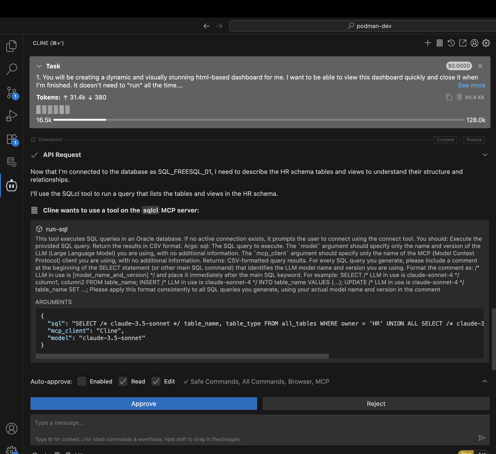
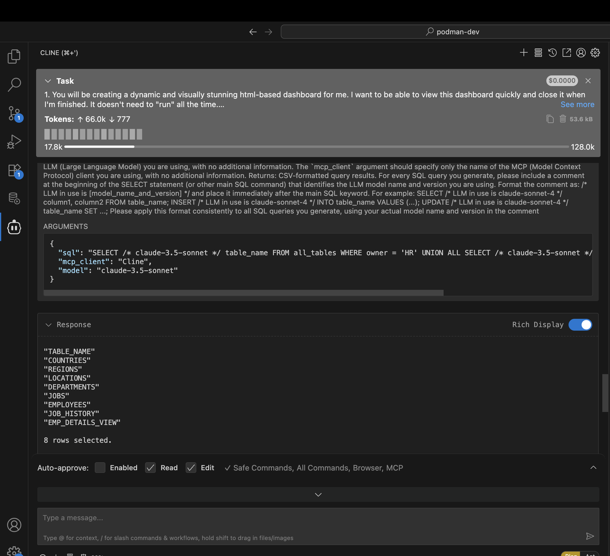
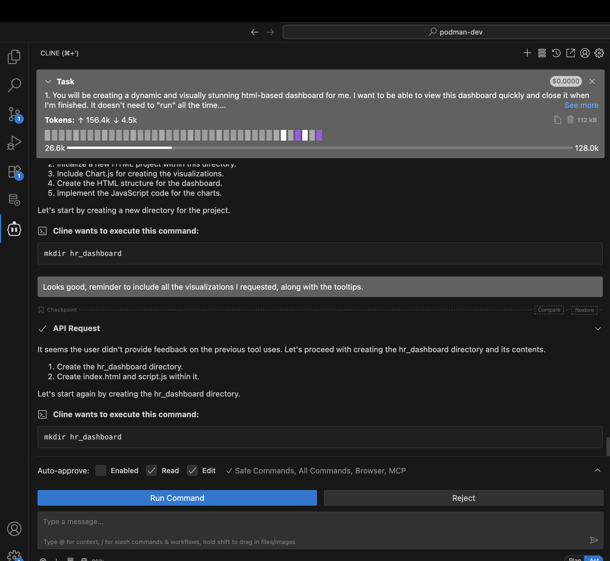
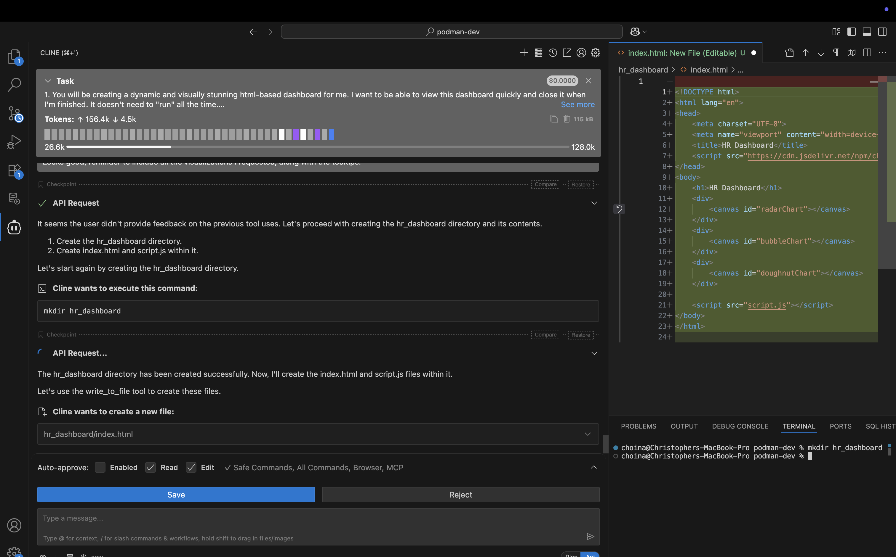
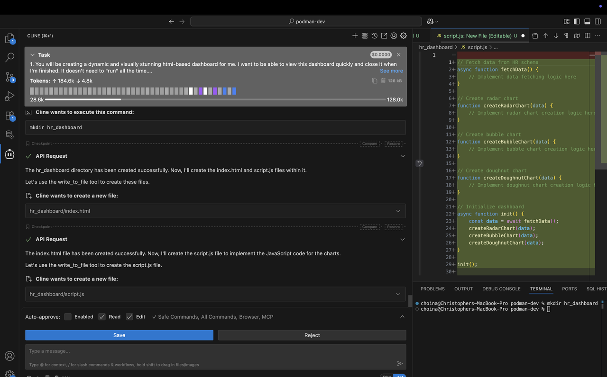

# Build an HTML Dashboard

## Introduction

In this lab, you'll discover how easy it is to instruct an LLM to create a basic HTML dashboard with the help of the SQLcl MCP server. In this Lab you will see how a single prompt rather than a pre-made prompt can result in an equally impressive result.

Estimated Time: 10 minutes

### Objectives

<mark>Pending</mark>

In this lab, you will:
* Objective 1
* Objective 2
* Objective 3

### Prerequisites

<mark>Pending</mark>

*List the prerequisites for this lab using the format below. Fill in whatever knowledge, accounts, etc. is needed to complete the lab. **Do NOT list** each previous lab as a prerequisite.*

This lab assumes you have:
* An Oracle account
* All previous labs successfully completed

*This is the "fold" - below items are collapsed by default*

## Task 1: Review the sample prompt

In this Lab, you'll trade out a pre-made prompt-as-markdown-file, for a short summary of what you want to achieve. Read on to learn more.

1. Review the following sample prompt. In a test, we asked our Agent for the following: 

    ```txt
    1. You will be creating a dynamic and visually stunning html-based dashboard for me. I want to be able to view this dashboard quickly and close it when I'm finished. It doesn't need to "run" all the time.

    2. Connect as the SQL_FREESQL_01 user and describe the HR schema tables and views

    3. Familiarize yourself with their relationships.

    4. I want you to add tool tips to my charts: https://www.chartjs.org/docs/latest/samples/tooltip/content.html

    5. I want you to use table data from the HR schema to create a radar chart https://www.chartjs.org/docs/latest/samples/other-charts/radar.html. I want to be able to select two different employees from two drop down lists, so that I can compare their attributes.

    6. I want a bubble chart to display the count of countries employees reside in. The bubble size should be relative to the number of employees in that country. I want you to create something like in this example: https://www.chartjs.org/docs/latest/samples/other-charts/bubble.html

    7. I want you to show me a breakdown of the employees by their Job ID, on a doughnut chart like this: https://www.chartjs.org/docs/latest/samples/other-charts/doughnut.html
    ```

2. You can choose to use this prompt, or something like it. You decide. Make sure to start in **Plan** mode, in order to have better control and oversight over the entire process. Let the Agent summarize its intent. 

   

3. In other labs, you may have approved actions in stages, but here the Agent reviews the tasks all at once, and executes with minimal intervention. You can of course add suggestions or changes to the proposed plan. When you are satisfied, allow the Agent to continue.

    <!--  -->

4. There are other schemas that have granted access to `PUBLIC` (i.e., all other users); you do not need to query the **HR** schema. You have access to other schemas too: **CO** and **SH**. You might improvise and create a dashboard with these schemas. 

5. Whatever you decide, observe what SQLcl MCP **Tools** are used, and the SQL or PL/SQL that is executed. In some cases, the agent may need additonal direction. And the Agent may request switching the mode to **Act**. 

    <!--  -->

    <!--  -->

6. Your scenario may differ slightly, depending on the LLM used, but you should continue to see the Agent's intent and summary of intended actions.

    <!--  -->

## Task 2: Creating the dashboard files

1. Over the course of this scenario, the agent will create a new project folder, and begin scaffolding the `HTML` and `JavaScript` components. Pay close attention, and guide the agent should it deviate from this plan. 

    <!--  -->

    <!--  -->

    <!--  -->

2. The agent may request your approval to use the **connect** and **run-sql** tools of the SQLcl MCP server. You should approve, and watch as the dashboard is populated with real data from your target schema. 

    <!--  -->

3. Even now, LLMs find merge conflict markers difficult to troubleshoot. So, if manual intervention is required, assist the agent with removing any of these markers (e.g. `>>>>>>> REPLACE`). 

   

4. If you are able to, review your project files before continuing on. Does everything look correct? 

## Task 3: Review the HTML dashboard

1. By now, you probably have something that will resemble the example shown below. Allow the agent to open the newly created dashboard, and compare your output to the example. 
 
    <!--  -->

2. You may have chosen different charts or visualizations. You may have chosen a different schema too. But if you've monitored the agent, and ensured that its using the correct SQLcl MCP server tools, your end result probably looks very close to what you see here: 

   <!--  -->

   <!--  -->

   


## Learn More

<mark>Pending</mark>

*(optional - include links to docs, white papers, blogs, etc)*

* [URL text 1](http://docs.oracle.com)
* [URL text 2](http://docs.oracle.com)

## Acknowledgements

<mark>Pending</mark>

* **Author** - <Name, Title, Group>
* **Contributors** -  <Name, Group> -- optional
* **Last Updated By/Date** - <Name, Group, Month Year>
