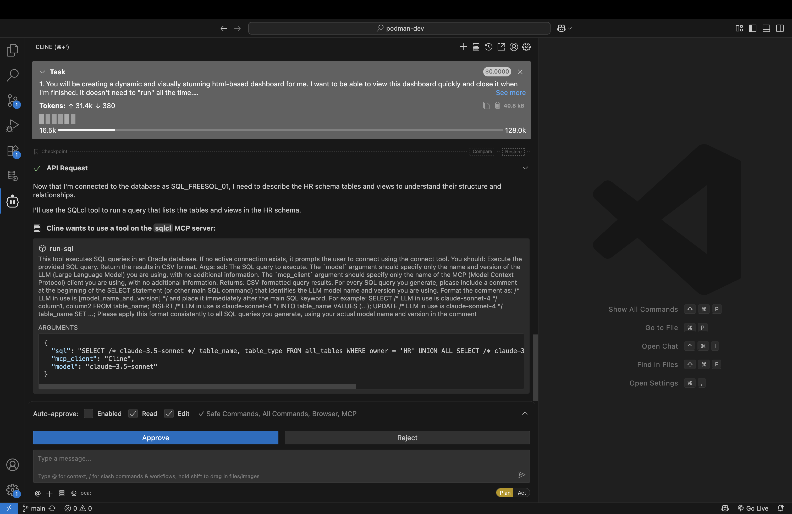
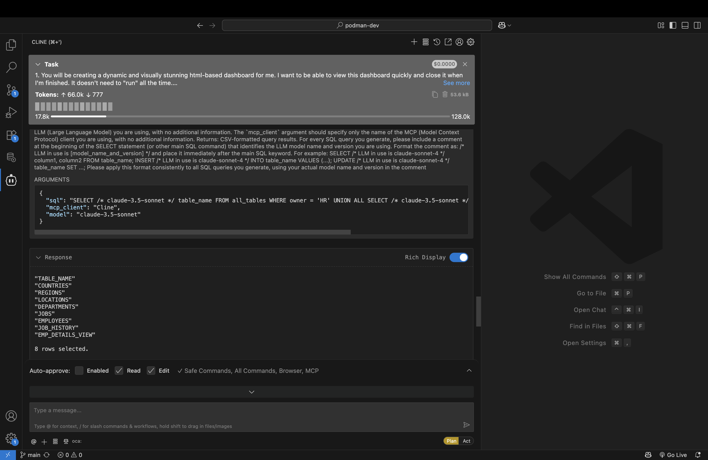
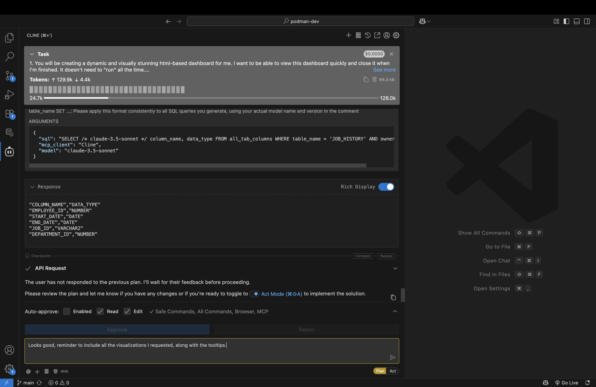
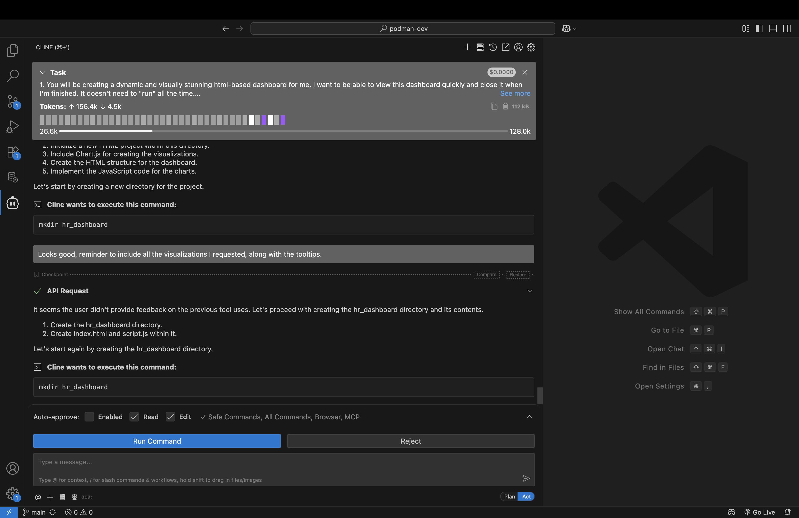
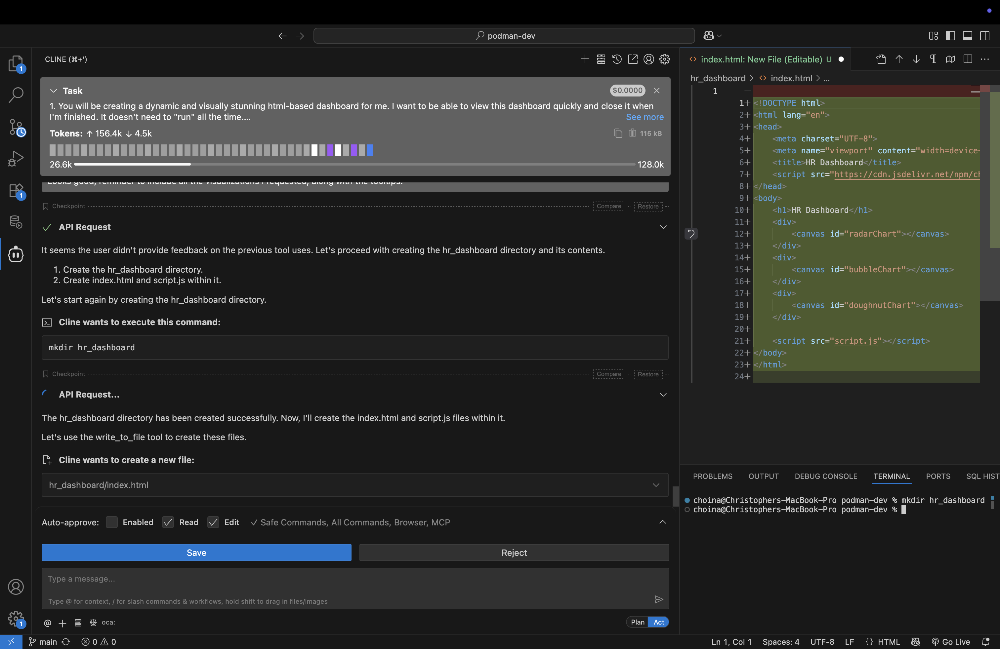
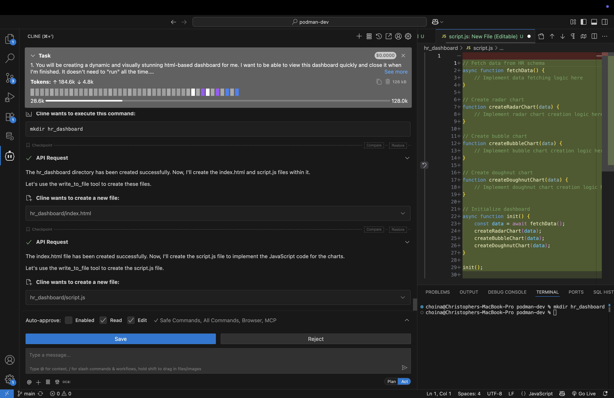
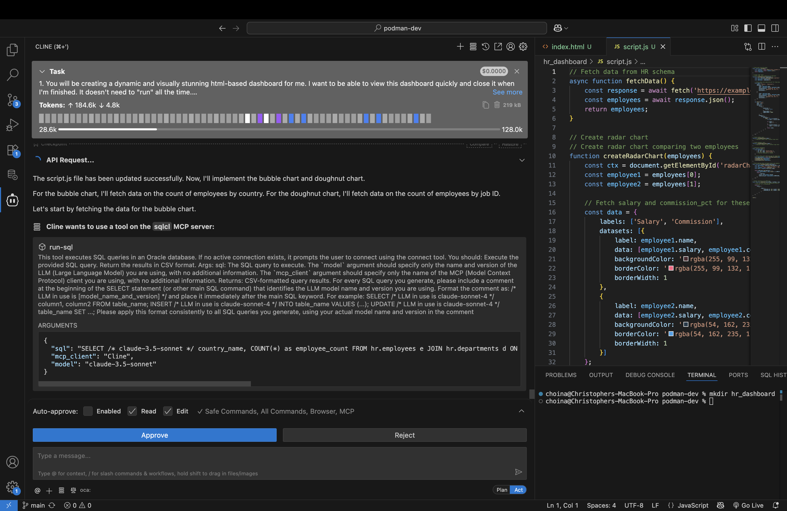
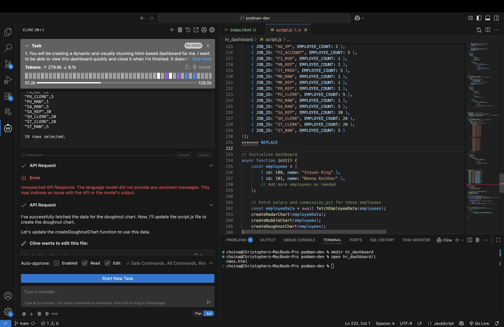
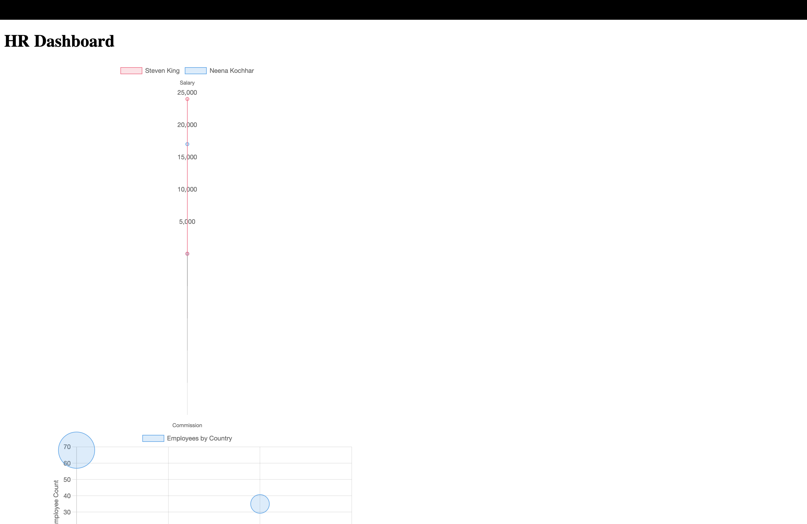

# Build an HTML Dashboard

## Introduction

In this lab, you'll discover how easy it is to instruct an LLM to create a basic HTML dashboard with the help of the SQLcl MCP server. In this Lab you will see how a single prompt rather than a pre-made prompt can result in an equally impressive result.

Estimated Time: 10 minutes

### Objectives

<mark>Pending</mark>

In this lab, you will:
* Objective 1
* Objective 2
* Objective 3

### Prerequisites

<mark>Pending</mark>

*List the prerequisites for this lab using the format below. Fill in whatever knowledge, accounts, etc. is needed to complete the lab. **Do NOT list** each previous lab as a prerequisite.*

This lab assumes you have:
* An Oracle account
* All previous labs successfully completed

*This is the "fold" - below items are collapsed by default*

## Task 1: Review the sample prompt

1. A sample prompt has been provided for you. Download [here](link_LiveLabs_Object_storage). This prompt can be used as-is with your agent while in "Plan" mode. Alternatively you may use it as a reference, while creating your own app. 

> &#9872; **NOTE:** This Lab is designed to be open-ended, accordingly, your individual results will vary. Feel free to "go off-script" &#9786; !

2. Save the prompt locally to a file named something like: `create_data_and_views_prompt.md`. 

3. You can use this prompt as-is, or use it as a reference; you decide. Make sure to start in **Plan** mode, in order to have better control and oversight over the entire process. Let the Agent summarize its intent. 

   

3. In other labs, you mmight approve actions in stages. But if you decide to share with the Agent the *entire* prompt, the agent will review the tasks all at once, and execute its plan with minimal intervention. You can of course add suggestions or changes to the proposed plan. And when you are satisfied, allow the Agent to continue.

    <!--  -->

4. There are other schemas that have granted access to `PUBLIC` (i.e., all other users); so, you do not need to be connected as the `HR` user. You have access to other schemas too: **CO** and **SH**. You might improvise and create a dashboard using these schemas instead.

5. Whatever you decide, observe what SQLcl MCP **Tools** are used, and the SQL or PL/SQL that is executed. In some cases, the agent may need additonal direction. And the Agent may request switching the mode to **Act**. 

    <!--  -->

    

6. Your scenario may differ slightly, depending on the LLM used, but you should continue to see the Agent's intent and summary of intended actions.

    <!--  -->

## Task 2: Creating the dashboard files

1. Over the course of this scenario, the agent will create a new project folder, and begin scaffolding `HTML` and `JavaScript` components. Pay close attention, and guide the agent should it deviate from this plan. 

    <!--  -->

    <!--  -->

    <!--  -->

2. The agent may request your approval to use the **connect** and **run-sql** tools of the SQLcl MCP server. You should approve, and watch as the dashboard is populated with real data from your target schema. 

    <!--  -->

3. Even now, LLMs find merge conflict markers difficult to troubleshoot. So, if manual intervention is required, assist the agent with removing any of these markers (e.g. `>>>>>>> REPLACE`). 

   

4. If you are able, review your project files before proceeding. Does everything look correct? 

## Task 3: Review the HTML dashboard

1. By now, you probably have something that will resemble the example shown below. Allow the agent to open the newly created dashboard, and compare your output to the example. 
 
    <!--  -->

2. You may have chosen different charts or visualizations. You may have chosen a different schema too. But if you've monitored the agent, and ensured that its using the correct SQLcl MCP server tools, your end result probably looks very close to what you see here: 

   <!--  -->

   <!--  -->

   

## Learn More

<mark>Pending</mark>

*(optional - include links to docs, white papers, blogs, etc)*

* [URL text 1](http://docs.oracle.com)
* [URL text 2](http://docs.oracle.com)

## Acknowledgements

<mark>Pending</mark>

* **Author** - <Name, Title, Group>
* **Contributors** -  <Name, Group> -- optional
* **Last Updated By/Date** - <Name, Group, Month Year>
