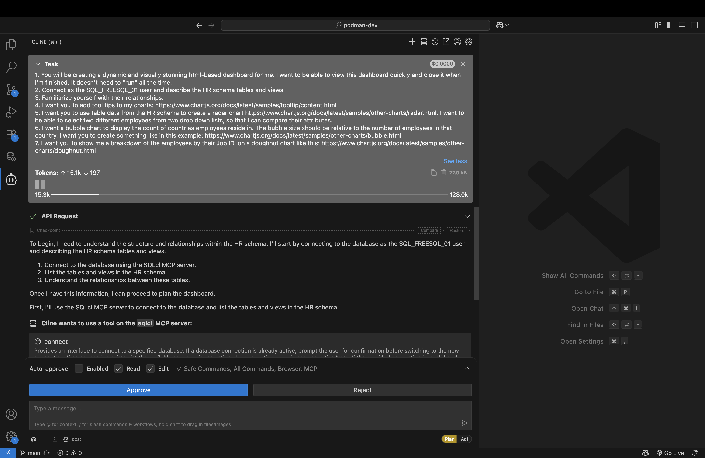
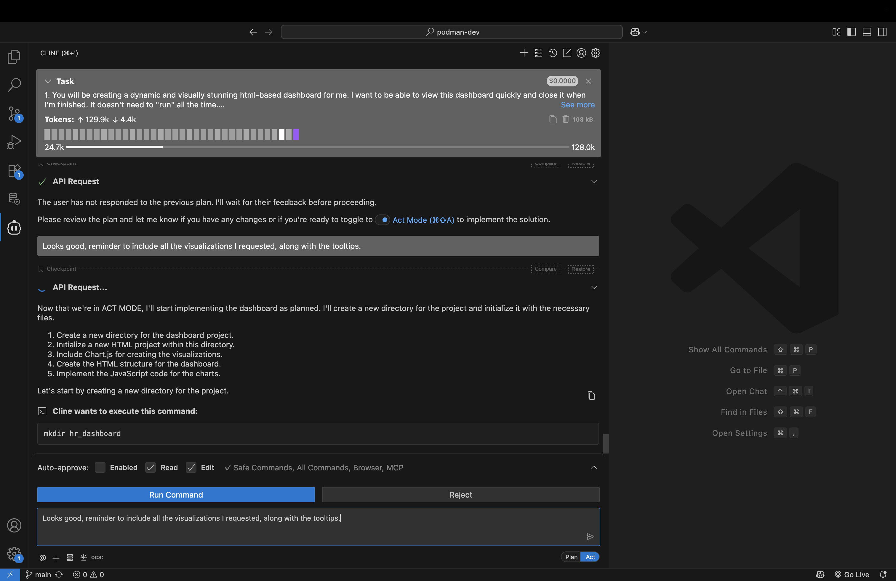
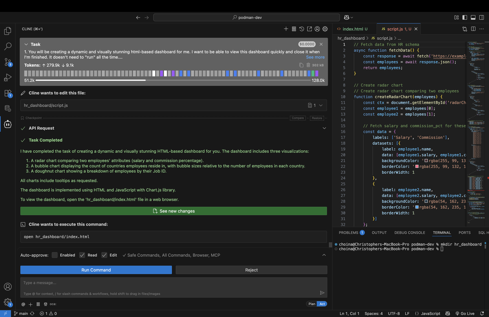

# Build an HTML Dashboard

## Introduction

In this lab, you'll discover how easy it is to instruct an LLM to create a basic HTML dashboard with the help of the SQLcl MCP server.

Estimated Time: 10 minutes

### Objectives

In this lab, you will:
* Review the included prompt
* Use the provided prompt:
  * to guide you through the creation process, *or*
  * as a reference guide while you improvise your own HTML dashboard

### Prerequisites

This lab assumes you have:
* All previous labs successfully completed
* VS Code installed
* Installed the Cline for VS Code Extension
* Configured an Oracle Database connection using the Oracle SQL Developer for VS Code extension

<p></p>

> &#9872; **NOTE:** In this lab you must allow your AI Agent to create a new project folder, scaffold an HTML page, and if required, install dependencies (e.g., npm, Node, Express, etc.).

<p></p>

## Task 1: Review the sample prompt

1. A sample prompt has been provided for you. It can be used as-is in **Plan** mode with your Agent. Or, can use the prompt as a reference while you create your own dashboard. 

   <details>
      <summary style="color: #0000FF";><kbd style="font-size: 10px;">(click) </kbd><strong>Sample prompt</strong></summary>
      <p></p>
      <button>
      <a href="./files/create_an_html_dashboard_prompt.md" target="_blank">Open in new tab</a>
      </button> 
      <button>
      <a href="./files/create_an_html_dashboard_prompt.md" target="_self" download="create_an_html_dashboard_prompt.md">Download .md file</a>
      </button>
      <p></p>
       
      ```txt
      <copy>
      Title: Build a dashboard

      Overview

      1. You will be creating a dynamic and visually stunning html-based dashboard for me. I want to be able to view this dashboard quickly and close it when I'm finished. It doesn't need to "run" all the time.

      Task 1: Connect, familiarize

      1. Connect as the SQL_FREESQL_01 user and describe the HR schema tables and views

      2. Familiarize yourself with their relationships.

      Task 2: Build the dashboard, my requests

      1. I want you to add tool tips to my charts: https://www.chartjs.org/docs/latest/samples/tooltip/content.html

      2. I want you to use table data from the HR schema to create a radar chart https://www.chartjs.org/docs/latest/samples/other-charts/radar.html. I want to be able to select two different employees from two drop down lists, so that I can compare their attributes.

      3. I want a bubble chart to display the count of countries employees reside in. The bubble size should be relative to the number of employees in that country. I want you to create something like in this example: https://www.chartjs.org/docs/latest/samples/other-charts/bubble.html

      4. I want you to show me a breakdown of the employees by their Job ID, on a doughnut chart like this: https://www.chartjs.org/docs/latest/samples/other-charts/doughnut.html
      </copy>
      ```
       
    </details>
    <p></p>

> &#9872; **NOTE:** This Lab is designed to be open-ended, accordingly, your individual results will vary. Feel free to "go off-script" &#9786; !

2. Whether you use the prompt as-is or use it as a reference; you decide. Make sure to begin your workflow in **Plan** mode in order to have better control and oversight over the entire process. Let the Agent summarize its intent. 

   

3. In other labs, you might approve actions in stages. But if you decide to share with the Agent the *entire* prompt, the Agent will review the tasks all at once and execute its plan with minimal intervention. You can of course add suggestions or changes to the proposed plan. And when you are satisfied, allow the Agent to continue.

4. There are other schemas that have granted access to `PUBLIC` (i.e., all other users); so, you do not need to be connected as the `HR` user (which is what the provided prompt references). You also have access to other schemas: `CO` and `SH`~. You might improvise and create a dashboard using these schemas instead.

5. Whatever you decide, observe what SQLcl MCP **tools** are used, as well as the SQL or PL/SQL that is executed. In some cases, the Agent may need additonal direction. And the Agent may request switching the mode to **Act**. 

    <!--  -->

    

6. Your scenario may differ slightly, depending on the LLM used, but you should continue to see the Agent's intent and summary of intended actions.

    <!--  -->

## Task 2: Creating the dashboard files

1. Over the course of this scenario, the Agent will create a new project folder, and begin scaffolding `HTML` and `JavaScript` components. Pay close attention, and guide the Agent should it deviate from this plan. 

    <!--  -->

    <!--  -->

    <!--  -->

2. The Agent may request your approval to use the **connect** and **run-sql** tools of the SQLcl MCP server. You should approve, and watch as the dashboard is populated with real data from your target schema. 

    <!--  -->

3. Even now, LLMs find merge conflict markers difficult to troubleshoot. So, if manual intervention is required, assist the Agent with removing any of these markers (e.g. `>>>>>>> REPLACE`). 

   

4. If you are able, review your project files before proceeding. Does everything look correct? 

## Task 3: Review the HTML dashboard

1. By now, you probably have something that will resemble the example shown below. Allow the Agent to open the newly created dashboard, and compare your output to the example. 
 
    <!--  -->

2. You may have chosen different charts or visualizations. You may have chosen a different schema too. But if you've monitored the Agent, and ensured that its using the correct SQLcl MCP server tools, your end result probably looks very close to what you see here: 

   <!--  -->

   <!--  -->

   


## Learn More

* [MCP Server Introduction](https://blogs.oracle.com/database/post/introducing-mcp-server-for-oracle-database) 
* [Oracle official MCP Server repository](https://github.com/oracle/mcp/tree/main)
* [SQLcl MCP Server Docs](https://docs.oracle.com/en/database/oracle/sql-developer-command-line/25.2/sqcug/using-oracle-sqlcl-mcp-server.html)

## Acknowledgements

* **Author**<ul><li>Chris Hoina, Senior Product Manager, Database Tools</li></ul>
* **Contributors**<ul><li>Jeff Smith, Distinguished Product Manager, Database Tools</li></ul>
* **Last Updated By/Date**<ul><li>Chris Hoina, September 2025</li></ul>
