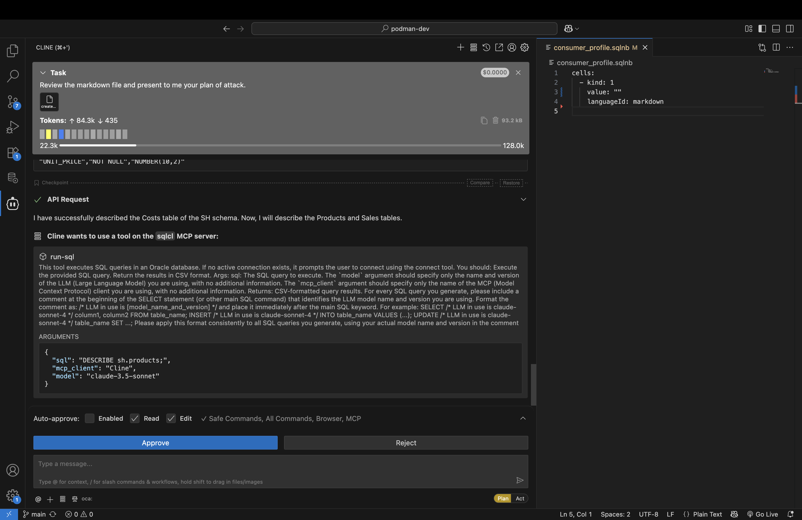
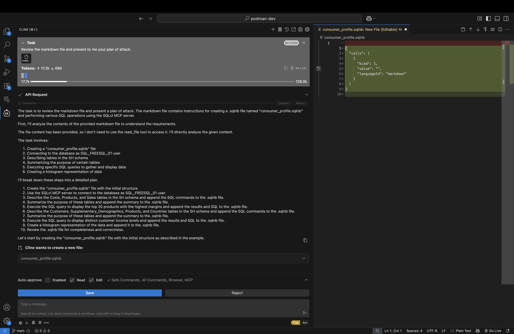
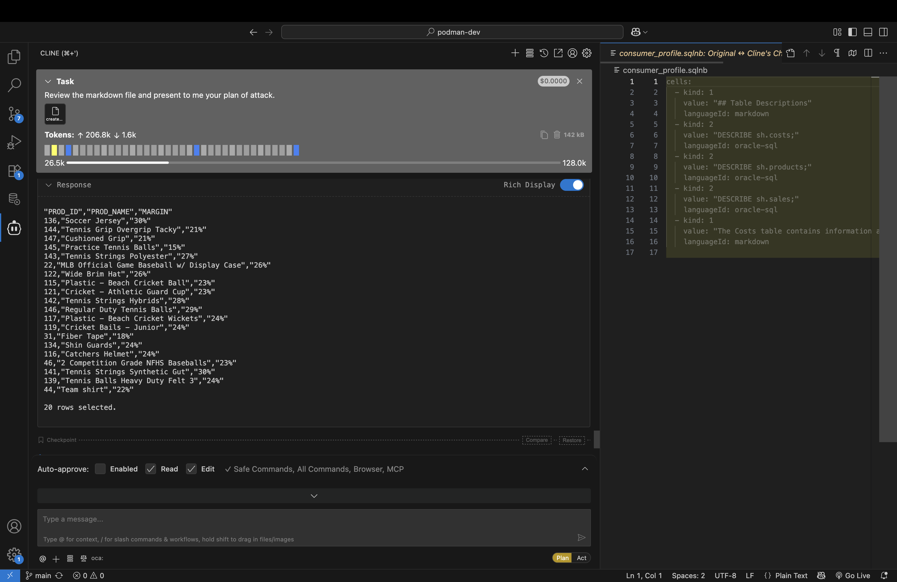
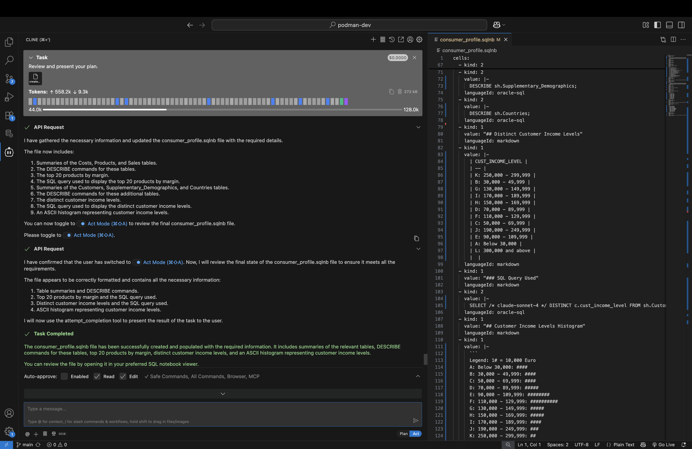
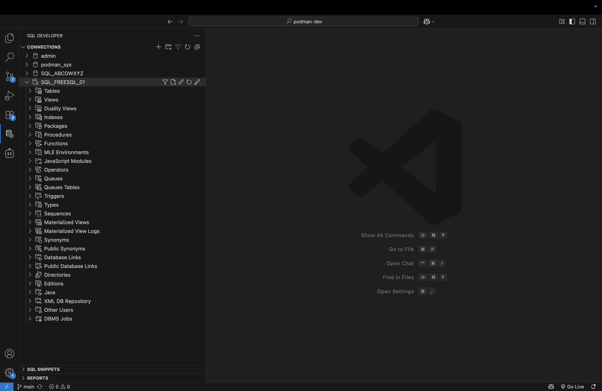
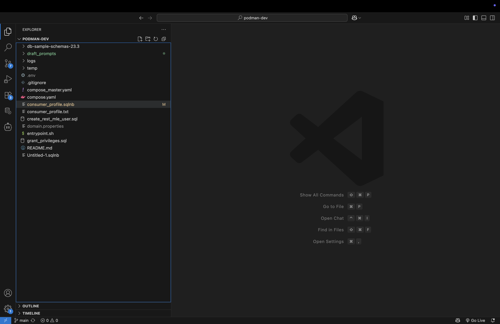
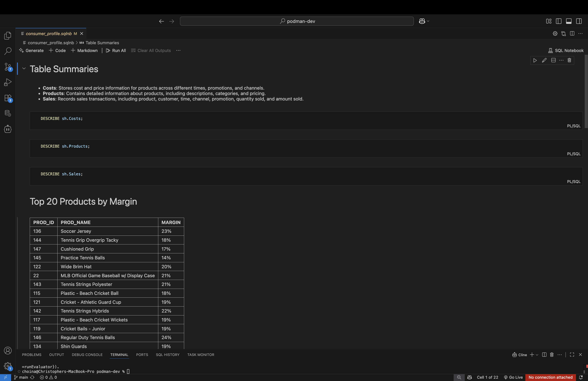

# Build a SQL Notebook

## Introduction

The following scenario explores one of the most compelling features of MCP servers: Training an LLM on a unique context or use case. In this scenario, you'll see how we use prompts to save as a SQL Notebook (.sqlnb): the actions of your Agent, the SQLcl MCP Server tools it used, the SQL and any PL/SQL that was executed, along with the results (represented in Markdown). 

Estimated Time: 5 minutes

### Objectives

In this lab, you will:
* Review the provided prompt
* Execute the prompt to create a sample SQL Notebook (`.sqlnb`)
* Alter the provided script to create a unique SQL Notebook
<!-- * [relative lab url test](?lab=need-help) -->

### Prerequisites

<mark>Pending</mark>

This lab assumes you have:

* An Oracle account
* All previous labs successfully completed

## Task 1: Review the provided prompt

1. You again have been provided with a sample prompt. In other scenarios the prompts were relatively straightforward. And depending on the LLM used, the results in the other Lab scenarios probably matched the expected output. 

   Your results are largely due to the fact that your LLMs have quite a bit of training on the various topics we've covered. However, there may not be a lot of publically-accessible training data related to new or novel technologies and features: in this case asking our Agent to use the SQLcl MCP server to help design a SQL Notebook file (`.sqlnb`)!

2. Let's begin by reviewing prompt.

   Notice the helpful hints and guidance that has been included in this prompt. We do this to provide some additional context and rules for your agent. With this additional context, the agent should have no problem recording the SQL and PL/SQL that was executed (in the prompt), and the results in a SQL Notebook (`.sqlnb`) friendly format. 

> NOTE: The `## Your task list` section can be looked at as the "action" steps in the prompt. All the tasks there are what populate your SQL Notebook file (as you'll see later on).

    ~~~
    # Create a SQL Notebook

    ## Create an empty .sqlnb file

    Create a file named "consumer_profile.sqlnb" and set it aside for appending. You will use this file periodically to summarize your findings, obeservations, and SQL and any PL/SQL used to gather results. The tasks list (known as "Your task list") in the following steps will provide you with the content for this .sqlnb file.

    ### Guidelines, structure, syntax of .sqlnb files

    #### Example .sqlnb file

    Here is an example .sqlnb file. Note the syntax, structure, and its elements/properties. It is similar to a .YAML file: 

    ```markdown
    cells:
      - kind: 1
        value: ""
        languageId: markdown
      - kind: 1
        value: "# Heading level 1"
        languageId: markdown
      - kind: 1
        value: "## Heading level 2"
        languageId: markdown
      - kind: 1
        value: "### Heading level 3"
        languageId: markdown
      - kind: 1
        value: |-
          1. First item
          2. Second item
          3. Third item
          4. Fourth item
        languageId: markdown
      - kind: 1
        value: An inline code example, where `nano` is the inline code.
        languageId: markdown
      - kind: 2
        value: |-
          create or replace function mytest return number is
          begin
            return 1;
          end;
        languageId: oracle-sql
      - kind: 2
        value: describe sh.costs;
        languageId: oracle-sql
      - kind: 2
        value: |-
          CREATE OR REPLACE PROCEDURE get_employee
                      (p_empid in employees.employee_id%TYPE,
                      p_sal OUT employees.salary%TYPE,
                      p_job OUT employees.job_id%TYPE) IS
                  BEGIN
                    SELECT salary,job_id
                    INTO p_sal, p_job
                    FROM employees
                    WHERE employee_id = p_empid;
                  END;
        languageId: oracle-sql
      - kind: 1
        value: |-
          | Column 1 | Column 2 |
          | -- | -- | 
          | Row Value 1 | Row Value 2 | 
        languageId: markdown
      - kind: 1
        value: ""
        languageId: markdown
    ```

    ### Detailed guidelines for structing a .sqlnb file: 

    - A .sqlnb file begins with "cells:"
    - Markdown
        - Markdown blocks are identified as "kind: 1"
        - A markdown block consists of a kind, value, and languageId key.
            - The keys are indented two columns, and begin with a dash (hyphen), followed by the key name and colon, a whitespace, followed by the value of that key, followed by the languageId.
        - The markdown value's contents are encapsulated in double quotes.
            - The value will be either:
                - A markdown subheading (double hash ## or triple hash ###, where applicable), or
                - The summary that was requested in the prompt (as seen in the #Your task list section)
        - The syntax for the markdown languageId is "languageId: markdown"
        - Notice how lists and table are structured like this:

          *List example*
      
            - kind: 1
              value: |-
                1. First item
                2. Second item
                3. Third item
                4. Fourth item
              languageId: markdown

          *Table example*

            - kind: 1
              value: |-
                | Column 1 | Column 2 |
                | -- | -- | 
                | Row Value 1 | Row Value 2 | 
              languageId: markdown
              
    - SQL and PL/SQL
        - Oracle SQL and PL/SQL blocks are identified by "kind: 2"
        - A SQL or PL/SQL markdown block consists of a kind, value, and languageId key.
            - The keys are indented two columns, and begin with a dash (hyphen), followed by the key name and colon, a whitespace, followed by the value of that key, followed by the languageId.
        - The syntax for the SQL and PL/SQL languageId is "languageId: oracle-sql"
        - Notice how the PL/SQL blocks are structured, always beginning with the "|-" characters:

          *PL/SQL Example*

            - kind: 2
              value: |-
                CREATE OR REPLACE PROCEDURE get_employee
                            (p_empid in employees.employee_id%TYPE,
                            p_sal OUT employees.salary%TYPE,
                            p_job OUT employees.job_id%TYPE) IS
                        BEGIN
                          SELECT salary,job_id
                          INTO p_sal, p_job
                          FROM employees
                          WHERE employee_id = p_empid;
                        END;
              languageId: oracle-sql

        - Only one SQL statment per code block is permitted
        - Only one PL/SQL procedure (or function, or trigger, etc.) per code block is permitted.

    ## Your task list

    1. Connect as the SQL_FREESQL_01 user

    2. Describe the Costs, Products, and Sales tables of the SH schema.
        - Create a new .sqlnb compliant markdown heading, followed by three .sqlnb-compliant sql code blocks and append to the consumer_profile.sqlnb" file the SQL and any PL/SQL used to Describe these tables.
          - Do not include the actual results, just the SQL or PL/SQL used.

    > NOTE: you cannot perform a "bulk" DESCRIBE on tables. You must use DESCRIBE on one table or object at a time.

    3. Display in a markdown list format, a 1-3 sentence summary for each table, explaining the purpose or what the table is used for. Use a markdown list format for this new sqlb cell block.
        - Create a new .sqlnb compliant markdown heading or sub-heading to title this section and append to the "consumer_profile.sqlnb" file these summaries. 
        - Make the table names bold.

    4. Using the Costs, Products, and Sales tables, display the top 20 products that have the highest margins (i.e., lowest Cost-of-Goods). Display the results by Product ID, in order of least sales revenue to highest sales revenue. The margins should be represented as whole numbers, followed by the % character. Use normal spelling for the table column names.
        - Create a new .sqlnb compliant markdown heading or sub-heading for this task and append to the consumer_profile.sqlnb" file these results in a separate .sqlnb compliant markdown block.
            - The results should be displayed in a markdown table where Product_ID and Product_Name are in separate columns.
        - Create a new .sqlnb compliant markdown sub-heading to title the code block, followed by the SQL and any PL/SQL used to produce the results in a .sqlnb-compliant code block.

    5. Using the results from the previous operation, display in a markdown table, the Product IDs in one column and their associated Product Names in another column.
        - Create a new .sqlnb compliant markdown heading or sub-heading and append these results to the consumer_profile.sqlnb" file as a .sqlnb compliant markdown block in a markdown table.
        - Create a new .sqlnb compliant markdown heading or sub-heading and include in the consumer_profile.sqlnb" file the SQL and any PL/SQL used to produce these results as a .sqlnb compliant oracle-sql code block.

    5. Describe the Customers, Supplementary_Demographics, Products, and Countries tables of the SH schema.

        - Create a new .sqlnb compliant markdown heading or sub-heading to title this code block
        - Create and append to the "consumer_profile.sqlnb" file the SQL and any PL/SQL used to Describe these tables as three separate .sqlnb compliant oracle-sql code blocks; one for each table.
        - Do not include the actual results, simply the SQL or PL/SQL used.
      
    > NOTE: you cannot perform a "bulk" DESCRIBE on tables. You must use DESCRIBE on one table or object at a time.

    7. Display in a markdown list format, a 1-3 sentence summary for each table, explaining the purpose or what the table is used for. Use a markdown list format for this new sqlb cell block.
        - Create a new .sqlnb compliant markdown heading or sub-heading to title this section and append to the "consumer_profile.sqlnb" file these summaries. 
        - Make the table names bold.

    8. Using the Country ID and the Country ISO Code of the Country and Customers tables, display the distinct customer income levels.
        - Create a new .sqlnb compliant markdown heading or sub-heading to title this section
        - Create a new .sqlnb compliant markdown code block to display these results in a markdown table.
        - Create and append to the consumer_profile.sqlnb" the SQL and any PL/SQL used to display these distinct income levels as a .sqlnb compliant oracle-sql code block.

    9. Display the values (assume they are in Euros) in an ASCII-based histogram. Follow these guidelines:

        - Use the `#` character to represent 10,000 Euro.
        -  Use as many `#` characters are needed to represent the magnitude for each of the bins in the histogram (do not include the actual Euro total, just the equivalent number of `#` charactres, where one `#` = 10000 Euro):
        - Include a legend, which must include: the total number of Euros equal to one `#`.
        - The ASCII-based histogram should be contained as a fenced code block, an example can be seen here: https://www.markdownguide.org/extended-syntax/#fenced-code-blocks
        - Create a new .sqlnb compliant markdown heading or sub-heading to title this section.
        - Create and append the Legend, and the ASCII-based histogram into a .sqlnb compliant markdown block.

    10. If not completed already, review each cell you have created in the .sqlnb file, ensure that all SQL and any PL/SQL code has been included. Verify that the markdown headings and results are present and correctly formatted (for instance if the markdown calls for a list, table, or fenced code block). 

    11. After you have verified that everything is correct, then confirm with me and stop.
    ~~~
   
> NOTE: As SQL Notebooks become more popular, and as more context becomes publically availale, user-provided context such as what is in the included prompt may be unecessary!

## Task 2: Execute the prompt

1. You may use the prompt as-is, or a subset of the prompt. For instance, you might try creating your own unique SQL Notebook. To do so, remove the `## Your task list` in the provided prompt. Execute the prompt in **Plan** mode, and as you perform your own queries, ask you agent to add any SQL, PL/SQL, and results to your SQL Notebook file!

2. In this example, we ran the prompt in **Plan** mode, adding minimal additional guidance for the agent. The agent did most of the communicating with the SQLcl MCP server, and between the two we arrived at usable `.sqlnb` file. 

   

   

   

   

## Task 3: Reviewing your SQL Notebook file

1. If you've made it this far, then head back to over to your SQL Developer for VS Code connections, and click on your connection to restablish a database connection.

   

2. Locate your saved SQL Notebook, click it. SQL Developer will recognize it, and open the notebook.

   

3. Congrats, you've just discovered a new use case: Using an AI agent to create a SQL notebook using the available **Tools** in the SQLcl MCP Server.

   

   

   

## Task 4: Wrapping up

1. You should now have a better understanding of not only *what* an MCP Server is, but what *our* SQLcl MCP Server can do for you. 

2. Now take the sample prompts, use them as a reference guide, and start testing the limits. Really push the boundaries. 

## Learn More

<mark>Pending</mark>

* [URL text 1](http://docs.oracle.com)
* [URL text 2](http://docs.oracle.com)

## Acknowledgements

<mark>Pending</mark>

* **Author** - <Name, Title, Group>
* **Contributors** -  <Name, Group> (optional)
* **Last Updated By/Date** - <Name, Month Year>
