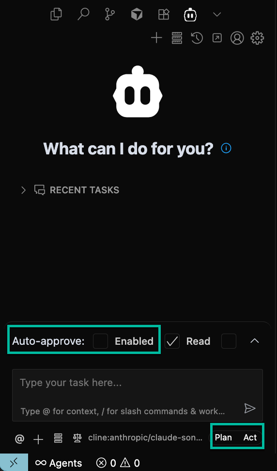
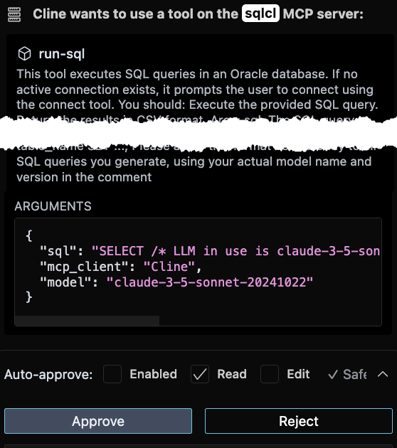
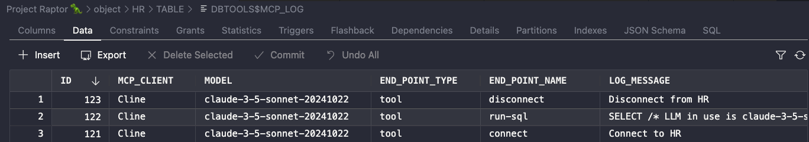

# Title of the Lab

## Introduction

This lab will get you comfortable interacting with your Agent (Cline) and your Oracle Database, using our MCP Server.


Estimated Time: 10 minutes

### About Product/Technology (Optional)
Enter background information here about the technology/feature or product used in this lab - no need to repeat what you covered in the introduction.

### Objectives

*List objectives for this lab*

In this lab, you will:
* See how MCP Server tools are requested, and how to review and approve those requests
* Observe how the responses lead the agent to advance the task at hand
* Understand how the LLM generates SQL and presents it to the MCP Server to be executed
* Witnesss the LLM process the results and summarize the findings
* See the MCP Server tasks log in your schema 

### Prerequisites (Optional)

This lab assumes you have:
* a Oracle Database connection defined in either SQLcl or VS Code via the SQL Developer extension
* VS Code installed with the Cline Extension

## Task 0: Testing your configuration and getting started
The goal is to confirm that our MCP Server is working, and that you can get a feel for how the user to Agent interaction works.

You will ask (via a prompt) the Agent (Cline)  to complete a task. The agent will see that it needs to use one or more tools from our MCP Server to accomplish said task.

It will prompt you for permission to use the tool. You will review the request, and approve (or deny!) it as appropriate. 

The agent via the configured LLM, will generate SQL as necessary, and prompt you to run it via the run-sql tool, where you will again review it for accuracy, saftey, and performance, and then approve it. 

The results will be analyzed by the LLM and summarized.

When you are done, you will inspect the MCP logging table in your schema to see what has happened in the database, via our MCP Server.

In Cline, ensure you are in 'Agentic' mode, you should see that both 'Plan' and 'Act' are enabled. You will also confirm that 'Auto-Approve' is disabled.



In the Task input area of Cline, use the following prompt:

  connect to my database and run a test query to make sure everything is working as expected

Cline will create a plan and respond by asking permission to use our MCP Server via the *list-connections* tool. You should see something like this:


Note the tool name, followed by the arguments. In this case, Cline wants to see what database connections are available.

Hitting the 'Approve' button will allow the Agent to continue its plan.

The Agent will see our Oracle Database connection, and ask to connect to it, via the *connect* tool. 

You will again be prompted to approve a request, that looks like this -

    {
      "connection_name": "your connection name",
           "mcp_client": "Cline",
                "model": "claude-3-5-sonnet-20241022"
    }

Approving the request, will advance the Agent's plan to the next step.

If the connection is succssfull, you will see the raw feedback from the *connect* tool, quickly followed by the LLM's summary, which should look like this:

    Excellent! The connection to your database was successful. I can see we're connected to Oracle Database 23.0.0.0.0 in READ WRITE mode with AL32UTF8 character set.
    
    Now let me run a test query to verify everything is working properly. I'll start with a simple query to check the current database time:

Note that the LLM may generate one of several different types of queries to satisfy our request to 'test' the connection and system. It is very important that you review the following SQL, or update your prompt to include the exact SQL you want the Agent to use.




If we scroll through the "sql" attribute, we can review the entire statement. 

For example, the LLM has generate this SQL:

    SELECT /* LLM in use is claude-3-5-sonnet-20241022 */
           SYSDATE as current_time,
           USER as connected_user
      FROM DUAL

After confirming the generate SQL is appropriate, we can can again, APPROVE the task request, and let the Agent continue with its plan.

The *run-sql* tool returns query results as CSV, and in the Cline panel, you can see the 'Plain Text' response, followed by the Agent's interpretation of those results. 

The username should be your FreeSQL database username, or whatever you used to define your connection.

As a best practice, you should prompt Cline to close your database connection when you are done with it. It will prompt you for permission to use the *disconnect* tool, which you can approve.

The agent will finish the task with a Summary of what it has done to accomplish your original task. 

*Note: the agent may wish to continue running more queries, in order to get you more information about your database. It is up to YOU to decide to allow it to continue, or to DENY it's follow-up requests, or let it know with an additional prompt that it's ok to stop.*

Before we finish this section of our lab, let's inpsect the information that was recorded in our database.

In the SQL Developer panel, connect to your database, and open the Tables tab. Find the *DBTOOLS$MCP_LOG* table, and open it. Browse the Data tab to find the interactions from our previous Cline project.



That's it, you are now ready to start exploring the power of your Agent, it's LLMs, and your Oracle Database via our MCP Server!


## Task 1: MCP introspects schema

(optional) Step 1 opening paragraph.

1. Allow the MCP server to gather insights from your schema 

2. 

		<!-- 

  To create a link to local file you want the reader to download, use the following format.

	> **Note:** _The filename must be in lowercase letters and CANNOT include any spaces._

  Download the [starter file](files/starter-file.sql) SQL code.

	When the file type is recognized by the browser, it will attempt to render it. So you can use the following format to force the download dialog box.

	> **Note:** _The filename must be in lowercase letters and CANNOT include any spaces._

	Download the [sample JSON code](files/sample.json?download=1).

  *IMPORTANT: do not include zip files, CSV, PDF, PSD, JAR, WAR, EAR, bin or exe files - you must have those objects stored somewhere else. We highly recommend using Oracle Cloud Object Store and creating a PAR URL instead. See [Using Pre-Authenticated Requests](https://docs.cloud.oracle.com/en-us/iaas/Content/Object/Tasks/usingpreauthenticatedrequests.htm)*

2. Sub step 2

    

4. Example with inline navigation icon  click **Navigation**.

5. Example with bold **text**.

  If you add another paragraph, add 3 spaces before the line.

## Task 2: <what is the action in this step>

1. Sub step 1 - tables sample

  Use tables sparingly:

  | Column 1 | Column 2 | Column 3 |
  | --- | --- | --- |
  | 1 | Some text or a link | More text  |
  | 2 |Some text or a link | More text |
  | 3 | Some text or a link | More text |

2. You can also include bulleted lists - make sure to indent 4 spaces:

    - List item 1
    - List item 2

3. Code examples

    ```
    Adding code examples
  	Indentation is important for the code example to appear inside the step
    Multiple lines of code
  	<copy>Enclose the text you want to copy in <copy></copy>.</copy>
    ```

4. Code examples that include variables

	```
  <copy>ssh -i <ssh-key-file></copy>
  ```

## Learn More

*(optional - include links to docs, white papers, blogs, etc)*

* [URL text 1](http://docs.oracle.com)
* [URL text 2](http://docs.oracle.com)

## Acknowledgements
* **Author** - <Name, Title, Group>
* **Contributors** -  <Name, Group> -- optional
* **Last Updated By/Date** - <Name, Group, Month Year> -->
