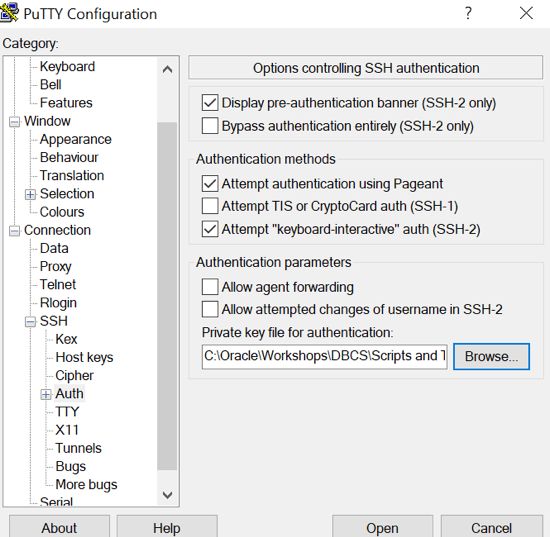
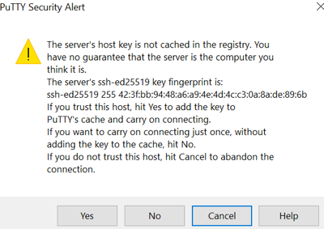
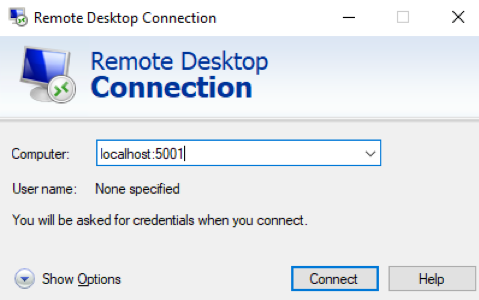
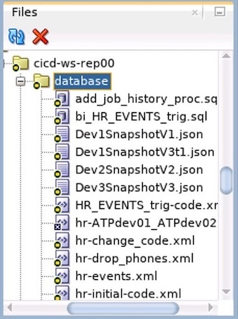

# Capture Oracle Database Changes Introduction

## Introduction

Before we can start capturing any changes, we need an Oracle Database and a development environment to work on. The fastest way to get an Oracle Database up and running is to provision an Oracle Autonomous Database on Oracle Cloud Infrastructure. In the same way, the easiest way to put your hands on a sandbox with all the development tools necessary for this project, is to provision a Compute Instance using Oracle Cloud Developer Image.

Estimated Lab Time: 60 minutes

### Objectives
In this lab, you will:
* Create network and compute resources on Oracle Cloud
* Prepare cloud infrastructure for development
* Provision Oracle Autonomous Database
* Update Git client and create a new GutHub repository
* Install Liquibase on compute node

### Prerequisites
* An Oracle Free Tier, Always Free, Paid or LiveLabs Cloud Account
* SSH Keys for Putty or OpenSSH (`id_rsa.ppk` or `id_rsa`, and `id_rsa.pub`)


## Task 1: Create Virtual Cloud Network (VCN)

1. Login to Oracle cloud console using the URL: [https://console.eu-frankfurt-1.oraclecloud.com](https://console.eu-frankfurt-1.oraclecloud.com)

    - Tenant: oci-tenant
    - Username: oci-username
    - Password: oci-password

2. Click on main menu ≡, then Networking > **Virtual Cloud Networks**. Select your Region and Compartment assigned by the instructor. 

3. Click **Start VCN Wizard**.

4. Select **VCN with Internet Connectivity**. Start VCN Wizard.

    - VCN Name: [Your Initials]-VCN (e.g. VLT-VCN)
    - Compartment: [Your Compartment]

5. Click Next and Create.

6. Click **[Your Initials]-VCN** for details.


## Task 2: Provision Compute node for development

1. Click on main menu ≡, then Compute > **Instances**. Click **Create Instance**.

    - Name: [Your Initials]-ClientVM (e.g. VLT-ClientVM)
    - Image or operating system: Change Image > Image source: Oracle Images > Oracle Cloud Developer Image (this image may be on the second page, you need to move the blue lifebuoy/donut icon up to click next)
    - Shape: Change Shape > Intel: VM.Standard2.1
    - Virtual cloud network: existing VCN (default)
    - Subnet: Public Subnet (default)
    - Assign a public IP address (default)
    - Generate a key pair for me, and download both private and public keys. Or click Add SSH keys: Choose SSH key files > `id_rsa.pub`

2. Click **Create**. Wait for Compute Instance to finish provisioning, and have status Available. On the Instance Details page, copy Public IP Address in your notes.

3. Connect to the Compute node using SSH. In OpenSSH, local port forwarding is configured using the -L option. Use this option to forward any connection to port 3389 on the local machine to port 3389 on your Compute node. (Mac/Linux only)

    ````
    ssh -C -i id_rsa -L 3389:localhost:3389 opc@[ClientVM Public IP Address]
    ````

4. Connect to the Compute node using SSH Connection From a Windows Client. Connect to Compute Public IP Address port 22. (Windows only)

    

5. Use the `id_rsa.ppk` private key. (Windows only)

    

    

6. Create a SSH tunnel from source port 5001 to localhost:3389. (Windows only)

    


## Task 3: Configure development environment on Compute

For some of the labs we need graphical user interface, and this can be achieved using a Remote Desktop connection.

1. Use the substitute user command to start a session as **root** user.

    ````
    sudo su -
    ````

2. Create a new script that will install and configure all the components required for the Remote Desktop connection.

    ````
    vi xRDP_config.sh
    ````

3. Press **i** to insert text, and paste the following lines:

    ````
    #!/bin/bash

    yum -y groupinstall "Server with GUI"

    yum -y install xrdp tigervnc-server terminus-fonts terminus-fonts-console cabextract

    wget --no-check-certificate https://downloads.sourceforge.net/project/mscorefonts2/rpms/msttcore-fonts-installer-2.6-1.noarch.rpm
    yum -y localinstall msttcore-fonts-installer-2.6-1.noarch.rpm

    yum -y update sqldeveloper.noarch

    sed -i 's/max_bpp=24/max_bpp=128\nuse_compression=yes/g' /etc/xrdp/xrdp.ini

    systemctl enable xrdp

    firewall-cmd --permanent --add-port=3389/tcp
    firewall-cmd --permanent --add-port=5000/tcp
    firewall-cmd --reload

    chcon --type=bin_t /usr/sbin/xrdp
    chcon --type=bin_t /usr/sbin/xrdp-sesman

    systemctl start xrdp

    echo -e "DBlearnPTS#21_\nDBlearnPTS#21_" | passwd oracle

    sed -i -e 's/^/#/' /etc/profile.d/oracle-instantclient*

    printf "\nORACLE_HOME=/opt/oracle/product/19c/dbhome_1\nLD_LIBRARY_PATH=\$ORACLE_HOME/lib\nPATH=\$PATH:\$ORACLE_HOME/bin\nexport ORACLE_HOME LD_LIBRARY_PATH PATH\n" >> /etc/profile
    
    ````

4. Press **Esc**, type **:wq** and hit **Enter** to save the file and close. Make this script executable.

    ````
    chmod u+x xRDP_config.sh 
    ````

5. Run the script and check that all goes well.

    ````
    ./xRDP_config.sh
    ````

6. Close session as **root** user.

    ````
    exit
    ````

7. Use Microsoft Remote Desktop to open a connection to **localhost**. (Mac/Linux only)

8. If you are using Putty on Windows, connect to **localhost:5001**. (Windows only)

    

9. When asked about username and password, use **oracle** and **DBlearnPTS#21_**.

10. After setting your language and keyboard layout, open a Terminal window using **Right-Click** and **Open Terminal**. 

11. Check if your keyboard works. If you need to select another keyboard layout, click the **On-Off** button in the upper right corner, and **Settings** button. You will find the options under Region & Language.

12. From the Terminal window, launch SQL Developer.

    ````
    sqldeveloper 
    ````

13. If it will ask for the full pathname of a JDK installation. This should be available in folder **/usr/java**. Type **/usr/java/latest** when asked.

    ````
    Default JDK not found
    Type the full pathname of a JDK installation (or Ctrl-C to quit), the path will be stored in /home/oracle/.sqldeveloper/19.4.0/product.conf
    /usr/java/latest
    ````

    > **Note** : You may receive a warning message that Java JDK is older than the recommended version for this SQL Developer. In order to save time, we will skip Java update for now.

    > **Note** : Once JDK installation full pathname is set, SQL Developer can be started from **Applications** main menu, and **Programming**.


## Task 4: Provision Oracle Autonomous Database (ATP)

1. Click on main menu ≡, then Oracle Database > **Autonomous Transaction Processing**. **Create Autonomous Database**.

    - Select a compartment: [Your Compartment]
    - Display name: [Your Initials]-Dev01 (e.g. VLT-Dev01)
    - Database name: [Your Initials]Dev01 (e.g. VLTDev01)
    - Choose a workload type: Transaction Processing
    - Choose a deployment type: Shared Infrastructure
    - Choose database version: 19c
    - OCPU count: 1
    - Storage (TB): 1
    - Auto scaling: disabled

2. Under Create administrator credentials:

    - Password: DBlearnPTS#21_

3. Under Choose network access:

    - Access Type: Allow secure access from everywhere

4. Choose a license type: Bring Your Own License (BYOL).

5. Click **Create Autonomous Database**. Wait for Lifecycle State to become Available.


## Task 5: Connect to your Autonomous Database

From the compute node, we will connect to the Autonomous Database. Wallet files, along with the database user ID and password, provide access to data in your Autonomous Database. Store wallet files in a secure location. Share wallet files only with authorized users.

1. Open  your Oracle Cloud Login URL using the Firefox browser on the ClientVM and navigate to Oracle Database > Autonomous Database. Click on your ATP instance, **DB Connection**, and download Instance Wallet using **Download Wallet** button.

2. Provide a password (use the same as for RD connection - DBlearnPTS#21_), and Save File.

3. If you use the Firefox browser on the Remote Desktop connection, it will be downloaded in folder `/home/oracle/Downloads/`. Create a new folder to place wallet files.

    ````
    ls /home/oracle/Downloads/
    
    mkdir /home/oracle/Wallet_[Your Initials]Dev01

    unzip /home/oracle/Downloads/Wallet_[Your Initials]Dev01.zip -d /home/oracle/Wallet_[Your Initials]Dev01/
    ````

4. Edit **sqlnet.ora** file in **Wallet_[Your Initials]Dev01** folder, and set the value of `DIRECTORY` to `${TNS_ADMIN}`.

    ````
    WALLET_LOCATION = (SOURCE = (METHOD = file) (METHOD_DATA = (DIRECTORY="${TNS_ADMIN}")))
    SSL_SERVER_DN_MATCH=yes
    ````

5. Set the `TNS_ADMIN` environment variable to the directory where the unzipped credentials files.

    ````
    export TNS_ADMIN=/home/oracle/Wallet_[Your Initials]Dev01
    ````

6. Get service names for your instance from **tnsnames.ora** file.

    ````
    cat /home/oracle/Wallet_[Your Initials]Dev01/tnsnames.ora
    ````

7. Verify the connectivity using SQL*Plus, using the TP service. If the connection works, exit. Replace `[Your Initials]` with your initials.

    ````
    sqlplus admin/DBlearnPTS#21_@[Your Initials]dev01_tp

    exit
    ````


## Task 6: Install HR Sample Schema

For this simple CICD example, we will capture database changes from the HR sample schema.

1. Download Oracle Sample Schemas installation package from GitHub.

    ````
    wget https://github.com/oracle/db-sample-schemas/archive/v19c.zip
    ````

2. Unzip the archive.

    ````
    unzip v19c.zip
    ````

3. Open the unzipped folder.

    ````
    cd db-sample-schemas-19c
    ````

4. Run this Perl command to replace `__SUB__CWD__` tag in all scripts with your current working directory, so all embedded paths to match your working directory path.

    ````
    perl -p -i.bak -e 's#__SUB__CWD__#'$(pwd)'#g' *.sql */*.sql */*.dat
    ````

5. Go back to the parent folder (this should be `/home/oracle`).

    ````
    cd ..
    ````

6. Create a new folder for logs.

    ````
    mkdir logs
    ````

7. Connect to the **ATPdev01** ATP service as **admin**. Replace `[Your Initials]` with your initials.

    ````
    sqlplus admin/DBlearnPTS#21_@[Your Initials]dev01_tp
    ````

8. Run the HR schema installation script. For more information about [Oracle Database Sample Schemas](https://github.com/oracle/db-sample-schemas) installation process, please follow the link. Replace `[Your Initials]` with your initials.

    ````
    @db-sample-schemas-19c/human_resources/hr_main.sql DBlearnPTS#21_ DATA TEMP DBlearnPTS#21_ /home/oracle/logs/ [Your Initials]dev01_high
    ````


## Task 7: Connect to your ATP using SQL Developer

1. Create a new connection in SQL Developer to Dev01 ATP. You can find SQL Developer on the Compute Node under Applications > Programming main menu.

    - Name: hr@Dev01ATP
    - Username: hr
    - Password: DBlearnPTS#21_
    - Save Password: enabled
    - Connection Type: Cloud Wallet
    - Configuration File: click Browse and select Wallet_[Your Initials]Dev01.zip in Downloads folder.
    - Service: [Your Initials]dev01_tp

2. Click Test, make sure it returns 'Success', and Save.

3. Click Connect.

4. Verify HR schema objects. Copy and paste the following query in SQL Developer Worksheet, and click Run Statement .

    ````
    select object_name, object_type from user_objects order by 2,1;
    ````

5. Click **View** on SQL Developer main menu, and click **Files**. This dialog will be used to see your project files during development.

    

6. If files are modified outside SQL Developer, you need to click the `database` folder and **Refresh** icon  to show those changes.


## Task 8: Update Git Client

GitHub uses Git version control systems (VCS) to handle the collaboration workflow. This allows developers to create a local copy of the project, makes changes, and merge them back into the central repository.

1. Use the SSH connection as **opc** user to check the Git client version.

    ````
    git --version
    git version 1.8.3.1
    ````

2. This Git is old, we need to update to a newer version (e.g. 2.28.1).

    ````
    sudo yum -y install curl-devel expat-devel gettext-devel openssl-devel zlib-devel gcc perl-ExtUtils-MakeMaker
    ````

3. Remove old Git client.

    ````
    sudo yum -y remove git
    ````

4. Download and unpack new Git client files.

    ````
    cd /usr/src
    
    sudo wget --no-check-certificate https://mirrors.edge.kernel.org/pub/software/scm/git/git-2.28.1.tar.gz
    
    sudo tar xzf git-2.28.1.tar.gz 
    ````

5. Perform new Git client installation.

    ````
    cd git-2.28.1
    
    sudo make prefix=/usr/local/git all
    
    sudo make prefix=/usr/local/git install
    ````

6. Add Git client path to `/etc/profile`.

    ````
    sudo sh -c 'printf "\nexport PATH=\$PATH:/usr/local/git/bin\n" >> /etc/profile'

    ````

7. Confirm Git client was updated.

    ````
    cd ~
    
    export PATH=$PATH:/usr/local/git/bin
    
    git --version
    git version 2.28.1
    ````


8. Use the Terminal on the Remote Desktop connection as **oracle** user to configure Git client to save your Git user name and email address. Replace `[GitHub username]` with your GutHub user name and `[GitHub email]` with your GitHub email address.

    ````
    git config --global user.name "[GitHub username]"
    
    git config --global user.email [GitHub email]
    ````

9. Configure Git client to save credentials for 8 hours.

    ````
    git config --global credential.helper 'cache --timeout 28800'
    ````

10. Create a new GitHub repository **cicd-ws-rep00**, and clone it on your compute node.

    ````
    cd ~

    git clone https://github.com/[GitHub username]/cicd-ws-rep00.git
    ````


## Task 9: Install Liquibase

1. Access the website, and find the URL for the latest stable Liquibase release for Linux x64. 

2. Download and unzip Liquibase in oracle's home folder on the development machine.

    ````
    wget https://github.com/liquibase/liquibase/releases/download/v4.3.2/liquibase-4.3.2.tar.gz
    ````

3. Create a new folder and unpack Liquibase files.

    ````
    mkdir liquibase4.3.2

    tar -xvf liquibase-4.3.2.tar.gz -C liquibase4.3.2/
    ````

4. Add a symbolic link to Liquibase executable command to oracle's binary files.

    ````
    mkdir /home/oracle/.local/bin

    ln -s /home/oracle/liquibase4.3.2/liquibase /home/oracle/.local/bin/liquibase

    ln -s /usr/local/git/bin/git /home/oracle/.local/bin/git
    ````

5. Check if Liquibase is running and get version.

    ````
    liquibase --version
    ````

6. Create a properties file in your GitHub repository folder.

    ````
    cd ~/cicd-ws-rep00

    gedit liquibase.properties
    ````

7. Use the following properties for Liquibase. Replace `[Your Initials]` with your initials. 

    ````
    driver : oracle.jdbc.OracleDriver
    classpath : /usr/lib/oracle/21/client64/lib/ojdbc8.jar
    url : jdbc:oracle:thin:@[Your Initials]dev01_high?TNS_ADMIN=/home/oracle/Wallet_[Your Initials]Dev01
    username : hr
    password : DBlearnPTS#21_
    changeLogFile : database/hr-master.xml
    ````

    > **Note** : This file contains:
    > - driver - driver class name
    > - classpath - path for your database driver
    > - url - Oracle JDBC connect string
    > - username - database user
    > - password - database password
    > - changeLogFile - relative path to your Liquibase master changelog

8. Edit `ojdbc.properties` file to set connection properties. 

    ````
    cd ~

    gedit Wallet_[Your Initials]Dev01/ojdbc.properties
    ````

9. We have to make 3 changes:
    - Comment out the `oracle.net.wallet_location` line. 
    - Use `TNS_ADMIN` environment variable value in `javax.net.ssl.trustStore` and `javax.net.ssl.keyStore`. 
    - Set `javax.net.ssl.trustStorePassword` and `javax.net.ssl.keyStorePassword` to the wallet password.
    - You can add all `javax.net.ssl` lines at the end of the file.

    ````
    #oracle.net.wallet_location=(SOURCE=(METHOD=FILE)(METHOD_DATA=(DIRECTORY=${TNS_ADMIN})))
    javax.net.ssl.trustStore=${TNS_ADMIN}/truststore.jks
    javax.net.ssl.trustStorePassword=DBlearnPTS#21_
    javax.net.ssl.keyStore=${TNS_ADMIN}/keystore.jks
    javax.net.ssl.keyStorePassword=DBlearnPTS#21_
    ````


## Acknowledgements
* **Author** - Valentin Leonard Tabacaru, PTS
* **Last Updated By/Date** -  Valentin Leonard Tabacaru, May 2021

## Need Help?
Please submit feedback or ask for help using our [LiveLabs Support Forum](https://community.oracle.com/tech/developers/categories/livelabsdiscussions). Please click the **Log In** button and login using your Oracle Account. Click the **Ask A Question** button to the left to start a *New Discussion* or *Ask a Question*.  Please include your workshop name and lab name.  You can also include screenshots and attach files.  Engage directly with the author of the workshop.

If you do not have an Oracle Account, click [here](https://profile.oracle.com/myprofile/account/create-account.jspx) to create one.
