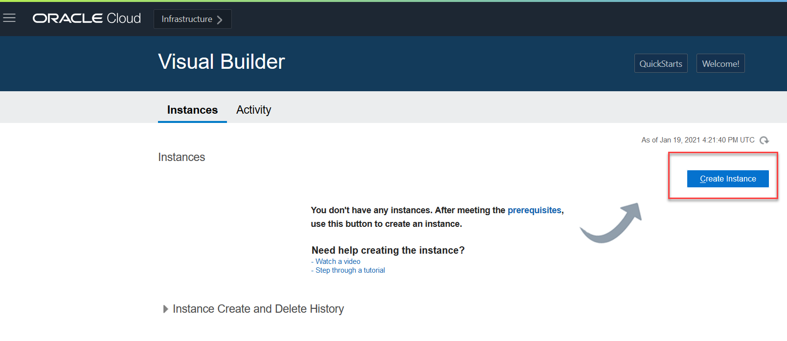
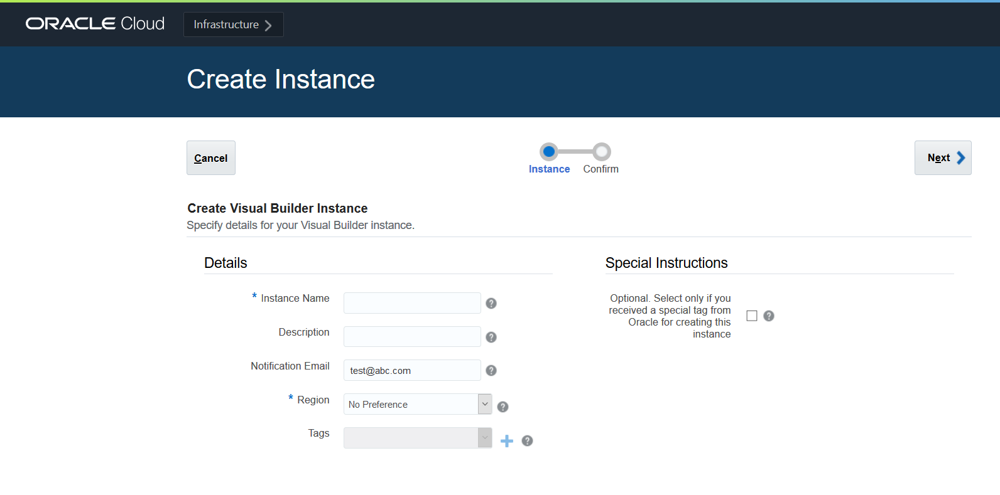

# Provision an Instance of Oracle Visual Builder  

## Introduction

This lab walks you through the process of provisioning an instance of Visual Builder, assuming you don't already have one available to you.  If you do, you can skip this lab and move on to the next one.

Estimated Time:  5 minutes

### About this lab
If you just created a new Cloud account following the instructions in Getting Started, you must wait at least 30 minutes before you attempt to create an instance of Visual Builder. (It could take anywhere between 10 and 30 minutes for a new user account to be fully provisioned and for the Visual Builder navigation menu to show.) If you already have a Cloud account, you don't need to wait. Either way, make sure you've signed in to the Oracle Cloud as an Oracle Identity Cloud Service user before proceeding. *Note: If you log in using an Oracle Cloud Infrastructure account, the navigation menu to Visual Builder won't show.*

## Task 1: Create an instance of Visual Builder

1.  On the Oracle Cloud Get Started page, click the menu in the upper left corner to display the services you can provision:

    

2.  Click **OCI Classic Services**, then select **Visual Builder**:

    

    A new Visual Builder tab opens.  

3.  Click **Create Instance** on the Instances tab:

    

4.  On the Create Instance page, fill in the information required.  Give your instance a unique name, one that is unlikely to be chosen by another user.  Be sure to select the Region nearest to your location.  Click **Next**.

    

    When the instance has finished provisioning, you'll receive an email.  

5. From the menu on the Instances page, click **Open Visual Builder Home Page**.

  

You're now in Visual Builder and can [proceed to the next lab](#next).

## Acknowledgements

**Last Updated** - February 2022
