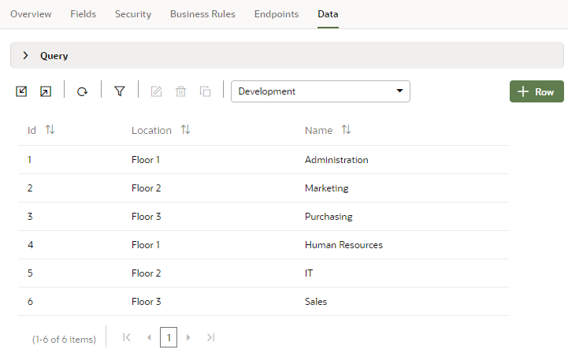

# Add data to your mobile app

## Introduction

This lab shows you how to add data to a mobile application by importing the data from a file.

Estimated Time: 5 minutes

### Objectives

In this lab, you will import data to your mobile application.

### Prerequisites

This lab assumes you have:

* A Chrome browser
* All previous labs successfully completed

## Task 1: Import data for the Department business object

1. Right-click [this file](https://objectstorage.us-ashburn-1.oraclecloud.com/p/LNAcA6wNFvhkvHGPcWIbKlyGkicSOVCIgWLIu6t7W2BQfwq2NSLCsXpTL9wVzjuP/n/c4u04/b/livelabsfiles/o/developer-library/Department.csv) and download it to your file system. The `Department.csv` file contains six departments for the application.

2. In the Navigator, click **Business Objects** .

3. Click **Department**, then click the **Data** tab. The business object fields you created are displayed.

4. Click **Import From File** .

5. In the Import Data dialog box, select the **Replace** option for Row Handling if it's not already selected. Then click the upload box, browse to select the `Department.csv` file, and click **Import**.

6. Click **Close** after the file has been successfully imported. If necessary, click **Refresh Data**  to see the new departments.

    

    You may **proceed to the next lab**.

## Acknowledgements

* **Author** - Sheryl Manoharan, Visual Builder User Assistance

* **Last Updated By/Date** - Sheryl Manoharan, March 2023
