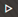
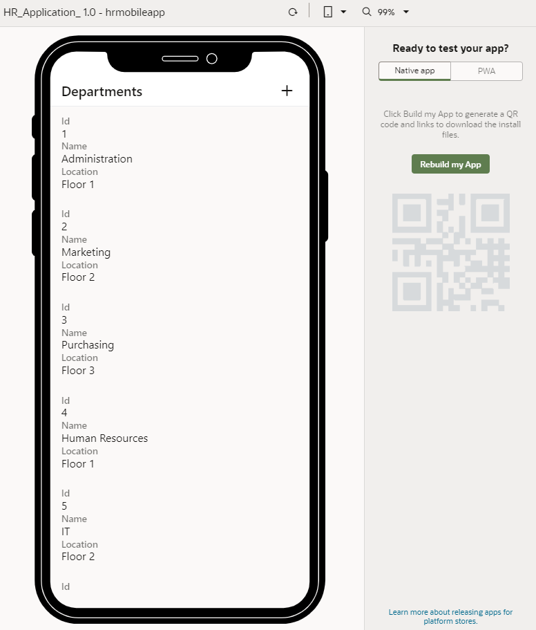
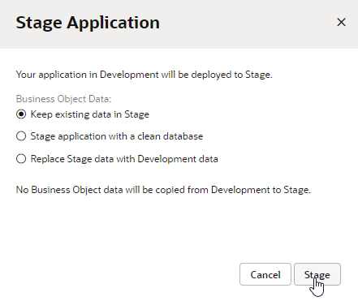
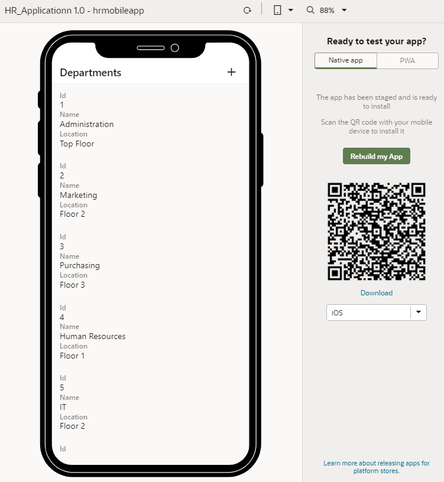

# Build a mobile app for installation on Android and iOS devices

## Introduction

This lab shows you how to build a mobile application for installation on Android and iOS devices.

Estimated Time:  10 minutes

### About this lab

After you define build configurations that define deployment information for the Android and iOS platforms, you are ready to build the mobile application and stage it for testing. Visual Builder generates a QR code and a link to an installation file for each platform after the build process is complete. Users can scan the QR code or download the installation file to install the mobile application.

In this lab, you'll rebuild the mobile application to generate QR codes and installation files for both the Android and iOS platforms. The steps to build a mobile application for installation on any one platform (either Android or iOS) are identical, except that a QR code and an installation file are only generated for the specified platform.

## Task 1: Build a mobile application

After you create the build configuration for both Android and iOS, you can generate QR codes and build the installation files (APK for an Android device and IPA for an iOS device) to install the mobile application on those devices.

1. Click **Preview**  to run the app on a new tab in the browser.

    

    Because we previously enabled the mobile app as a PWA, you'll see the **PWA** tab in addition to the **Native app** tab. The PWA tab will contain a QR code and a **Launch in browser** link to install or open the app as a PWA. Since we've gone over this in an earlier lab, we'll focus on native mobile app installation here. Note that unlike native mobile apps, PWAs don't require build configurations.

2. Click **Rebuild my App**.

3. In the Stage Application dialog box, select **Keep existing data in Stage** and click **Stage**.

    

    When the build is complete, the **Native app** tab will contain a QR code and **Download** link to install the mobile app as a native app.

    

4. If you have access to an Android or iOS device, download the installation file for each platform:
    - Select **iOS** in the drop-down list, then scan the QR code to download the installation file onto an iOS device, or use the **Download** link to download the IPA file to your file system.
    - Select **Android** in the drop-down list, then scan the QR code to download the installation file onto an Android device, or use the **Download** link to download the APK file to your file system.

5. Try out the app on the device to test its functionality. When you are done, close the app. Remember to also close the preview tab or window.

    You may **proceed to the next lab**.

## Acknowledgements

- **Author** - Sheryl Manoharan, Visual Builder User Assistance

- **Last Updated By/Date** - Sheryl Manoharan, March 2023
