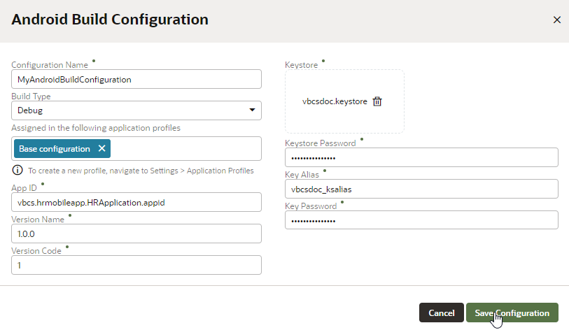

# Create a build to install your mobile app on Android devices

## Introduction

This lab shows you how to define a build configuration to install a mobile application on Android devices.

Estimated Time:  10 minutes

### About this lab

Before you can stage or publish a mobile application, you'll need to create a build configuration that defines deployment information for the Android platform. In this lab, you'll define an Android build configuration, whose settings you'll use to build the mobile application for installation on Android devices in a later lab.

### Objectives

In this lab, you will:

* Create a keystore
* Define a build configuration

### Prerequisites

This lab assumes you have:

* A Chrome browser
* All previous labs successfully completed

## Task 1: Create a keystore for signing the app

Before your mobile application can be deployed to an Android device, it must be signed. Android does not require a certificate authority; an application can instead be self-signed.

To sign your mobile application, you must have a key. If you do not have a key, you can create one using the keytool utility.

The following example shows how to create a keystore with a single key that is valid for 10,000 days. As described in the _Sign Your App_ document, available on the Android Developers website, the keytool prompts you to provide passwords for the keystore and key, and to provide the Distinguished Name fields for your key before it generates the keystore. Complete all the prompts and the created keystore is saved in the specified directory.

`keytool -genkeypair -v -keystore c:\mykeystore\releasesigning.keystore -alias releaseKeyAlias -keyalg RSA -keysize 2048 -validity 10000`

If you do not want to create a key, right-click [this sample keystore file](https://c4u04.objectstorage.us-ashburn-1.oci.customer-oci.com/p/EcTjWk2IuZPZeNnD_fYMcgUhdNDIDA6rt9gaFj_WZMiL7VvxPBNMY60837hu5hga/n/c4u04/b/livelabsfiles/o/developer-library/vbcsdoc.keystore) and download it to your file system to use in this lab. Here are the credentials for the keystore file:

* **Keystore Password**: `vbcsdoc_ks_pass`
* **Key alias**: `vbcsdoc_ksalias`
* **Key password**: `vbcsdoc_ks_pass`

## Task 2: Define a Build Configuration

A build configuration includes deployment configuration and specifies if the build is to be deployed for development or production. Ideally, you'll want to create separate builds: one for development  and another for production with different information for the two environments. For the purposes of this lab, however, we'll only use one build configuration for both.

These steps assume that you are already logged in to Oracle Visual Builder and are viewing the HR Application you created.

1. If required, click the **Mobile Applications**  tab in the Navigator. Click the **hrmobileapp** node, then the **Settings** tab.

2. Click the **Build Configurations** tab and select **Android** in the + Configuration drop-down list.

    

3. In the Android Build Configuration dialog box, enter:

    * **Configuration Name:** Enter the configuration name, for example, `MyAndroidBuildConfiguration`.

    * **Build Type:** Set the build type to **Debug**. Options are **Debug** or **Release**.

    * **Assigned in the following application profiles**: Accept the default application profile (**Base configuration**) that Visual Builder provides. You could also create your own application profile.
    * **App ID:** Enter a unique ID for the application, for example, you could enter `default.android.hrmobileapp`. Each application deployed to an Android device has a unique ID, one that cannot start with a numeric value or contain spaces.

    * **Version Name:** Accept the default value for the application's release version number. This is the release version of the application code that is displayed to the user. For example, enter `2.0.0` if this is the second version of your application. The value you enter appears in application information dialogs when you deploy the application to a device.
    * **Version Code:** Accept the default value for the version code. This is an integer value that represents the version of the application code, which is checked programmatically by other applications for upgrades or downgrades. The minimum and default value is 1. You can select any value and increment it by 1 for each successive release.
    * **Keystore:** Drag and drop (or browse to and select) the keystore file containing the private key used for signing the application for distribution. Use the provided sample keystore file, `vbcsdoc.keystore`.
    * **Keystore Password:** Enter the password for the keystore. This password allows access to the physical file. If using the sample keystore file, enter `vbcsdoc_ks_pass`.
    * **Key Alias:** Enter an alias for the key. This is the value set for the keytool's _-alias_ argument. Only the first eight characters of the alias are used. If using the sample keystore file, enter `vbcsdoc_ksalias`.
    * **Key Password:** Enter the password for the key. This password allows access to the key (identified by the alias) within the keystore. If using the sample keystore file, enter `vbcsdoc_ks_pass`.

    

4. Click **Save Configuration**. The new build configuration is displayed on the Build Configurations page.

    

    You may **proceed to the next lab**.

## Acknowledgements

* **Author** - Sheryl Manoharan, Visual Builder User Assistance

* **Last Updated By/Date** - Sheryl Manoharan, March 2023
