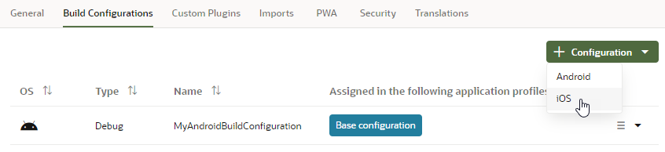
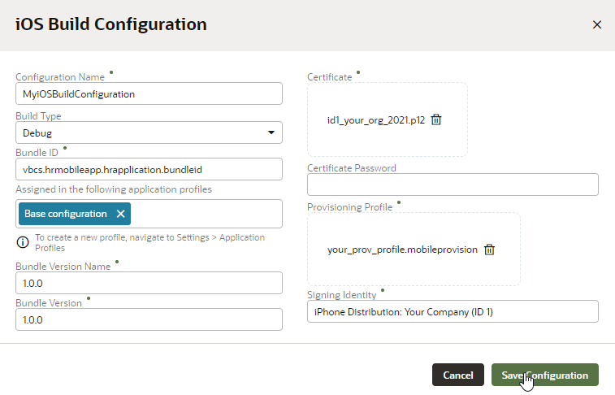
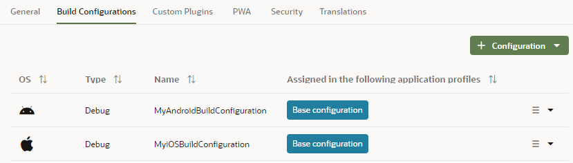

# Create a build to install your mobile app on iOS devices

## Introduction

This lab shows you how to create a build configuration to install a mobile application on iOS devices.

Estimated Time:  10 minutes

### About this lab

In the previous lab, you defined a build configuration to deploy your mobile application on the Android platform; you'll do the same for the iOS platform in this lab. You'll then use these settings to build the mobile application for installation on both Android and iOS devices in a later lab.

### Objectives

In this lab, you will:

* Enroll in an iOS developer program and create a provisioning profile
* Define a build configuration

### Prerequisites

This lab assumes you have:

* A Chrome browser
* All previous labs successfully completed

## Task 1: Enroll in an iOS developer program

Deployment to an iOS-powered device or to a distribution site requires membership in the iOS Developer Program or the iOS Developer Enterprise Program.

Visit the Apple website and enroll for the iOS Developer Program or iOS Developer Enterprise Program. You can enroll as an individual or organization. For information about these programs, see this [page](https://developer.apple.com/programs/).

## Task 2: Create a provisioning profile

You must have a provisioning profile to deploy an iOS application (.IPA file) to an iOS-powered device or to publish it either to the App Store or to an internal hosted download site. A provisioning profile contains an application ID as well as signing certificate(s), either a *distribution* certificate or one or more *developer* certificates depending on the profile type. You'll need the exact application ID and the certificate's signing identity for the iOS build configuration you'll define in the next step.

Use the iOS Provisioning Portal, accessible only to members of the iOS Developer Program, to create a provisioning profile. For more information, review the [iOS Developer Support page](https://developer.apple.com/support/).

## Task 3: Define a build configuration

A build configuration includes deployment configuration information, such as the credentials of the certificate that you use to sign the application, and other information, such as the build type, bundle ID, and bundle version. You'll want to create separate builds: one for development and another for production, especially because iOS requires you to provide a certificate that can be used for production. For the purposes of this lab, however, we'll use one build configuration for both environments.

These steps assume that you are already logged in to Oracle Visual Builder and are viewing the HR Application you created.

1. If necessary, click the **Mobile Applications**  tab in the Navigator. Click the **hrmobileapp** node, then the **Settings** tab.

2. Click the **Build Configurations** tab and select **iOS** in the + Configuration drop-down list.

    

3. In the iOS Build Configuration dialog box, enter:
    * **Configuration Name:** Enter the configuration name, for example, `MyiOSBuildConfiguration`.
    * **Build Type:** Set the build type to **Debug**. Options are **Debug** or **Release**.
    * **Bundle ID:** Enter a unique bundle ID for the application, for example, `com.myOrg.myComp.ios.hrmobileapp`. This ID must be unique for each application installed on an iOS device. It must adhere to reverse-package style naming conventions (`com.organization_name.company_name`) and cannot contain any spaces. The application ID must be identical to what's set in the iOS provisioning profile that you plan to use for this app.

    * **Assigned in the following application profiles:** Accept the default application profile (**Base configuration**) that Visual Builder provides. You could also create your own application profile.
    * **Bundle Version Name:** Accept the default value for the application's release version number. This version number is displayed to users and identifies a released iteration of the application. It is a string made up of three non-negative and period-separated integers, such as 3.1.2. The string should only contain numeric (0-9) and period (.) characters.
    * **Bundle Version:** Accept the default value for the version number identifying the build. The version you enter corresponds to the build number that identifies an iteration (released or unreleased) of the application and must be incremented each time the application is uploaded to the Apple App Store. The build version is typically a string made up of three non-negative and period-separated integers, such as 3.1.2. The string should only contain numeric (0-9) and period (.) characters.
    * **Certificate:** Drag and drop (or browse to and select) the certificate. The certificate file is a P12 file (CER format is not supported), for example, `id1_your_org_2020.p12`. The iOS Development Certificate electronically associates a developer’s identity with a public key and private key. The certificate identifies you as an iOS developer and enables the signing of the application for deployment. In the iOS operating environment, all certificates are managed by the Keychain.  
    * **Certificate Password:** Enter the password for the certificate that was set to protect the provisioning profile certificate when it was exported from the Keychain Access app.
    * **Provisioning Profile:** Drag and drop (or browse to and select the location of) the provisioning profile, for example, `your_prov_profile.mobileprovision`.
    * **Signing Identity:** Enter the name of the developer or distribution certificate that identifies the originator of the code (such as a developer or a company), for example, `iPhone Distribution: Your Company (ID 1)`. Enter the entire name as it appears in the Common Name column of the Keychain Access app. The signing identity must be identical to what's set in your iOS provisioning profile.

    

4. Click **Save Configuration**. The new build configuration is displayed on the Build Configurations page.

  

  You may **proceed to the next lab**.

## Acknowledgements

* **Author** - Sheryl Manoharan, Visual Builder User Assistance

* **Last Updated By/Date** - Sheryl Manoharan, March 2023
