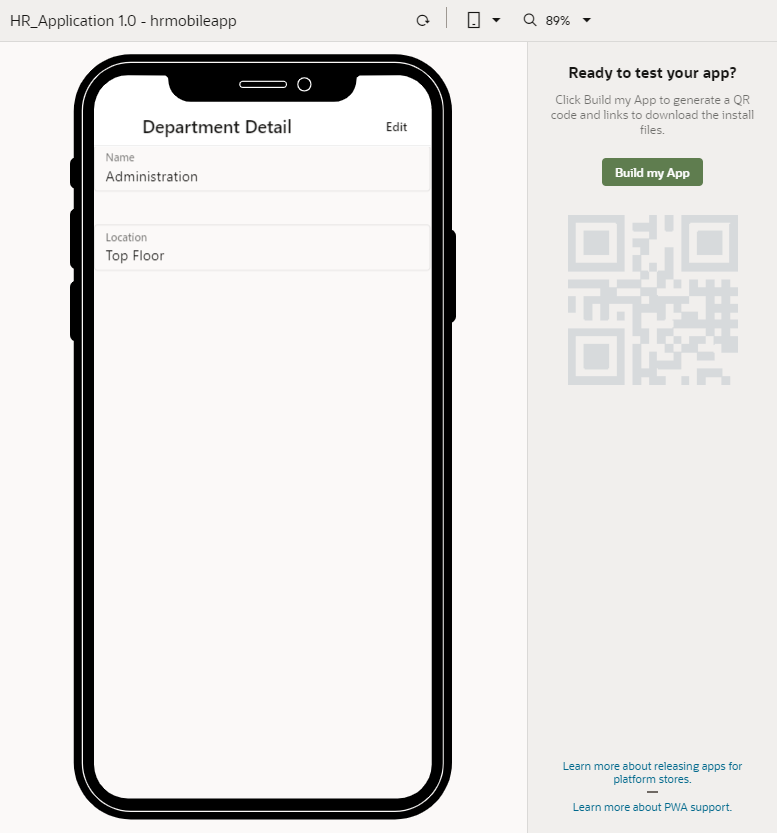
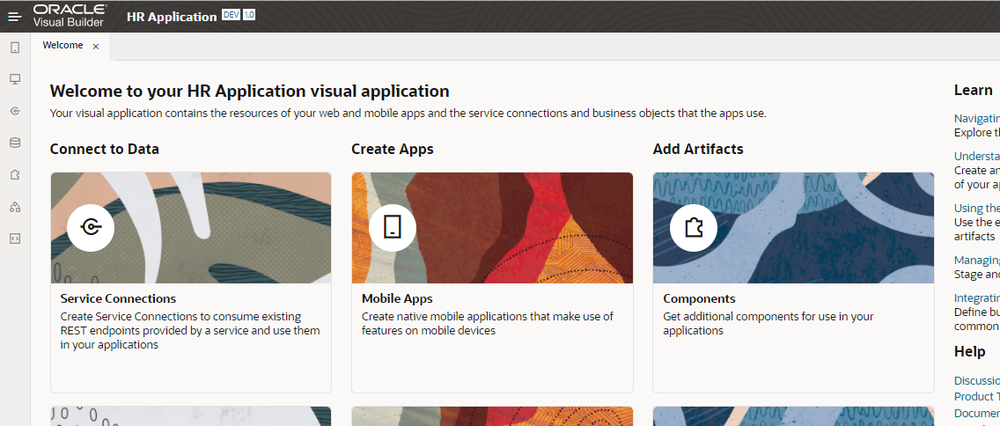
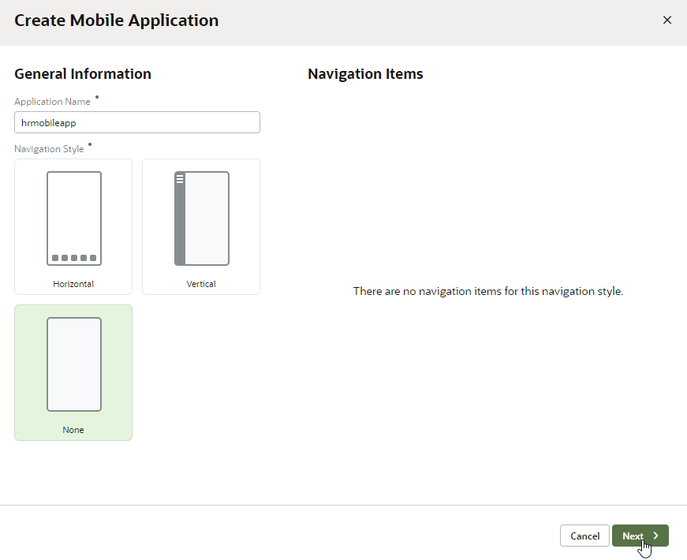
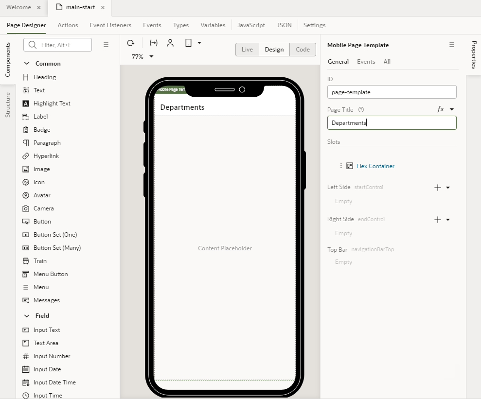
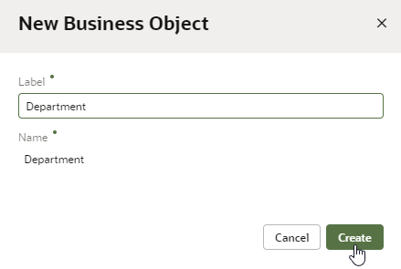
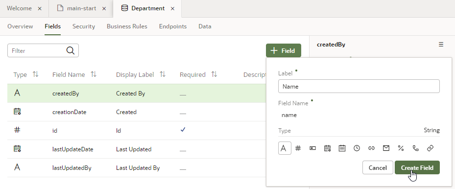
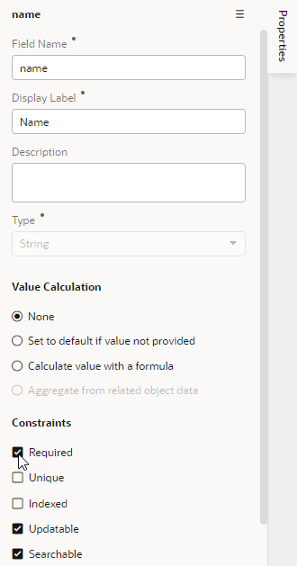
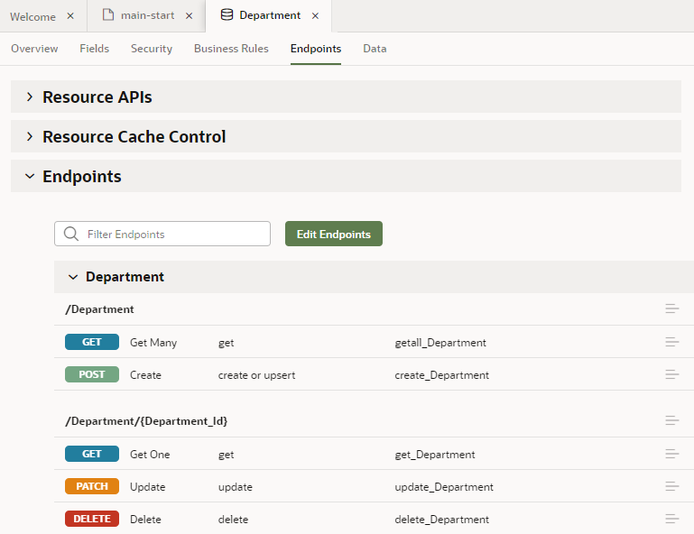

# Create a mobile application

## Introduction

This lab shows you how to create a basic mobile application in Oracle Visual Builder and populate it with data from a business object.

Estimated Time:  10 minutes

### About this lab

Oracle Visual Builder is a development tool for creating web and mobile applications that lets you create an application by dragging and dropping components onto a page. It also allows you to manipulate the application and your business objects through the underlying source code, to create types and variables, to access REST endpoints, and to create action chains.

You’ll create a business object and a mobile application that you'll later use to display, edit, and delete data about departments. You'll also enable the mobile application to run as a Progressive Web App as well as create build configurations that enable Oracle Visual Builder to build mobile applications for installation on Android and iOS devices.

### Objectives

In this lab, you will:

* Create a mobile app
* Create a reusable business object to store data

### Prerequisites

This lab assumes you have:

* A Chrome browser
* All previous labs successfully completed

## Task 1: Create a mobile application

1. In the web browser, sign in to Oracle Visual Builder.

    * If you have no current applications, the landing page appears. Click **\+ New  Application.**
    * If you have one or more current applications, the Visual Applications page appears. Click **New.**

2. In the Create Application dialog box, enter `HR Application` in the **Application Name** field and `Tutorial application` in the **Description** field.

    The **Application ID** text field is automatically populated based on the value that you enter in the **Application Name** field. Make sure the **Empty Application** template is selected in the Application template list, then click **Finish**.

    The new application opens in the Welcome screen. The `DEV` and `1.0` tags next to the application name indicate the status (development) and the version.

    

3. Click **Mobile Apps** and click **\+ Mobile Application** in the Mobile Apps pane.

4. In the General Information screen of the Create Mobile Application wizard, enter `hrmobileapp` in the **Application Name** field, select **None** as the navigation style, and click **Next.**

    

5. In the Page Template – main page of the Create Mobile Application wizard, select **Custom** and click **Create**.

    Oracle Visual Builder creates the mobile application and opens the main-start page in the Page Designer.

6. Click **Page Title**, then enter `Departments` as the page title in the Properties pane on the right.

    

## Task 2: Create a Department business object

1. Click the **Business Objects**  tab.
2. Click **\+ Business Object**.
3. In the New Business Object window, enter `Department` in the **Label** field and click **Create**.

    The **Name** field is automatically populated based on the value that you enter in the **Label** field. When you create a business object label, use the singular form of the name.

    

4. Click the **Fields** tab, then click **\+ Field.**

    

5. In the pop-up box, enter `Name` in the **Label** field.

    The **name** value is automatically populated in the **Field Name** field, and **String**  is selected by default in the **Type** field. Click **Create Field**.

    

6. In the Name field's Properties pane, select the **Required** check box under **Constraints.**

    

7. Click **\+ Field** again. In the pop-up window, enter `Location` in the **Label** field, and click **Create Field**.

    The **location** value is automatically populated in the **Field Name** field, and **String**  is selected by default in the **Type** field.

8. Click the **Endpoints** tab and view the REST endpoints created for the Department business object.

    

    You may **proceed to the next lab**.

## Acknowledgements

* **Author** - Sheryl Manoharan, Visual Builder User Assistance

* **Last Updated By/Date** - Sheryl Manoharan, March 2023
