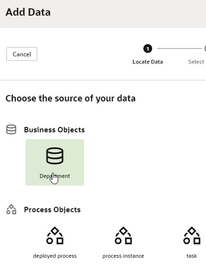
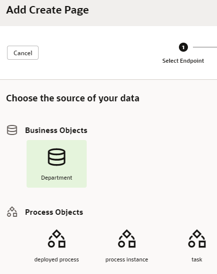
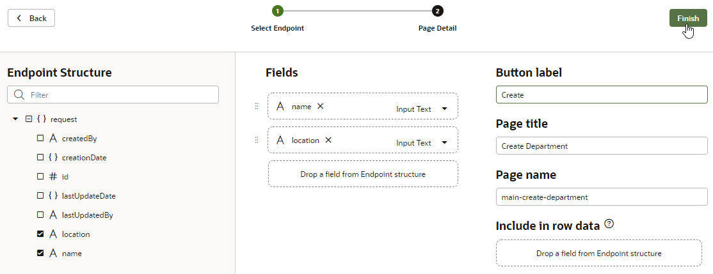
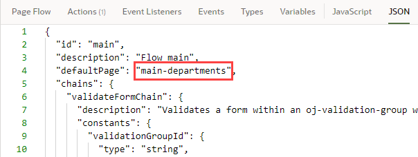

# Create Pages for a Business Object in an Oracle Visual Builder Mobile Application

## Introduction

This lab shows you how to create pages to display data from the business object you created in the previous lab and to create new instances of the business object.

### Estimated Lab Time:  10 minutes

### Background

In Oracle Visual Builder, you create pages in your mobile application by dragging and dropping components. You can use Quick Starts to quickly create pages to display, create, edit, and delete your application's data.

In this lab, we'll use Quick Starts to create a page that displays Departments and another that displays Employees. We'll also create pages that let users add a new department and a new employee - again using Quick Starts.

## Task 1: Use the main-start Page to Display Departments

These steps assume that you are already logged in to Oracle Visual Builder and are viewing the HR Application you created in the previous lab.

1.  Click the **Mobile Applications**  tab.
2.  Expand the **hrmobileapp**, **Flows**, and **main** nodes, then click **main-start**.

    

    You're viewing the Page Designer, where you'll use the Components and Structure tabs on the left to design your pages. You'll also use the Properties pane on the right to view and edit a component's properties.

    Click the **Mobile Applications** tab on the left to hide the Mobile Apps pane and create more room for the Page Designer. You may also want to widen your browser window.

3.  In the Components palette, scroll down to Collection and drag a **List View** component to the page's Content Placeholder section.

4.  In the Properties pane, click **Add Data** to open the Add Data Quick Start.

    

5.  On the Locate Data page of the Quick Start, select the **Department** business object, then click **Next**. (Depending on your Visual Builder instance, you may or may not see Process Objects.)

    

6.  On the Select List Item Template page, select the label - value pairs template, and click **Next**.

    

7.  On the Bind Data page, under **item\[i\]**, select the **id**, **name**, and **location** items. The columns appear in the order selected; if you want to change the order, drag a **Handle**  to reorder the columns as desired. Click **Next**.

    

8.  On the Define Query page, click **Finish**.  

    The empty list view component is displayed with a message that there are no items to display.

## Task 2: Add a Create Page for the Department Business Object

A Create page allows you to create data instances. In this step, you're setting up a Create page that lets your users create new departments.

1.  If necessary, click the **List View** component on the page, then click **Quick Start** to display the Quick Start menu again.
2.  Click **Add Create Page**.
3.  On the Select Endpoint page, select the **Department** business object if necessary, then click **Next**.

    

4.  On the Page Detail page, under Endpoint Structure, select the **location** check box. The **name** check box is already selected, because **name** is a required field. These are the only fields the user needs to specify.
5.  Change the value in the **Button label** field to `Create`. Leave the other values set to their defaults. Click **Finish**.

    

    A **+** button appears on the main-start page. Click the **Mobile Applications** tab to view the main-create-department page created in the **main** page flow. You may want to click the **Components** tab to close the Components palette and make room for your view.

    

6.  Click the **main-create-department** page to open it in the Page Designer.
7.  In the Page Designer toolbar, click **Live** to make the form active.
8.  Enter `Administration` in the **Name** field, and enter `Floor 1` in the **Location** field. Click **Save**.

    

    Oracle Visual Builder places you in the **main** page flow of your application, where you can see that the main-start page points to the main-create-department page.

    

9.  Open the **main-start** page either by clicking the page name in the Navigator or by clicking the tab above the canvas area to see the List View component with the new department  you created. If you don't see it, click **Reload page** .

    

10.  Click **Design** to return to Design view.

## Task 3: Change the Name of the main-start Page

It makes sense at this point to change the name of the main-start page to main-departments.

1.  In the Navigator, right-click the **main-start** page and select **Rename**.

    

2.  In the Rename dialog box, change `start` to `departments` in the **ID** field and click **Rename**. 
3.  In the Navigator, click the **main-departments** page to go to that page again.
4.  Although you have changed its name, the main-departments page continues to be the page where your application starts when you run it. To find out why, click the **Source View**  tab and expand the **mobileApps**, **hrmobileapp**, **flows**, and **main** nodes. Then click **main-flow.json** to open it.

    

    You can see that the `defaultPage` property has been set to the value `main-departments`, making it the starting page for the mobile application flow.

## Acknowledgements
* **Author** - Sheryl Manoharan, Visual Builder User Assistance

* **Last Updated By/Date** - Sheryl Manoharan, February 2021
