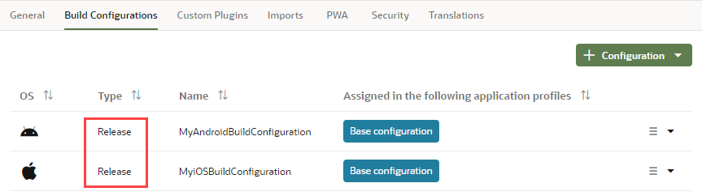
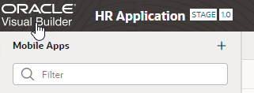
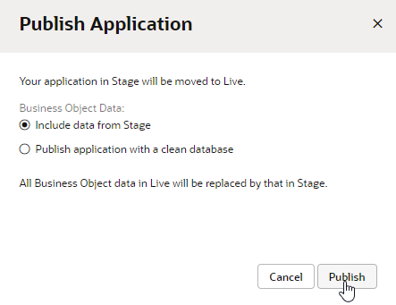
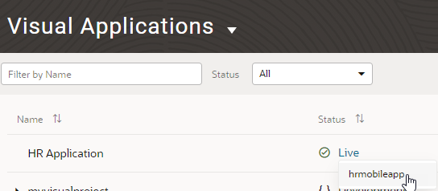

# Publish an Oracle Visual Builder Mobile Application

## Introduction

This lab shows you how to publish a mobile application.

### Estimated Lab Time:  10 minutes

### Background

After you successfully test the staged application, you can publish it and make the application live. Users who have the proper credentials can view the live application. You can’t make changes to an application once it's published. Instead, you must create and edit a new version.

## Task 1: Enable build configurations for release

If you built the mobile app for installation on Android and iOS devices, you'll need to release the build configuration before you can publish the app. If you built the mobile app only as a PWA, jump to step 2.

1. If necessary, click the **Mobile Applications**  tab, then click the **hrmobileapp** node and the **Settings** tab.
2. In the **Build Configurations** tab, select the Android build configuration, click **Options** , and select **Edit**.
3. From the **Build Type** drop-down list, select **Release**, then click **Save Configuration**.
4. Do the same for the iOS build configuration, so that both your build configurations are set for release:

    

    **Note:** Remember that for demonstration purposes, we're using the same builds for development and production. When defining your build configurations for a mobile application, make sure you create different builds for the different environments.

## Task 2: Publish the application

1. Click **Oracle Visual Builder** to return to the Visual Applications page:

    

2. Click **Options**  for the HR Application, and select **Publish**.

3. In the Publish Application dialog box, select **Include data from Stage**, and click **Publish**.

    

    The schema and data from the staging database are copied to the live database. The application is now live.

4. On the Visual Applications page, click **Live** and select **hrmobileapp**.

    

    The application opens in a new browser tab on the application's start page. On the right is the QR code and installation file link that users can use to download and install the mobile application on a supported device. For a PWA, the option to launch the app in a browser is also available. You can now share this application URL with your users.

## Acknowledgements

* **Author** - Sheryl Manoharan, Visual Builder User Assistance

* **Last Updated By/Date** - Sheryl Manoharan, March 2023
