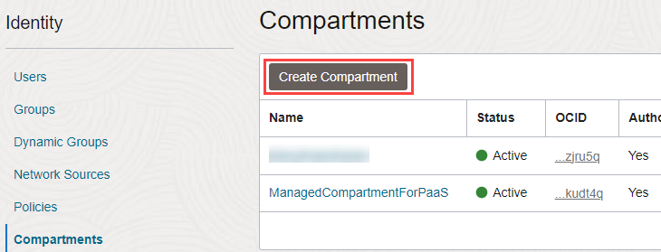
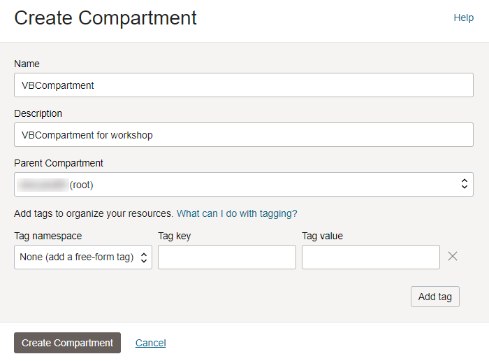
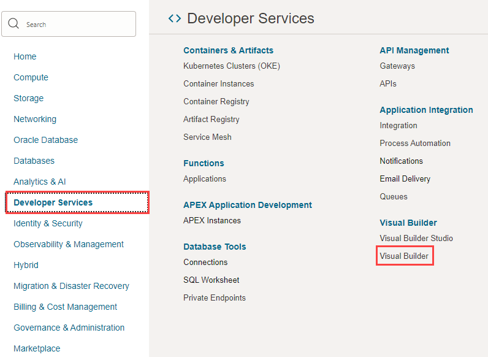
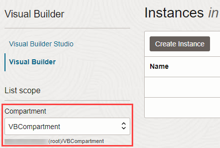
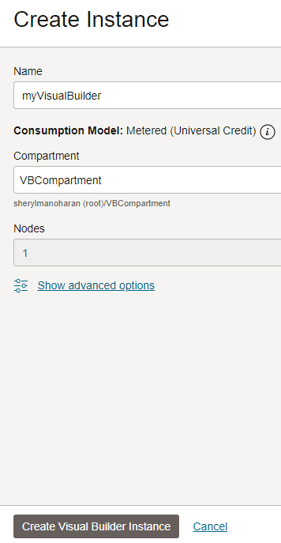
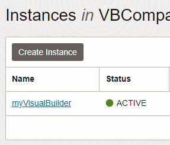

# Provision an Instance of Oracle Visual Builder

## Introduction

This lab walks you through the process of provisioning an instance of Visual Builder, assuming you don't already have one available to you.  If you do, you can skip this lab and move on to the next one.

Estimated Lab Time:  5 minutes

### About this lab

If you just created a new Cloud account following the instructions in Getting Started, you must wait at least 30 minutes before you attempt to create an instance of Visual Builder. (It could take anywhere between 10 and 30 minutes for a new user account to be fully provisioned and for the Visual Builder navigation menu to show.) If you already have a Cloud account, you don't need to wait. Either way, make sure you've signed in to the Oracle Cloud as an Oracle Identity Cloud Service user before proceeding. *Note: If you log in using an Oracle Cloud Infrastructure account, the navigation menu to Visual Builder won't show.*

### Objectives

In this lab, you will create an instance of Visual Builder.

### Prerequisites

This lab assumes you have:

* An Oracle Cloud Account
* A Chrome browser

## Task 1: Create a compartment

Visual Builder instances use Oracle Cloud Infrastructure (OCI) as underlying infrastructure. To connect your Visual Builder instance to OCI resources, you need a dedicated compartment. While you can use the `root` compartment for your Visual Builder, it's recommended that you create a dedicated compartment to better organize and isolate your Visual Builder resources.

1. On the Oracle Cloud Get Started page, click the menu  in the upper left corner.

2. Select **Identity & Security**, then **Compartments**.

    

3. Click **Create Compartment**.

   

4. Enter a name (for example, `VBCompartment`) and add a description (`VBCompartment for workshop`). Leave the Parent Compartment set to the default and click **Create Compartment**.

  

   A new **VBCompartment** appears in the Compartments table.

## Task 2: Create an instance

1. From the menu in the upper left corner, click **Developer Services**, then select **Visual Builder**.

    

2. In the **Compartment** field on the Visual Builder instances page, select the `VBCompartment` you created to host the Visual Builder instance, then click **Create Instance**.

    

3. On the Create Instance screen, give your instance a unique name, one that is unlikely to be chosen by another user.  Click **Create Visual Builder Instance**.

    

   When instance creation completes successfully, the instance shows as **Active** in the **Status** column. If you don't see the status change, try refreshing your browser.

    

4. At the far right, click  and select **Service Homepage** to open Visual Builder in a new browser tab.

  You're now in the Visual Builder console and can **proceed to the next lab**.

## Acknowledgements

* **Author** - Sheryl Manoharan, Visual Builder User Assistance

* **Last Updated By/Date** - Sheryl Manoharan, March 2023
