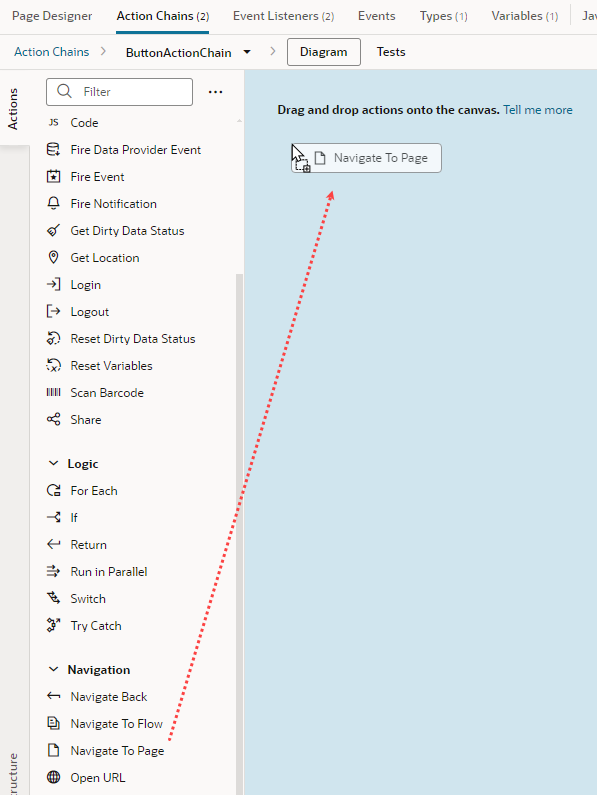
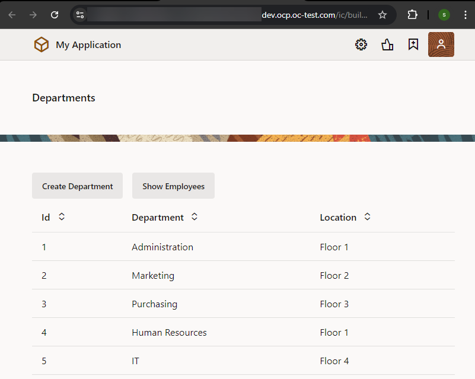

# Add Navigation to Your Web App

## Introduction

This lab shows you how to how to set up navigation between pages in a web app.

Estimated Time: 5 minutes

### About this lab

With the Department and Employee pages now available, you'll want your users to be able to navigate between these pages. You can do this by adding buttons that perform specific *actions* when you click them. This sequence of actions is called an *action chain* in Visual Builder. In this lab, you'll add buttons that take you from the Departments page to the Employees pages and back again. Each button is associated with an 'onclick' event that sets off a navigation action chain.

## Task 1: Create an action chain to navigate from the Departments page to the Employees page

1. Click the **Web Applications**  tab in the Navigator, and click **main-departments** under the **hrwebapp** and **main** nodes.
2. In the Page Designer, click **Components** to open the Components palette. Enter `button` in the Filter field, then drag a Button onto the Toolbar, to the right of the **Create Department** button on the main-departments page.

    

3. Click **Properties** (if necessary) and in the **General** tab, change the **Label** field to `Show Employees`.
4. Click the button's **Events** tab, then click the **\+ New Event** button. From the menu, select **On 'ojAction'**, the default action suggested for a button click.

    

    An empty action chain with the ID **ButtonActionChain** is created.

5. In the Actions palette, scroll down to the **Navigation** section, then drag the **Navigate** action to the **+** sign pointed to by the **Start** arrow.

    

6. In the Navigate action's Properties pane, select **main-employees** from the **Page** drop-down list.

    

    The action now has the label `Navigate main-employees`.

7. Click **Preview**  in the header to run the page in its own browser tab and see how it will appear to a user. (You can use the Live mode to test your app if you prefer, though the Preview form factor is a bit more pleasing.)

8. In the new browser tab, click **Show Employees**.

    

    You'll notice there's no way to get back to the main-departments page from the main-employees page, something we'll fix in the next task. Close the browser tab.

## Task 2: Create an action chain to navigate from the Employees page to the Departments page

1. In the Web Apps pane, click **main-employees** under the **hrwebapp** and **main** nodes.

2. Locate the **Button** component in the Components palette and drag it into the **Toolbar**, to the right of the **Create Employee** button.
3. In the Button's Properties pane, change the **Label** field to `Show Departments`.
4. Click the **Events** tab for the button, then click the **+ New Event** button and select **On 'ojAction'**.

    Another empty action chain with the ID **ButtonActionChain** is created. Because this action chain is for a different page, it doesn't matter that it has the same name as the one for the main-departments page.

5. Drag the **Navigate** action from the **Navigation** section of the Actions palette to the **+** sign pointed to by the **Start** arrow.

6. In the Navigate action's Properties pane, select **main-departments** from the **Page** drop-down list.

    The action now has the label `Navigate main-departments`.

7. Now click **Preview**  and make sure you can get to the Departments page from the Employees page. Close the browser tab.

8. In the Web Apps pane, click **main**, then **Diagram** to view the application's modified page flow. You'll see bi-directional arrows flowing between the main-departments page and the main-employees page. Select the main-departments page tile to see   navigation icons appear in the page's Properties pane, indicating that you can now navigate from main-departments to main-employees and back.

    

    You may **proceed to the next lab**.

## Acknowledgements

* **Author** - Sheryl Manoharan, Visual Builder User Assistance, August 2021
* **Last Updated By** - February 2023
