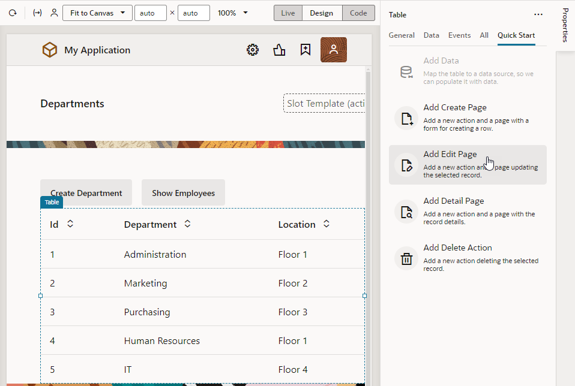
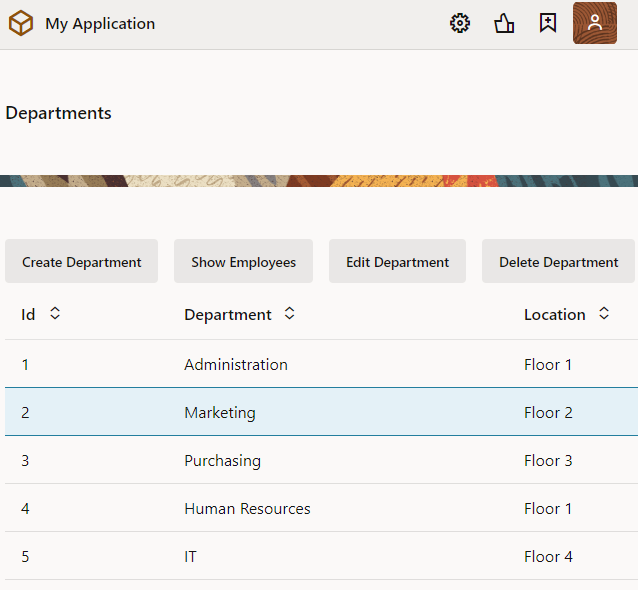
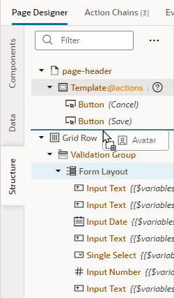
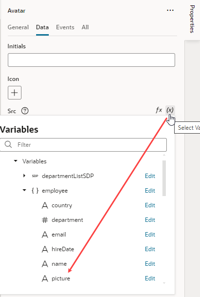
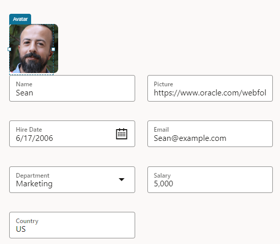
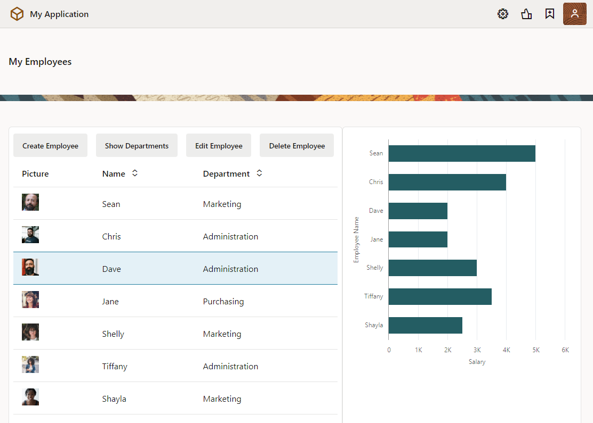

# Add pages to interact with your data

## Introduction

This lab shows how you can create pages and buttons that allow you to edit data, view details of data, and delete data in a table.

Estimated Time:  15 minutes

### About this lab

In a previous lab, you used a couple of Quick Starts to create pages that let your users add departments and employees. In this lab, you'll use the rest of them to add pages for users to edit and delete departments and employees. You'll also get a chance to test all your web pages as they will appear to the user.

### Objectives

In this lab, you will:

* Add web pages to edit and delete data
* Test your web pages
* Change the web app's default home page

### Prerequisites

This lab assumes you have:

* A Chrome browser
* All previous labs successfully completed

## Task 1: Add a page to edit a department's details

In this task, you'll add an edit page that lets users change a department's Name and Location. An Edit page lets you edit a selected row in your table.

1. Select the **main-departments** page in the **Web Apps** pane. Click the **Page Designer** tab, then select the **Table** component on the page.

2. In the Table's Properties pane, click the **Quick Start** tab to display the Quick Start menu, then click **Add Edit Page**.

    

3. On the Select Read Endpoint step of the Add Edit Page Quick Start, select **Department** under Business Objects (if necessary) and click **Next**.

4. On the Select Update Endpoint step, select **Department** under Business Objects (if necessary)  and click **Next**.

5. On the Page Details step, select **location** (**department** is already selected). Click **Finish**.

    An **Edit Department** button is displayed in the toolbar on the main-departments page. The button is inactive.

## Task 2: Add a button to delete a department

Add a delete button to remove a department, so users can delete a department if they wanted.

1. With the table on the **main-departments** page selected, click the **Quick Start** tab if necessary, and click **Add Delete Action**.

2. On the Select Endpoint step (the only step of the Quick Start), select **Department** under Business Objects (if necessary) and click **Finish**.

    A **Delete Department** button is displayed in the toolbar on the main-departments page. The button is inactive.

## Task 3: Test your new Department pages

1. Click **Preview**  to open your application in another browser tab. The two buttons you created are inactive.

2. Select a row. All the buttons are now active.

3. Click **Edit Department**.

    

4. On the Edit Department page, change the **Location** field to `Floor 4` and click **Save**. A success message appears briefly, and you are returned to the Departments page.

5. Click **Create Department** and specify the name and location of a new department, then click **Save**. A success message appears. The new department is displayed in the table.

6. Select the new department and click **Delete Department**. A success message appears. The department is no longer displayed.

7. Close the browser tab.

## Task 4: Add a page to edit an employee's details

Now that we've added options to let users manage departments, we'll do the same for employees. In this task, you'll add an Edit page to update details of your employees.

1. Go to the **main-employees** page, click the **Page Designer** tab and select the **Table** component.

2. In the Properties pane, click **Quick Start** to display the Quick Start menu, then click **Add Edit Page**.

3. On the Select Read Endpoint step of the Add Edit Page Quick Start, select **Employee** under Business Objects (if necessary) and click **Next**.

4. On the Select Update Endpoint step, select **Employee** under Business Objects (if necessary) and click **Next**.

5. On the Page Details step, select **picture**, **hireDate**, **email**, **department**, **salary**, and **country** (**name** is already selected). Click **Finish**.

    An **Edit Employee** button is displayed in the toolbar on the main-employees page. The button is inactive.

6. Click **Live**, select a row, and click the **Edit Employee** button to open the main-edit-employee page.

7. To make the fields on the main-edit-employee page display in two columns, click within the form on the page but outside of a component (that is, in the **Form Layout** component on the page). In the **General** tab of the Properties pane, set the **Max Columns** value to **2**. The fields now appear in two columns.

8. Let's also set up the employee's picture field to display as an image. To do this, search for an Avatar component in the Components palette, then drag and drop it onto the **div** element just above the Form Layout on the page.
    

9. In the Avatar's Properties pane, select **Large** in the **Size** drop-down list to increase the component's size.

10. Click the **Data** tab and bind the component to a data source. Components are typically bound to variables that store and display data from your data source. Quick Starts automate this for you, but in this step, we'll manually bind the Avatar component to the **picture** variable that retrieves its data from the **picture** field in the Employee business object. To do this, hover over the **Src** field in the Data tab, click  to open the Variable picker, then select **picture** under the **employee** object.

  

  The employee's image now displays on the page. If you were to update the URL in the **Picture** field, the employee's image will also update.
  

## Task 5: Add a page to delete an employee

1. Go to the **main-employees** page. Switch to **Design** mode, click the table, and select  **Add Delete Action** under **Quick Start** in the Properties pane.

2. On the Select Endpoint step of the Add Delete Action Quick Start, select **Employee** under Business Objects (if necessary) and click **Finish**.

    A **Delete Employee** button is displayed in the toolbar on the main-employees page. The button is inactive.

3. Because the page features a bar chart as well, let's update the action chain created by the Quick Start to refresh the chart whenever an employee is deleted. Select the **Delete Employee** button, then select the **Events** tab in the Properties pane and click **deleteEmployeeChain** under Action Chain.

    

4. On the success branch of the Call REST action, drag and drop a new Fire Data Provider Event (used to dispatch an event on a data provider) and position it between the other Fire Data Provider Event and Fire Notification actions. You might need to drop the Fire Data Provider Event action on the **+** sign, then drag the Fire Notification action down.

    

5. In the action's Properties pane, click  next to **Event Target** (you'll need to hover over the field to see the icon) and select **employeeListSDP2**, which is the data provider backing the bar chart.

6. Change the Type from **Mutate** to **Refresh**.

    

   Now you're ready to test your pages.

## Task 6: Test your Employee pages

1. Click **Preview** .

    The application opens in another browser tab, displaying the Departments page.

2. Click **Show Employees**.

    The two buttons you created are inactive.

3. Select a row. All the buttons are now active.

    

4. Click the **Edit Employee** button.

5. On the Edit Employee page, change the **Department** to `IT` and **Salary** to 6000. Click **Save**. A success message appears, and you are returned to the Employees page. Notice how the bar chart also changes to show the employee's updated salary.

6. Click **Create Employee** and specify the data for a new employee, for example:
    - **Name**: `Shayla`
    - **Picture**: `https://www.oracle.com/webfolder/technetwork/jet/content/images/hcm/placeholder-female-16.png`
    - **Hire Date**: Select today's date
    - **Email**: `shayla@example.com`
    - **Department**: `Marketing`
    - **Salary**: `4000`
    - **Country**: `NZ`

    Click **Save**. A success message appears, and the new employee is displayed in the table and bar chart.

7. Select the new employee and click **Delete Employee**. A success message appears. The employee is no longer displayed in the table or the chart.

8. Close the browser tab.

## Task 7: Change the app's default page

Now that we have our web pages, let's change the application's home page from Departments to Employees—after all, an HR app is about employees.

1. In the Web Apps pane, click the **main** node, then click **Settings**.

2. In the **General** tab, set **main-employees** as the **Default Page**.

   

3. Click **Diagram** to see the **main** flow's new navigation. Notice how the main-employees page is badged , indicating it as the starting page for your application. Previously, it was the main-departments page.

4. Click **Preview**  to now see the HR app open on the Employees page.

    Close the browser tab.

   You may **proceed to the next lab**.

## Acknowledgements

- **Author** - Sheryl Manoharan, Visual Builder User Assistance, August 2021
- **Last Updated By** - February 2023
