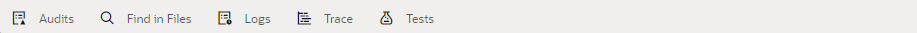
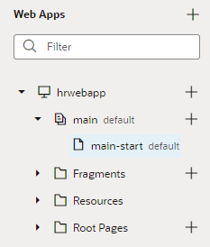
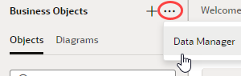
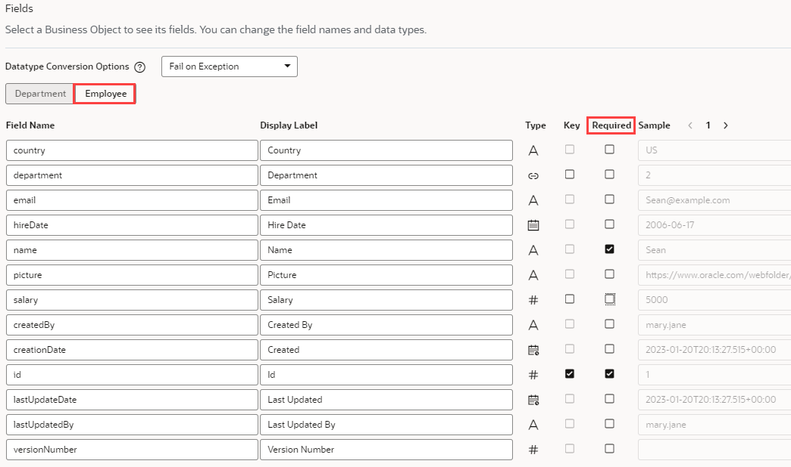

# Create a Web Application

## Introduction

This lab shows you how to use Visual Builder to create a basic web application and populate it with business objects that store your data.

Estimated Time:  15 minutes

### About this lab

Visual Builder, as the name suggests, is a *visual* development tool for web and mobile applications. It provides an easy-to-use graphical interface that lets you design and develop applications simply by dragging and dropping *components* on a page. You can use these components—all based on the open-source Oracle JavaScript Extension Toolkit (JET)—to create rich UIs that span multiple devices.

Each UI component depends on a *business object* for its data. A business object is a resource—like a purchase order or invoice—that has fields to hold your application's data. It is similar to a database table, as it provides the structure for your data; in fact, business objects are stored in a database. Your application accesses the data in these business objects through  REST endpoints that Visual Builder automatically generates for you.

In this lab, you'll create the Employee, Department, and Location business objects to build a simple Human Resources application. Each business object has its own set of fields as shown here:

Once you have your business objects, you'll use them to build the HR web app in which every employee belongs to a department, and every department has a location. Your goal is to allow your users to add employee names and their departments to the database, and to change that data when necessary.

## Task 1: Create a web app

The first thing we'll do is create the web application itself. Later, we'll construct the business objects we need so we can populate the app with data.

1. In the web browser, log in to Visual Builder.
    - If you don't have any applications, the landing page appears. Click **+ New Application**.

        

    - If you have one or more current applications, the Visual Applications page shows you a list of them. Click **New**.

        

2. In the Create Application dialog box, enter:

    - **Application Name**: `HR Application`
    - **Description**: `Tutorial application`

    The **Application ID** text field is automatically populated as you type, based on the Application Name. The **Application Template** field is set to Empty Application.

3. Click **Finish**.

    The newly created visual application opens on the Welcome page.

    

    The Welcome page contains a set of tiles in three groups: **Connect to Data**, **Create Apps**, and **Add Artifacts**. On the far left are icons representing Mobile Applications, Web Applications, Services, Business Objects, Layouts, Components, Processes, and Source. This vertical toolbar is the Navigator.

    Now take note of the header:
    

    The `DEV` and `1.0` tags next to the application name on the left indicate the application status (DEV for development) and version (1.0). Elements on the right let you perform various actions. For example, you can undo your most recent change or search for a file. This workshop primarily demonstrates the options to preview your app, stage, then publish it. If you make a mistake during this workshop, click  to back out of the last step you did.

    Now take a look at the footer, which has tools that help you debug and maintain your visual app (we'll briefly look at Audits in this workshop):

    

    Keep in mind that Visual Builder saves your changes automatically as you work. A timestamp at the bottom of the page will show the time  your work was last saved.

4. We want to create a web app, so under **Create Apps**, click **Web Apps**.

    The Navigator opens in the Web Apps pane.

5. Click **+ Web Application** (or the **+** sign at the top of the pane).

    

6. In the Create Web Application dialog box, enter `hrwebapp` in the **Application Name** field under General Information. (You can specify uppercase as well as lowercase characters in the application name, but the name is converted to lowercase.) Leave the **Navigation Style** set to the default, **None**, and click **Create**.

    The **hrwebapp** opens on the **main-start** page, which is the application's default home page created automatically for you.

    What you see under the **main-start** tab is your application's work area. Just under **main-start** are several horizontal tabs: **Page Designer**, **Actions**, **Event Listeners**, and so on. Each tab provides editors to help you examine and modify artifacts used in the page. By default, the page opens in the **Page Designer**, which is where you'll do the bulk of your work.

    

    Here are the main Page Designer areas you'll use throughout this workshop:
    | # | Tab | Functionality |
    | --- | ---- | --- |
    | 1 | Components | UI components (sorted by categories) that you can drag and drop onto a page|
    | 2 | Data | Data endpoints exposed when you create business objects or service connections |
    | 3 | Structure | Hierarchical view of the page's structure  |
    | 4 | Properties | Properties of a component selected on the page. When the entire page is selected (as it is now), you'll see the Page view where you can choose a preferred page layout.|
    | 5 | Canvas | A design, live, or code view of your page's content |
    {: title="Page Designer Work Area"}

    You can collapse and expand tabs to better manage your working area. For example, click **Properties** to hide the Properties pane and expand your work area. When collapsed, each tab will show as a vertical tab on the side of the editor. Click the tab again to expand it.

   You can also move different panes to customize your work area. For example, right-click **Structure** at the bottom of your work area, then select **Move to Top Left** to move the Structure view right under **Components** and **Data**.

    

    See also how you can manage tabs that open in the tab bar. Right-click the **main-start** tab to see the available options. Note that the active tab  always stays in focus.

    

    In the Web Apps pane, expand the **hrwebapp** and **main** nodes to get a tree view of your web application's flows and pages.

    

    A *flow* contains pages that relate to each other. An application can have multiple flows, and each flow can contain many pages. This simple application contains only one flow, **main**, and one page, **main-start**—though we'll add more pages later on. By convention, a page takes its flow name as a prefix.

## Task 2: Create a Location business object and import data

Let's create your first business object and add data to it by importing a CSV file. Every business object needs data associated with it, and there are many ways to do that, as you'll see.

1. Click the **Business Objects**  tab in the Navigator.
2. Click the **\+ Business Object** button.
3. In the New Business Object dialog box, enter `Location` in the **Name** field. `Location` is also filled in automatically as the **Display Label** field. Click **Create**.
4. Click the **Fields** tab for the newly created Location object.

    Every business object you create has six default fields: an id, plus fields that provide information on who created and updated the object and when.

    

5. Click **\+** and select **Field** to add a field specific to this business object. This is a very simple business object, so we'll add only one new field.
6. In the pop-up box, enter:

    - **Label**: `Location`
    - **Field Name**: `location` (automatically populated)
    - **Type**: **String**  (selected by default)

    

    Click **Create Field**.

7. Click **Properties** on the right (if necessary) to view the **Location** field's properties, then select the **Required** check box under **Constraints**.

    

    You can see that there's now a check mark in the **Required** column for the **Location** field.

8. Click [this link](https://objectstorage.us-ashburn-1.oraclecloud.com/p/LNAcA6wNFvhkvHGPcWIbKlyGkicSOVCIgWLIu6t7W2BQfwq2NSLCsXpTL9wVzjuP/n/c4u04/b/livelabsfiles/o/developer-library/Location.csv) to download the `Location.csv` file. This file contains four locations and  provides the data for the Location business object.

9. Click the **Data** tab, then **Import from File** .

    

10. In the Import Data dialog box, click the drag and drop box, browse to select the `Location.csv` file, and click **Import**.

    

    When the import succeeds, click **Close**. You'll see a list of locations.

    

## Task 3: Create the Department and Employee business objects

Let's now create the Department and Employee business objects. But instead of creating the business objects and fields one by one and importing data for them, you'll import a ZIP file that defines two business objects, their fields, and data all at once.

1. Click [this link](https://objectstorage.us-ashburn-1.oraclecloud.com/p/Ei1_2QRw4M8tQpk59Qhao2JCvEivSAX8MGB9R6PfHZlqNkpkAcnVg4V3-GyTs1_t/n/c4u04/b/livelabsfiles/o/oci-library/Department-Employee-BO.zip) and download the `Department-Employee-BO.zip` file. This ZIP file contains CSV files for the Department and Employee business objects. Feel free to review the contents.

2. In the Navigator's Business Object pane, click **Menu**  and select **Data Manager**. The Data Manager is what you use to import data from a variety of sources.

    

3. On the Manage Application Data page, select **Import Business Objects**.

   

4. On the Upload File step of the Import New Business Objects wizard, click the drag and drop box, select the Department-Employee-BO.zip file, and click **Upload**.

   When the file is uploaded, you'll see a message that the import contains records for the Department and Employee business objects. Click **Next**.

    

5. On the Business Objects step, you'll see the definitions that will be used to create the Department and Employee business objects. Leave them as is and click **Next**.

6. On the Fields step, you'll need to make some changes. For the Department business object (selected by default), look for the `Location` field in the second row and click **#** in the Type column. Change the type setting as follows:

    - **Type**: **Reference** 
    - **Referenced Business Object**: **Location** (the default for a **Referenced Business Object** is always the current business object (in this case, Department), so make sure you select **Location** from the drop-down list)

        A Reference field is like a foreign key in a database table: it's a field that refers to the key (the Id field) of another business object to link the two business objects together. So when you create a department, you'll be able to specify one of the floors as the department's location.

    - **Display Field**: **Location** (automatically populated)
    

    Click **OK**.

7. For the same **Location** field, click **Required** to deselect the setting (**Department** and **Id** are the only required fields for the Department object).

8. Now click the **Employee** tab and change the **Department** field's type to a reference. Click **#** in the **Department** field's Type column and change the Type setting as follows:

    - **Type**: **Reference** 
    - **Referenced Business Object**: **Department**
    - **Display Field**: **Department** (automatically populated)

    Click **OK**.

9. Remove **Required** for all Employee fields, except **Name** and **Id**.

    

10. Click **Finish**. When the import completes successfully, click **Close**.

    

11. In the Business Objects pane, you'll now see two new business objects, each of which becomes a table in Visual Builder's embedded database. Click **Department**, then **Data** to view four departments imported from the spreadsheet. See how the **location** column shows each department's floor, as defined in the referenced Location object.

    

12. Click **Employee** in the Business Objects pane, then **Data** to view six employees imported from the spreadsheet. See how the **picture** column uses paths to images stored elsewhere. If you want to change the data, select a row and click .

13. Now click **Endpoints** to view the Employee object's REST endpoints. These endpoints expose the object's data and let you perform operations to create, read, update, delete as well as query this data in your pages.

  

  Because the Employee object refers to the Department object, you'll see the Department endpoints also listed here under **departmentObject**.

  If you click an endpoint, an endpoint viewer displays details of endpoint settings and headers sent in a request. You can also test requests and view responses. To do this, click the **getall_Employee** endpoint, then in the Test tab, click **Send Request** (you can supply your own parameter values if you want):

  

  Click  Endpoints to return to the main Endpoints page.

## Task 4: Create a business object diagram

Now that we have our business objects, let's create a diagram that provides a visual representation of the business objects and their relationships.

1. In the Business Objects pane of the Navigator, click the **Diagrams** tab, then click the **\+ Business Object Diagram** button.

    

2. In the Create Business Object Diagram dialog box, enter `HRDiagram` in the **Diagram name** field and click **Create**.

3. In the Properties pane, click **Select All** next to Business Objects to see the three business objects you created and their relationships.

    

    The diagram looks just like the graphic in the About this lab section. You may **proceed to the next lab**.

## Acknowledgements

- **Author** - Sheryl Manoharan, Visual Builder User Assistance, August 2021
- **Last Updated By** - February 2023
