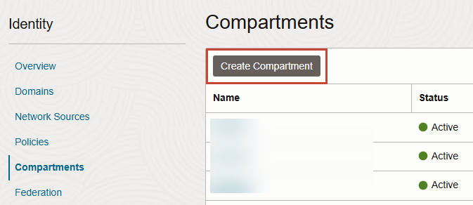
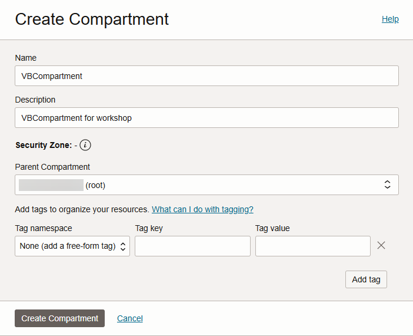

# Provision an instance

## Introduction

This lab walks you through the process of provisioning an instance of Visual Builder, assuming you don't already have one available to you.  If you do, you can skip this lab and move on to the next one.

Estimated Time:  5 minutes

  **Note:** If you have access to Oracle Integration, you can use the Visual Builder instance provisioned in Oracle Integration—though an administrator must first enable it. See [how to enable Visual Builder for your Oracle Integration instance](https://docs.oracle.com/pls/topic/lookup?ctx=en/cloud/paas/application-integration&id=ABCAG-GUID-592A60FD-C6B7-4E65-8AC5-05253EF2A026).

### About this lab

If you just created a new Cloud account following the instructions in Getting Started, you must wait at least 30 minutes before you attempt to create an instance of Visual Builder. It could take anywhere between 10 and 30 minutes for a new user account to be fully provisioned (you'll get a email when provisioning is complete). If you already have a Cloud account, you don't need to wait. Either way, make sure you've signed in to the Oracle Cloud as an Oracle Identity Cloud Service user before proceeding. *If you log in using an Oracle Cloud Infrastructure account, the navigation menu to Visual Builder won't show.*

### Objectives

In this lab, you will create an instance of Visual Builder.

### Prerequisites

This lab assumes you have:

* An Oracle Cloud Account
* A Chrome browser

## Task 1: Create a compartment

Visual Builder instances use Oracle Cloud Infrastructure (OCI) as underlying infrastructure. To connect your Visual Builder instance to OCI resources, you need a dedicated compartment. While you can use the `root` compartment for your Visual Builder, it's recommended that you create a dedicated compartment to better organize and isolate your Visual Builder resources.

1. On the Oracle Cloud Get Started page, click the menu  in the upper left corner.

2. Select **Identity & Security**, then **Compartments** under Identity.

    

3. Click **Create Compartment**.

   

4. Enter a name (for example, `VBCompartment`) and add a description (`VBCompartment for workshop`). Leave the Parent Compartment set to the default and click **Create Compartment**.

  

   A new **VBCompartment** appears in the Compartments table.

## Task 2: Create an instance

1. From the navigation menu, click **Developer Services**, then select **Visual Builder**.

    

2. Switch to the compartment you created for Visual Builder resources: Click the **Compartment** filter next to Applied filters, select **VBCompartment**, and click **Apply filter**. Click **Create Visual Builder instance**.

   

3. On the Create instance screen, give your instance a unique name, one that is unlikely to be chosen by another user. Leave all other fields as is for the purposes of this tutorial. Click **Create Visual Builder instance**.

   

    When instance creation completes successfully, the instance shows as **Active** in the Status column. If you don't see the status change, try refreshing your browser.

   

4. Click the instance's name on the list of instances to view its details, then click **View Service Home Page** to open Visual Builder in a new browser tab.

   

  You're now in the Visual Builder console and can **proceed to the next lab**.

## Acknowledgements

* **Author** - Sheryl Manoharan, Visual Builder User Assistance, August 2021
* **Last Updated By/Date** - Sheryl Manoharan, May 2025