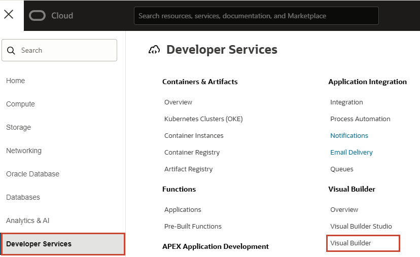
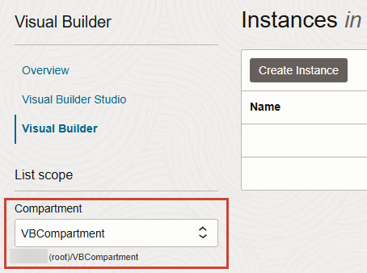

# Provision an Instance of Oracle Visual Builder  

## Introduction

This lab walks you through the process of provisioning an instance of Visual Builder, assuming you don't already have one available to you.  If you do, you can skip this lab and move on to the next one.

Estimated Time:  5 minutes

### About this lab
If you just created a new Cloud account following the instructions in Getting Started, you must wait at least 30 minutes before you attempt to create an instance of Visual Builder. (It could take anywhere between 10 and 30 minutes for a new user account to be fully provisioned and for the Visual Builder navigation menu to show.) If you already have a Cloud account, you don't need to wait. Either way, make sure you've signed in to the Oracle Cloud as an Oracle Identity Cloud Service user before proceeding. *If you log in using an Oracle Cloud Infrastructure account, the navigation menu to Visual Builder won't show.*

> **Note:** To successfully provision a Visual Builder instance using a Free Tier account, you need an Oracle Cloud account with active credits. If you don't have credits, you'll need to upgrade to a paid account. See [Oracle Cloud Infrastructure Free Tier](https://www.oracle.com/cloud/free/#always-free) for details.

## Task 1: Create an instance of Visual Builder

1.  On the Oracle Cloud Get Started page, click the menu in the upper left corner to display the services you can provision:

    

2.  Click **Developer Services**, then select **Visual Builder**:

    

3.  Select the Visual Builder instance's compartment in the **Compartment** field on the left, then click **Create Instance**:

    

4.  On the Create Instance screen, give your instance a unique name, one that is unlikely to be chosen by another user.  Click **Create Visual Builder instance**.

    

    Instance creation takes some time. If you attempt to click the instance name and receive a <code>401: Authorization failed or a 404: Not Found</code> error, but followed all the correct steps, instance creation has not completed. Wait a few more minutes.  

    When instance creation completes successfully, the instance shows as **Active** in the **State** column.

5. At the far right, click  and select **Service Homepage** to open the Visual Builder login page.

  You're now in Visual Builder and can **proceed to the next lab**.

## Acknowledgements

* **Author** - Sheryl Manoharan, Visual Builder User Assistance, August 2021
* **Last Updated** - June 2022
