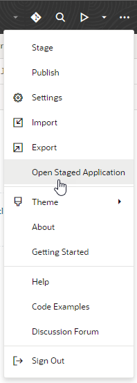
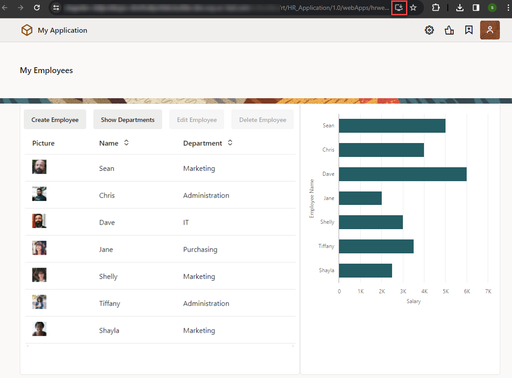

# Stage and publish your web app

## Introduction

This lab shows you how to stage and publish your web app.

Estimated Time:  10 minutes

### About this lab

At this point, your work designing the app is more or less complete. You can now stage your app to allow team members to test it thoroughly. After testing is complete, you can publish the application and make it available to users.

Visual Builder provides different databases for the development, staging, and live phases of an application. You can use an empty database for the staging or live phase, you can transfer data from one to another, or you can import specific data for each.

This lab shows you how to stage, publish, and access those apps within the Designer. You can also perform these operations from the application's Options menu on the Visual Applications page.

### Objectives

In this lab, you will:

* Enable your web app as a PWA
* Stage your app for team members to test
* Publish the app for external users

### Prerequisites

This lab assumes you have:

* A Chrome browser
* All previous labs successfully completed

## Task 1: Enable the web app as a PWA

As a final step before you stage the app, enable it to run as a Progressive Web App—or PWA for short. PWAs are designed to be capable, reliable, and provide a platform-specific look and feel. When you enable a web app as a PWA, it can be installed directly from a browser on a user's device, including Android and iOS mobile devices.

1. In the Web Apps pane, click the **hrwebapp** node.

2. Click **Settings** and **PWA**, then toggle **Enable Progressive Web App (PWA)**.

    

3. Review the **Manifest Settings** included with the PWA's web manifest, a JSON file that contains information about your application:

    * **Application Name:** Accept the default value or specify another name to be displayed when you are prompted to install the application.

    * **Short Name:** Accept the default value. When both the application name and short name are specified, the short name is used on the Home screen, launcher, and other places where space is limited.

    * **Theme Color**: Accept the default background and theme colors.
4. Under **Resources**, click **Create** next to **Offline Fallback Page** to add a page that is displayed when the user performs an action in the PWA that requires a connection, but the device is offline.

    

  A default `offlinePage.html` is created for you. You can click this page to customize its code, if you want. For demonstration purposes, we'll accept the default settings.

## Task 2: Stage the application

Let's now stage the application, so other users can test its behavior.

1. Click the **Menu**  icon in the header and select **Stage**.

    

2. In the Stage Application dialog box, select the **Populate Stage with Development data** option and click **Stage**.

    

    The application is staged, and its status in the header changes from `DEV` to `STAGE`.

3. From the header **Menu** , click **Open Staged Application**.

    

    The staged application opens in a new browser tab. The tables are populated with the data from Development. An **Install HR Application**  icon that lets you install the app as a PWA also shows up on the address bar—we'll test this functionality in a later step.

    

4. Make a note of the application's URL to share with your team.

    When you have finished using the application, close the browser tab to return to the application in the Designer.

## Task 3: Import data into the application

To add more records to your data in the staging database, let's import data for the Department and Employee business objects from a zip file.

1. Click [this link](https://objectstorage.us-ashburn-1.oraclecloud.com/p/Ei1_2QRw4M8tQpk59Qhao2JCvEivSAX8MGB9R6PfHZlqNkpkAcnVg4V3-GyTs1_t/n/c4u04/b/livelabsfiles/o/oci-library/hr_application_stage.zip) and save the `hr_application_stage.zip` file. The ZIP file contains CSV files of the Department and Employee business objects of the HR Application schema with a few more records.

2. In the Navigator, click the **Business Objects**  tab, then click **Menu**  and select **Data Manager**.

    

3. From the drop-down list in the upper right corner, select **Staging** to import the data into the staging database.

    

4. Click **Import from File**.

5. In the Import Data dialog box, click the import box, select `hr_application_stage.zip`, and click **Import**. When the import succeeds, click **Close**.

    

6. In the Business Objects pane, switch to the **Objects** tab and click **Department**.

7. Click the **Data** tab if necessary, then select **Staging** from the drop-down list to view the new departments.

    

8. Click **Employee** and **Data**, then select **Staging** to view the new employees.

    

## Task 4: Publish the application

After you have successfully tested the staged application, you can publish it and make the application live. The live application is visible to users with proper credentials.

1. Click the **Menu**  icon in the header and select **Publish**.

2. In the Publish Application dialog box, select the **Include data from Stage** option and click **Publish**.

    

    The application is now live. Notice the status change in the header next to the application name.

3. Click **ORACLE Visual Builder** in the header to go to the Visual Applications page.

   

4. Locate the HR Application, click **Live** in the Status column, then select **hrwebapp** to open the app.

    

    The application opens in a new browser tab, with the schema and data from the staging database copied to the live database.

    

    You can make a note of this URL to share with public users.

5. To install the app as a PWA, click the **Install HR Application**  icon in the address bar, then **Install** when prompted.

    

    If you access this app on a mobile device, you'll be prompted to add the app to your phone's home screen as well.

6. When the app opens on your device as a standalone app, try it out and test its functionality.

    

    When you are done, click **X** to close the app. You can always click  on your device's home screen or laptop to open the app again. Remember also to close the staged app's browser tab.

    Now that the HR app is published, you won't be able to make changes to it. To do that, you'll need to create a new version from the application's Options menu on the Visual Applications page. This creates a development version of the app for you to work on while the published version stays live. Once you are ready to go live with your updates, you'll need to re-stage and re-publish the new version.

    And that's it for this workshop!

## Acknowledgements

* **Author** - Sheryl Manoharan, Visual Builder User Assistance, June 2021
* **Last Updated By** - February 2023
