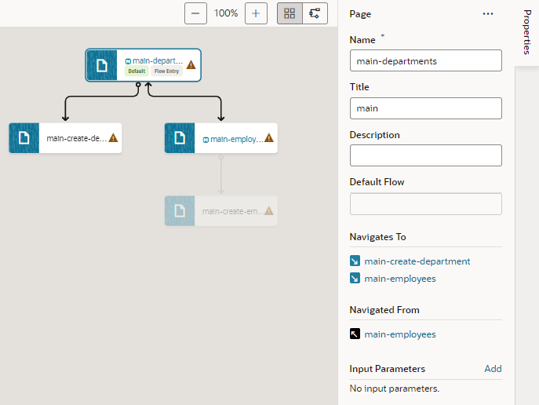

# Add Navigation and Data

## Introduction

This lab shows you how to set up navigation between pages in a web app. It also demonstrates other ways of adding data to your app.

Estimated Time: 10 minutes

### About this Lab
Now that your changes are committed to a remote branch, you'll want to continue updating your web pages to make sure users can navigate between the Department and Employee pages. You do this by adding buttons that perform a series of actions when you click them. In VB Studio, this sequence of actions is called an _action chain_. You can use and customize built-in actions, or define your own. In this lab, you'll add buttons that take you from the Departments page to the Employees pages and back again. Each button is associated with an event that sets off a navigation action chain.

You'll also populate your app's business objects by importing data from a file. You did this for the Location business object in a previous lab; you'll do the same for the Department and Employee business objects in this lab.

### Objectives
In this lab, you will:
* Set up navigation between web pages
* Import data for your business objects

### Prerequisites

This lab assumes you have:
* A Chrome browser
* All previous labs successfully completed

## Task 1: Create an action chain to navigate from the Departments page to the Employees page

1.  Click **Workspaces**, then click **HR Visual Application** in the Workspaces table.
2.  Click **Web Applications** , then **main-departments** under the **hrwebapp** and **main** nodes.
3.  In the Page Designer, click **Components** to open the Components palette. Then, drag a **Button** from the Common components to the Toolbar, to the right of the Create Department button on the `main-departments` page.

    

4.  If necessary, click **Properties**. Then in the General tab of the Properties pane, change the **Text** field to `Display Employees`.
5.  Select the button (if necessary) and click the **Events** tab, then click the **\+ New Event** button. From the menu, select **On 'ojAction'**, the default action for a button click.

    

    An action chain with the ID ButtonActionChain is created. It contains only the Start action.

6.  From the Navigation section of the Actions palette, drag the **Navigate** action to the **+** sign pointed to by the Start action.
7.  In the Navigate action's properties, select **main-employees** from the **Page** list.

    

    The action now has the label `Navigate main-employees`.

8.  Click **Preview**  in the header to run the application and see how the pages will appear to the user.

    The application opens in another browser tab.
    

9.  Click **Create Department** and add another department (`IT` on `Floor 2`, for example), then click **Save**. A success message is displayed briefly.
10.  Click **Display Employees**, then click **Create Employee**. Add another employee, specifying the new department, and click **Save**. You'll notice there's no way to get back to the `main-departments` page from the `main-employees` page. Close the browser tab.

## Task 2: Create an action chain to navigate from the Employees page to the Departments page

1.  In the Web Apps pane, click **main-employees** under the **hrwebapp** and **main** nodes. If necessary, click **Reload page**  to display the new employee you created.
2.  From the Components palette, drag a **Button** component to the Toolbar, to the right of the Create Employee button.
3.  In the button's Properties pane, change the **Text** field to `Display Departments`.
4.  Click the **Events** tab, then click **+ New Event** and select **On 'ojAction'**.

    Another empty action chain with the ID ButtonActionChain is created. Because this action chain is for a different page, it doesn't matter that it has the same name as the one for the `main-departments` page.

5.  Drag the **Navigate** action from the Navigation section to the **+** sign pointed to by the Start action.
6.  In the Properties pane, select **main-departments** from the **Page** list.

    The action now has the label `Navigate main-departments`.

7.  Click **Preview**  to test the pages and navigation. The application opens in another browser tab. Make sure you can get to the Departments page from the Employees page. Close the browser tab.
8.  Click **main**, then **Diagram** to view the application's modified page flow. Click the **main-departments** page to see two navigation icons ( ) appear on the `main-employees` page, indicating that you can now navigate from `main-departments` to `main-employees` and back.

    

    Navigation details also show in the page's Properties pane.

    

## Task 3: Import data for the business objects

Let's now add data for the Department and Employee business objects. Instead of using the Data Manager to import data, this time you'll use each business object's Data tab to do the same thing.

1.  Click [this link](https://objectstorage.us-ashburn-1.oraclecloud.com/p/CSv7IOyvydHG3smC6R5EGtI3gc1vA3t-68MnKgq99ivKAbwNf8BVnXVQ2V3H2ZnM/n/c4u04/b/livelabsfiles/o/solutions-library/Department.csv) and save the `Department.csv` file to your file system. The file contains six departments.

2.  Click [this link](https://objectstorage.us-ashburn-1.oraclecloud.com/p/CSv7IOyvydHG3smC6R5EGtI3gc1vA3t-68MnKgq99ivKAbwNf8BVnXVQ2V3H2ZnM/n/c4u04/b/livelabsfiles/o/solutions-library/Employee.csv) and save the `Employee.csv` file to your file system. The file contains nine employees.

3.  In the Navigator, click **Business Objects** , then **Objects**. The business objects you created are displayed.

4.  Click **Department**, then **Data**.

5.  Click **Import from File** .

6.  In the Import Data dialog box, select the **Replace** option if it's not already selected. Then click the upload box, browse to select the `Department.csv` file, and click **Import**.

   

   (If you run into an error, you'll need to delete the new department and the new employee you created in the previous task. To do this, go to the Employee business object's **Data** tab, select the new employee, and click the **Delete Row** icon. Do the same for the new department. Then try the import again.)

	Click **Close** after the file has been successfully imported. Six departments are displayed in the table.

	

7.  Click **Employee** under Business Objects, then click **Data**.

8.  Click **Import from File** .

9.  In the Import Data dialog box, select the **Replace** option if it's not already selected. Then click the upload box, browse to select the `Employee.csv` file, and click **Import**.

   Click **Close** after the file has been successfully imported. Nine employees are displayed in the table.

	

   You may **proceed to the next lab**.

## Acknowledgements
* **Author** - Sheryl Manoharan, VB Studio User Assistance, November 2021
* **Last Updated By/Date** - Sheryl Manoharan, February 2022
