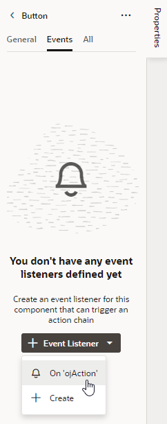
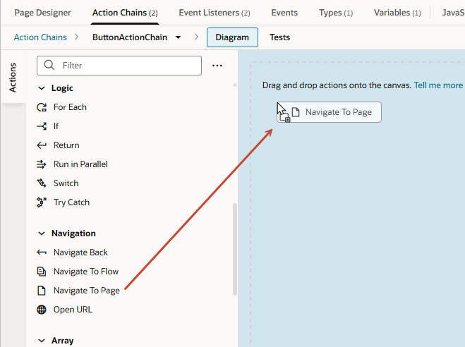
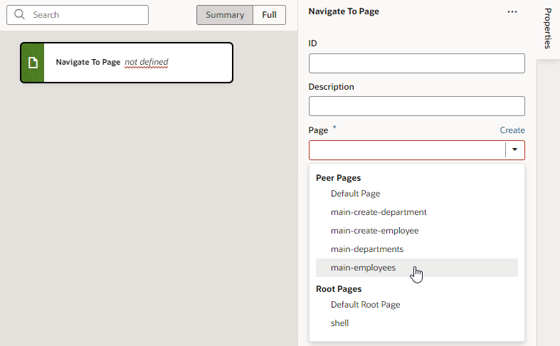
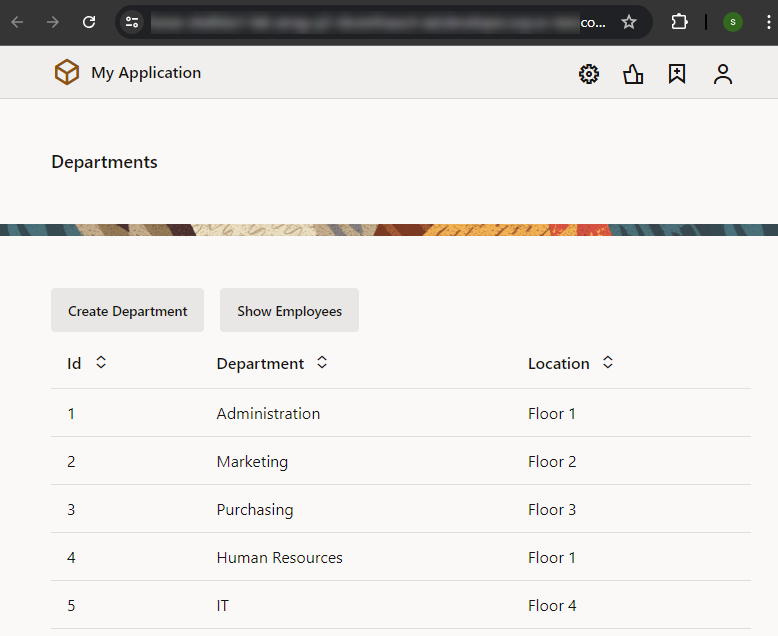

# Add navigation between pages

## Introduction

This lab shows you how to set up navigation between pages in a web app.

Estimated Time: 5 minutes

### About this Lab

Now that your changes are committed to a remote branch, you'll want to continue updating your web pages to make sure users can navigate between the Department and Employee pages. You do this by adding buttons that perform specific _actions_ when you click them. In VB Studio, this sequence of actions is called an _action chain_. In this lab, you'll add buttons that take you from the Departments page to the Employees pages and back again. Each button is associated with an 'onclick' event that sets off a navigation action chain.

### Objectives

In this lab, you will set up navigation between web pages.

### Prerequisites

This lab assumes you have:

* A Chrome browser
* All previous labs successfully completed

## Task 1: Create an action chain to navigate from the Departments page to the Employees page

1. Click **Workspaces**, then click **HR Workspace** in the Workspaces table.
2. Click **Web Applications** , then **main-departments** under the **hrwebapp** and **main** nodes.
3. In the Page Designer, click **Components** to open the Components palette. Enter `button` in the Filter field, then drag a **Button** onto the Toolbar, to the right of the Create Department button on the main-departments page.

    

4. Click **Properties** (if necessary) and in the General tab, change the **Label** field to `Show  Employees`.
5. Click the button's **Events** tab, then click the **\+ New Event** button. From the menu, select **On 'ojAction'**, the default action suggested for a button click.

    

    An empty action chain with the ID ButtonActionChain is created.

6. In the Actions palette, scroll down to the **Navigation** section, then drag the **Navigate To Page** action onto the canvas.

    

7. In the Navigate To Page action's properties, select **main-employees** from the **Page** list.

    

    The action now has the label **Navigate To Page main-employees**.

8. Click **Preview**  in the header to run the page in its own browser tab and see how it will appear to a user. (You can use the Live mode to test your app if you prefer, though the Preview form factor is a bit more pleasing.)

9. In the new browser tab, click **Show Employees**.

    

    You'll notice there's no way to get back to the main-departments page from the main-employees page, something we'll fix in the next task. Close the browser tab.

## Task 2: Create an action chain to navigate from the Employees page to the Departments page

1. In the Web Apps pane, click **main-employees** under the **hrwebapp** and **main** nodes.
2. Locate the **Button** component in the Components palette and drag it into the Toolbar, to the right of the **Create Employee** button.
3. In the button's Properties pane, change the **Label** field to `Show Departments`.
4. Click the **Events** tab, then click **+ New Event** and select **On 'ojAction'**.

    Another empty action chain with the ID ButtonActionChain is created. Because this action chain is for a different page, it doesn't matter that it has the same name as the one for the main-departments page.

5. Drag the **Navigate To Page** action from the **Navigation** section onto the canvas.
6. In the Navigate To Page action's Properties pane, select **main-departments** from the **Page** list.

    The action now has the label **Navigate To Page main-departments**.

7. Now click **Preview** , then **Show Employees** in the new browser tab. Make sure you can get to the Departments page from the Employees page. Close the browser tab.
8. In the Web Apps pane, click **main**, then **Diagram** to view the application's modified page flow. You'll see bi-directional arrows flowing between the main-departments page and the main-employees page. Select the main-departments page tile to see   navigation icons appear in the page's Properties pane, indicating that you can now navigate from main-departments to main-employees and back.

    

   You may **proceed to the next lab**.

## Acknowledgements

* **Author** - Sheryl Manoharan, VB Studio User Assistance, November 2021
* **Last Updated By/Date** - Sheryl Manoharan, May 2023
