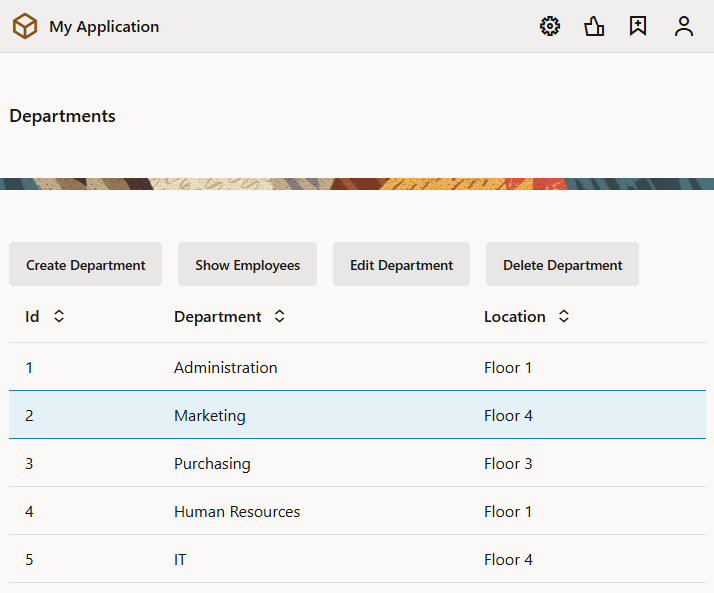
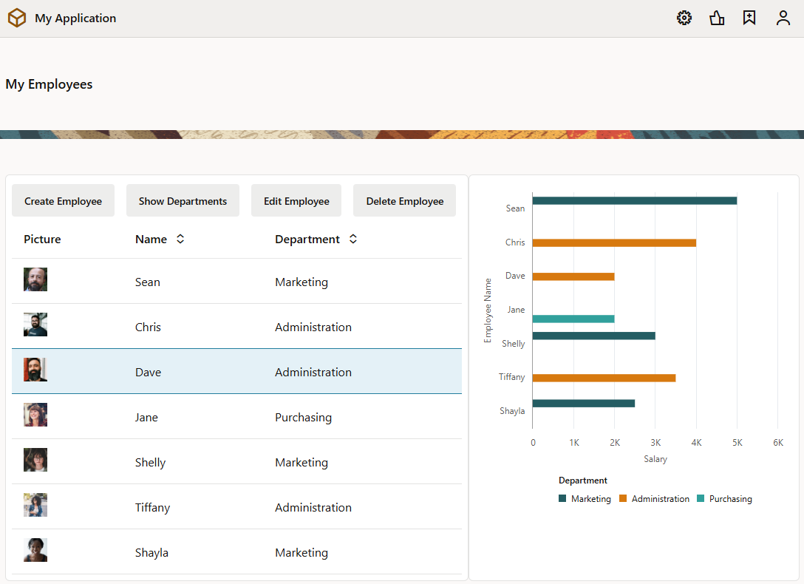

# Add Pages to Manage a Web App's Data

## Introduction

This lab shows how you can create pages and buttons that allow you to edit data, view details of data, and delete data in a table.

Estimated Time: 15 minutes

### About this Lab
In a previous lab, you used a couple of Quick Starts to create pages that let your users add departments and employees. In this lab, you'll use the rest of them to add pages for users to edit and delete departments and employees. You'll also get a chance to test your web pages as they will appear to the user.

### Objectives
In this lab, you will:
* Add web pages to view details, edit data, and delete data
* Test your web pages

### Prerequisites

This lab assumes you have:
* A Chrome browser
* All previous labs successfully completed

## Task 1: Add a page to edit a department's details

An Edit page lets you edit a row in your table. In this task, you'll add a page that lets users change a department's Name and Location. 

1.  Click **Web Applications** , then select the **main-departments** page.  Click **Page Designer** and select the **Table** component on the page. If necessary, click **Reload page**  to view the new departments.
2.  In the Properties pane, click **Quick Start** to display the Quick Start menu, then click **Add Edit Page**.

    

3.  On the Select Read Endpoint step of the Add Edit Page wizard, select **Department** under Business Objects (if necessary) and click **Next**. VB Studio will automatically select the Department object's read endpoint.
4.  On the Select Update Endpoint step, select **Department** under Business Objects again (if necessary) and click **Next**. As with the read endpoint, VB Studio will automatically select the Department object's update endpoint.

5.  On the Page Details step, select **location** (**name** is already selected). Click **Finish**.

    An **Edit Department** button is displayed in the toolbar on the `main-departments` page. The button is inactive.

## Task 2: Add a page to view a department's details

A Detail page lets you view additional details of a row in your table. In this task, you'll add a page for users to see more information about each of your departments.

1.  In the Quick Start menu, click **Add Detail Page**.
2.  On the Select Endpoint step of the Add Details Page wizard, select **Department** under Business Objects (if necessary) and click **Next**. VB Studio will automatically select the endpoint to read a single record.
3.  On the Page Details step, select **name**. Expand the **locationObject** and **items** nodes (expand **item\[i\]** if it isn't already expanded) and select **name**. With this selection, both the department's name and location will show as additional details for the user. Change the **Button label** field to `View Department Detail`. Click **Finish**.

   

    A **View Department Detail** button is displayed in the toolbar on the `main-departments` page. The button is inactive.

4.  Click **Live**, select a row, and then click **View Department Detail** to open the `main-department-detail` page.
5.  Click **Design** to return to Design view.
6.  Click the **Input Text** field for the second **Name** label to open the Input Text's properties. In the **General** tab, change the **Label Hint** value to `Location`.

## Task 3: Add a button to delete a department
A Delete button lets you delete a selected row in your table. In this task, you'll add a delete button to remove a department if you wanted.

1.  Return to the **main-departments** page. Click **Quick Start** if necessary, and click **Add Delete Action**.
2.  On the Select Endpoint step (the only step of the Add Delete Action wizard), select **Department** under Business Objects (if necessary) and click **Finish**. As with other quick starts, the endpoint to delete a record will be automatically selected.

    A **Delete Department** button is displayed in the toolbar on the `main-departments` page. The button is inactive.

## Task 4: Test your new Department pages

Now, let's test your web pages.

1.  Click **Preview** .

    The application opens in another browser tab. The three buttons you created are inactive.

2.  Select a row. All the buttons are now active.
3.  Click **Edit Department**.

    

4.  On the Edit Department page, change the **Location** field to `Floor 4` and click **Save**. A success message appears briefly, and you are returned to the Departments page.
5.  Select the row again and click **View Department Detail** to display the data.

    

6.  Click **Back**.
7.  Click **Create Department** and specify the name and location of a new department, and then click **Save**. A success message appears. The new department is displayed in the table.
8.  Select the new department and click **Delete Department**. A success message appears. The department is no longer displayed.
9.  Close the browser tab.

## Task 5: Add a page to edit an employee's details

Now that we've added options to let users manage departments, we'll do the same for employees. In this task, you'll add an Edit page to update details of your employees.

1.  Go to the **main-employees** page, click **Page Designer**, and select the **Table** component.
2.  Click **Quick Start** to display the Quick Start menu, then click **Add Edit Page**.
3.  On the Select Read Endpoint step of the Add Edit Page wizard, select **Employee** under Business Objects (if necessary) and click **Next**.
4.  On the Select Update Endpoint step, again select **Employee** under Business Objects (if necessary) and click **Next**.
5.  On the Page Details step, select **hireDate**, **email**, and **department** (**name** is already selected) and click **Finish**.

    An **Edit Employee** button is displayed in the toolbar on the `main-employees` page. The button is inactive.

6.  Click **Live**, select a row, and click **Edit Employee** to open the `main-edit-employee` page.
7.  Click **Design**.
8.  Click within the form on the page but outside of a component (that is, in the **Form Layout** component on the page). In the General tab of the form's properties, set the **Max Columns** value to **2**. The fields now appear in two columns.

## Task 6: Add a page to view an employee's details and a button to delete an employee

1.  Go to the **main-employees** page. Click the table, then **Quick Start** in the Properties pane.
2.  In the Quick Start menu, click **Add Detail Page**.
3.  On the Select Endpoint step of the Add Detail Page wizard, select **Employee** under Business Objects (if necessary) and click **Next**.
4.  On the Page Details step, select **name**, **hireDate**, and **email**. Expand the **departmentObject** and **items** nodes (expand **item\[i\]** if it isn't already expanded) and select **name**. Change the **Button label** field to `View Employee Detail`, then click **Finish**.

    A **View Employee Detail** button is displayed in the toolbar on the `main-employees` page. The button is inactive.

5.  Now click **Add Delete Action** in the Quick Start menu.
6.  On the Select Endpoint step of the Add Delete Action wizard, select **Employee** under Business Objects (if necessary) and click **Finish**.

    A **Delete Employee** button is displayed in the toolbar on the `main-employees` page. The button is inactive.

7.  Click **Live**, select a row, and click **View Employee Detail** to open the `main-employee-detail` page.
8.  Click **Design**.
9.  Click the **Input Text** component for the second **Name** label. In the Properties pane, change the **Label Hint** value to `Department`.
10.  Click within the form on the page but outside of a component (that is, in the **Form Layout** component on the page). In the General tab, set the **Max Columns** value to **2**.

## Task 7: Test your Employee pages

1.  Click **Preview** .

    The application opens in another browser tab, displaying the Departments page.

2.  Click **Display Employees**.

    The three buttons you created are inactive.

3.  Select a row. All the buttons are now active.

    

4.  Click **Edit Employee**.
5.  On the Edit Employee page, change **Department** to `IT` and click **Save**. A success message appears, and you are returned to the Employees page.
6.  Select the row again and click **View Employee Detail** to display the data, then click **Back**.
7.  Click **Create Employee** and specify the data for a new employee, then click **Save**. A success message appears, and the new employee is displayed in the table.
8.  Select the new employee and click **Delete Employee**. A success message appears. The employee is no longer displayed.
9.  Close the browser tab.

    You may **proceed to the next lab**.

## Acknowledgements
* **Author** - Sheryl Manoharan, VB Studio User Assistance, November 2021
* **Last Updated By/Date** - Sheryl Manoharan, February 2022
