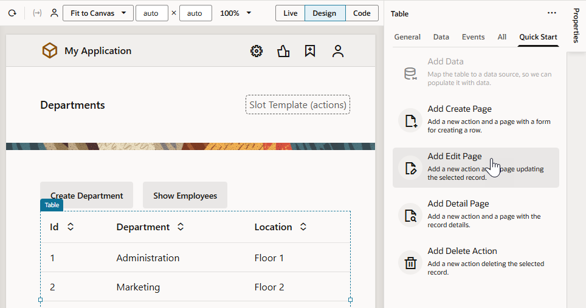
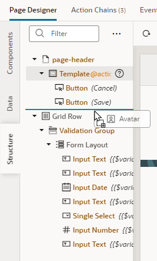
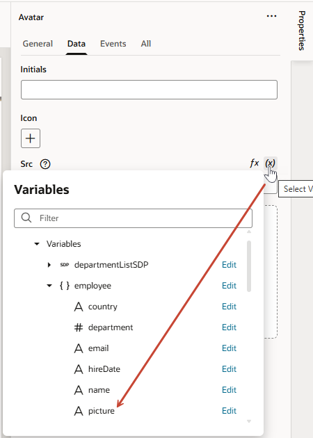
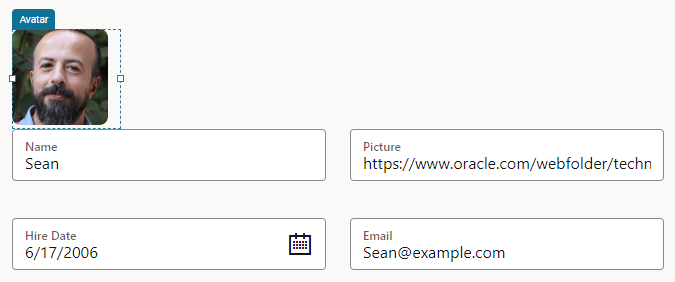
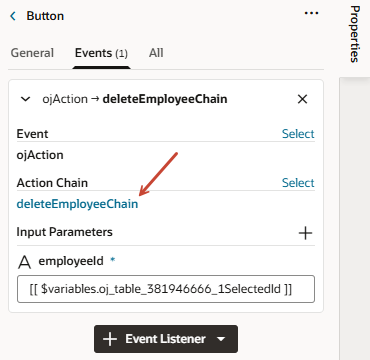
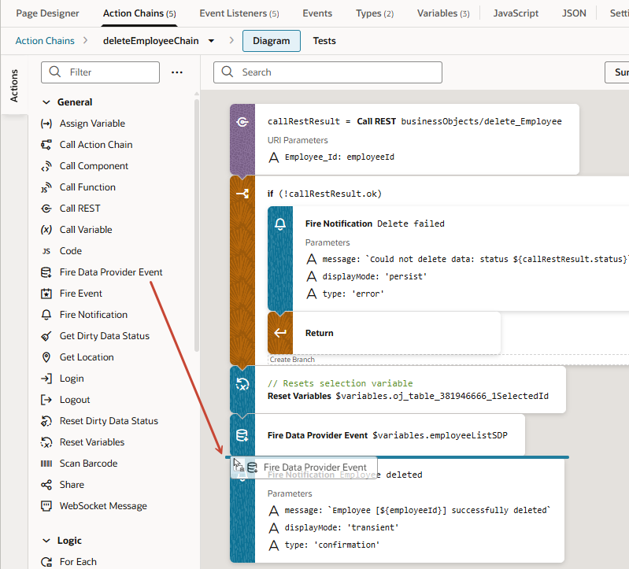
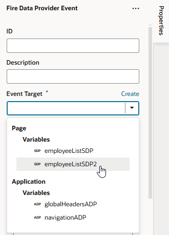
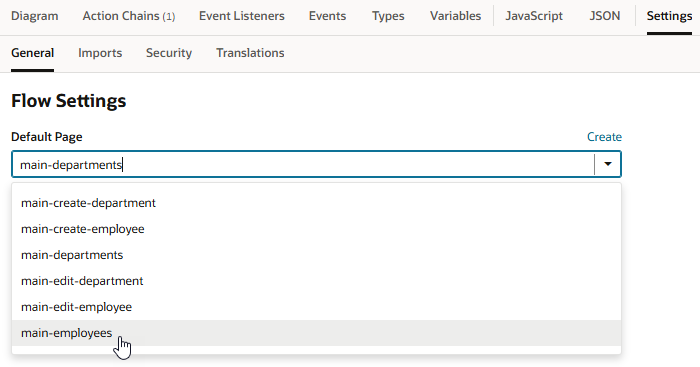

# Add pages to interact with your data

## Introduction

This lab shows how you can create pages and buttons that allow you to edit data, view details of data, and delete data in a table.

Estimated Time: 15 minutes

### About this Lab

In a previous lab, you used a couple of Quick Starts to create pages that let your users add departments and employees. In this lab, you'll use the rest of them to add pages for users to edit and delete departments and employees. You'll also get a chance to test your web pages as they will appear to the user.

### Objectives

In this lab, you will:

* Add web pages to edit and delete data
* Test your web pages
* Change the web app's default home page

### Prerequisites

This lab assumes you have:

* A Chrome browser
* All previous labs successfully completed

## Task 1: Add a page to edit a department's details

In this task, you'll add an edit page that lets users change a department's Name and Location. An Edit page lets you edit a selected row in your table.

1. Select the **main-departments** page in the Web Apps pane.  Click **Page Designer**, then select the **Table** component on the page.
2. In the table's Properties pane, click **Quick Start** to display the Quick Start menu, then click **Add Edit Page**.

    

3. On the Page Details step of the Add Edit Page wizard, select **location** (**department** is already selected). Leave the other fields to their default settings and click **Finish**.

    An **Edit Department** button is displayed in the toolbar on the main-departments page. The button is inactive.

## Task 2: Add a button to delete a department

Add a Delete button to remove a department, so users can remove a department if they wanted.

1. With the table on the **main-departments** page selected, click **Quick Start** if necessary, then **Add Delete Action**.
2. On the Select Endpoint step (the only step of the quick start), select **Department** under Business Objects (if necessary) and click **Finish**. As with other quick starts, the endpoint to delete a record will be automatically selected.

    A **Delete Department** button is displayed in the toolbar on the main-departments page. The button is inactive.

## Task 3: Add a page to edit an employee's details

Now that we've added options to let users manage departments, we'll do the same for employees. In this task, you'll add an Edit page to update details of your employees.

1. Go to the **main-employees** page, click **Page Designer**, and select the **Table** component.
2. In the Properties pane, click **Quick Start** to display the Quick Start menu, then click **Add Edit Page**.
3. On the Page Details step of the Add Edit Page wizard, select **picture**, **hireDate**, **email**, **department**, **salary**, and **country** (**name** is already selected). Click **Finish**.

    An **Edit Employee** button is displayed in the toolbar on the main-employees page. The button is inactive.

4. Click **Live**, select a row, and click **Edit Employee** to open the main-edit-employee page.
5. To make the fields on the main-edit-employee page display in two columns, click **Structure** and select **Form Layout**, then in the General tab of the form's properties, set the **Columns** value to **2**. The fields now appear in two columns.
6. Let's also set up the employee's picture field to display as an image. To do this, search for an Avatar component in the Components palette, drag it into **Structure** view, and drop it above the Grid Row containing the Form Layout component. Make sure the Avatar component is in its own Grid Row.
    

7. In the Avatar's Properties pane, select **Large** in the **Size** drop-down list to increase the component's size.

8. Click the **Data** tab and bind the component to a data source. Components are typically bound to variables that store and display data from your data source. Quick Starts automate this for you, but in this step, we'll manually bind the Avatar component to the **picture** variable that retrieves its data from the **picture** field in the Employee business object. To do this, hover over the **Src** field in the Data tab, click  to open the Variable picker, expand the **employee** object under Page and Variables, then select **picture**.

    

    The employee's image now displays on the page. If you were to update the URL in the **Picture** field, the employee's image will also update.

    

## Task 4: Add a button to delete an employee

1. Go to the **main-employees** page. Switch to **Design** mode, select the table if necessary, then click **Add Delete Action** under Quick Start in the Properties pane.
2. On the Select Endpoint step of the Add Delete Action Quick Start, select **Employee** under Business Objects (if necessary) and click **Finish**.

    A **Delete Employee** button is displayed in the toolbar on the main-employees page. The button is inactive.

3. Because the page features a bar chart as well, let's update the action chain created by the Quick Start to refresh the chart whenever an employee is deleted. Select the **Delete Employee** button, click its **Events** tab in the Properties pane, then select **deleteEmployeeChain** under Action Chain.

    

4. When the deleteEmployeeChain opens in the Action Chain editor, drag a Fire Data Provider Event and drop it on the canvas between the existing Fire Data Provider Event and Fire Notification actions. The Fire Data Provider Event action is used to dispatch an event on a data provider.

    

5. In the second Fire Data Provider Event action's Properties pane, click the **Event Target** drop-down list and select **employeeListSDP2** (which is the data provider backing the bar chart) under Page and Variables.

   

6. Change the Type from **Mutate** to **Refresh**.

## Task 5: Test your Department and Employee pages

Now test the newly created Department and Employee pages.

1. Click  **Preview**.

    The application opens in another browser tab, displaying the Departments page. The two buttons you created are inactive.

2. Select a row. All the buttons are now active.

3. Click **Edit Department**.

    

4. On the Edit Department page, change the **Location** field to `Floor 4` and click **Save**. A success message appears briefly, and you are returned to the Departments page.
5. Click **Create Department** and specify the name and location of a new department, then click **Save**. A success message appears. The new department is displayed in the table.

6. Select the new department and click **Delete Department**. A success message appears. The department is no longer displayed.

7. Now click **Show Employees** to open the Employees page. As with the Departments page, the two buttons you created are inactive.

8. Select a row. All the buttons are now active.

    

9. Click **Edit Employee**.

10. On the Edit Employee page, change the **Department** to `IT` and **Salary** to 6000. Click **Save**. A success message appears, and you are returned to the Employees page. Notice how the bar chart also changes to show the employee's updated salary and department.

11. Click **Create Employee** and specify the data for a new employee, for example:
    * **Name**: `Walter`
    * **Picture**: `https://www.oracle.com/webfolder/technetwork/jet/content/images/hcm/placeholder-male-05.png`
    * **Hire Date**: Select today's date
    * **Email**: `walter@example.com`
    * **Department**: `IT`
    * **Salary**: `4000`
    * **Country**: `NZ`

    Click **Save**. A success message appears, and the new employee is displayed in the table and bar chart.

12. Select the new employee and click **Delete Employee**. A success message appears. The employee is no longer displayed in the table or the chart.

    Close the browser tab.

## Task 6: Change the app's default page

Now that we have our web pages, let's change the application's home page from Departments to Employees—after all, an HR app is about employees.

1. In the Web Apps pane, click the **main** node, then click **Settings**.

2. In the **General** tab, set **main-employees** as the **Default Page**.

   

3. Click **Diagram** to see the **main** flow's new navigation. Notice how the main-employees page is badged , indicating it as the starting page for your application. Previously, it was the main-departments page.

4. Click  **Preview** to see the HR app now open on the Employees page.

    Close the browser tab.

    You may **proceed to the next lab**.

## Acknowledgements

* **Author** - Sheryl Manoharan, VB Studio User Assistance, November 2021
* **Last Updated By/Date** - Sheryl Manoharan, July 2025
