# Create Pages for a Web App

## Introduction

This lab shows you how to create web pages to display the business objects you created in the previous lab.

Estimated Time: 15 minutes

### About this Lab

Now that you've created the Location, Department, and Employee business objects, we'll see how to create web pages to display data from these business objects in your application. So far, you've only imported data for the Location object. You'll add data for the Department and Employee business objects in later labs, but set up the pages required to display that data in this lab. You'll create one page to display departments and another to display employees, both in table components. You'll also add a **Create** button to each page to let your users create a new department or a new employee (in other words, create new instances of the business object in the database).

### Objectives
In this lab, you will:
* Add web pages to display data from business objects
* Add web pages to create new instances of a business object

### Prerequisites

This lab assumes you have:
* A Chrome browser
* All previous labs successfully completed

## Task 1: Use the **main-start** page to display departments

Let's create a table to display your departments on the `main-start` page. The Table component is useful when you want to show lots of data in columns.

1.  Click **Web Applications**  in the Navigator.
2.  If necessary, expand the **hrwebapp** and **main** nodes, then click **main-start**, the page that was automatically created as the default home page for your web application. (You can also open the page by clicking the **main-start** tab just below the header.) You're viewing the Page Designer.

    Click the **Web Applications** tab to close the Navigator pane and expand your work area. You can also widen your browser window.

3.  Let's give this `main-start` page a title. Click `main` on the page canvas—notice how the title text uses the Bind Text component, also selected in the Structure view. (If you're having trouble selecting the component, you'll need to expand the canvas area to better view its elements.)

    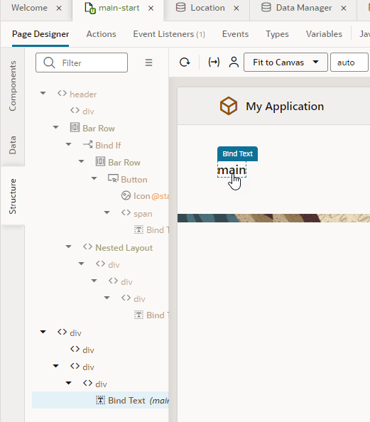

4.  In the Bind Text component's Properties pane, replace `main` with `Departments` in the **Value** field.

    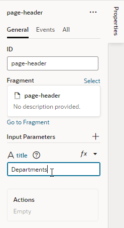

5.  Now click **Components** to open the Components palette and scroll down to Collection. Drag and drop a **Table** component onto the canvas.

   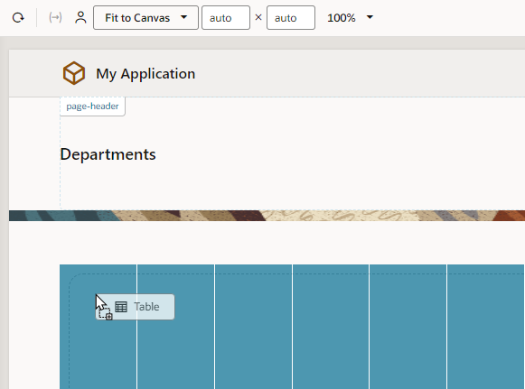

    A table with some sample data is added to the page. We'll use this table to display three columns that map to the department business object's id, name, and location fields.

6.  Select the table if necessary, then click **Add Data** in the Properties pane to open the Add Data Quick Start.

    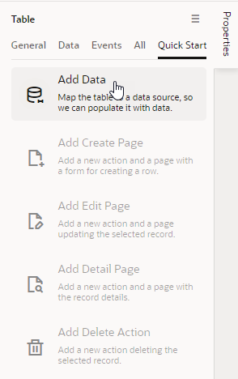

    Quick Starts walk you through complex processes and help build the basics of your application quickly; in this task, we'll use the Add Data Quick Start to connect your table to the Department business object's data. The Quick Start wizard will prompt you to select your data source, select the fields from the business object that you want to show in your table, and filter data (which we won't do here).

7.  On the Locate Data step of the Add Data wizard, select **Department** under Business Objects, then click **Next**.  

    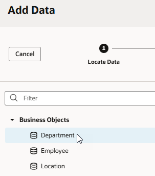

8.  On the Bind Data step, under item\[i\], select **id** and **name** (in that order). These two fields will show as columns in your Departments table.  

    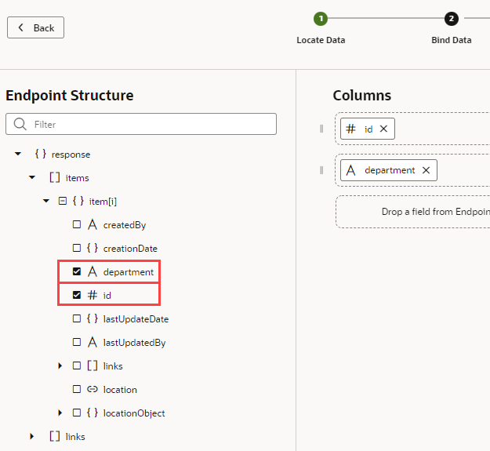

9.  Expand the **locationObject** and **items** nodes (expand **item\[i\]** if it isn't already expanded) and select **name** to enable the location name to appear as another column in the table. Because we created a reference from the Department business object to the Location business object in the previous lab, the location's name field is now available to us through the locationObject accessor, which lets us traverse relationships between the two objects. Click **Next**.

    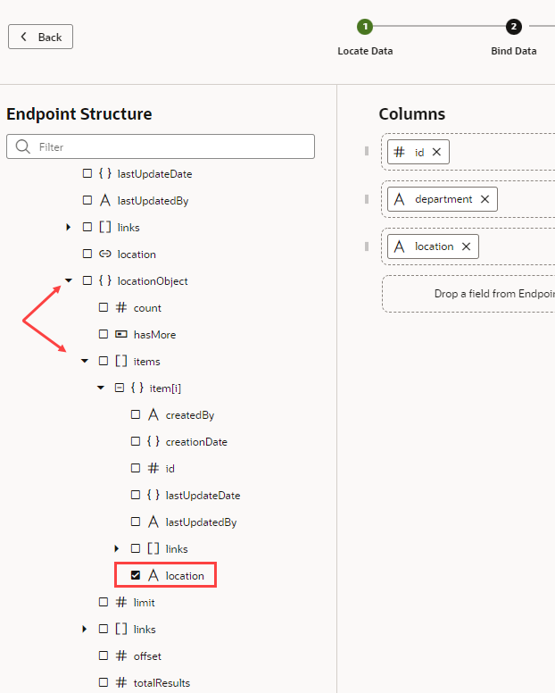

10.  On the Define Query step, click **Finish**.  

    A Departments table with three empty columns is displayed on the `main-start` page. Notice that the second Name column (which maps to the location name field) shows simply as Name because that's what we set for the Display Field when we created the Location reference.

    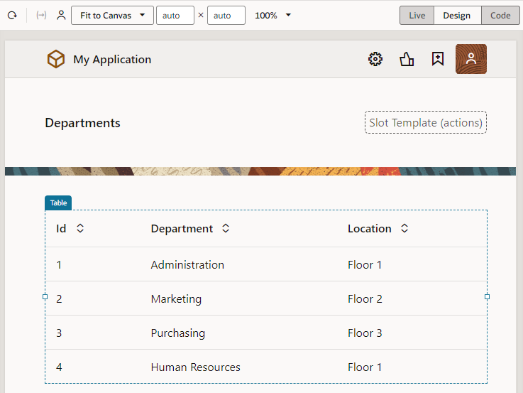

11.  To make the location name column more descriptive, click the **Data** tab in the Properties pane. Under **Table Columns**, click  **Column Detail** next to Name (locationObject). You won't see the icon until you hover the mouse next to the field.  

    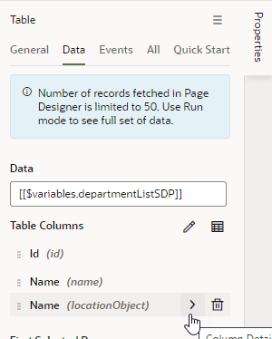

12.  In the **Columns, Header Text** field, change `Name` to `Location`, then click  **Table** to return to the main **Data** tab.  

    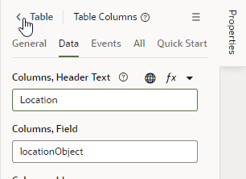

     The `main-start` page now has a table with three columns: Id, Name, and Location. You won't see any records in your table because we are yet to import data for the Department business object.

## Task 2: Add a page to create departments

Now that we have a way to show departments, we'll add a Create page that lets users create new departments. With the help of the Add Create Page Quick Start, we'll connect to our data source, the Department business object, and select the fields that we want the user to provide values for.

1.  With the Departments table on the `main-start` page selected, click **Quick Start**, then click **Add Create Page**.
2.  On the Select Endpoint step of the Add Create Page wizard, select **Department** under Business Objects (if necessary) and click **Next**.
3.  On the Page Detail step, select **location** (**name** is already selected because it's a required field). Name and Location are the only fields the user needs to specify to create a department.

   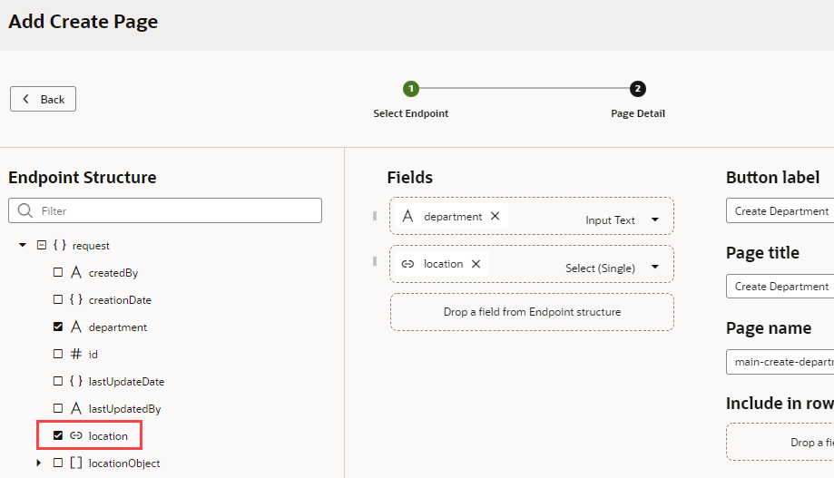
4.  Leave the Button label and other fields set to their default values. Click **Finish**.

    A **Create Department** button appears in a Toolbar component above the table on the `main-start` page. (You might need to click next to the **Create Department** button to see the Toolbar component.) Click  **Web Applications** in the Navigator to see the `main-create-department` page created in the pages list under `main`.

    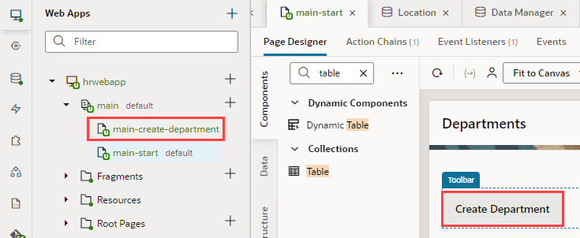

5.  Let's quickly test whether we can create departments. In the hrwebapp's tree, click the **main-create-department** page to open it in the Page Designer.

    The page has a form for you to enter the fields you specified. It also has two buttons: Cancel and Save.

6.  In the Page Designer toolbar, click **Live** to make the form active. (Click **Properties** if you need to make room for the form.)

    To indicate that you are in Live mode, the **Live** option now has a green background, and a green line appears around the page.

7.  Enter `Administration` in the **Name** field, and select **Floor 1** from the **Location** list.

    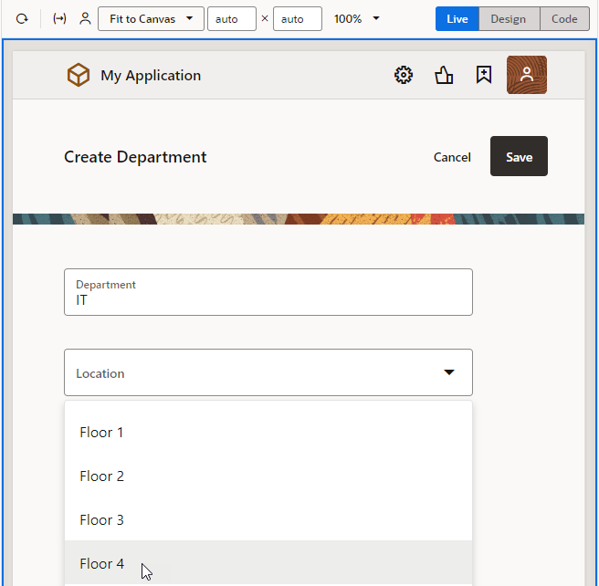

    Click **Save**. A message appears briefly and you are taken to the application's Diagram tab, which visually represents the application's `main` page flow.

    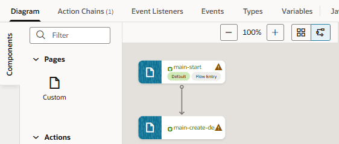

    **Tip:** A page that's marked with a warning triangle usually indicates that the page's code has issues that you might want to review. For example, the warning for the `main-start` page here relates to a translation issue, which you can safely ignore. If you want, click **Audits** at the bottom of the screen to review and resolve issues in the Audits pane. You can also select messages that you don't want to be flagged and disable reporting for those messages in the Code editor.

8.  Open the **main-start** page (you can either click the `main-start` tab just below the header or click the page in the Web Apps pane), then click **Reload page**  to see the row you created.

    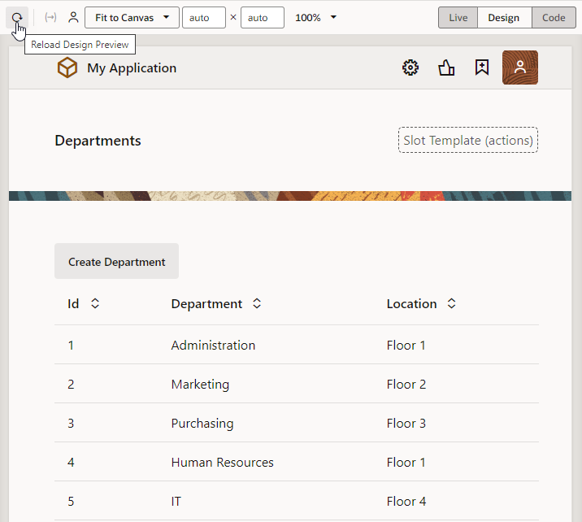

9.  Click **Design** to return to Design view.

## Task 3: Add a page to display employees

We'll now create a page to display employees, similar to the one you created to show departments.

1.  In the Web Apps pane, under **hrwebapp**, click **+** (Create Root Page) next to the **main** node and select **Create Page**.

    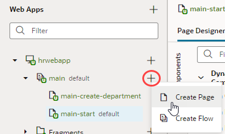

2.  In the Create Page dialog box, enter `employees` in the **Page ID** field after the `main-` prefix and click **Create**.

    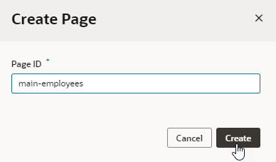

    The `main-employees` page opens in the Page Designer.

3.  Click the **main-employees** Bind Text component on the page. Click **Properties** if necessary, then in the Properties pane, change `main employees` to `Employees` in the **Value** field.
4.  Now let's add a table to display employees. This time, instead of using the Components palette, let's use the Data palette, which provides a *data-first approach* to UI design. The Data palette  provides access to your business objects and allows you to drag and drop them onto the canvas to create UI components that readily map to your data sources. To see this in action, click **Data** to open the Data palette, then expand the **Employee** business object.

    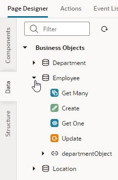

  You see all the REST endpoints that VB Studio created for you when the Employee business object was created.

5. Drag and drop the **Get Many** REST endpoint (which fetches a list of employees) onto the canvas to bring up the **Render as** pop-up.

    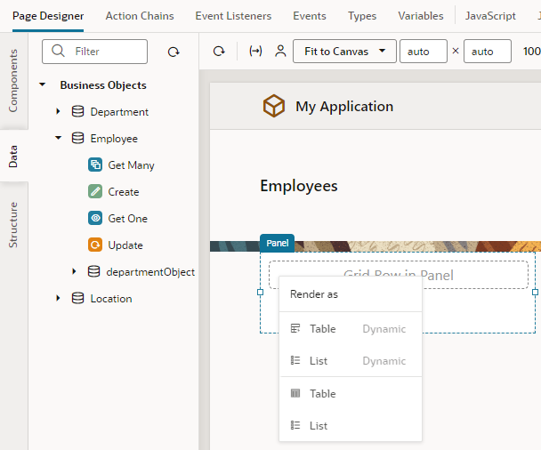

6.  Select **Table** in the pop-up menu (the second Table option, not Table Dynamic) to open the Add Data quick start.  This quick start is similar to the one you used before to create the departments table, except that you don't need to associate a data source.

7.  On the Bind Data step of the Add Data wizard, select **id**, **name**, **hireDate**, and **email** under item\[i\]. The columns appear in the order selected; if you want to change the order, drag a **Handle** icon  to reorder the columns as desired.

    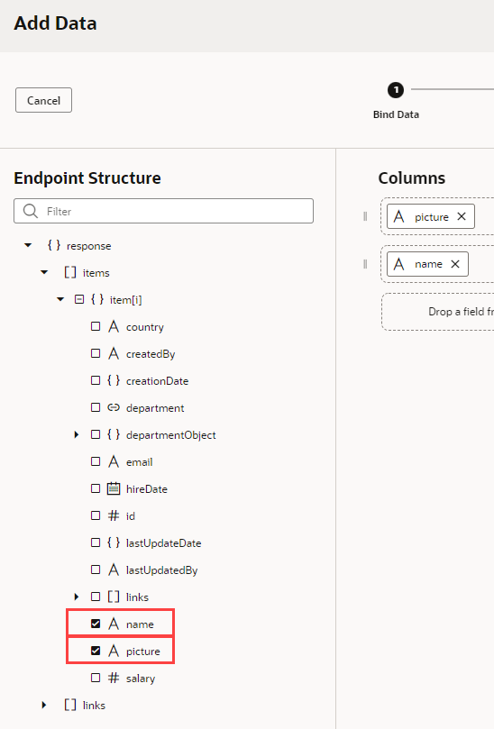

8.  Expand the **departmentObject** and **items** nodes (expand **item\[i\]** if it isn't already expanded) and select **name**, then click **Next**.

    

9.  On the Define Query step, click **Finish**.

    An empty Employees table is displayed. If all the fields don't show, resize the table to see all fields.

10.  To make the second Name column (which refers to the Department name field) descriptive, click **Data** in the table's Properties pane. Under **Table Columns**, click  **Column Detail** next to Name  (departmentObject).

    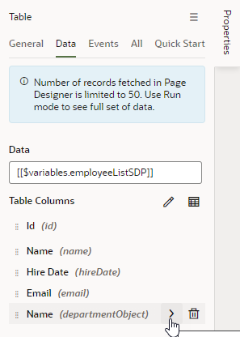

11.  In the **Columns, Header Text** field, change `Name` to `Department`, then click  **Table** to return to the main **Data** tab.

     The `main-employees` page now has a table with five columns: Id, Name, Hire Date, Email, and Department. You won't see any information in the table until we import data for the Employee business object in a later lab.

     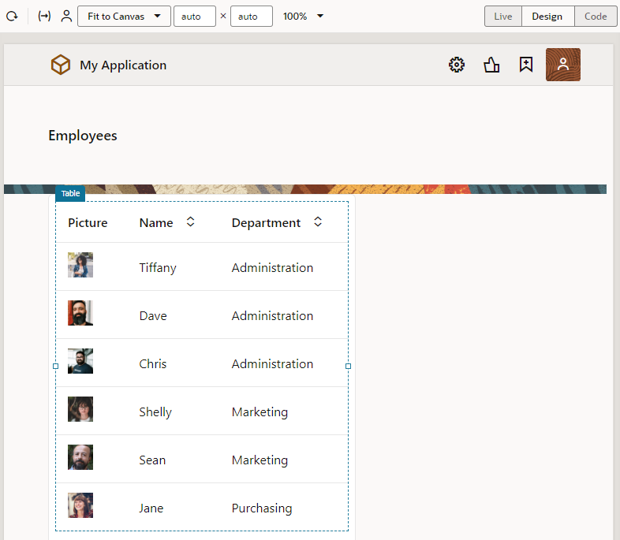

## Task 4: Add a page to create employees

Add a Create page that lets your users create new employees.

1.  With the table selected on the `main-employees` page, click the **Quick Start** tab in the Properties pane, then click **Add Create Page**.
2.  On the Select Endpoint step of the Add Create Page wizard, select **Employee** under Business Objects (if necessary) and click **Next**.
3.  On the Page Detail step, select **hireDate**, **email**, and **department**, in that order (**name** is already selected because it's a required field).
4.  Leave the Button label field and other fields set to their default values. Click **Finish**.

    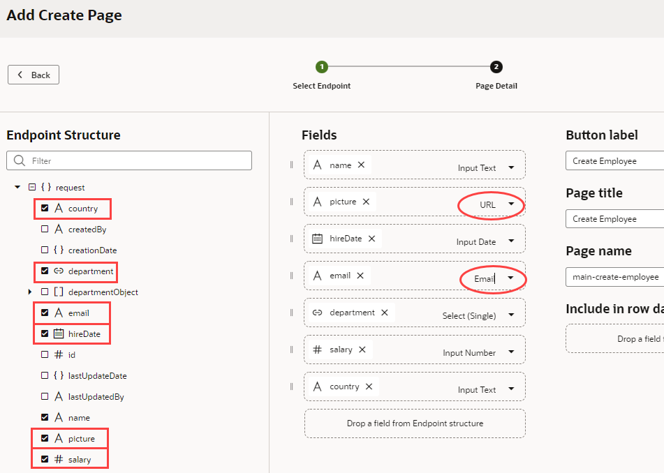

    A **Create Employee** button appears above the table, and the `main-create-employee` page appears in the pages list.

5.  In the pages list, click the **main-create-employee** page to open it in the Page Designer.
6.  Click within the form on the page but outside of a component (that is, in the Form Layout component on the page). In the **General** tab of the Form Layout's properties, set the **Max Columns** value to **2**.

    

    The fields now appear in two columns. If you don't see the change, click **Properties** to hide the Properties pane and expand your view.

7.  Switch to **Live** mode. Enter `Leslie Smith` in the **Name** field. Select today's date from the **Hire Date** calendar, and enter `lsmith@example.com` in the **Email** field. Select `Administration` (the only choice) from the **Department** list. (You can use other data if you wish, except for Department, because you have only one department.) Click **Save**.  

    VB Studio briefly displays a message and then places you in the `main` page flow of your application.

    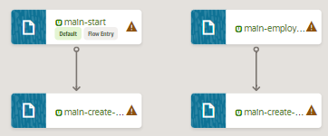

8.  Return to the `main-employees` page. (You can double-click the page tile in the page flow, in addition to using other navigation mechanisms.) Click **Reload page**  to display the row you created.
9.  Click **Code** (next to **Design** in the Page Designer toolbar) to view the HTML code for the `main-employees` page. You can see the code for the page title, the toolbar, and the table within `div` elements. You could edit this code to create a customized user interface. The components and classes all begin with `oj-`, indicating that they are Oracle JavaScript Extension Toolkit (JET) components.  

    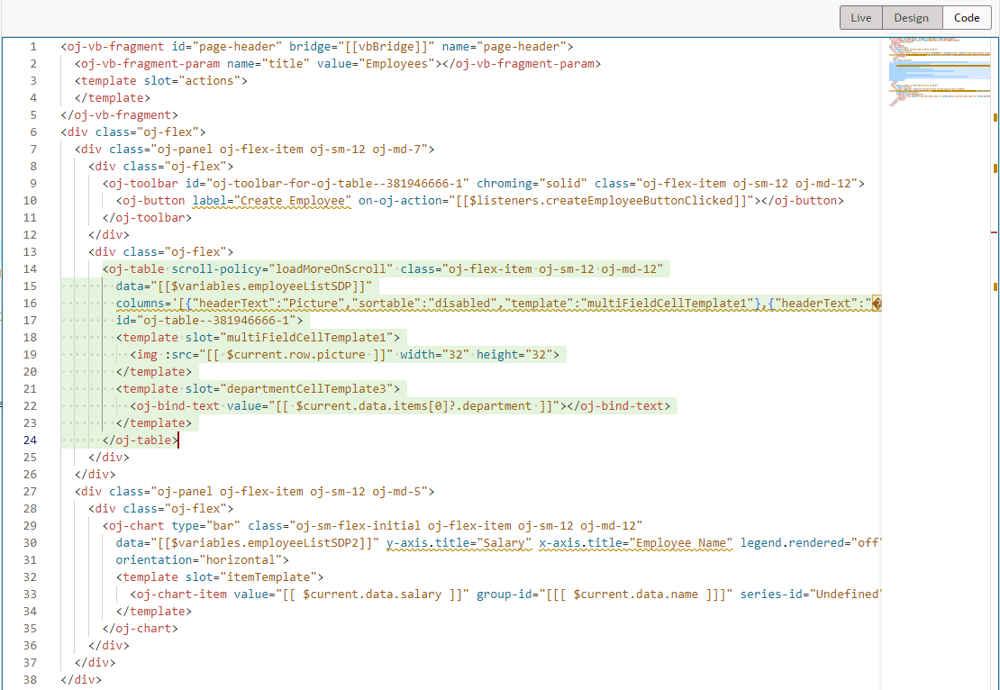

10.  Click **Design** to return to the `main-employees` page, then click **Structure** to view the component structure on the page.

    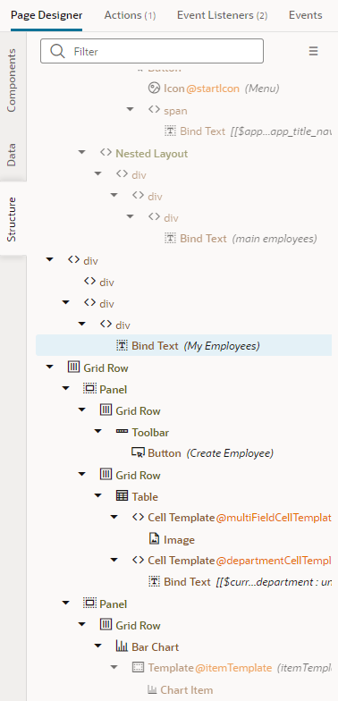

11.  Click **Structure** again to close the Structure view.

## Task 5: Change the name of the **main-start** page

It makes sense at this point to change the name of the `main-start` page to `main-departments`, to match the name of the `main-employees` page.

1.  In the Web Apps pane, right-click the **main-start** page and select **Rename**.

    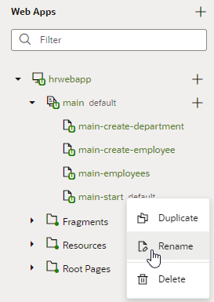

2.  In the Rename dialog box, replace `start` with `departments` in the **ID** field and click **Rename**.
3.  Click **main**. The page flow Diagram shows the now renamed page.

    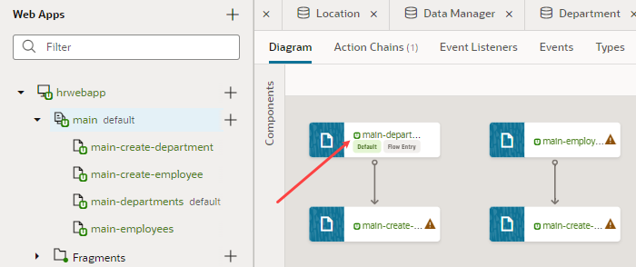

4.  Double-click the **main-departments** tile to go to that page again.
5.  Although you have changed its name, the `main-departments` page will continue to be the page where your application starts when you run it. To find out why, click **Source** 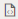 in the Navigator. Under **webApps**, expand the **hrwebapp**, **flows**, and **main** nodes. Then click **main-flow.json** to open it.

    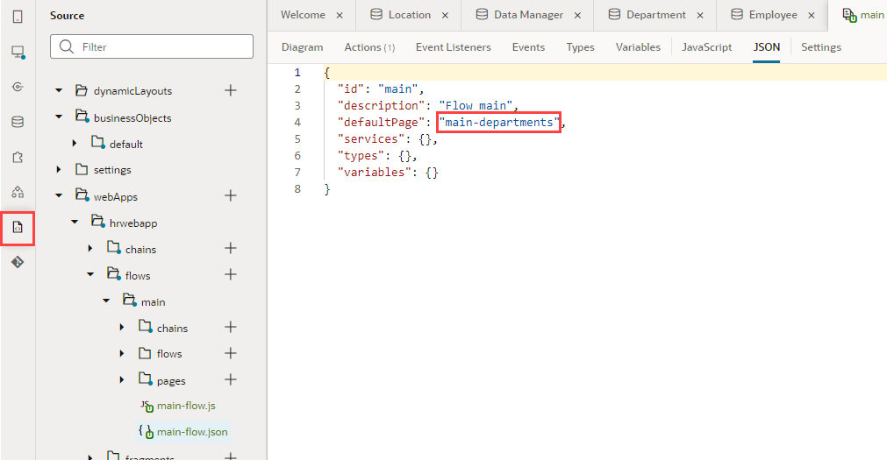

    You can see that the `defaultPage` property has been set to the value `main-departments`, making it the starting page for the web application flow. (If we'd looked before, it would have been set to `main-start`.)

    You may **proceed to the next lab**.

## Acknowledgements
* **Author** - Sheryl Manoharan, VB Studio User Assistance, November 2021
* **Last Updated By/Date** - Sheryl Manoharan, February 2022
