# Create pages to display your data

## Introduction

This lab shows you how to create web pages to display the business objects you created in the previous lab.

Estimated Time: 15 minutes

### About this Lab

Now that you've created the Location, Department, and Employee business objects, we'll see how to create web pages to display data from these business objects in your application. You'll create one page to display departments and another to display employees. You'll also add pages that let your users create a new department or a new employee (in other words, create a new instance of the business object in the database). We'll do all this using Quick Starts, a handy set of wizards that work behind the scenes and make it easy for you to create pages and interact with your data.

### Objectives

In this lab, you will:

* Add web pages to display data from business objects
* Add web pages to create new instances of a business object

### Prerequisites

This lab assumes you have:

* A Chrome browser
* All previous labs successfully completed

## Task 1: Use the **main-start** page to display departments

Let's create a table to display your departments on the main-start page. The Table component is useful when you want to show lots of data in columns.

1. Click **Web Applications**  in the Navigator.
2. If necessary, expand the **hrwebapp** and **main** nodes, then click **main-start**, the page that was automatically created as the default home page for your web application. (You can also open the page by clicking the **main-start** tab just below the header.)

    You might want to click the **Web Applications** tab to close the Navigator pane and expand your work area. You can also widen your browser window.

3. Now that you're in the Page Designer, let's give the main-start page a title. Click **main** on the page canvas—notice how the title text uses the Bind Text component.

    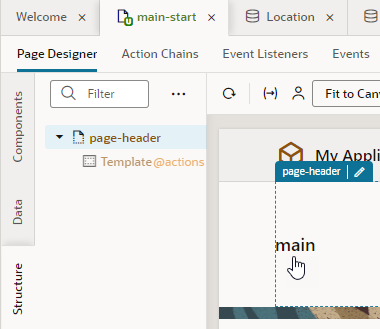

    If you're having trouble selecting the component, you'll need to expand the canvas area to better view its elements. Make sure you select the Bind Text component, not the div element surrounding it.

4. In the Bind Text component's Properties pane (click **Properties** if needed), replace `main` with `Departments` in the **Value** field.

    

5. Click **Components** on the left edge of your work area to open the Components palette. Enter `table` in the Filter field, then drag and drop **Table** from the **Collections** category onto the canvas.

   

    A table with some sample data is added to the page. We'll use this table to display three columns that show a department's id, name, and location.

6. Select the table if necessary, then click **Add Data** in the Properties pane to open the Add Data Quick Start.

    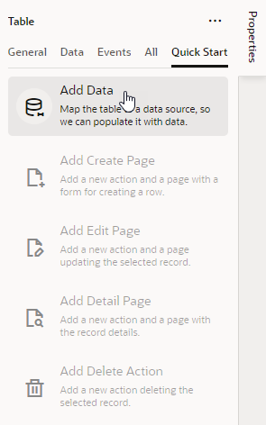

    Quick Starts simplify things so you can quickly build common functionality that every application provides. Here, we'll use the Add Data Quick Start to connect your table to the Department business object and display that data. The Quick Start wizard will prompt you to select your data source, select the fields from the business object that you want to show in your table, and filter data (which we won't do here).

7. On the Locate Data step of the Add Data wizard, select **Department** under Business Objects, then click **Next**.

    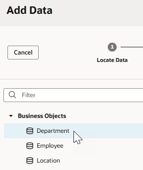

8. On the Bind Data step, under item\[i\], select **id** and **department** (in that order). The two fields are added as Columns for your Departments table.

   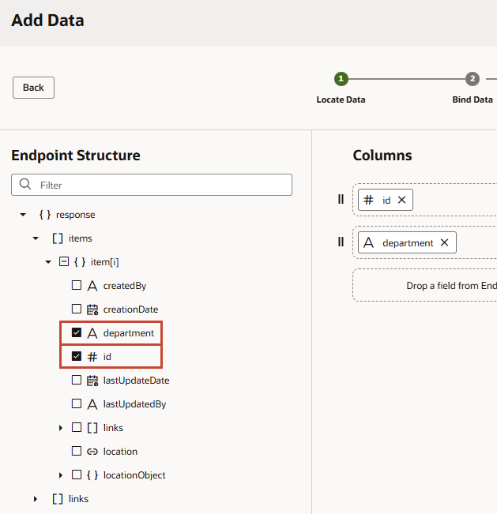

9. Expand the **locationObject** and **items** nodes (expand **item\[i\]** if it isn't already expanded) and select **location**. Because we created a reference-type field from the Department business object to the Location business object, the Location field is now available to us through the locationObject accessor (which lets us traverse relationships between the two objects). Click **Next**.

    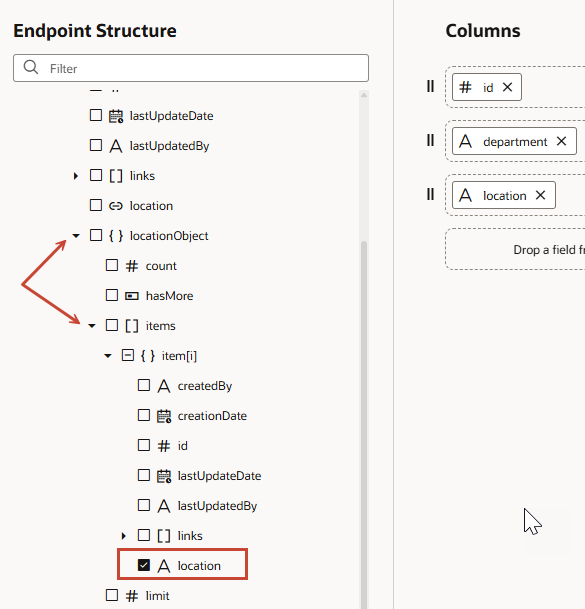

10. On the Define Query step, click **Finish**.

    A Departments table with the Id, Department, and Location columns is displayed on the main-start page.

    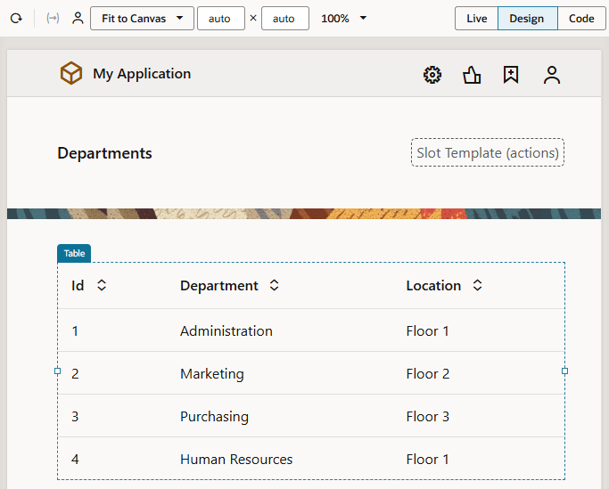

## Task 2: Add a page to create departments

Now that we have a way to show departments, we'll add a Create page that lets users create new departments. With the help of the Add Create Page Quick Start, we'll connect to our data source, the Department business object, and select the fields that we want the user to provide values for.

1. With the Departments table on the main-start page selected, click **Add Create Page** in the **Quick Start** menu.
2. On the Select Endpoint step of the Add Create Page wizard, select **Department** under Business Objects (if necessary) and click **Next**.
3. On the Page Detail step, select **location** (**department** is already selected because it's a required field). Department and Location are the only fields the user needs to specify to create a department.

   

4. Leave other values set to their defaults. Click **Finish**.

    A **Create Department** button appears in a Toolbar component above the table on the main-start page. (You might need to click next to the **Create Department** button to see the Toolbar component.) Click  **Web Applications** in the Navigator to see the **main-create-department** page created in the pages list under **main**.

    

5. Let's now quickly test whether we can create departments. Click the **main-create-department** page to open it in the Page Designer.

    The page has a form for you to enter the fields you specified. It also has two buttons: Cancel and Save.

6. In the Page Designer toolbar, click **Live** to make the form active. (Click **Properties** if you need to make room for the form.)

    To indicate that you are in Live mode, the **Live** option now has a green background, and a green line appears around the page.

7. Enter `IT` in the **Department** field, and select **Floor 4** from the **Location** list.

    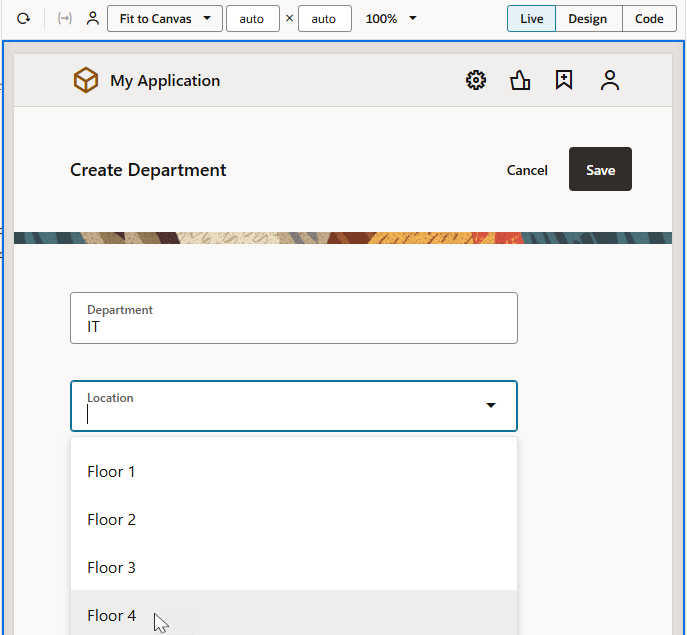

    Click **Save**. A message appears briefly and you are taken to the application's **Diagram** tab, which displays the application's **main** flow and navigational relationships between pages in the flow.

    

    **Tip:** A page that's marked with a warning triangle usually indicates that the page's code has issues that you might want to review. For example, the warnings for the main-start and main-create-department pages here relate to a translation issue, which you can safely ignore. If you want, click **Audits** at the bottom of the screen to review and resolve issues in the Audits pane. You can also select warnings you don't want flagged and disable reporting for those messages in the Audits Menu .

8. Double-click the **main-start** tile to open the page (you can also click the page in the Web Apps pane, click the **main-start** tab just below the header if it's visible, or click  in the tab bar and select the page in the drop-down list). Now click **Reload Design Preview**  to see the department you created.

    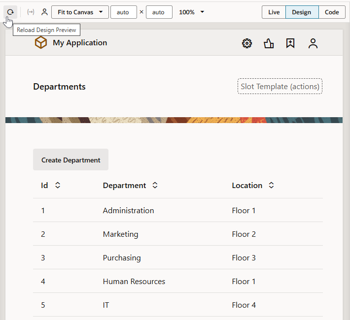

## Task 3: Add a page to display employees

We'll now create a page to display employees, similar to the one you created to show departments. In addition to a table that lists employees, we'll add a chart that lets you display employee salary visually.

1. In the Web Apps pane, under **hrwebapp**, click **+** (Create Page) next to the **main** node and select **Create Page**.

    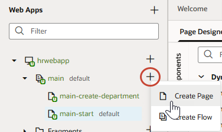

2. In the Create Page dialog box, add `employees` in the **Page ID** field after the **main-** prefix and click **Create**.

    

    The main-employees page opens in the Page Designer.

3. Click **main-employees** on the page to select the Bind Text component, then in the **Properties** pane (click **Properties** if you need to), change `main employees` to `Employees` in the **Value** field.

4. Because we want to show a table as well as a chart, it might help to split the page into two distinct areas using panels. A panel encapsulates content with a border and padding. To add a panel to the page, enter `panel` in the Components Filter field, then drag and drop the **Panel** component onto the page.

5. Select the panel on the page (if necessary) and use the resize cursor to shrink it to seven columns.

    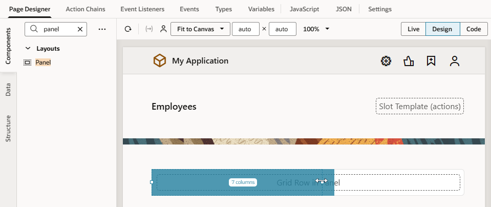

6. Now let's add our table. This time, instead of using the Components palette, let's use the Data palette, which provides a *data-first approach* to UI design. The Data palette provides access to your business objects, so you can drag and drop them onto the canvas and readily map them to UI components. To see this in action, click the **Data** tab, then expand **Business Objects** and **Employee**.

    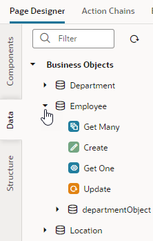

    You see the REST endpoints that VB Studio created for you when the Employee business object was created.

7. Drag and drop the **Get Many** REST endpoint (which fetches a list of employees) into the Panel component on the canvas.

    

8. Select **Table** (not Table Dynamic) in the pop-up menu to open the Add Data quick start.  This quick start is similar to the one you used before to create the departments table, except that you don't need to associate a data source.

9. On the Bind Data step of the Add Data wizard, select **picture** and **name** under item\[i\].

    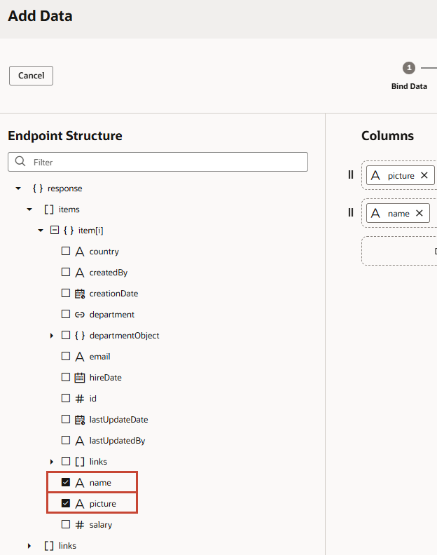

10. Expand the **departmentObject** and **items** nodes (expand **item\[i\]** if it isn't already expanded) and select **department**.

    ![Part of the Bind Data page of the Add Data quick start after the departmentObject node has been expanded is shown. The items and item\[i\] nodes are expanded, and the department check box is selected. In the Columns list, department appears at the bottom. ](images/employees-add-data-2.png "")

    The columns appear in the order selected; if you want to change the order, drag a **Handle** icon  to reorder the columns as desired.

11. For the picture column, change **Text** to **Image**, so the picture displays. Click **Next**.

    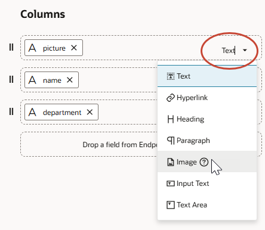

12. On the Define Query step, click **Finish**.

    An Employees table with the Picture, Name, and Department columns is displayed with data. Resize the table to take up all available space within the panel.

     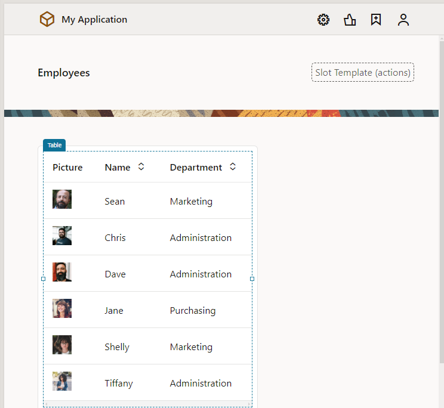

## Task 4: Add a chart to display employees

Now that you've displayed some employee data in a table, let's add a chart to visually display employee salary. The table and chart both use the Employee business object as their data source, they only display the data differently.

1. Click **Components**, then drag another Panel component onto the page, next to the existing table.

2. Enter `chart` in the Components Filter field, then from the **Chart** section, drag a **Bar Chart** into the panel on the page:

   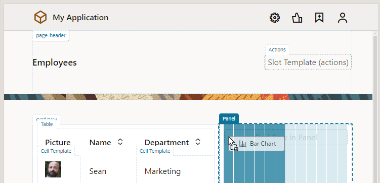

3. When the Bar Chart is added to the page, resize it to fit the panel.

   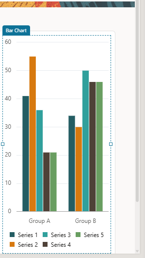

4. In the Properties pane's Quick Start tab, click **Add Data** to open the Add Data Quick Start.

5. On the Locate Data step of the Quick Start, select **Employee** under Business Objects and click **Next**.

6. On the Map Fields step, select **salary** to add it to the **Values (Y Axis)** field, then **name** to add it to the **Categories (X Axis)** field. Leave the **Colors (Series)** field blank, and click **Next**.

    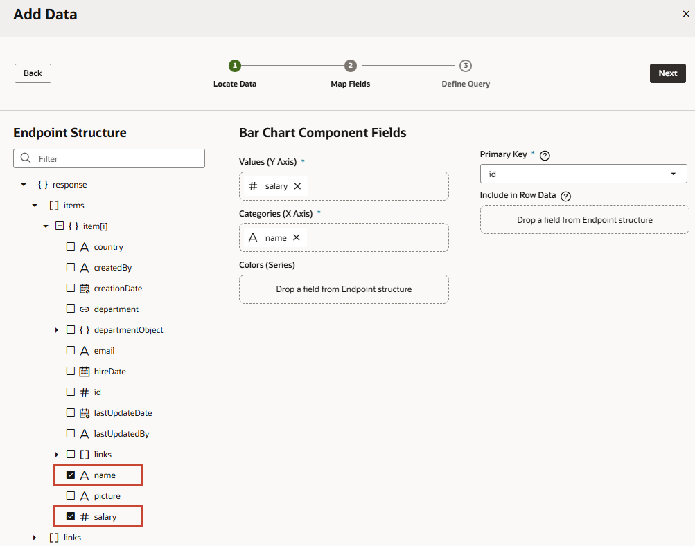

7. On the Define Query step, click **Finish**.

    The chart displays the salary for each employee.

    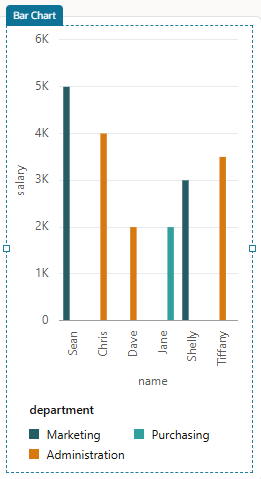

8. Click the chart's **General** tab in the Properties pane. In the **X Axis, Title** field, change **name** to **Employee Name**. In the **Y Axis, Title** field, change **salary** to **Salary**. Change the Orientation from **Vertical** to **Horizontal**.

    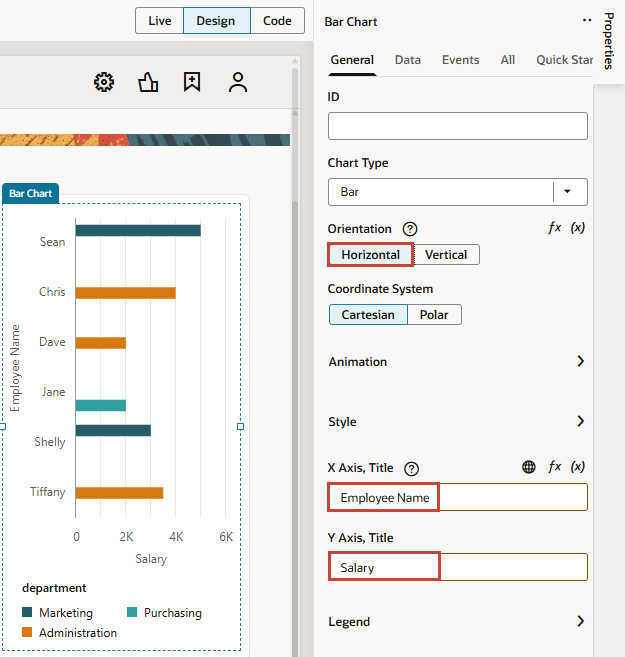

## Task 5: Add a page to create employees

Add a Create page that lets your users create new employees.

1. Select the table component within the panel on the main-employees page, click the **Quick Start** tab in the Properties pane, then click **Add Create Page**.
2. On the Select Endpoint step of the Add Create Page wizard, select **Employee** under Business Objects (if necessary) and click **Next**.
3. On the Page Detail step, select **picture**, **hireDate**, **email**, **department**, **salary**, and **country** in that order (**name** is already selected, because it's a required field). Because our employee images are stored in a database elsewhere and we only reference their paths, change the **picture** field's type to **URL** for validation.  Change the **email** field's control type from **Input Text** to **Email**.

    

4. Leave the **Button label** field and other fields to their default values. Click **Finish**.

    A **Create Employee** button appears above the table, and the **main-create-employee** page appears in the pages list.

5. In the pages list, click the **main-create-employee** page to open it in the Page Designer.
6. Click within the form on the page but outside of a component (that is, in the Form Layout component on the page). In the **General** tab of the Form Layout's properties, set the **Columns** value to **2**.

    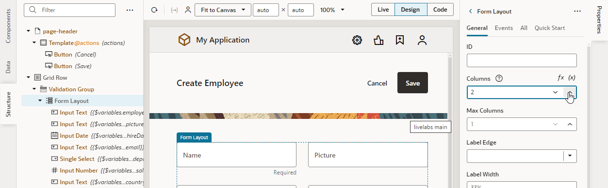

    The fields now appear in two columns.

7. Click **Live** to make the form active. Enter or select the following (you can use other data if you wish):
    * **Name**: `Walter`
    * **Picture**: `https://www.oracle.com/webfolder/technetwork/jet/content/images/hcm/placeholder-male-05.png`
    * **Hire Date**:  Select today's date
    * **Email**: `walter@example.com`
    * **Department**: `IT`
    * **Salary**: `2500`
    * **Country**: `CA`

    Click **Save**.

    VB Studio briefly displays a message and then places you in the application's **main** flow.

    

8. Return to the main-employees page. (You can double-click the page tile, in addition to using other navigation mechanisms.) If necessary, click **Reload Design Preview**  to display the new employee, both in the table and the bar chart.
9. Now click **Code** (next to **Design** in the Page Designer toolbar) to view the HTML code for the main-employees page. You can see the code for the title, the table, and the chart within `div` elements.  The components and classes all begin with `oj-`, indicating that they are Oracle JavaScript Extension Toolkit (JET) components.

    

    Select the **oj-bind-text** value in line 34 and change `Employees` to `My Employees`:

    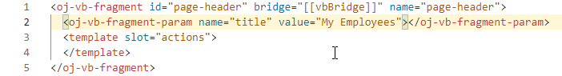

     Now click **Design** to see your changes reflected in the page's visual editor. Whichever mode you choose to work in (visual or source code), your changes are synced to keep both views consistent.

10. Click **Structure** to view the structure of components on the main-employees page. Components that aren't currently visible on the page fade into the background to allow you to focus on parts of a page, a section at a time.

11. Click **Structure** again to close the Structure view.

## Task 6: Change the name of the **main-start** page

It makes sense at this point to change the name of the main-start page to main-departments, to match the name of the main-employees page.

1. In the Web Apps pane, right-click the **main-start** page and select **Rename**.

    

2. In the Rename dialog box, replace `start` with `departments` in the **ID** field and click **Rename**.
3. Click **main**. The page flow Diagram shows the now renamed page. Note how the main-departments page is still badged , indicating it as the page where your application starts when you run it.

    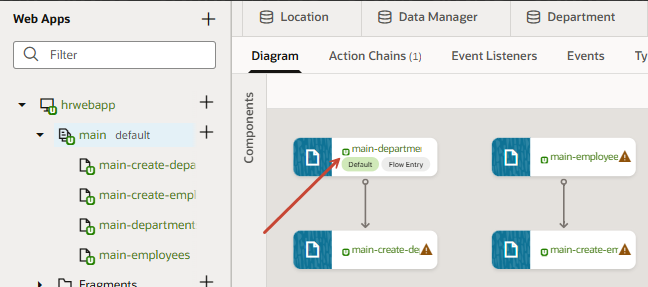

4. To find out why, click **Source**  in the Navigator. Under **webApps**, expand the **hrwebapp**, **flows**, and **main** nodes. Then click **main-flow.json** to open it.

    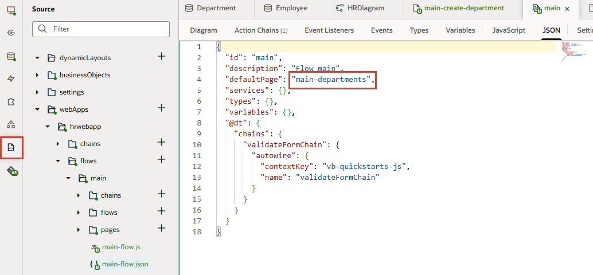

    You can see that the **defaultPage** property has been set to the value **main-departments**, making it the starting page for the web application flow. If we'd looked before, it would have been set to **main-start**.

    You may **proceed to the next lab**.

## Acknowledgements

* **Author** - Sheryl Manoharan, VB Studio User Assistance, November 2021
* **Last Updated By/Date** - Sheryl Manoharan, May 2023
