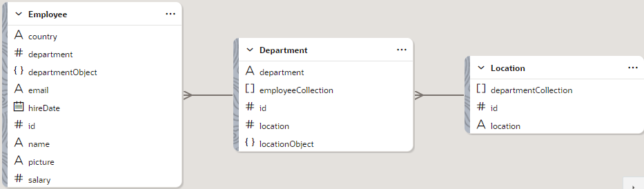
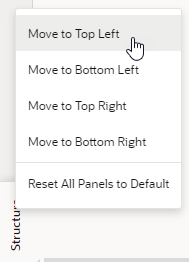
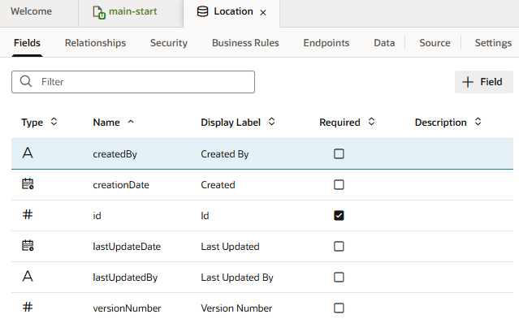
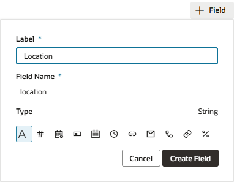
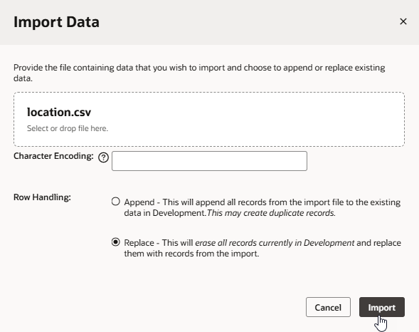
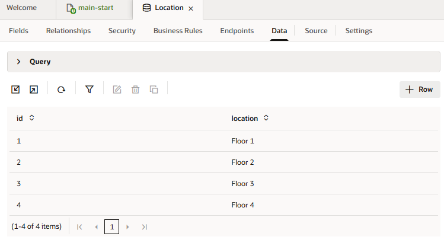
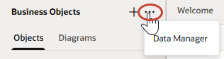
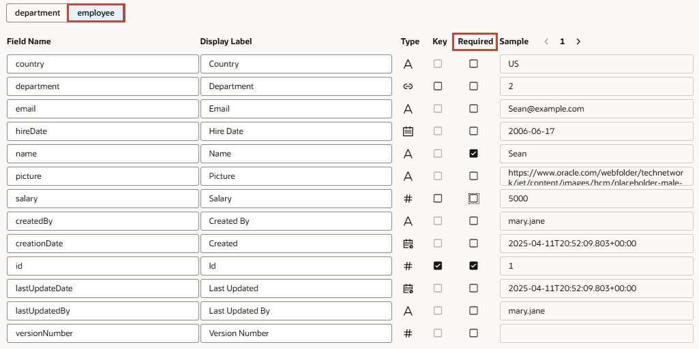

# Create a Web App in a Visual Application

## Introduction

This lab shows you how to create a web app in your visual application project and populate it with business objects that store your data.

Estimated Time: 15 minutes

### About this Lab
Web and mobile applications in VB Studio take shape within the _Designer_, a rich graphical user interface that lets you design and develop your application by dragging and dropping components on a page. You use these components—all based on the open-source Oracle JavaScript Extension Toolkit (JET)—to create rich UIs that span multiple devices.

Each component depends on a _business object_ for its data. A business object is just a resource—like a purchase order or invoice—that has fields to hold your application's data. It is similar to a database table, as it provides the structure for your data; in fact, business objects are stored in a database. Your application accesses the data in these business objects through REST endpoints that VB Studio generates for you.

In this lab, you'll create the Employee, Department, and Location business objects for the HR web application. Each business object has its own set of fields as shown here:

Once you have your business objects, you'll use them to build the HR web application in which every employee belongs to a department, and every department has a location.

### Objectives
In this lab, you will:
* Create a web app in your visual application
* Create reusable business objects to store data
* Create a diagram to visualize relationships between your business objects

### Prerequisites

This lab assumes you have:
* A Chrome browser
* All previous labs successfully completed

## Task 1: Create a web app

The first thing we'll do is add a web app to the HR visual application you just created. A visual application is a container for all your web and mobile applications. In this task, you add a single web app to your visual application, but you can have more than one, even both web and mobile apps in the same visual application.

1.  On the Project Home page, click **HR Visual Application** under Workspaces.

    The visual application opens on the Designer's Welcome page.

    

    The Welcome page contains a set of tiles in three groups: **Connect to Data**, **Create Apps**, and **Add Artifacts**. On the far left are icons representing Mobile Applications, Web Applications, Services, Business Objects, Components, Processes, Source, and Git. This vertical toolbar is the Navigator.

    Now take note of the header:

    

    On the left is the name of your current workspace, **HR Visual Application**; next to it is the project's Git repository (**tutorial-hr-project.git**) and the branch currently associated with your workspace (**hrbranch**). Click each option to see other actions that you can perform from here. Clicking  will take you back to the Project Home page.

    Elements on the right let you perform various other actions. For example, you can undo your most recent change, redo a change after clicking Undo, or search the Git repository for a file. This workshop primarily demonstrates the options to preview your app and publish changes.

2.  We want to create a web application, so under **Create Apps**, let's click the **Web Apps** tile.

    The Web Apps pane opens in the navigator.

    

3.  Click **\+ Web Application** (or the **+** sign at the top of the pane).
4.  In the Create Web Application window, enter `hrwebapp` as the **Application Name**. (You can specify uppercase as well as lowercase characters in the application name, but the name is converted to lowercase.) Leave the **Navigation Style** set to the default, **None**, and click **Create**.

    The application opens on the **main-start** page, which is your application's default home page created automatically for you. By convention, a page name takes its flow as a prefix. This simple application uses only the **main** flow. More complex applications can have more than one flow.

    (You can ignore the **This dot says that you have made some changes** dialog that appears in the header for now; we'll explore Git changes in a later lab.)

    

    What you see under the **main-start** tab is your application's main work area. Just under main-start are several horizontal tabs: **Page Designer**, **Actions**, **Event Listeners**, and so on. Each tab provides editors to help you examine and modify artifacts used in the page. By default, the page opens in the **Page Designer** that features the **Components** palette, the **Data** palette, and the **Structure** view on the left edge of the work area. To design your pages, you'll drag UI components from the Components palette to the canvas. Once you add components, the hierarchy of those components on your page will show in the Structure view.

    On the far right is the **Properties** pane, which lets you view or edit a component's properties. When the entire page is selected (as it is now), the Properties pane shows the Page view, where you can choose a preferred page layout. Click **Properties** (the vertical tab located along the right-most edge of your browser) to hide the Properties pane and expand your work area.

    You can also move different panes to customize your work area. For example, right-click **Structure** at the bottom of your work area, then select **Move to Top Left** to move the Structure view right under **Components** and **Data**.

    

    In the Web Apps pane, expand the **hrwebapp** and **main** nodes to get a tree view of your web application.

## Task 2: Create a Location business object and import data

Let's create your first business object and add data to it by importing a CSV file. Every business object needs data associated with it, and there are many ways to do that, as you'll see. 

1.  Click **Business Objects**  in the navigator.
2.  Click **\+ Business Object**.
3.  In the New Business Object dialog box, enter `Location` in the **Label** field. `Location` is also filled in automatically as the Name value. Click **Create**.
4.  Click **Fields** for the newly created Location business object.

    Every business object you create has five default fields: an id, plus fields that provide information on who created and updated the object and when.

    

5.  Click **\+** and select **Field** to add a field specific to this business object. This is a very simple business object, so we'll only add one new field.
6.  In the pop-up box, enter:

    -   **Label**: `Location`
    -   **Field Name**: `location` (automatically populated)
    -   **Type**: **String**  (selected by default)

    

    Click **Create Field**.

7.  In the **Location** field's properties, select **Required** under Constraints.

    

    A check mark is displayed in the Required column for the Location field.

8.  Click [this link](https://objectstorage.us-ashburn-1.oraclecloud.com/p/LNAcA6wNFvhkvHGPcWIbKlyGkicSOVCIgWLIu6t7W2BQfwq2NSLCsXpTL9wVzjuP/n/c4u04/b/livelabsfiles/o/developer-library/Location.csv) to download the `Location.csv` file to your file system. This file contains four locations and provides the data for the Location business object.

9.  Click the **Data** tab, then **Import from File** .

    

10.  In the Import Data dialog box,  click the drag and drop box, browse to select the `Location.csv` file, and click **Import**.

    

    When the import succeeds, click **Close**. You'll see a list of locations.  

    

## Task 3: Create the Department and Employee business objects

Let's now create the Department and Employee business objects. But instead of creating the business objects and fields one by one and importing data for them, you'll import a ZIP file that defines the two business objects, their fields, and data all at once.

1.  Click [this link](https://objectstorage.us-ashburn-1.oraclecloud.com/p/LNAcA6wNFvhkvHGPcWIbKlyGkicSOVCIgWLIu6t7W2BQfwq2NSLCsXpTL9wVzjuP/n/c4u04/b/livelabsfiles/o/developer-library/Department-Employee-BO.zip) and download the `Department-Employee-BO.zip` file. This ZIP file contains CSV files for the Department and Employee business objects. Feel free to review the contents.

2. In the Navigator's Business Object pane, click **Menu**  and select **Data Manager**. The Data Manager is what you use to import data from a variety of sources.

  

3. On the Manage Application Data page, select **Import Business Objects**.

     

4. On the Upload File step of the Import New Business Objects wizard, click the drag and drop box, select the `Department-Employee-BO.zip` file, and click **Upload**.

  When the file is uploaded, you'll see a message that the import contains records for the Department and Employee business objects. Click **Next**.

  

5. On the Business Objects step, you'll see the definitions that will be used to create the Department and Employee business objects. Leave them as is and click **Next**.

6. On the Fields step, you'll need to make some changes. For the Department business object (selected by default), look for the `Location` field in the second row and click **#** in the Type column. Change the type setting as follows:

      -   **Type**: **Reference** 
      -   **Referenced Business Object**: **Location** (the default for a **Referenced Business Object** is always the current business object (in this case, Department), so make sure you select **Location** from the drop-down list)
      -   **Display Field**: **Location** (automatically populated)
      

      Click **OK**.

      A Reference field is like a foreign key in a database table: it's a field that refers to the key (the Id field) of another business object to link the two business objects together. When you create a department, you'll be able to specify one of the floors as the department's location.

7. For the same **Location** field, click **Required** to deselect the setting (**Department** is the only required field for the Department object).

8. Now click the **Employee** tab and change the **Department** field's type to a reference, similar to what you did for the **Location** field previously.

9. Remove **Required** for all Employee fields, except **Name**.

  

10. Click **Finish**. When the import completes successfully, click **Close**.

  

11. In the Business Objects pane, you'll now see two new business objects, each of which becomes a table in Visual Builder's embedded database. Click **Department**, then **Data** to view four departments imported from the spreadsheet. See how the **location** column shows each department's floor, as defined in the referenced Location object.

  

12. Click **Employee** in the Business Objects pane, then **Data** to view six employees imported from the spreadsheet. See how the **picture** column uses paths to images stored elsewhere. If you want to change the data, select a row and click .

13. Now click **Endpoints** to view the Employee object's REST endpoints. These endpoints expose the object's data and let you perform operations to create, read, update, delete as well as query this data in your pages.

  

  Because the Employee object refers to the Department object, you'll see the Department endpoints also listed here under **departmentObject**.

  If you click an endpoint, an endpoint viewer displays details of endpoint settings and headers sent in a request. You can also test requests and view responses. To do this, click the **getall_Employee** endpoint, then in the Test tab, click **Send Request** (you can supply your own parameter values if you want):

  

  Click  Endpoints to return to the main Endpoints page.

## Task 4: Create a business object diagram

Now that you have your business objects, create a diagram that visualizes the business objects and their relationships.

1.  In the Business Objects pane, click **Diagrams**, then **\+ Business Object Diagram**.

    

2.  In the Create Business Object Diagram dialog box, enter `HRDiagram` in the **Diagram name** field and click **Create**.

    An empty diagram page opens.

3.  In the Properties pane, click **Select All** to see the three business objects you created and their relationships.

    

    The diagram looks just like the graphic in the About this Lab section.

    You may **proceed to the next lab**.

## Acknowledgements
* **Author** - Sheryl Manoharan, VB Studio User Assistance, November 2021
* **Last Updated By/Date** - Sheryl Manoharan, July 2022
