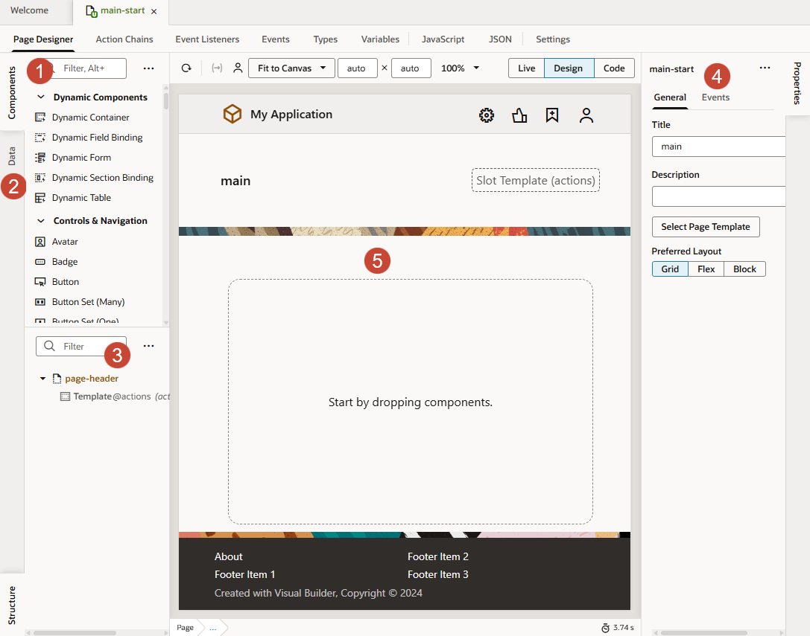
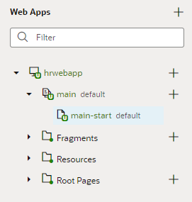
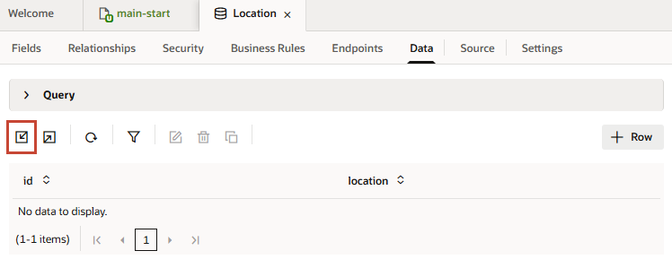
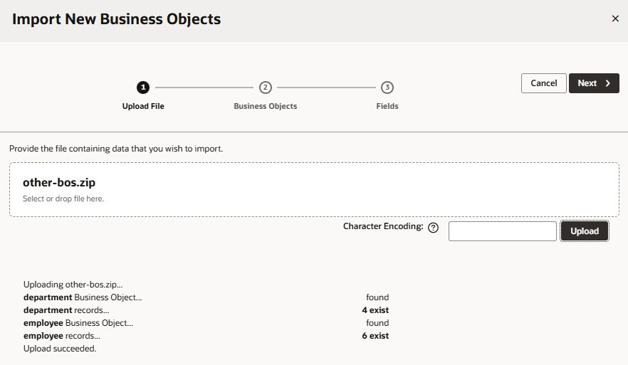
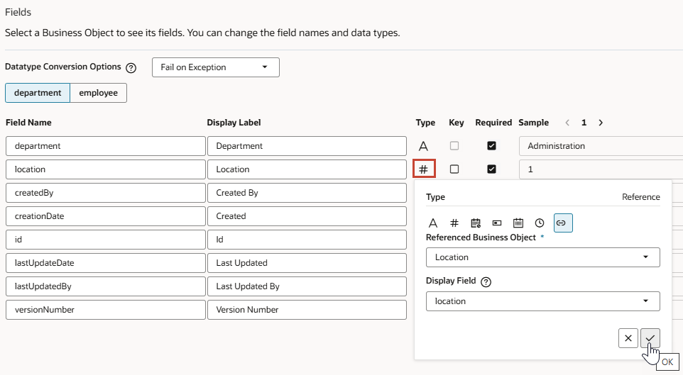
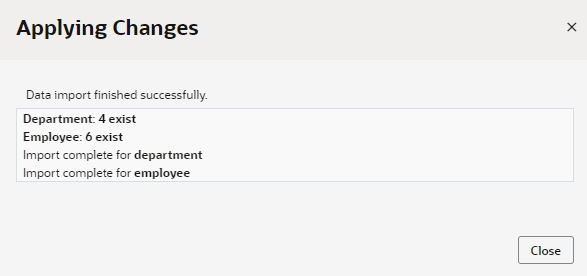
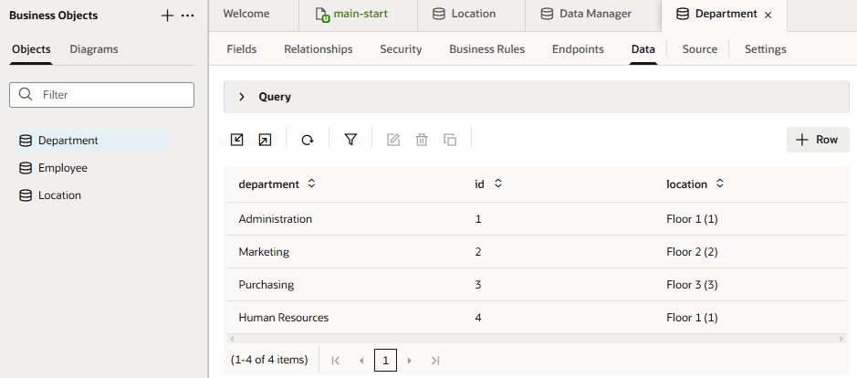
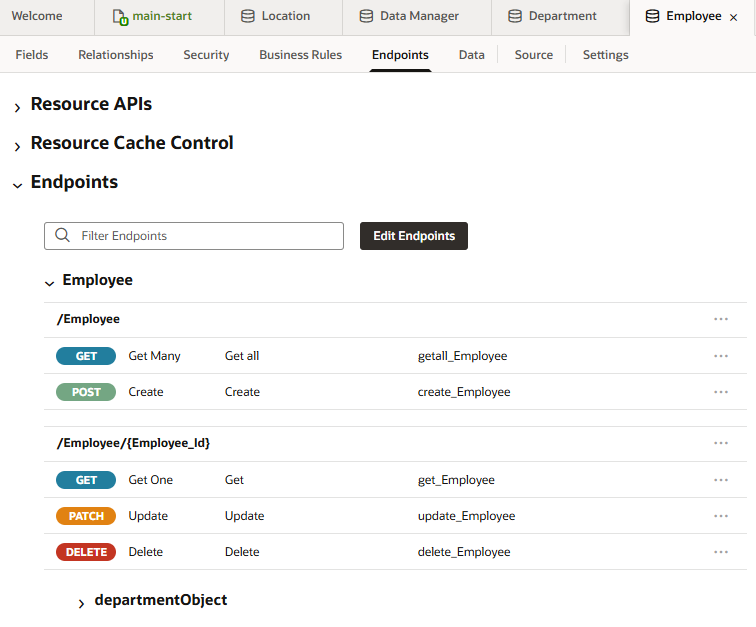
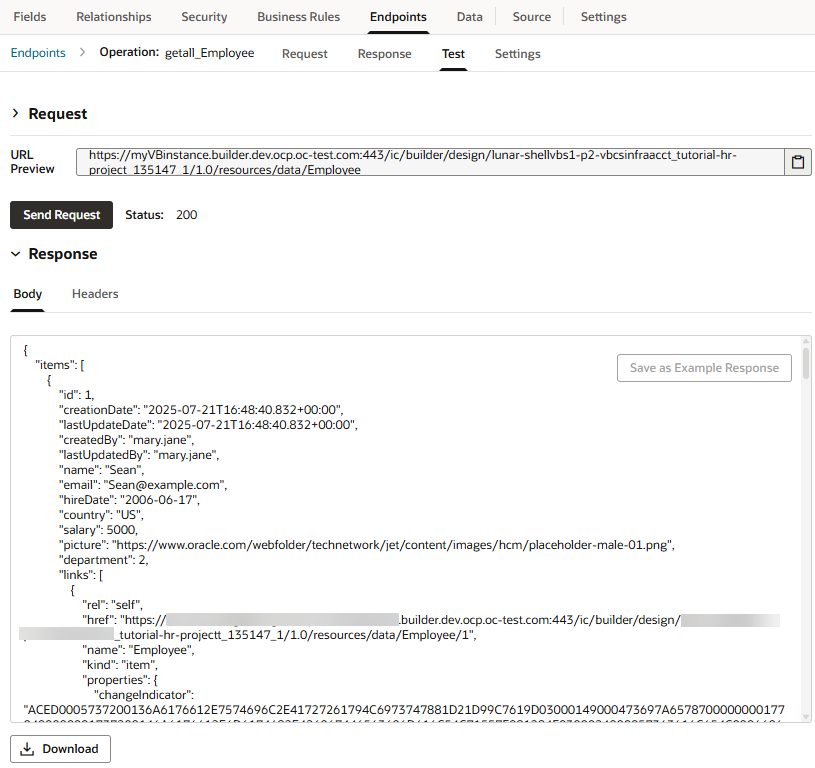

# Create a web app in a visual application

## Introduction

This lab shows you how to create a web app in your visual application project and populate it with business objects that store your data.

Estimated Time: 15 minutes

### About this Lab

Web and mobile applications in VB Studio take shape within the _Designer_, a rich graphical user interface that lets you design and develop your application by dragging and dropping components on a page. You use these components—all based on the open-source Oracle JavaScript Extension Toolkit (JET)—to create rich UIs that span multiple devices.

Each component depends on a _business object_ for its data. A business object is just a resource—like a purchase order or invoice—that has fields to hold your application's data. It is similar to a database table, as it provides the structure for your data; in fact, business objects are stored in a database. Your application accesses the data in these business objects through REST endpoints that VB Studio generates for you.

In this lab, you'll create the Employee, Department, and Location business objects for the HR web application.

### Objectives

In this lab, you will:

* Create a web app in your visual application
* Create reusable business objects to store data
* Create a diagram to visualize relationships between your business objects

### Prerequisites

This lab assumes you have:

* A Chrome browser
* All previous labs successfully completed

## Task 1: Create a web app

The first thing we'll do is add a web app to the HR visual application you just created. A visual application is a container for all your web and mobile applications. In this task, you add a single web app to your visual application, but you can have more than one, even both web and mobile apps in the same visual application.

1. Click **Workspaces**, then click **HR Workspace** in the Workspaces table.

    The HR application opens in the Designer on the Welcome page, which serves as a launching point for connecting to data, creating apps, or adding artifacts.

    

    On the far left are icons representing Mobile Applications, Web Applications, Business Objects, and so on. This vertical toolbar is the Navigator, which helps you move between the artifacts in your visual application.

    Now take a look at the header:

    

    On the left is the name of your current workspace, **HR Workspace**; next to it is the project's Git repository and the branch currently associated with your workspace (**tutorial-hr-project.git/hrbranch**). Click each option to see other actions that you can perform. Clicking  will take you back to the Project Home page.

    Elements on the right let you perform various other actions, such as undo a change or search the Git repository for a file. This workshop primarily demonstrates the options to preview your app, share it, and publish changes. If you make a mistake during this workshop, click   to back out of the last step you did.

    Take note of the footer, which has tools that help you debug and maintain your visual app (we'll briefly look at Audits and Git History in this workshop):

    

    Keep in mind that VB Studio saves your changes automatically as you work. A timestamp at the bottom of the page will show the time  your work was last saved. Note that changes are only saved to your local workspace repo—but more on that later.

2. We want to create a web application, so under **Create Apps**, let's click the **Web Apps** tile.

    

    The Web Apps pane opens in the Navigator.

3. Click **\+ Web Application** (or the **+** sign at the top of the Web Apps pane).

4. In the Create Web Application window, enter `hrwebapp` as the **Application Name**. (You can specify uppercase as well as lowercase characters in the application name, but the name is converted to lowercase.) Leave the **Navigation Style** set to the default, **None**, and click **Create**.

    The application opens on the **main-start** page, which is your application's default home page created automatically for you. (Ignore the **This dot says that you have made some changes** dialog that appears in the header for now; we'll explore Git changes in a later lab.)

    What you see under the **main-start** tab is your application's main work area. Just under main-start are several horizontal tabs: **Page Designer**, **Actions**, **Event Listeners**, and so on. Each tab provides editors to help you examine and modify artifacts used in the page. By default, the page opens in the Page Designer, which is where you'll do the bulk of your work in VB Studio.

    

    Here are the main Page Designer areas you'll use throughout this workshop:
    | # | Tab | Functionality |
    | --- | ---- | --- |
    | 1 | Components | UI components (sorted by categories) that you can drag and drop onto a page|
    | 2 | Data | Data endpoints exposed when you create business objects or service connections |
    | 3 | Structure | Hierarchical view of the page's structure  |
    | 4 | Properties | Properties of a component selected on the page. When the entire page is selected (as it is now), you'll see the Page view where you can choose a preferred page layout.|
    | 5 | Canvas | A design, live, or code view of your page's content |
    {: title="Page Designer Work Area"}

    You can collapse and expand tabs to better manage your working area. For example, click **Properties** to hide the Properties pane and expand your work area. You can also move different panes to customize your work area. For example, right-click **Structure** at the bottom of your work area, then select **Move to Top Left** to move the Structure view right under **Components** and **Data**.

    

    When collapsed, each tab will show as a vertical tab on the side of the editor. Click the tab again to expand it.

    See also how you can manage tabs that open in the tab bar. Right-click the **main-start** tab to see the available options. Note that the active tab always stays in focus.

     

    In the Web Apps pane, expand the **hrwebapp** and **main** nodes to get a tree view of your web application's flows and pages.

     

    A _flow_ contains pages that relate to each other. An application can have multiple flows, and each flow can contain many pages. This application contains only one flow, **main**, and one page, **main-start**—though we'll add more pages later on. By convention, a page takes its flow name as a prefix.

## Task 2: Create a Location business object and import data

Let's now create your first business object and add data to it by importing a CSV file. Every business object needs data associated with it, and there are many ways to do that, as you'll see.

1. Click **Business Objects**  in the Navigator.
2. Click **\+ Business Object**.
3. In the New Business Object dialog box, enter `Location` in the **Name** field. **Location** is also filled in automatically as the **Display Label**. Click **Create**.
4. Click **Fields** for the newly created Location business object.

    Every business object you create has six default fields: an id, plus fields that provide information on who created and updated the object and when.

    

5. Click **\+** and select **Field** to add a field specific to this business object. This is a very simple business object, so we'll only add one new field.
6. In the pop-up box, enter `Location` as the **Label**. The **Field Name** is automatically populated as **Location** and the **Type** set to **String**  by default.

    

    Click **Create Field**.

7. In the **Location** field's properties, select **Required** under Constraints.

    

    A check mark is displayed in the Location field's Required column.

8. Click [this link](https://objectstorage.us-ashburn-1.oraclecloud.com/p/LNAcA6wNFvhkvHGPcWIbKlyGkicSOVCIgWLIu6t7W2BQfwq2NSLCsXpTL9wVzjuP/n/c4u04/b/livelabsfiles/o/developer-library/Location.csv) to download the `Location.csv` file to your file system. This file contains four locations and provides the data for the Location business object.

9. Click the **Data** tab, then **Import from File** .

    

10. In the Import Data dialog box,  click the drag and drop box, browse to select the `Location.csv` file, and click **Import**.

    

    When the import succeeds, click **Close**. You'll see a list of locations.

    

## Task 3: Create the Department and Employee business objects

Let's now create the Department and Employee business objects. But instead of creating the business objects and fields one by one and importing data for them, you'll import a ZIP file that defines the two business objects with their fields and data all at once.

1. Click [this link](https://objectstorage.us-ashburn-1.oraclecloud.com/p/Ei1_2QRw4M8tQpk59Qhao2JCvEivSAX8MGB9R6PfHZlqNkpkAcnVg4V3-GyTs1_t/n/c4u04/b/livelabsfiles/o/oci-library/Other-BOs.zip) and download the `Other-BOs.zip` file. This ZIP file contains CSV files for the Department and Employee business objects. Feel free to review the contents.

2. In the Navigator's Business Object pane, click **Menu**  and select **Data Manager**. The Data Manager is what you use to import data from a variety of sources.

    

3. On the Manage Application Data page, select **Import Business Objects**.

     

4. On the Upload File step of the Import New Business Objects wizard, click the drag and drop box, select the `Other-BOs.zip` file, and click **Upload**.

    When the upload succeeds, you'll see a message that the import contains records for the Department and Employee business objects. Click **Next**.

    

5. On the Business Objects step, you'll see the definitions that will be used to create the Department and Employee business objects. Leave them as is and click **Next**.

6. On the Fields step, you'll need to make some changes. For the Department business object (selected by default), look for the `Location` field in the second row and click **#** in the Type column. Change the type setting as follows:

      * Select the **Type** as **Reference** . A Reference field is like a foreign key in a database table: it's a field that refers to the key (the Id field) of another business object to link the two business objects together.
      * Select **Location** as the **Referenced Business Object**. The default for a **Referenced Business Object** is always the current business object (in this case, Department), so make sure you select **Location** from the drop-down list. Now when you create a department, you'll be able to specify one of the floors as the department's location.
      * Leave the **Display Field** as **Location** (automatically populated).

    

    Click **OK**.

7. For the same **Location** field, click **Required** to deselect the setting (**Department** and **Id** are the only required fields for the Department object).

8. Now click the **Employee** tab and change the **Department** field to a reference. Click **#** in the **Department** field's Type column and change the Type setting as follows:

    * Select the **Type** as **Reference** .
    * Select **Department** as the **Referenced Business Object**.
    * Leave the **Display Field** as **Department** (automatically populated).

    Click **OK**.

9. Remove **Required** for all Employee fields, except **Name** and **Id**.

    

10. Click **Finish**. When the import completes successfully, click **Close**.

    

11. In the Business Objects pane, you'll now see two new business objects, each of which becomes a table in VB Studio's embedded database. Click **Department**, then **Data** to view four departments imported from the spreadsheet. See how the **location** column shows each department's floor, as defined in the referenced Location object.

    

12. Click **Employee** in the Business Objects pane, then **Data** to view six employees imported from the spreadsheet. See how the **picture** column uses paths to images stored elsewhere. If you want to change the data, select a row and click .

13. Now click **Endpoints** to view the Employee object's REST endpoints. These endpoints expose the object's data and let you perform operations to create, read, update, delete as well as query this data in your pages.

    

     Because the Employee object refers to the Department object, you'll see the Department endpoints also listed here under **departmentObject**.

    If you click an endpoint, an endpoint viewer displays details of endpoint settings and headers sent in a request. You can also test requests and view responses. To do this, click the **getall_Employee** endpoint, then in the Test tab, click **Send Request** (you can supply your own parameter values if you want):

    

    Click  Endpoints to return to the main Endpoints page.

## Task 4: Create a business object diagram

Now that you have your business objects, create a diagram that visualizes the business objects and their relationships.

1. In the Business Objects pane, click **Diagrams**, then **\+ Business Object Diagram**.

    

2. In the Create Business Object Diagram dialog box, enter `HRDiagram` in the **Diagram name** field and click **Create**.

    An empty diagram page opens.

3. In the Properties pane, click **Select All** next to Business Objects.

    

    You'll see a diagram representing the three business objects you created and their relationships:
    

    You may **proceed to the next lab**.

## Acknowledgements

* **Author** - Sheryl Manoharan, VB Studio User Assistance, November 2021
* **Last Updated By/Date** - Sheryl Manoharan, May 2023
