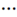

# Create a project for a new visual application

## Introduction

This lab shows you how to create a project for a new visual application, the foundation to build a web application in Oracle Visual Builder Studio.

Estimated Time: 15 minutes

### About this Lab

In this workshop, you'll build a simple Human Resources app using a _project_ with a _visual application_ template as the starting point. Every project in VB Studio is devoted to a discrete software effort, and the project you create in this lab is exclusive to the HR app. The project brings together all the tools you need to create your app: a Git repository to store your source code, a pipeline to provide continuous integration and delivery, an issue tracking system, and more. Because it is based on the visual application template, it will have everything you need to visually develop an application.

As part of your project, you'll also create a _workspace_, a completely private area for you to work on your application. The changes you make in your workspace are stored in a clone of the project's Git repository, and are not visible to others until you share or publish them. A workspace also connects you to the development environment where you plan to host your application, which must be a separate Visual Builder (VB) instance.

### Objectives

In this lab, you will:

* Create a project for a visual application
* Add credentials to deploy the visual application to your VB instance

### Prerequisites

This lab assumes you have:

* A Chrome browser
* A VB Studio instance and a separate VB instance

## Task 1: Create a project for a visual application

As someone who creates a project, you'll automatically become the project's owner, responsible for project management. For the purposes of this workshop, we'll assume that you're also the developer who will create the HR web application.

1. On VB Studio's Organization page, click the **Projects** tab, then click **\+ Create**.

    

2. On the Project Details step of the New Project wizard:

    * Enter **Tutorial HR Project** as the **Project Name**. You may want to add your name to the project name if you're in a large organization.
    * Enter **Tutorial project** as the **Description**.
    * Leave the **Security** settings as **Private** and **Discoverable** (the default).
    * Leave the **Preferred Language** as **English** (the default).

    Click **Next**.

3. On the Project Template step, select **Visual Application** and click **Next**.

4. On the Project Properties step:

    * Leave the **Git Repository Name** as **tutorial-hr-project.git** (based on the project name).
    * Click **Development VB Instance** to select the VB instance where you plan to deploy your application. If you have only one VB instance provisioned, it will be automatically selected as your environment's development instance.
    * Change the **Workspace Name** from **Workspace 1** (the default) to **HR Workspace**.
    * Change the **Working Branch Name** from **branch1** (the default) to **hrbranch**.

    Click **Next**.

5. On the Project Team Members step, add other members of your team who will work with you on this visual application.

    As the project owner, you can control what others can do in this project by granting them membership as a Developer Full Access, Developer Limited Access, Contributor, or even as another Project Owner. For demonstration purposes, we'll add Clara Coder with the Developer Limited Access role, which lets her access most project components.

    * Enter the username of a teammate in the **Add Members** list.
    * Select a membership role.
    * Click **Add**. An email containing project details is sent to Clara Coder. To receive email notifications, the teammate's email address must be verified and notifications set properly in Preferences.

    Now click **Finish**.

    Wait for the project to be provisioned. Once provisioning completes, you'll see the Project Home page, which serves as a window to your workspace, your environments, and repositories, as well as a recent activities feed. On the left are a series of tabs showing the available project components.

    

    Click  to hide the labels and increase screen space.

## Task 2: Explore the project environment

Everything you need to start building a visual application is now created for you in this project. Let's step through some key components to better understand your project environment.

1. On the Project Home page, the **tutorial-hr-project.git** repository shows  under Workspaces as well as in the Repositories tab on the right. This Git repo stores your visual application's source files and is known as the project's _remote_ repository. Click the **tutorial-hr-project.git** link in the Workspaces table to go to the Git page. Here, you can see your project's remote branches, **main** and **hrbranch**, created with initial content for your visual application. Select **hrbranch**; the **main** branch is the default branch created when a new repository is generated and is the project's source of truth.

    

2. In the left navigator, click **Workspaces**to view the **HR Workspace**. This workspace contains a working copy of **hrbranch** and serves as your _local_ repository. The **hrbranch** initially has the same set of source files as the **main** branch, but as you work with your visual application, it will include the changes you make. Your changes can't be seen by others until you save them from the local branch to a remote branch.

    

3. Click **Environments**  in the left navigator to view the development environment that points to your VB instance. Here, you can view details of your VB instance and all the applications you deploy to this instance.

    

4. Click **Builds**  in the left navigator to view the default build jobs that package and deploy your visual application to the development instance. The **Visual-Application-Package** job generates the visual application's artifact files. The **Visual-Application-Deploy** job deploys the artifact files to the development instance.

    

5. On the Builds page, click **Pipelines** to view the **Visual Application - Package and Deploy** pipeline, which contains the two jobs we saw in the previous step. Pipelines create a chain of builds to define job dependencies. From the pipeline's **Actions**  menu, select **View Layout** to view the defined sequence of jobs.

    

    You'll see that the visual application pipeline, by default, runs the package job before the deploy job, so the latest application artifacts are packaged for deployment.

    Click **Builds** in the breadcrumbs trail to return to the main Builds page.

## Task 3: Add credentials to deploy the visual application

Now that your project is provisioned, let's set up the credentials that VB Studio will use to deploy your visual application to the VB development instance.

1. Click **Jobs** on the Builds page, then from the **Actions** menu for the **Visual-Application-Deploy** job, select **Configure**.

    

2. On the Job Configuration page, click **Steps**.

3. In the **Username** and **Password** fields, enter the credentials of a user who can deploy to the VB development instance.

    

   **Tip:** Before you save your changes, take a quick look at some other settings on this page:
    * The **Include the application version in the URL** check box (selected by default) adds a version to the URL when your application is deployed (for example, <https://host/something-else/0.1/index.html>) and is useful to identify multiple versions during development. When your app is ready to go live, you'll want to deselect this option so your application URL is something like <https://host/something-else/live/index.html> (without a version number in it).
    * The **Use clean database** option (also selected by default) uses a new database to store your application's data. To keep your data after initially importing it (which we'll do in a later lab), you'll need to select the **Keep existing environment data** option.

    Click **Save**.

    You may **proceed to the next lab**.

## Acknowledgements

* **Author** - Sheryl Manoharan, VB Studio User Assistance, November 2021
* **Last Updated By/Date** - Sheryl Manoharan, May 2023
